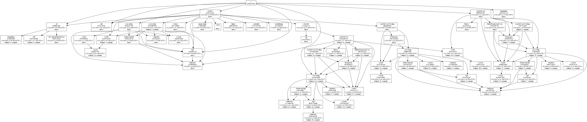
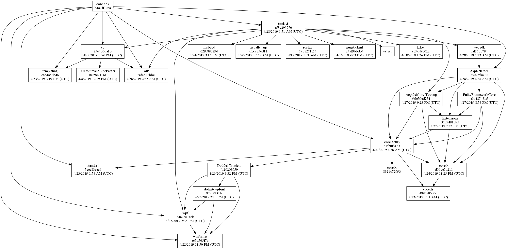

# Release 3.0 Release Shutdown Tasks (Coherency QB)

This document describes the process by which a 3.x release is shut down and
prepared for validation. This is the job of the "coherency QB".

This document makes some assumptions about familiarity with the Maestro++
concepts of [Channels, Branches and
Subscriptions](BranchesChannelsAndSubscriptions.md). Please read if you are unfamiliar.

## General workflow

The general workflow for a release looks like:
1. Commit desired changes to each repository involved in the release.
    1. For a .NET Core 3.x preview, these changes may be committed by the process
       of branching the working (typically master) branch into a release branch
       (like release 3.0)
    2. For a servicing release, these changes may simply be committed into an
       existing release branch.
2. Official builds and dependency flow begins in each repository with changes.
3. New commits are built, generating new assets, which flow via Maestro++
   subscriptions into other repositories.
4. Dependency flow generates new commits, which in turn cause new builds and
   additional dependency flow.
5. Repeat 3-4 until no additional changes appear and build is 'coherent'. See
   [What is coherency and why is it important](#what-is-coherency-and-why-is-it-important)
6. Starting with dotnet/core-sdk (which aggregates all repos), gather a drop for the build.
7. Validate the SDKz
8. For each additional fix needed, repeat steps 3-7.
9. Once quality has reached the desired level, release build to public.

## What is coherency and why is it important?

Each node in .NET Core's dependency graph may flow dependencies to more than one other node. For
instance, the Microsoft.NETCore.App dependency, produced out of core-setup,
flows to dotnet/toolset, dotnet/core-sdk, aspnet/extensions and a number of
other places. Updates of dependency will be committed at different rates in each
of those places, due to variations in pull request validation time, need for
reaction to breaking changes, and desired subscription update frequencies. As
those repositories then flow elsewhere and eventually coalesce under
dotnet/core-sdk, there may be a number of different versions of
Microsoft.NETCore.App that have been transitively referenced throughout the
graph. This is called **incoherency**. When only a single version of each
product dependency is referenced throughout the dependency graph, the graph is
**coherent**.


*Wildly incoherent graph*



*Coherent graph, except for one pinned dependency in core-setup*

***What kinds of problems of does incoherency cause?*** Incoherency represents a
*possible* error state. For an example, let's take a look at
Microsoft.NETCore.App. Microsoft.NETCore.App represents a specific API surface area.
While multiple versions of Microsoft.NETCore.App may be referenced in the
repository dependency graph, the SDK ships with just one. This runtime must
satisfy all of the demands of the transitively referenced components (e.g.
winforms and wpf) that may execute on that runtime. If the runtime does not
satisfy those demands (e.g. breaking API change), failures may occur. In an
incoherent graph, because all repositories have not ingested the same version of
Microsoft.NETCore.App, there is a possibility that a breaking change has not
been reacted to.

***Does this mean that incoherency is always an error state?*** No. For example, let's
say that the incoherency of Microsoft.NETCore.App in the graph only
represents a single change in coreclr, a single non-breaking JIT bug fix. There
would technically be no need to ingest the new Microsoft.NETCore.App at each
point in the graph. Simply shipping the same components against the new runtime
will suffice.

***If incoherency only matters occasionally, why do we strive to ship a coherent
product?*** Because determining when incoherency does not matter is hard. It is
easier to simply ship with coherency as the desired state than attempt to
understand any semantic effects differences between incoherent components will
have on the completed product. It can be done, but on a build to build basis
it is time intensive and prone to error. Enforcing coherency as the default
state is safer.

***Does this mean we always ship a coherent product?*** No. There are various
scenarios (e.g. pinned dependencies) where it is not possible to drive to a
coherent state. In these cases, we drive to be as coherent as possible, then
evaluate the incoherency to determine whether it is problematic.

When shutting down for a release, the "coherency QB" is responsible for driving
the product to as coherent a state as is possible. They are responsible for
ensuring the orchestration of the end to end process is done properly.

***What does the coherency QB do when there is no imminent release?***
Primarily, the Coherency QB's job outside of times when the product needs to
drive to coherency includes:
- Advising on schedules. When is the right time to start the drive to coherency
  and a final build for a release?
- Watching for potential issues in the Dev channel which might be an issue in a
  time-sensitive coherency drive:
    - Are any repositories far out of date in the Dev channel? This should
      generally be watched by .NET Core Tactics, but other pairs of eyes is
      always useful.
    - Is overall dependency flow health okay for the Dev channel? Have product
      dependency cycles been accidentally introduced?

## Coherency QB workflow

The coherency QB is responsible for the following:
- **Verifying** the dependency flow is correct and will produce the desired
  build, and fixing if necessary. Repository owners are generally responsible
  for dependency flow into their repositories and designating branches as
  producing assets for the correct channels. The coherency QB serves as a final
  check that this flow is correct for producing the desired final result.
- **Verifying** with repository owners that commits (or branching) have been
  completed for those repositories that are contributing to a release. 
- **Verifying** that dependencies are flowing and official builds are completing.
  Unblocking and communicating with repository owners where necessary.
- **Orchestrating** flow to reduce risk of undesired product churn
  that would adversely affect "time to coherency".
- **Evaluating** the effect additional changes (e.g. taking a bug fix) will have
  on the "time to coherency".
- **Evaluating** the level coherency state and declaring "done" when
  appropriate.
- **Gathering** a drop of the product once coherent and providing it for use in
  testing, for release, etc.

*Note: There is a goal to automate as much of this process as is possible.*

Below specfic steps in the coherency QB are detailed.

### Prepare and verify dependency flow

.NET Core releases are generally tied to Maestro++ channels. For instance, for
.NET Core 3.0, the *.NET Core 3 Dev* channel is used for dependency flow of
day-to-day development builds, while the *.NET Core 3 Release* channel is used
for the flow of the final builds. Different channels are used for two reasons:
- A separate set of branches can be used to flow outputs into each channel,
  allowing for development to continue during product shutdown.
- Release channel dependency flow is optimized for stability (e.g. no back-edges) and
  speed, while dependency flow in the Dev channel is optimized to reduce the
  number of dependency updates and allow for back edges (generally used for
  toolset and test updates).

The Dev channel is generally in more active use than Release, and thus the
dependency flow setup is usually more up to date. When we branch for a release,
it's usually necessary to update the dependency flow of the Release channel to
reflect changes in dependency flow on the Dev channel. Thus, it's necessary to
evaluate the subscriptions currently applied to the Release channel and update
as needed. Generally, we're trying to achieve the following:
- Each repository currently contributing to the Dev channel should have an
  equivalent default channel association for the Release channel. There are some
  exceptions to the rule here (e.g. NuGet likes to manually assign builds to
  channels), but generally this should be the case for the "core stack".
- There should be equivalent subscriptions in the Release channel for each
  subscription in the Dev channel.
- Subscriptions updating toolsets should have their frequencies set to "none"
- Subscriptions updating product dependencies should have their frequencies set
  to "everyBuild".

#### Prior to branch/commit day

The `darc` tool can identify a lot of gaps in the dependency flow for a specific
channel. However, because branching/committing of changes has not yet been
performed, `darc` is less useful because the current state of the channel may
not match the future state. Prior to branch/commit day it is still possible to
get the Release channel subscription state relatively close based on the current
state of the Dev channel subscription state.

1. Dump all subscriptions that apply specifically to the Dev and Release
   channels with two separate darc commands
   ```
   darc get-subscriptions --channel ".NET Core 3 Dev"

   darc get-subscriptions --channel ".NET Core 3 Release"
   ```
2. Match Dev and Release subscriptions. Identify missing Release channel
   subscriptions and add. Identify existing Release channel subscriptions that
   have no equivalent Dev subscription and eliminate.
   
   Use `darc add-subscription` and `darc delete-subscription` to add and delete subscriptions.

   **Ensure that subscriptions updating toolsets (generally these are backedges
   in the graph) have update frequencies set to 'none'**

   *Note: https://github.com/dotnet/arcade/issues/3012 tracks adding some
   features to get-subscriptions to help out with this exercise*

3. Dump the default channel state and ensure that repositories with a default
   channel assocation in the Dev channel have a default channel association in the
   Release channel. Where there are gaps work with with repository owners to
   understand which branch will ship the coming release. Some repositories may
   not have default associations and can be left alone. For example nuget
   generally avoid automatic channel assignment and "inserts" into the SDK via
   `darc add-build-to-channel`.

   ```
   # Get the default channel associations
   darc get-default-channels

   # Add a default channel
   darc add-default-channel
   ```

   Some typical repositories with odd/no assocations:
   - **dotnet/roslyn** - Branch changes preview to preview to align with VS
   - **microsoft/msbuild** - Branch changes preview to preview to align with VS
   - **dotnet/fsharp** - Branch changes preview to preview to align with VS
   - **nuget/nuget.client** - Typically no default association, nuget assigns
     builds manually
   - **mono/linker** - Not always branched for release (typically sticks with
     what is in dotnet/toolset@master at the time of branching for release).
   - **aspnet/* except aspnet/websdk** - Handles their own subscriptions and
     default channels as they generally change branches per-release.

   **Note: All branch names in default channels (and only default channels)
   should be prefixed with `refs/heads/`.

#### Commit/Branching day

Commit/branching day happens in the following steps:
1. **Turn off core-sdk builds and/or dependency flow out of specific components to
   avoid mixed branding** - In Azure DevOps, disable the official build pipeline
   for dotnet/core-sdk. You may also need to disable other flow if other
   repositories branch early. Please see below for notes.
2. **Branch/commit for release** - Repository owners should branch and commit
   branding updates. The Coherency QB need only monitor the status of this as
   the core-sdk build cannot be turned back on until branding is consistent.
3. **Turn back on disabled dependency flow if necessary** - If some repositories
   had their dependency flow disabled because of an early branching scenario,
   now is the time to turn these back on.
4. **Verify dependency flow health** - Once all branching and commits are complete,
   the Coherency QB can verify the release channel health with `darc get-health
   --channel "<channel name>"` and correct any issues. the `darc get-flow-graph`
   command is sometimes also also useful in this case. Remember, the goals are:
   - Fast flow between repositories in the channel (updated every build)
   - No automatic cycles in dependency flow (toolset dependencies are updated
     with frequency 'none').   
5. **Drive for consistent branding in core-sdk repository** - Watch the
   core-sdk's eng/Version.Details.xml to determine when branding is updated in
   the affected branches. Use https://aka.ms/bar and the
   [Open Dependency Update PRs][open-dependency-prs] GitHub query to track updates.
6. **Turn core-sdk builds back on** - Re-enable official dotnet/core-sdk build
   and queue builds on affected branches.
7. **Notify validation teams when a new (even non-coherent build) is
   available** - Notify netcoretac that core-sdk builds are available.
   Validation teams may now begin testing for release based on the
   dotnet/core-sdk GitHub page.

***Why are dotnet/core-sdk builds turned off on branch/commit day?*** The primary
concern is branding. dotnet/core-sdk will publish its outputs to public on the
main web github page on each build (it overwrites a set of 'latest' blobs based
on information in the current branch being built). Until the core-sdk branches
affected by branching/commiting for release (e.g. release/3.0.1xx moves to
previewN and master moves to previewN+1) reflect the branding updates for their
input dependencies, exposing new builds to the public will cause confusion. The
builds will have mixed previewN and previewN+1 branding. We want to avoid this.
By turning off the official core-sdk build (disable in AzDO), the 'latest' will
not update and confusion will be avoided. *Note that this may change at a later
date, and we may be able to avoid updating the latest simply by disabling a
default channel association.*

Often, "branching" is a multi-day operation. For example, dotnet/core-setup may
branch early as to reduce schedule risk (dotnet/coreclr + dotnet/corefx are
expensive steps in the coherent build process). Because branching will involve a
branding update, allowing normal dependency flow will cause core-sdk's branches
to have mixed branding. This can be avoided by disabling the default channel assignment
of those key components that are branching early, then turning it back on later.
Specifically, in the dotnet/core-setup case, disabling the default channel
assignment out of core-setup is an ideal solution. Non "coherent-parent"
references to dotnet/coreclr and dotnet/corefx components are not allowed above
dotnet/core-setup. By just disabling dotnet/core-setup's default channel
assignments dotnet/coreclr and dotnet/corefx may flow into dotnet/core-setup,
reducing the time to coherency after the full branch on Monday, but the rest of
the stack will not see the updated branding until the default channel assignment
is re-enabled. For completeness, this **could** be done by disabling the
dotnet/core-sdk build earlier, when dotnet/core-setup branches. But that means
a longer period of time without a running dotnet/core-sdk build.

### Drive product to coherency with the desired commits from each repository

This stage is primarily about verifying that dependency flow pull requests are
being merged, official builds of affected branches are succeeding, and watching
the dependency graph to determine where incoherencies need resolution. Both
https://aka.ms/bar and `darc get-dependency-graph` are useful in this regard.
The Coherency QB is looking for a coherent build with the desired (usually the
latest) commits from each repository transitively referenced by dotnet/core-sdk.

Generally speaking, the build is coherent when https://aka.ms/bar shows
dotnet/core-sdk as having no yellow (incoherencies in dependencies) nodes in the
Dependencies list. Expanding the list with "Show Sub-Dependencies" can be
helpful in identifying sources of incoherency.

***When might incoherency be okay?*** Incoherency is generally a situation to
avoid. In some cases, however, it may be unavoidable. For instance, a repository that
pins to an old version of a corefx package can not become coherent (without
forcing everyone to use that old version). It may be possible to
ship with incoherency if it is determined that the incoherency has no meaningful
effects. The Coherency QB should work with repository owners to understand
whether incoherencies are meaningful or not.

### Gather product drops and hand-off for testing

After a candidate build is reached, it's time to prep a drop of the candidate
for validation. A drop consists of 3 parts:
- A "unified" drop of all assets in the product, in separate "shipping" and
  "non-shipping" designations - This drop is used for validation.
- A "release" drop separated by repo. This drop contains a release.json and
  is used if the candidate will actually ship.
- A nuget feed with all shipping packages. For validation, it is important to
  only restore packages that will ship to nuget.org (what our customers use)
  along with packages that have already shipped to nuget.org.  Our day to day
  dev builds upload packages to feeds that contain a mix of transport and
  shipping packages, as those feeds are needed for downstream builds.

Drops of builds are uploaded to to
`\\vsufile\patches\sign\NET\CORE_BUILDS\3.0.X\3.0.0\`

To gather a drop:
1. Create a directory (if it does not exist) under the drop root for the
   appropriate preview/release (e.g. `preview6').
2. Create a directory under that with the appopriate SDK build number. E.g.
   `3.0.100-preview6-012264` of the top level SDK build.
3. Run `darc gather-drop` to upload the unified drop to the share:
   ```
   darc gather-drop --sdk --commit <version> -o <share> --non-shipping --full --continue-on-error --skip-existing
   ```
4. Run `darc gather-drop` to upload the release drop to the share:
   ```
   darc gather-drop --sdk --commit <version> -o <share> --release --non-shipping --full --continue-on-error --skip-existing
   ```

   *Note: In cases of incoherent builds, the generated release.json may need to
   be trimmed to remove product builds that do not need to ship to nuget.org*
5. Generate a new feed with only the shipping packages - While eventually we
   will use Azure public feeds for this, today we will use a blob feed because
   of the simplicity of authentication.  There is a build definition that can create
   this today: https://dev.azure.com/devdiv/DevDiv/_build?definitionId=9767.
   1. Find the unified directory of shipping packages we want on the feed.  If
      looking at the on your local machine, e.g.
      `\\vsufile\patches\sign\NET\CORE_BUILDS\3.0.X\3.0.0\preview6\3.0.100-preview6-012264\shipping\packages`
   2. Start the build definition using that directory using the following parameters
      - Change the CentralBlobFeedUrl to point to an unused, isolated feed. Keep
        the storage account the same but change the container to something new.
          - Container name: dotnet-core-preview6-012258
          - Full blob feed url: https://dotnetfeed.blob.core.windows.net/dotnet-core-preview6-012258/index.json.
        Note that the container name can only have letters, numbers and dashes.
      - Clear the MyGetFeedUrl parameter (no myget upload)
      - Change PackagePublishGlob to point to a glob of the nuget packages.
        E.g.
        `\\vsufile\patches\sign\NET\CORE_BUILDS\3.0.X\3.0.0\preview6\3.0.100-preview6-012264\shipping\packages`
6. Send mail to netcoretac with information about the new build (share location
   feed) 

### Iterate until release

As validation proceeds, there may be bugs found. These will be sent to shiproom
for approval, and changes may be accepted. At that point, we enter a new
"incoherent" state as those dependencies flow up to dotnet/core-sdk, and the
Coherency QB will help drive back to coherency, generate a new drop, etc.

## Dependency flow tools

Below are listed various tools and commands useful for the Coherency QB.

- **GraphViz** - Graph visualization software that can be used to produce
  graphical representations of the output of `darc get-dependency-graph` and
  `darc get-flow-graph`. https://www.graphviz.org/download/ has downloads for
  various platforms.  For example, given an input graphviz (.dot) file, one can
  generate a png with:
  ```
  'C:\Program Files (x86)\Graphviz2.38\bin\dot.exe' -Tpng -o'C:\scratch\mygraph.png' 'C:\scratch\mydependencies.dot'
  ```
- **https://aka.ms/bar** - Website for tracking build state.
- **[Open Dependency Update PRs][open-dependency-prs]** - List of open
  dependency update PRs within the microsoft, aspnet, and dotnet orgs.
- **[darc add-default-channel](Darc.md#add-default-channel)** - Adds a new
  default channel association. See example in linked docs.
- **[darc get-default-channels](Darc.md#get-default-channels)** - Retrieve
  default channel associations. See example in linked docs.
- **[darc default-channel-status](Darc.md#default-channel-status)** - Enable or
  disable a default channel association. See example in linked docs.
- **[darc delete-default-channel](Darc.md#delete-default-channel)** - Delete a
  default channel. See example in linked docs.
- **[darc add-subscription](Darc.md#add-subscription)** - Add a new
  subscription. See example in linked docs.
- **[darc get-subscriptions](Darc.md#get-subscriptions)** - Get current
  subscriptions. See example in linked docs.
- **[darc delete-subscription](Darc.md#delete-subscription)** - Delete a
  subscription. See example in linked docs.
- **[darc update-subscription](Darc.md#update-subscription)** - Update a
  subscription (e.g. source channel or merge policies). See example in linked docs.
- **[darc subscription-status](Darc.md#subscription-status)** - Enable or
  disable a subscription. See example in linked docs.
- **[darc gather-drop](Darc.md#gather-drop)** - Gather a drop of a repo,
  potentially including all referenced components. See example in linked docs.
- **[darc get-dependency-graph](Darc.md#get-dependency-graph)** - Get a
  dependency graph (textual or graphviz) of the current dependency state. See
  example in linked docs.
- **[darc get-flow-graph](Darc.md#get-flow-graph)** - Retrieve the dependency
  flow graph. See example in linked docs.

[open-dependency-prs]: https://github.com/pulls?utf8=%E2%9C%93&q=is%3Aopen+is%3Apr+author%3Aapp%2Fdotnet-maestro+archived%3Afalse+user%3Adotnet+user%3Aaspnet+
