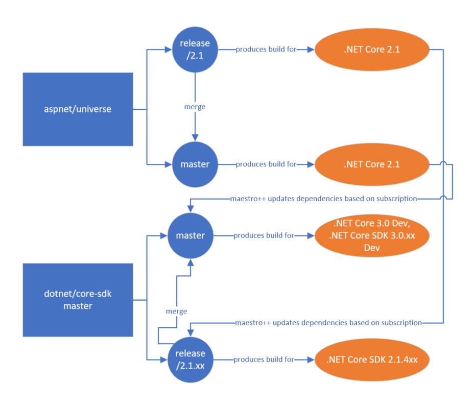

# Channels, Branches and Subscriptions

This document describes the concepts of channels, branches and subscriptions in the .NET Core 3.0 (ProdCon v2) world as well as workflow and management.

## Introduction

For .NET Core 3, the engineering system must be able to support a number of core construction scenarios, including:
- Builds involving custom branches for various parts of the stack (e.g. long lived feature work).
- Builds for a new release.
- Builds involving stabilized assets (that are only published after validation).
- Internal only builds.
- Non-validated builds (only requirement for producing a new product is that "it builds").
- Speculative builds (see https://github.com/dotnet/arcade/blob/master/Documentation/Maestro.md#speculative-version-flow).
- Upstack builds on PRs.

In Prodcon v2, there are a number of central principals that shape how the product is constructed:
- The product is spread among many repositories, with inter-repo dependencies expressed as pointers to build assets.  The pointers normally take the form of version number and name of asset.
- All product changes must be commits.  These commits alter *Branches*.
  
  *In prodcon v1, inter-repo dependency updates were forced via a dependency info file that was passed into the build.*
- If the inter-repo dependency graph has a maximal depth N, then N commits are required for a complete alteration of the product output.
- Branches do not generally define the intended use of the code in the branch.  This is defined by the *Channels* (one or more) a build of that branch is assigned.
- Alterations in product composition (new repo dependencies) are done via a pull model, pulling new assets based on the intended purpose of those assets.  These pulls are automated using *Subscriptions*

### Branches, Channels and Subscriptions, Explained

#### Branches

A Git branch is a moving pointer to the head of a tree of commits that define *potential* product content.  Branches are created and destroyed based on the individual needs of a repository and thus are not consistent across the product stack. It is also important to recognize that branches are primarily a way to improve developer productivity and understanding of a repository. The git repo is really just a set of commits, and these commits are what defines potential product content, not branches.

#### Channels

A "tag" that defines the purpose of a set of build assets.  Whereas commits define *potential* content, a build *creates* content based on a commit, and channels define what the created content is intended for.

Channels have the following characteristics:
- Should be consistent across the product stack, though they may not necessarily apply to all repos.  For example, all repos may produce bits for a ".NET Core 3.0.0" channel, but only some repos (e.g. core-sdk) might produce output for a ".NET SDK 3.0.1xx" channel
- Build assets are applied to a set channels after the build is done.  This may be manual or automatic.
- A build may be applied to multiple channels.
- Channels may be public or internal.  This differentiates what may be done with outputs from a build.  The following rules must be followed:
    - Builds of internal, non public branches may **not** be assigned to public channels.
    - Build assets that are assign to an internal channel may not publish/display outputs in a public location (e.g. nuget.org, dev.azure.com/dnceng/public)

#### Subscriptions

Defines the process of product transformation (creation of new commits). Inter-repo dependencies are expressed as dependencies on created content (e.g. core-sdk commit `abcd` depends on core-setup build asset `Microsoft.NetCore.App.123456`). Subscriptions define a set of rules under which those inter-repo dependencies should be altered in new commits to a target branch.

Subscriptions have the following characteristics:
- They define a mapping between assets produced by a build, and new commits to branches in another repo.

    `source repo + channel + assets (optional) -> target branch + target repo`

- They have a desired quality metric for when the mapping should be applied (e.g. should tests have passed?)
- They have a trigger for when the mapping should be applied.

A subscription can be visualized with the following pseudocode

```
    function runSubscription(newBuild, subscription) {}
        // Determine whether the build applies to the subscription
        if (subscription.sourceRepo != newBuild.sourceRepo ||
            subscription.sourceChannel != newBuild.channel) {
            return 
        }
        // Determine whether trigger should be run
        // For example, this might return false if we've already run once today and the subscription only runs once a day.
        if (!subscription.isTriggered(newBuild)) {
            return
        }
        // Check out the target repo and branch.
        // git clone targetRepo; git checkout targetBranch
        repo = checkOutSources(targetRepo, targetBranch)
        // Check out a new branch in which to make a commit
        // git checkout -b update-dependencies
        repo.checkOutBranchForChanges()
        // Map assets existing in target's 
        foreach (dependency in repo.Dependencies) {
            if (newBuild.assets.contains(dependency)) {
                if (subscription.assets.count == 0 || subscription.assets.contains(dependency)) {
                    repo.updateAsset(newBuild.assets)
                }
            }
        }
        // Check quality of new repo content (do a build, etc.)
        if (subscription.isDesiredQuality(repo)) {
            mergeChanges()
        }
    }
```



## Branches, Channels and Subscriptions in a Monolithic repo world

Those who have worked in a monolithic repo world in the past can have trouble understanding the issues that a distributed repository world introduces (though it has other significant benefits).  To better understand these issues, let's look at branches, channels and subscriptions in the monolithic world.  A mono repo world is one where the vast majority of changes do not cross repository lines.  Even in monolithic repositories, there are still some distributed qualities.  For example, an update of a checked in toolset effectively is a pull of an external content channel (like a build of a compiler).  However, these types of changes tend to be fewer, and thus the product repository can generally be viewed as self-contained.

When a product repository can be viewed as self-contained, the branches, channels and subscriptions concepts tend to blend together.
- A single commit (and moving branch head by extension) covers the entire product stack.  All components are versioned in a single atomic fashion. This makes it possible to imply a *channel* based on a *branch*:
  - "Main produces vNext"
  - "Dev15.6 produces Dev15.6"
- Because a single commit describes all components at a *single* specific point in time, no subscription is needed to update dependencies between components
- There are perhaps a few remaining 'subscriptions' for the remaining distributed components, but there are few enough that they tend to be manually dealt with and have little overhead.
  1. External team checks in lots of new commits into branch X (potential content)
  2. External team produces new toolset from branch X (created content)
  3. External team declares new toolset as for a specific channel (e.g. C++ Compiler 16.x LKG).  Much of the time this is done through human communication channels (e.g. email).
  4. Product team infers quality level of new external toolset based on the channel (LKG)
  5. Product maps new toolset into their repository

        ```
        Starting from:

        source repo (optional) + channel + asset (optional) -> target branch + target repo

        source repo = toolset team's repo
        channel = C++ Compiler 16.x LKG
        asset = new compiler exe
        target branch = what branches needs a 16.x LKG compiler? E.g. Main because we need stable bits
        target repo = product repo 

        Gives:
        
        toolset team's repo + C++ Compiler 16.x LKG + new compiler exe -> Main + product repo
        ```

  6. Product team decides whether to commit new toolset based on quality results on their repo.

## Need for automation and tooling

After combining the product construction principals with the .NET Core 3 scenarios, it's clear that:
- There will be many branches in each repo, some long lived, some short lived.
- There will be many commits required for product alteration.
- There will be many builds for various purposes.
- Managing product alteration cannot be manual.

This increased complexity needs to be tooled where possible.

## Scenarios

There are a variety of scenarios that require changes in channels, branches and subscriptions.  This section walks through these core scenarios, explains the manual steps that would normally be involved, and the expected behavior of tooling (if any).  These scenarios are explained in terms of specific .NET Core repositories.

### Onboarding of initial/new repositories

Onboarding of new repositories adds new nodes to the product dependency graph. Initially the number of nodes in the dependency graph is 0. There are no branches of any repos producing assets for any channel, and thus there are no subscriptions consuming those assets (because there would be no place to move them). Onboarding the initial repository involves the following:

1. Define potential content - The dotnet/coreclr repo's master branch should be onboarded.
2. Onboard dotnet/coreclr to Arcade style publishing.  Arcade publishing will push build assets to shared storage locations and notify the [Build Asset Registry (BAR)](https://github.com/dotnet/arcade/blob/master/Documentation/Maestro/BuildAssetRegistry.md) of new builds.
3. Create content - Build dotnet/coreclr's master branch (let's say its ID is 'dotnet/coreclr#1')  Through arcade publishing a new entry for this build will be created in the [BAR](https://github.com/dotnet/arcade/blob/master/Documentation/Maestro/BuildAssetRegistry.md).  'dotnet/coreclr#1' will not initially have a channel..
4. Create a new channel for content - Create '.NET Core 3.0.0' channel in the [BAR](https://github.com/dotnet/arcade/blob/master/Documentation/Maestro/BuildAssetRegistry.md)
    ```
    darc channel new '.NET Core 3.0.0'
    ```
5. Assign existing dotnet/coreclr builds to the channel if desired - dotnet/coreclr's master branch creates content for '.NET Core 3.0.0' channel, so use the [BAR](https://github.com/dotnet/arcade/blob/master/Documentation/Maestro/BuildAssetRegistry.md) to assign 'dotnet/coreclr#1' to '.NET Core 3.0.0'
    ```
    darc channel assign 'dotnet/coreclr#1' '.NET Core 3.0.0'
    ```
6. Assign future builds of a specific branch a default channel (if desired) - Use the [BAR](https://github.com/dotnet/arcade/blob/master/Documentation/Maestro/BuildAssetRegistry.md) to map dotnet/coreclr master onto '.NET Core 3.0.0'.

    ```
    darc channel edit '.NET Core 3.0.0'
    ```

Once the repository graph has more than one node (or if there is a circular dependency, like in the case of dotnet/arcade), it becomes possible to create subscriptions.  Onboarding new repositories after the initial node involves the steps above with the following alterations/additions:

1. No new channel is necessary if repository/branch being onboarded is producing assets for an existing channel
2. Repository should be onboarded onto the formal [dependency description format](https://github.com/dotnet/arcade/blob/master/Documentation/DependencyDescriptionFormat.md), enabling automated update of dependencies via Darc.

Let's say dotnet/corefx's master branch is the second branch to be onboarded.  dotnet/corefx has a dependency on dotnet/coreclr's output assets.

1. Define potential content - The dotnet/corefx repo's master branch should be onboarded.
2. Onboard dotnet/corefx to Arcade style publishing.  Arcade publishing will push build assets to shared storage locations and notify the [BAR](https://github.com/dotnet/arcade/blob/master/Documentation/Maestro/BuildAssetRegistry.md) of new builds.
3. Onboard dotnet/corefx to Arcade style dependency management - Create a Dependency.Versions.xml and associated dependency props files in the master branch.  Use Darc to add dependencies for specific dotnet/coreclr dependencies (e.g. Microsoft.NETCore.Runtime.Coreclr). These dependencies were produced by dotnet/coreclr builds and assigned to the '.NET Core 3.0.0' channel.
4. Create content - Build dotnet/corefx's master branch (let's say its ID is 'dotnet/corefx#3')  Through arcade publishing a new entry for this build will be created in the [BAR](https://github.com/dotnet/arcade/blob/master/Documentation/Maestro/BuildAssetRegistry.md).  'dotnet/corefx#3' will not initially have a channel..
6. Assign new dotnet/corefx build to the channel - dotnet/corefx's master branch creates content for '.NET Core 3.0.0' channel, so use the [BAR](https://github.com/dotnet/arcade/blob/master/Documentation/Maestro/BuildAssetRegistry.md) to assign 'dotnet/corefx#3' to '.NET Core 3.0.0'
7. Assign future builds of a specific branch a default channel (if desired) - Use the [BAR](https://github.com/dotnet/arcade/blob/master/Documentation/Maestro/BuildAssetRegistry.md) to map dotnet/corefx master onto '.NET Core 3.0.0'.
8. Add a subscription to automatically pull new dotnet/coreclr dependencies into dotnet/corefx's master branch. Subscription info
   - Mapping - Any dotnet/coreclr .NET Core 3.0.0 asset -> dotnet/corefx's master branch
   - Quality metric - No quality metric (implies build passes)
   - Trigger - Nightly at 2am

Using this workflow, developers will slowly build up the product dependency graph of repos, branches, etc. This could be done manually with other branches, creating new channels, subscriptions as needed.  However, these operations become tedious and error prone as the graph becomes larger.  In a lot of cases, we can infer what branches channels and subscriptions are needed based on the current set and some outside input. Operations to create these can then be performed based on the desired outcome.

### New Releases

In this scenario, there is an existing repository dependency graph, a set of subscriptions, and a set of output channels.  There will usually only be one output channel, but this is not necessarily true.  In branching for a release, or creating a new dev build involving some of the repositories involved, the goal is to produce a new graph that describes new input branches and flows their outputs in a similar manner to the original graph. This involves:
- Create new channels for outputs
- Create new subscriptions to flow those outputs
- Creating or identifying new branches
- Because there is most likely a relationship between original and new branches, it may be desirable to set up automatic merges between branches.

Let's look at a simple example of branching for stabilization and release.  This is a subset of a sample repository graph for .NET Core v3.0

```
dotnet/core-sdk
    - branch: master
    - depends on
        - dotnet/core-setup
        - aspnet/universe
        - dotnet/roslyn
    - output channels: .NET Core 3.0 Dev, .NET Core SDK 3.0.1xx Dev
    - subscriptions
        - dotnet/core-setup .NET Core 3.0 Dev
        - aspnet/universe .NET Core 3.0 Dev
        - dotnet/roslyn Dev16.0
dotnet/core-setup
    - branch: master
    - depends on
        - none
    - output channel: .NET Core 3.0 Dev
    - subscriptions
        - none
aspnet/universe
    - branch: master
    - depends on
        - dotnet/core-setup
    - output channel: .NET Core 3.0 Dev
    - subscriptions
        - dotnet/core-setup .NET Core 3.0 Dev
dotnet/roslyn
    - branch: master
    - depends on
        - none
    - output channel: Dev16.0
    - subscriptions
        -none
```

In branching for release, we want to isolate the input code from risky changes, allow mainline development to continue, etc.  This typically involves creating a release branch for each repository, like "release/3.0".  The outputs for .NET Core 3.0 switch to coming from this set of branches, and the original set of branches is now producing .NET Core 3.1 development bits.  Looking at this action from the perspective of channels and subscriptions:
- The .NET Core 3.0 Dev channel is now defunct (we are in release shutdown)
- A .NET Core 3.0 release channel should produced from a set of yet-created branches.  These branches would be based off the branches producing .NET Core 3.0 Dev bits.
- Subscriptions intaking .NET Core 3.0 assets should map onto new branches and flow in the same manner as the .NET Core 3.0 Dev subscriptions
- The .Net Core 3.1 Dev channel should be created and assigned as the default output channel of the branches that previously defaulted to the .NET Core 3.0 Dev channel.
- Because fixes in the release branches should flow back into the mainline branches, there should be automatic merge PRs opened.

The new .NET Core 3.0 graph should then look like:

```
dotnet/core-sdk
    - branch: release/3.0.1xx
    - depends on
        - dotnet/core-setup
        - aspnet/universe
        - dotnet/roslyn
    - automerge
        - release/3.0.1xx -> master
    - output channels: .NET Core 3.0, .NET Core SDK 3.0.1xx
    - subscriptions
        - dotnet/core-setup .NET Core 3.0
        - aspnet/universe .NET Core 3.0
        - dotnet/roslyn Dev16.0
dotnet/core-setup
    - branch: release/3.0
    - depends on
        - none
    - automerge
        - release/3.0 -> master
    - output channel: .NET Core 3.0
    - subscriptions
        - none
aspnet/universe
    - branch: release/3.0
    - depends on
        - dotnet/core-setup
    - automerge
        - release/3.0 -> master
    - output channel: .NET Core 3.0
    - subscriptions
        - dotnet/core-setup .NET Core 3.0
dotnet/roslyn
    - branch: master
    - depends on
        - none
    - output channel: Dev16.0
    - subscriptions
        -none
```

And the newly created .NET Core 3.1.0 Dev graph looks like:

```
dotnet/core-sdk
    - branch: master
    - depends on
        - dotnet/core-setup
        - aspnet/universe
        - dotnet/roslyn
    - output channels: .NET Core 3.1 Dev, .NET Core SDK 3.1.1xx Dev
    - subscriptions
        - dotnet/core-setup .NET Core 3.1 Dev
        - aspnet/universe .NET Core 3.1 Dev
        - dotnet/roslyn Dev16.0
dotnet/core-setup
    - branch: master
    - depends on
        - none
    - output channel: .NET Core 3.1 Dev
    - subscriptions
        - none
aspnet/universe
    - branch: master
    - depends on
        - dotnet/core-setup
    - output channel: .NET Core 3.1 Dev
    - subscriptions
        - dotnet/core-setup .NET Core 3.1 Dev
dotnet/roslyn
    - branch: master
    - depends on
        - none
    - output channel: Dev16.0
    - subscriptions
        -none
```

To perform this operation, we want to do two operations: **channel branch**, then **channel rename**.  We branch the .NET Core 3.0 Dev channel, to create .NET Core 3.0 Release, then rename .NET Core 3.0 Dev to .NET Core 3.1 Dev.

  ```
  darc channel branch '.NET Core 3.0 Dev' '.NET Core 3.0'
  darc channel rename '.NET Core 3.0 Dev' '.NET Core 3.1 Dev'
  ```

### Dev Builds

Dev builds are very similar to a new release, except for the following:
- There is a subset of input repos where active work will happen
- The original channel will not be renamed.

Let's start with the same input graph as before:

```
dotnet/core-sdk
    - branch: master
    - depends on
        - dotnet/core-setup
        - aspnet/universe
        - dotnet/roslyn
    - output channels: .NET Core 3.0 Dev, .NET Core SDK 3.0.1xx Dev
    - subscriptions
        - dotnet/core-setup .NET Core 3.0 Dev
        - aspnet/universe .NET Core 3.0 Dev
        - dotnet/roslyn Dev16.0
dotnet/core-setup
    - branch: master
    - depends on
        - none
    - output channel: .NET Core 3.0 Dev
    - subscriptions
        - none
aspnet/universe
    - branch: master
    - depends on
        - dotnet/core-setup
    - output channel: .NET Core 3.0 Dev
    - subscriptions
        - dotnet/core-setup .NET Core 3.0 Dev
dotnet/roslyn
    - branch: master
    - depends on
        - none
    - output channel: Dev16.0
    - subscriptions
        -none
```

Let's say a user wants to do work in core-setup and aspnet/universe on previously created branches for feature/foo.  Basically that means that they probably want to have the output of those branches appear in the SDK.  Remember the Product Construction v2 rules:
- Since all changes involve commits, that means that there must be a new branch of core-sdk that can take the output aspnet/universe and core-setup branches.
- No more than one channel per input repo may flow input a repo+branch combo (e.g. cannot have dotnet/core-setup's .NET Core 3.0 and dotnet/core-setup's .NET Core 3.1 assets flow to dotnet/core-sdk master as there will be collisions)
- A single channel may not receive input from two different branches in the same repo.

This means that we need:
- A new Dev channel that builds from the new branches are assigned to
- New branches for any repos downstream of the input repositories.
- Duplicated subscriptions targeting the new branches, replacing the old channel with the new dev channel where it appears.  Other subscriptions unrelated to the dev channel should remain the same (e.g. a new dotnet/roslyn for Dev 16.0 should be mapped into the new core-sdk branch)

If we want to create a channel called ".NET Core 3.0 Feature/Foo"

```
dotnet/core-sdk
    - branch: feature/foo (forked from master)
    - depends on
        - dotnet/core-setup
        - aspnet/universe
        - dotnet/roslyn
    - automerge
        - master -> feature/foo
    - output channels: .NET Core 3.0 Feature/Foo (.NET Core 3.0.1xx eliminated because master already produces this)
    - subscriptions
        - dotnet/core-setup .NET Core 3.0 Feature/Foo
        - aspnet/universe .NET Core 3.0 Feature/Foo
        - dotnet/roslyn Dev16.0
dotnet/core-setup
    - branch: feature/foo
    - depends on
        - none
    - automerge
        - master -> feature/foo
    - output channel: .NET Core 3.0 Feature/Foo
    - subscriptions
        - none
aspnet/universe
    - branch: feature/foo
    - depends on
        - dotnet/core-setup
    - automerge
        - master -> feature/foo
    - output channel: .NET Core 3.0 Feature/Foo
    - subscriptions
        - dotnet/core-setup .NET Core 3.0 Feature/Foo
dotnet/roslyn
    - branch: master
    - depends on
        - none
    - output channel: Dev16.0
    - subscriptions
        -none
```

To perform this operation, we want to do a restricted **channel branch** operation.  We branch the .NET Core 3.0 Dev channel, to create .NET Core 3.0 Feature/Foo for only aspnet/universe, dotnet/core-setup and downstream repos.

  ```
  darc channel branch '.NET Core 3.0 Dev' '.NET Core 3.0 Feature/Foo' dotnet/core-setup aspnet/universe
  ```

### Non-Validated Builds

Non-validated builds are useful for getting an early read on quality or ensuring that the path between repos deep in the stack flow bits as often as possible.  In this mode, there is no quality gate between the repos aside from whether the repo builds or not.  This effectively looks like a channel branch into a new channel with:
- Subscriptions that do not gate on quality to move bits
- Auto-merges between upstream branches and the new channel branches.

Starting from the original graph again:

```
dotnet/core-sdk
    - branch: master
    - depends on
        - dotnet/core-setup
        - aspnet/universe
        - dotnet/roslyn
    - output channels: .NET Core 3.0 Dev, .NET Core SDK 3.0.1xx Dev
    - subscriptions
        - dotnet/core-setup .NET Core 3.0 Dev
        - aspnet/universe .NET Core 3.0 Dev
        - dotnet/roslyn Dev16.0
dotnet/core-setup
    - branch: master
    - depends on
        - none
    - output channel: .NET Core 3.0 Dev
    - subscriptions
        - none
aspnet/universe
    - branch: master
    - depends on
        - dotnet/core-setup
    - output channel: .NET Core 3.0 Dev
    - subscriptions
        - dotnet/core-setup .NET Core 3.0 Dev
dotnet/roslyn
    - branch: master
    - depends on
        - none
    - output channel: Dev16.0
    - subscriptions
        -none
```

We want to branch into '.NET Core 3.0 Unstable', producing a graph that looks the same, yet with additional auto-merges and subscription options.  Like with dev builds, this means that we need homes for all those commits.  The primary difference here from a dev build is that we aren't intending to do work in these branches.  So any leaf repositories, those without inter-repo dependencies (or at least non-backedges), need not be branched.  The original branch simply outputs to a new channel.  In the example, core-setup and roslyn are both leaves, and only core-setup produces for .NET Core 3.0 Dev

```
dotnet/core-sdk
    - branch: master-unstable
    - depends on
        - dotnet/core-setup
        - aspnet/universe
        - dotnet/roslyn
    - output channels: .NET Core 3.0 Unstable
    - automerge
        - master -> master-unstable
    - subscriptions
        - dotnet/core-setup .NET Core 3.0 Unstable, no validation
        - aspnet/universe .NET Core 3.0 Unstable, no validation
        - dotnet/roslyn Dev16.0, no validation
dotnet/core-setup
    - branch: master
    - depends on
        - none
    - output channel: .NET Core 3.0 Dev, .NET Core 3.0 Unstable
    - subscriptions
        - none
aspnet/universe
    - branch: master
    - depends on
        - dotnet/core-setup
    - automerge
        - master -> master-unstable
    - output channel: .NET Core 3.0 Unstable
    - subscriptions
        - dotnet/core-setup .NET Core 3.0 Unstable
dotnet/roslyn
    - branch: master
    - depends on
        - none
    - output channel: Dev16.0
    - subscriptions
        -none
```

To perform this operation, we want to do a **channel branch** operation.  We branch the .NET Core 3.0 Dev channel, to create .NET Core 3.0 Unstable.  We then edit the configuration so that newly created subscriptions do not gate on test results.

  ```
  darc channel branch '.NET Core 3.0 Dev' '.NET Core 3.0 Unstable'
  ```

### Stabilized Asset Builds

Stabilization for release can be done one of two ways:
- Gradual stabilization - Having the main channel produce and flow stabilized assets.  This means each individual build would switch to a stable mode, run the build, and normal flow would occur.  As each repo flowed assets to other repos, we'd change subscriptions to manual flow to avoid overwriting those dependencies.  The downside to this is that you cannot get non-stabilized builds from the same set of branches in parallel (because the checked in inputs are stabilized), so during the window where stabilized assets are being produced, the builds cannot easily be shared externally.
- Parallel stabilization - Having a parallel set of branches to the release branch which produce and consume stabilized assets.  These builds would not be published externally.  The downside is increased complexity and resource usage.

Both approaches are valid and could be used in various stages of the product.  Let's look at the parallel set of branches approach, starting with the release graph for .NET Core 3.0

```
dotnet/core-sdk
    - branch: release/3.0.1xx
    - depends on
        - dotnet/core-setup
        - aspnet/universe
        - dotnet/roslyn
    - automerge
        - release/3.0.1xx -> master
    - output channels: .NET Core 3.0, .NET Core SDK 3.0.1xx
    - subscriptions
        - dotnet/core-setup .NET Core 3.0
        - aspnet/universe .NET Core 3.0
        - dotnet/roslyn Dev16.0
dotnet/core-setup
    - branch: release/3.0
    - depends on
        - none
    - automerge
        - release/3.0 -> master
    - output channel: .NET Core 3.0
    - subscriptions
        - none
aspnet/universe
    - branch: release/3.0
    - depends on
        - dotnet/core-setup
    - automerge
        - release/3.0 -> master
    - output channel: .NET Core 3.0
    - subscriptions
        - dotnet/core-setup .NET Core 3.0
dotnet/roslyn
    - branch: master
    - depends on
        - none
    - output channel: Dev16.0
    - subscriptions
        -none
```

Like with an unstable build, each node with dependencies needs a new branch to pull in those stabilized dependencies.  Lead nodes can go one of two ways.  They can either set up a build (with different queueing param) that produces the stabilized assets, and then only those builds would get assigned to the stabilized channel, or they could make code alterations in a new branch that causes those assets to be stabilized by default.  The latter is probably simpler.

Like an unstable build, we need merges between the main branches and the new branch

```
dotnet/core-sdk
    - branch: release/3.0.1xx-stabilized
    - depends on
        - dotnet/core-setup
        - aspnet/universe
        - dotnet/roslyn
    - automerge
        - release/3.0.1xx -> release/3.0.1xx-stabilized
    - output channels: .NET Core 3.0 Stabilized, .NET Core SDK 3.0.1xx Stabilized
    - subscriptions
        - dotnet/core-setup .NET Core 3.0 Stabilized
        - aspnet/universe .NET Core 3.0 Stabilized
        - dotnet/roslyn Dev16.0
dotnet/core-setup
    - branch: release/3.0-stabilized
    - depends on
        - none
    - automerge
        - release/3.0 -> release/3.0-stabilized
    - output channel: .NET Core 3.0 Stabilized
    - subscriptions
        - none
aspnet/universe
    - branch: release/3.0-stabilized
    - depends on
        - dotnet/core-setup
    - automerge
        - release/3.0 -> release/3.0-stabilized
    - output channel: .NET Core 3.0 Stabilized
    - subscriptions
        - dotnet/core-setup .NET Core 3.0 Stabilized
dotnet/roslyn
    - branch: master
    - depends on
        - none
    - output channel: Dev16.0
    - subscriptions
        -none
```

To perform this operation, we want to do a **channel branch** operation.  We branch the .NET Core 3.0 channel, to create .NET Core 3.0 Stabilized.

  ```
  darc channel branch '.NET Core 3.0 Dev' '.NET Core 3.0 Stabilized'
  ```

In gradual stabilization, we gradually edit the configuration for a channel or channels to remove subscriptions as components shut down and flow stable dependencies.  This is done through a series of **channel edit** operations.

  ```
  darc channel edit '.NET Core 3.0'
  ```

### Internal Only Builds

Internal only builds are much like regular builds, just that the channel they output to is an internal-only channel.  This has implications for where outputs from that channel can be published (e.g. an internal channel).  Other than that, a simple channel branch operation should suffice.  Starting with the .NET Core 3.0 graph:

```
dotnet/core-sdk
    - branch: release/3.0.1xx
    - depends on
        - dotnet/core-setup
        - aspnet/universe
        - dotnet/roslyn
    - automerge
        - release/3.0.1xx -> master
    - output channels: .NET Core 3.0, .NET Core SDK 3.0.1xx
    - subscriptions
        - dotnet/core-setup .NET Core 3.0
        - aspnet/universe .NET Core 3.0
        - dotnet/roslyn Dev16.0
dotnet/core-setup
    - branch: release/3.0
    - depends on
        - none
    - automerge
        - release/3.0 -> master
    - output channel: .NET Core 3.0
    - subscriptions
        - none
aspnet/universe
    - branch: release/3.0
    - depends on
        - dotnet/core-setup
    - automerge
        - release/3.0 -> master
    - output channel: .NET Core 3.0
    - subscriptions
        - dotnet/core-setup .NET Core 3.0
dotnet/roslyn
    - branch: master
    - depends on
        - none
    - output channel: Dev16.0
    - subscriptions
        -none
```

We want:
- A new .NET Core 3.0 Internal channel, set to private
- A set of branches based off the .NET Core 3.0 branches
- Automatic merges between .NET Core 3.0 branches and the internal only branches

An output graph might look like:

```
dotnet/core-sdk
    - branch: release/3.0.1xx-internal
    - depends on
        - dotnet/core-setup
        - aspnet/universe
        - dotnet/roslyn
    - automerge
        - release/3.0.1xx -> master
    - output channels: .NET Core 3.0 Internal
    - subscriptions
        - dotnet/core-setup .NET Core 3.0 Internal
        - aspnet/universe .NET Core 3.0 Internal
        - dotnet/roslyn Dev16.0
dotnet/core-setup
    - branch: release/3.0-internal
    - depends on
        - none
    - automerge
        - release/3.0 -> master
    - output channel: .NET Core 3.0 Internal
    - subscriptions
        - none
aspnet/universe
    - branch: release/3.0-internal
    - depends on
        - dotnet/core-setup
    - automerge
        - release/3.0 -> master
    - output channel: .NET Core 3.0 Internal
    - subscriptions
        - dotnet/core-setup .NET Core 3.0 Internal
dotnet/roslyn
    - branch: master
    - depends on
        - none
    - output channel: Dev16.0
    - subscriptions
        -none
```

This can be represented by the following channel branch operation

```
darc channel branch '.NET Core 3.0' '.NET Core 3.0 Internal' --internal
```

### Speculative Builds and Upstack Builds on PRs

These two scenarios are very much like the previous scenarios (simple channel branch operations), though with different subscriptions. The primary difference is that the creation and deletion of these graphs is fully automated (no user interaction).  One way this might be done is to have the automated system call the darc tool, but have it output the configuration to a json file.  The bot would then alter the configuration as needed and submit.

A speculative build is a typical channel branch with the following modifications:
- Restricted channel branch (single repo)
- No inter-branch merges
- Subscriptions flow outputs on build completion, open PRs and merge PRs upon quality gate passes.

An upstack build on a PR is a typical channel branch with the following modifications
- Restricted channel branch (single repo)
- No inter-branch merges
- Builds of upstack components are not signed
- Subscriptions flow outputs on build completion, not gated by quality gates, though quality is reported.

## Tooling

This section describes the tooling and the expected behavior of each operation.

### General Tooling UX

Because of the complexities of the ecosystem, the goal of the tooling is not to automatically and immediately perform actions to get the desired result.  The goal is to infer as much of the required changes as is possible, present the user with a description of the actions to be taken, and allow them to alter as necessary. These actions and "before/after" view should be presented in a textual format similar to the way that git handles complex operations like rebase, commit, etc.

The operations listed below should be implemented in darc.

### Channel Branch

This operation is called a channel branch.  An original channel is branched off into a new channel, creating or reusing N new branches (N >= 0).  Optionally takes a set of new root repositories that should be branched.  Specifying a root repository is primary targeted at the speculative build/dev scenarios, where it's not desired that all repos are branched.

```
darc channel branch <existing channel> <new channel> [root repos] [additional options]

Additional options:
--merges <none|to-new|to-old (default)>   Determines auto-merge behavior.
                                              none = no merges
                                              to-new = merge from to new channel's branches from
                                                existing channel's branches
                                              to-old = merge from new channel's branches to
                                                existing channel's branches
--movement-only                           Channel branch is for code movement only.
                                            Don't branch where unecessary, instead adding new channel to
                                            existing mappings (see Unstable builds)
--internal                                New channel is internal-only
```

This operation is in two stages.  A confirmation/modification stage (present user with configuration that will be applied), and application of this new configuration.  To determine the predicted new configuration:

**Determine input repo+branch list**

1. In the [BAR](https://github.com/dotnet/arcade/blob/master/Documentation/Maestro/BuildAssetRegistry.md), find the latest build of each repo that has produced assets in the last N days for the existing channel.  N defaults to 7.
2. Add each build's repo+branch to input repo+branch list
3. For this set of builds:
    1. Determine unique set of input builds to that build.
    2. For each of those builds, if build produced assets for the existing channel add to repo+branch list if not already in there.

If a set of input repos has been presented, we need to filter from this list, any repo+branch combination that does not transitively depend on the input repos.  The analysis ends on back-edges (e.g. arcade depends on core-sdk).  For example:

```
REPO+BRANCH LIST:

dotnet/core-sdk master depends on
  aspnet/universe master depends on
    dotnet/core-setup master depends on
      dotnet/corefx master depends on
        dotnet/coreclr master depends on
          dotnet/arcade master depends on
            dotnet/core-sdk master <- graph backedge

INPUT REPOS (what the dev wants to work on):

dotnet/corefx
aspnet/universe

FILTERED REPO LIST:

dotnet/core-sdk master depends on <- reachable from aspnet/universe
  aspnet/universe master depends on <- root
    dotnet/core-setup master depends on <- reachable from dotnet/core-setup
      dotnet/corefx master depends on <- root
```

**Determine subscriptions, branches, channels**

1. Find all subscriptions that target the repo+branch combination list
2. Find all default branch->channel mappings for the repo+branch combination list

**Present the user with the suggested configuration**

1. Newly created channel called <new channel>
2. For each branch+repo combination.
    1. Create a new branch based on the existing branch.  Stub out the branch names as required input fields?
    2. Create a default branch->channel mapping of the new branch+repo onto <new channel>
    3. Duplicate all subscriptions targeting the branch+repo combination, replacing those with input <existing channel> with <new channel>
    4. Add an auto-merge from existing branch -> new branch.

**Wait for user input**

Allow user to modify configuration (branch names, remove subscriptions, add repos, etc.)

**Validate and apply configuration**

Validate the configuration and then apply the configuration using the [BAR](https://github.com/dotnet/arcade/blob/master/Documentation/Maestro/BuildAssetRegistry.md) REST API.

#### Channel Rename

Renames one channel to another.  In the process of renaming A to B, the following should change:
- Subscriptions referencing A should reference B.
- Default build branch->channel mappings referencing A should reference B.

The following should **not** change
- Existing builds assigned to channel A should not change to B.

`darc channel rename <existing channel name> <new channel name>`

This is just a simple rename and need not involve user interaction.

#### Channel Create

Creates a new channel

```
darc channel new <new channel name> [-internal]
```

If -internal is specific, channel is internal only.

#### Channel Assign Build

Assigns a build to a specific channel.

```
darc channel assign <build name> <channel name>
```

#### Channel Configuration Edit

Edits the set of subscriptions/merges/default channel branch mappings related to a channel

```
darc channel edit <existing channel>
```

**Determine input repo+branch list**

1. In the [BAR](https://github.com/dotnet/arcade/blob/master/Documentation/Maestro/BuildAssetRegistry.md), find the latest build of each repo that has produced assets in the last N days for the existing channel.  N defaults to 7.
2. Add each build's repo+branch to input repo+branch list
3. For this set of builds:
    1. Determine unique set of input builds to that build.
    2. For each of those builds, if build produced assets for the existing channel add to repo+branch list if not already in there.

**Determine subscriptions, branches, channels**

1. Find all subscriptions that target the repo+branch combination list
2. Find all default branch->channel mappings for the repo+branch combination list
3. Find all auto-merges for the repo+branch combination list

**Present user with existing configuration to edit**

Without making suggested alterations, present the user with the existing configuration.

**Wait for user input**

Allow user to modify configuration (branch names, remove subscriptions, add repos, etc.)

**Validate and apply configuration**

Validate the configuration and then apply the configuration using the [BAR](https://github.com/dotnet/arcade/blob/master/Documentation/Maestro/BuildAssetRegistry.md) REST API.

#### Multi-Channel Edit

```
darc channel edit-all <existing channel> [repo]
```

For all elements (potentially filtered by repo, present the user with a way to edit the configuration.  

**Determine input repo+branch list**

1. In the [BAR](https://github.com/dotnet/arcade/blob/master/Documentation/Maestro/BuildAssetRegistry.md), find the latest build of each repo that has produced assets in the last N days for any channel.  N defaults to 7.
2. Add each build's repo+branch to input repo+branch list
3. For this set of builds:
    1. Determine unique set of input builds to that build.
    2. For each of those builds, add to repo+branch list if not already in there.

If a set of input repos has been presented, we need to filter from this list, any repo+branch combination that does not transitively depend on the input repo.  The analysis ends on back-edges (e.g. arcade depends on core-sdk).

**Determine subscriptions, branches, channels**

1. Find all subscriptions that target the repo+branch combination list
2. Find all default branch->channel mappings for the repo+branch combination list

**Present user with existing configuration to edit**

Without making suggested alterations, present the user with the existing configuration.

**Wait for user input**

Allow user to modify configuration (branch names, remove subscriptions, add repos, etc.)

**Validate and apply configuration**

Validate the configuration and then apply the configuration using the [BAR](https://github.com/dotnet/arcade/blob/master/Documentation/Maestro/BuildAssetRegistry.md) REST API.
