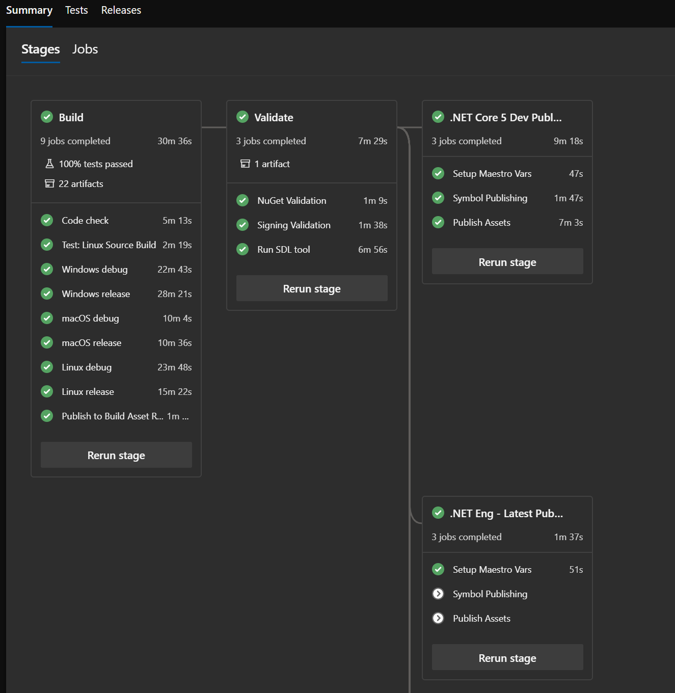

# Arcade SDK Publishing Infrastructure

This document describes the infrastructure provided by the Arcade SDK for publishing build assets.

## Main differences to previous approaches

- **The concept of Channels is central:** The locations where the packages will be published to are determined based on which Maestro++ channel the build is assigned to. Look [here](https://github.com/dotnet/arcade/blob/66175ebd3756697a3ca515e16cd5ffddc30582cd/Documentation/BranchesChannelsAndSubscriptions.md) for more info about channels.

- **Publishing happens after the build:** assets are not published to any external storage during the build job. They are instead registered as Azure DevOps artifacts which will be published to external locations only after the build job finishes and validations are executed.

- **Deprecate Azure DevOps release pipelines:** The new infrastructure doesn't use Azure DevOps Release Management Pipelines - the previous one did. Instead, the new concept of Stages is used. See below more information about stages.

## What are YAML stages?

Stages are a concept introduced by Azure DevOps to organize the jobs in a pipeline. Just as Jobs are a collection of Steps, Stages can be thought of as a collection of Jobs, where for example, the same pipeline can be split into Build, Test and, Publishing stages.

Stages are the way that Azure DevOps is bringing build and release pipelines together, and are going to be the replacement for the RM UI based release pipelines. The official documentation for YAML-based Stages can be found [here](https://docs.microsoft.com/en-us/azure/devops/pipelines/process/stages?view=azure-devops&tabs=yaml).

## Why use YAML stages for publishing?

Using stages for publishing seeks to unify the Arcade SDK build artifact publishing mechanisms into a single solution that brings together the advantages of both the in-build synchronous publishing and the previous release pipeline based asynchronous publishing approaches. Other benefits are:

* Clearly separate the concepts of build, test, publish and validate.
* Support publishing and validation errors to be reported in the build page UI.
* Stages can depend on each other, which provides a natural way to extend default Arcade publishing infra with custom (repo or branch specific) publishing steps.

## How to use the new infrastructure

#### Deprecated Parameters

The new infrastructure makes the following parameters obsolete. These parameters were introduced in previous implementations of the publishing infrastructure; you should not need to pass any of them to the build scripts anymore.

- DotNetPublishToBlobFeed
- DotNetPublishToBlobFeedUrl
- DotNetPublishBlobFeedKey

#### Basic Onboarding Scenario

In order to use this new publishing mechanism, the easiest way to start is by making your existing build pipeline a single stage, and then making use of a YAML template ([eng/common/templates/post-build/post-build.yml](https://github.com/dotnet/arcade/blob/66175ebd3756697a3ca515e16cd5ffddc30582cd/eng/common/templates/post-build/post-build.yml)) provided by Arcade to use the default publishing stages. The process is explained below step by step.

1. Update the repository Arcade SDK version to `1.0.0-beta.19360.8` or newer.

1. Add a *top level* variable named `_DotNetArtifactsCategory` to your build-definition YAML. Most repositories will use `.NETCore` as the category unless assets should be published to a feed other than the default Maestro++ managed feeds. See [Advanced Scenarios](##overriding-the-publishing-feed-used-for-builds-in-the-dev-channel) for instructions on how to publish to a specific feed. See below an example definition:

    ```YAML
    variables:
    ...
    - name: _DotNetArtifactsCategory
      value: .NETCore
    ...
    ```

1. Disable asset publishing during the build. 
    1. If the build job uses the `eng\common\templates\jobs\jobs.yml` template, set the parameter `enablePublishUsingPipelines` to `true`. See example below:

        ```YAML
        jobs:
        - template: /eng/common/templates/jobs/jobs.yml
          parameters:
            enablePublishUsingPipelines: true
        ```

    1. If the build job makes direct use of `eng\common\templates\job\job.yml` you will have to do the following changes. 

        1. Set the `enablePublishUsingPipelines` parameter to `true` when instantiating `job.yml`:

            ```YAML
            jobs:
            ...
            - template: /eng/common/templates/job/job.yml
              parameters:
                ...
                enablePublishUsingPipelines: true
                ...
    ```
        
    1. Make sure that you use the template `eng\common\templates\job\publish-build-assets.yml` to inform Maestro++ that *all* build jobs have finished executing. Also, make sure that you are setting the template parameter `enablePublishUsingPipelines` to `true`:
        
            ```YAML
            jobs:
            ...
            - ${{ if and(ne(variables['System.TeamProject'], 'public'), notin(variables['Build.Reason'], 'PullRequest')) }}:
              - template: /eng/common/templates/job/publish-build-assets.yml
                parameters:
                  ...
                  publishUsingPipelines: true
                  ...
            ```
    
1. You'll also need to pass the below two MSBuild properties to the Arcade build scripts.

    | Name                           | Value                         |
    | ------------------------------ | ----------------------------- |
    | /p:DotNetPublishUsingPipelines | true                          |
    | /p:DotNetArtifactsCategory     | `$(_DotNetArtifactsCategory)` |

    See how the Arcade repo passes these properties in its [azure-pipelines.yml](https://github.com/dotnet/arcade/blob/2cb8b86c1ca7ff77304f76fe7041135209ab6932/azure-pipelines.yml#L74) for an example.

1. Transform your existing build-definition to a single stage. Do that by nesting the current job definition(s) under the `stages` keyword. For instance, this example build definition with a single job definition:

    ```YAML
    jobs:
    - template: /eng/common/templates/jobs/jobs.yml
      parameters:
        enablePublishUsingPipelines: true
    ...
    ```

    should be changed to:

    ```YAML
    stages:
    - stage: build
      displayName: Build
      jobs:
      - template: /eng/common/templates/jobs/jobs.yml
        parameters:
          enablePublishUsingPipelines: true
    ...
    ```

    We suggest you to use the stage name *build*, otherwise you'll need to pass the name of the stage to the `post-build.yml` template (see table on next section).

1. Import the new `eng\common\templates\post-build\post-build.yml` Arcade template at the end of the build definition. This will import all default test, validate and publishing stages provided by Arcade. The bottom part of your build definition will look like this:

    ```YAML
    - ${{ if and(ne(variables['System.TeamProject'], 'public'), notin(variables['Build.Reason'], 'PullRequest')) }}:
      - template: eng\common\templates\post-build\post-build.yml
        parameters:
          enableSourceLinkValidation: false
          ...
    ```

    The `post-build.yml` template accepts the following parameters:

    | Name                                    | Type     | Description                                                                                          |Default Value |
    | --------------------------------------- | -------- | -----------------------------------------------------------------------------------------------------|----- |
    | enableSourceLinkValidation              | bool     | Run SourceLink validation during the post-build stage.                                               | false |
    | enableSigningValidation                 | bool     | Run signing validation during the post-build stage.                                                  | true |
    | enableNugetValidation                   | bool     | Run NuGet package validation tool during the post build stage.                                       | true |
    | symbolPublishingAdditionalParameters    | string   | Additional arguments for the PublishToSymbolServers sdk task.                                        | '' |
    | artifactsPublishingAdditionalParameters | string   | Additional arguments for the PublishArtifactsInManifest sdk task.                                    | '' |
    | signingValidationAdditionalParameters   | string  | Additional arguments for the SigningValidation sdk task.     | '' |
    | publishInstallersAndChecksums           | bool     | Publish installers packages and checksums from the build artifacts to the dotnetcli storage account. | false |
    | SDLValidationParameters                 | object   | Parameters for the SDL job template, as documented in the [SDL template documentation](https://github.com/dotnet/arcade/blob/66175ebd3756697a3ca515e16cd5ffddc30582cd/Documentation/HowToAddSDLRunToPipeline.md) | -- |
    | validateDependsOn | [array] | Which stage(s) should the validation stage depends on. | build |
    | publishDependsOn | [array] | Which stage(s) should the publishing stage(s) depends on. | Validate |

    After these changes the build job(s) will publish the build assets to Azure DevOps build artifacts instead of immediately publishing them to a feed or storage location. Once the post-build template is added, a repo's official build will include a series of stages that will publish the assets to different locations, depending on the Maestro++ default channel(s) that the build is assigned to.

    Examples of the use of the basic onboarding scenario can be found in  the following repos:

    * [Arcade](https://github.com/dotnet/arcade/blob/master/azure-pipelines.yml)
    * [Arcade-Validation](https://github.com/dotnet/arcade-validation/blob/master/azure-pipelines.yml)
    * [Arcade-Services](https://github.com/dotnet/arcade-services/blob/master/azure-pipelines.yml)

The pipeline for a build with stages enabled will look like the one shown below. In this example the build was assigned to the *.Net Core 5 Dev* channel but not to *.Net Eng - Latest* one.

**NOTE:** You need to have the AzDO <u>*Multi-stage pipelines*</u> preview feature enabled to see an UI like the one below. Take a [look here](https://docs.microsoft.com/en-us/azure/devops/project/navigation/preview-features?view=azure-devops) to see how to enable preview features in Azure DevOps.



#### Advanced Scenarios

##### Publishing to custom feeds

By default, public builds currently also publish their assets to the legacy `dotnetfeed/dotnet-core` feed besides the new AzDO feeds (e.g., dotnet5-transport, dotnet5, etc). The SDK provides a mechanism to let you override override the publishing to `dotnetfeed/dotnet-core` to instead publish to a different custom feed of your choice. The steps to enable this override are:

1. Create a Pull Request in Arcade that adds a new mapping between the category of your build assets to the desired target feed. The mapping needs to go in the `TargetStaticFeed` ItemGroup in this file:
    [/src/Microsoft.DotNet.Arcade.Sdk/tools/SdkTasks/SetupTargetFeeds.proj](https://github.com/dotnet/arcade/blob/fd91e27589e69c0a97db2e208b112a24ab989180/src/Microsoft.DotNet.Arcade.Sdk/tools/SdkTasks/SetupTargetFeeds.proj). See example below:

    ```XML
    <PropertyGroup>
      ...
      <TargetStaticFeed Condition="'$(ArtifactsCategory.ToUpper())' == '.NETCORE'">https://dotnetfeed.blob.core.windows.net/dotnet-core/index.json</TargetStaticFeed>
      <TargetStaticFeed Condition="'$(ArtifactsCategory.ToUpper())' == '.NETCOREVALIDATION'">https://dotnetfeed.blob.core.windows.net/arcade-validation/index.json</TargetStaticFeed>
      ...
      <!-- Begin: New Category -->
      <TargetStaticFeed Condition="'$(ArtifactsCategory.ToUpper())' == 'MYNEWCATEGORY'">https://dotnetfeed.blob.core.windows.net/my-feed/index.json</TargetStaticFeed>
      <!-- End: New Category -->
      ...
      <TargetStaticFeed Condition="'$(TargetStaticFeed)' == ''">https://dotnetfeed.blob.core.windows.net/dotnet-core/index.json</TargetStaticFeed>
    </PropertyGroup>
    ```

1. Set your new category as the value for the artifact category variable.

    ```YAML
    variables:
    ...
    - name: _DotNetArtifactsCategory
      value: MyNewCategory
    ...
    ```

**Note:** We strongly suggest that you discuss with the *.Net Engineering* team the intended use case for this custom feed before starting your work. In the *near* future support for publishing to custom feeds will definitely be implemented differently.

### Integrating custom publishing logic

Repositories that make direct use of tasks in Tasks.Feed to publish assets during their *build jobs* should move away from doing so, as they would likely end up publishing to incorrect feeds for servicing builds.

However, if for some reason the infra in the default publishing stages don't meet you requirements you can create additional stages and make them dependent on the default ones. That way, it will at least be clear that the build does custom operations.

**Note:** We strongly suggest that you discuss with the *.Net Engineering* team the intended use case for this before starting your work. We might be able to give other options.

#### Moving away from the legacy PushToBlobFeed task

If you use the legacy `PushToBlobFeed` task from the `Microsoft.DotNet.Build.Tasks.Feed` package, you should change your code to use a new task called [PushToAzureDevOpsArtifacts](https://github.com/dotnet/arcade/blob/master/src/Microsoft.DotNet.Build.Tasks.Feed/src/PushToAzureDevOpsArtifacts.cs). This new task is also in the Tasks.Feed package and should act as a drop-in replacement for the previous one.

`PushToAzureDevOpsArtifacts` generates an appropriately populated Build Asset Manifest and registers the build assets as Azure DevOps build artifacts. This will guarantee that the default publishing stages will be able to access the build assets.

A conversion to `PushToAzureDevOpsArtifacts` for repos that are using the `PushToBlobFeed` task inside their build would look like this:

1. Replace the `PushToBlobFeed` task with `PushToAzureDevOpsArtifacts`:

    ```XML
    <PropertyGroup>
      <AssetManifestFileName>ManifestFileName.xml</AssetManifestFileName>
      <AssetManifestPath>$(ArtifactsLogDir)AssetManifest\$(AssetManifestFileName)</AssetManifestPath>
    </PropertyGroup>
    
    <PushToBlobFeed
      ExpectedFeedUrl="$(FeedURL)"
      AccountKey="$(FeedKey)"
      ItemsToPush="@(ItemsToPush)"
      ManifestBuildData="Location=$(FeedURL)"
      ManifestRepoUri="$(BUILD_REPOSITORY_URI)"
      ManifestBranch="$(BUILD_SOURCEBRANCH)"
      ManifestBuildId="$(BUILD_BUILDNUMBER)"
      ManifestCommit="$(BUILD_SOURCEVERSION)"
      AssetManifestPath="$(AssetManifestPath)"
      PublishFlatContainer="$(PublishFlatContainer)" />
    ```

    becomes

    ```XML
    <PropertyGroup>
      <AssetManifestFileName>ManifestFileName</AssetManifestFileName>
      <AssetManifestPath>$(ArtifactsLogDir)AssetManifest\$(SdkAssetManifestFileName)</AssetManifestPath>
    
      <!-- Create a temporary directory to store the generated asset manifest by the task -->
      <TempWorkingDirectory>$(ArtifactsDir)\..\AssetsTmpDir\$([System.Guid]::NewGuid())</TempWorkingDirectory>
    </PropertyGroup>
    
    <MakeDir Directories="$(TempWorkingDirectory)"/>
    
    <!-- Generate the asset manifest using the PushToAzureDevOpsArtifacts task -->
    <PushToAzureDevOpsArtifacts
      ItemsToPush="@(ItemsToPush)"
      ManifestBuildData="Location=$(FeedURL)"
      ManifestRepoUri="$(BUILD_REPOSITORY_URI)"
      ManifestBranch="$(BUILD_SOURCEBRANCH)"
      ManifestBuildId="$(BUILD_BUILDNUMBER)"
      ManifestCommit="$(BUILD_SOURCEVERSION)"
      PublishFlatContainer="$(PublishFlatContainer)"
      AssetManifestPath="$(AssetManifestPath)"
      AssetsTemporaryDirectory="$(TempWorkingDirectory)" />
    
    <!-- Copy the generated manifest to the build's artifacts -->
    <Copy
      SourceFiles="$(AssetManifestPath)"
      DestinationFolder="$(TempWorkingDirectory)\$(AssetManifestFileName)" />
    
    <Message
      Text="##vso[artifact.upload containerfolder=AssetManifests;artifactname=AssetManifests]$(TempWorkingDirectory)/$(AssetManifestFileName)"
      Importance="high" />
    ```

    This will do something similar to what the SDK does for its default publishing pipeline, as seen in [publish.proj](https://github.com/dotnet/arcade/blob/master/src/Microsoft.DotNet.Arcade.Sdk/tools/Publish.proj). 

    **Note:** the usage of a temporary directory for placing the assets while uploading them is needed to guarantee that nothing interferes with the upload since it occurs asynchronously. See [this issue](https://github.com/dotnet/arcade/issues/2197) for context.

#### Validating the changes

Since the post-build stages will only trigger during builds that run in the internal project (i.e., they won't show up on public builds), there are some additional steps that need to be performed in order to test that the changes to the pipeline are correct, and that publishing works as expected. 

1. Publish a branch to the Azure DevOps mirror of the repo that includes the pipeline changes.
1. Set up the "General Testing Channel" as a default channel for the internal repo + branch combination using Darc.

    ``` Powershell
    darc add-default-channel --channel "General Testing" --branch "<my_new_branch>" --repo "https://dev.azure.com/dnceng/internal/_git/<repo_name>"
    ```

1. Queue a build for your test branch
1. Once the Build and Validate stages complete, the *General Testing* stage should execute and publish the packages to the feed during the `Publish Assets` job.

## Additional considerations for internal and stable builds

In order to publish packages for stable and internal servicing builds, some additional setup is required so that publishing, dependency flow and package restore work correctly.

### Builds from internal/* branches

Packages from *internal/* branches will not be published to public feeds, but will instead be published to a private transport feed provided by @dnceng. In order to be able to restore packages from this feed, repos will need to add the feed to their NuGet.config file.

### Stable builds

For stable builds, where every build will produce packages with the same version, the publishing pipeline will generate a new package feed to publish the build artifacts on every build. In order for dependent repos to be able to restore these packages, Maestro++ will flow the feed information required to restore packages located in any such feeds into the repo's root folder NuGet.config as part of a dependency update PR.

```XML
<?xml version="1.0" encoding="utf-8"?>
<configuration>
  <packageSources>
    <clear />
    <!--Begin: Package sources managed by Dependency Flow automation. Do not edit the sources below.-->
    <add key="darc-int-dotnet-arcade" value="<private-feed-containing the packages>" />
    <!--End: Package sources managed by Dependency Flow automation. Do not edit the sources above.-->
    <add key="arcade" value="https://pkgs.dev.azure.com/dnceng/public/_packaging/dotnet-eng/nuget/v3/index.json" />
    <add key="dotnet-core" value="https://dotnetfeed.blob.core.windows.net/dotnet-core/index.json" />
    <add key="nuget.org" value="https://api.nuget.org/v3/index.json" />
  </packageSources>
</configuration>
```

The PackageSources enclosed in the
`<!--Begin: Package sources managed by Dependency Flow automation. Do not edit the sources below.-->` and
`<!--End: Package sources managed by Dependency Flow automation. Do not edit the sources above.-->` comments are managed by Maestro++ Dependency update PRs, and will be added and removed by dependency update pull requests as they are needed.