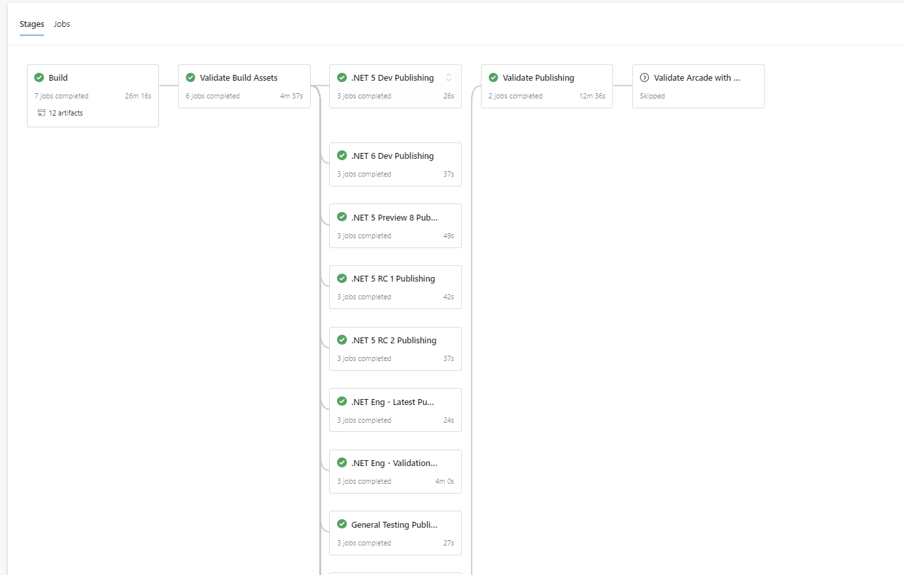

# Arcade SDK Publishing Infrastructure

This document describes the infrastructure provided by the Arcade SDK for publishing build assets.

### What is V1 publishing?

The publishing infrastructure has multiple stage(s), these stages represent available channels. Only the stages corresponding to the default channel will execute. This is for arcade3.x only.

V1 came into existence when we branched for release/3.x in arcade. Master and arcade/3.x initially had the same publishing logic. Overtime the publishing stage in arcade master evolved so that became V2 publishing.

Asset manifest Example : 

`publishingVersion` is not present in V1.

```XML
<Build Name="https://dnceng@dev.azure.com/dnceng/internal/_git/dotnet-arcade-validation"
BuildId="20200915.7"
Branch="refs/heads/release/3.x"
Commit="0f733414ac0a5e5d4b7233d47851a400204a7cac"
AzureDevOpsAccount="dnceng"
AzureDevOpsBranch="refs/heads/release/3.x"
AzureDevOpsBuildDefinitionId="282"
AzureDevOpsBuildId="816405"
AzureDevOpsBuildNumber="20200915.7"
AzureDevOpsProject="internal"
AzureDevOpsRepository="https://dnceng@dev.azure.com/dnceng/internal/_git/dotnet-arcade-validation"
InitialAssetsLocation="https://dev.azure.com/dnceng/internal/_apis/build/builds/816405/artifacts"
IsStable="False"
Location="https://dotnetfeed.blob.core.windows.net/arcade-validation/index.json">

```
All the 3.1 servicing branches of repos use this version of the infrastructure.

### What is V2 publishing?

The publishing infrastructure has multiple stage(s), these stages represent available channels. Only the stages corresponding to default channel will execute. All the other stages will execute the Setup Maestro Vars job but will not publish.

The distinction between V1 and V2 is that V1 serves for arcade3.x only and V2 serves for all the other repos. Also the asset manifest in V2 contains the `publishingVersion = 2`.

Example asset manifest from arcade-validation:
```XML
<Build PublishingVersion="2"
Name="dotnet-arcade-validation"
BuildId="20200918.1"
Branch="refs/heads/master"
Commit="4aa1a2a24a2c7685fdbfea89f4496d8a31a05264"
AzureDevOpsAccount="dnceng"
AzureDevOpsBranch="refs/heads/master"
AzureDevOpsBuildDefinitionId="282"
AzureDevOpsBuildId="820763"
AzureDevOpsBuildNumber="20200918.1"
AzureDevOpsProject="internal"
AzureDevOpsRepository="https://dnceng@dev.azure.com/dnceng/internal/_git/dotnet-arcade-validation"
InitialAssetsLocation="https://dev.azure.com/dnceng/internal/_apis/build/builds/820763/artifacts"
IsStable="False">

```

Example from arcade-validation : 



### What is V3 publishing? How is it different from V2?

In V3, we have a single stage called 'Publish Using Darc', handling publishing for all available channels. Even if the repo branch is associated to more than one default channel(s) there will be only one stage. V3 uses [`darc add-build-to-channel`](https://github.com/dotnet/arcade/blob/ec191f3d706d740bc7a87fbb98d94d916f81f0cb/Documentation/Darc.md#add-build-to-channel) to promote builds based on the current configured default channels for the branch just built.
The [maestro promotion pipeline](https://dnceng.visualstudio.com/internal/_build?definitionId=750) is a pipeline used to publish the packages to the target channel(s).
`Add-build-to-channel` queues a new build of this pipeline and waits for it to publish assets to the appropriate locations.

Using a single stage for the publishing infrastructure, reducing UI clutter. V3 reduces the number of machines used during publishing, which speeds up the whole process. In addition, some classes of changes (e.g. addition of new channels) can be added to the infrastructure without requiring an arcade update in a consumer repository.

Example from arcade-validation: 


### How to upgrade from V2 to V3?

The following changes have to be made:
1. Create or update eng/Publishing.props, adding the following MSBuild property:

```
<PublishingVersion>3</PublishingVersion>
```

Example: 
```
<?xml version="1.0" encoding="utf-8"?>
<Project>
   <PropertyGroup>
      <PublishingVersion>3</PublishingVersion>
   </PropertyGroup>
</Project>
```
arcade-validation example : https://github.com/dotnet/arcade-validation/blob/a3b8def7412266282cd23edf9e84176f6afe52a5/eng/Publishing.props#L4

1. In the azure-pipelines.yml file(or your pipeline file), add the `publishingInfraVersion` parameter to the post-build template.

Example: 
```
  - template: eng\common\templates\post-build\post-build.yml
    parameters:
      publishingInfraVersion: 3
      enableSymbolValidation: false
      enableSigningValidation: false
      enableNugetValidation: false
      enableSourceLinkValidation: false
```
arcade-validation example : https://github.com/dotnet/arcade-validation/blob/a3b8def7412266282cd23edf9e84176f6afe52a5/azure-pipelines.yml#L206

## Basic onboarding scenario for new repositories to the current publishing version V3

In order to use the new publishing mechanism, the easiest way to start is by turning your existing build pipeline into an AzDO YAML stage, and then making use of a YAML template ([eng/common/templates/post-build/post-build.yml](https://github.com/dotnet/arcade/blob/66175ebd3756697a3ca515e16cd5ffddc30582cd/eng/common/templates/post-build/post-build.yml)) provided by Arcade to use the default publishing stages. The process is explained below step by step.

1. Update the Arcade SDK version used by the repository to `5.0.0-beta.20461.7` or newer.

1. Disable asset publishing during the build. There are two common situations here. Some build definitions make use of the `jobs.yml` template and others make use of the `job.yml` (singular). The former is a wrapper around a few things, among them the `job.yml` and `publish-build-assets.yml` templates. If your build definition doesn't use `jobs.yml` you'll need to directly pass the `PublishUsingPipelines` parameter to the included templates. See examples below.

    1. If the build job uses the `eng\common\templates\jobs\jobs.yml` template, set the parameter `enablePublishUsingPipelines` to `true`. See example below:

        ```YAML
        jobs:
        - template: /eng/common/templates/jobs/jobs.yml
          parameters:
            enablePublishUsingPipelines: true
        ```

    1. If the build job makes direct use of `eng\common\templates\job\job.yml` you will have to do the following changes. 

        1. Set the `enablePublishUsingPipelines` parameter to `true` when instantiating `job.yml`:

            ```YAML
            jobs:
            ...
            - template: /eng/common/templates/job/job.yml
              parameters:
                ...
                enablePublishUsingPipelines: true
                ...
            ```
        1. Make sure that you use the template `eng\common\templates\job\publish-build-assets.yml` to inform Maestro++ that *all* build jobs have finished executing. Also, make sure that you are setting the template parameter `enablePublishUsingPipelines` to `true`:

            ```YAML
            jobs:
            ...
            - ${{ if and(ne(variables['System.TeamProject'], 'public'), notin(variables['Build.Reason'], 'PullRequest')) }}:
              - template: /eng/common/templates/job/publish-build-assets.yml
                parameters:
                  ...
                  publishUsingPipelines: true
                  ...
            ```

1. You'll also need to pass the below MSBuild property to the Arcade build scripts.

  | Name                           | Value |
  | ------------------------------ | ----- |
  | /p:DotNetPublishUsingPipelines | true  |

  For example, if the repo has the following configuration for invoking `cibuild.cmd`:
  
  ```YAML
    - _InternalBuildArgs: /p:DotNetSignType=$(_SignType) 
        /p:TeamName=$(_TeamName)
        /p:DotNetPublishBlobFeedKey=$(dotnetfeed-storage-access-key-1)
        /p:DotNetPublishBlobFeedUrl=$(_PublishBlobFeedUrl)
        /p:DotNetPublishToBlobFeed=$(_DotNetPublishToBlobFeed)
        /p:DotNetSymbolServerTokenMsdl=$(microsoft-symbol-server-pat)
        /p:DotNetSymbolServerTokenSymWeb=$(symweb-symbol-server-pat)
        /p:OfficialBuildId=$(BUILD.BUILDNUMBER)
    
    - script: eng\common\cibuild.cmd
        -configuration $(_BuildConfig)
        -prepareMachine
         $(_InternalBuildArgs)
  ```
  after setting the needed MSBuild properties it should looks like this:
  ```YAML
    - _InternalBuildArgs: /p:DotNetSignType=$(_SignType) 
        /p:TeamName=$(_TeamName)
        /p:DotNetPublishBlobFeedKey=$(dotnetfeed-storage-access-key-1)
        /p:DotNetPublishBlobFeedUrl=$(_PublishBlobFeedUrl)
        /p:DotNetPublishToBlobFeed=$(_DotNetPublishToBlobFeed)
        /p:DotNetSymbolServerTokenMsdl=$(microsoft-symbol-server-pat)
        /p:DotNetSymbolServerTokenSymWeb=$(symweb-symbol-server-pat)
        /p:OfficialBuildId=$(BUILD.BUILDNUMBER)
        /p:DotNetPublishUsingPipelines=$(_PublishUsingPipelines)
    
    - script: eng\common\cibuild.cmd
        -configuration $(_BuildConfig)
        -prepareMachine
         $(_InternalBuildArgs)
  ```

1. Transform your existing build-definition to a single stage. Do that by nesting the current job definition(s) under the `stages` keyword. For instance, this example build definition with a single job definition:

    ```YAML
    jobs:
    - template: /eng/common/templates/jobs/jobs.yml
      parameters:
        enablePublishUsingPipelines: true
    ...
    ```

    should be changed to:

    ```YAML
    stages:
    - stage: build
      displayName: Build
      jobs:
      - template: /eng/common/templates/jobs/jobs.yml
        parameters:
          enablePublishUsingPipelines: true
    ...
    ```

    We suggest you to use the stage name *build* and have only one build stage. However, that's not a requirement. If you choose to use a different stage name or need to use multiple build stages you'll need to pass the name of the stage(s) to the `post-build.yml` template (see table on next section).

1. Import the`eng\common\templates\post-build\post-build.yml` Arcade template at the end of the build definition. This will import all default test, validate and publishing stages provided by Arcade. The bottom part of your build definition will look like this:

    ```YAML
    - ${{ if and(ne(variables['System.TeamProject'], 'public'), notin(variables['Build.Reason'], 'PullRequest')) }}:
      - template: eng\common\templates\post-build\post-build.yml
        parameters:
          publishingInfraVersion: 3
          enableSourceLinkValidation: false
          ...
    ```

    The `post-build.yml` template accepts the following parameters:

    | Name                                    | Type     | Description                                                                                          |Default Value |
    | --------------------------------------- | -------- | -----------------------------------------------------------------------------------------------------|----- |
    | publishingInfraVersion                  | int      | Publishing infrastructure version - Use 3 for latest publishing infra. Accepted values are 2 / 3.                               | 2    |
    | enableSourceLinkValidation              | bool     | Run SourceLink validation during the post-build stage.                                               | false |
    | enableSigningValidation                 | bool     | Run signing validation during the post-build stage.                                                  | true |
    | enableNugetValidation                   | bool     | Run NuGet package validation tool during the post build stage.                                       | true |
    | symbolPublishingAdditionalParameters    | string   | Additional arguments for the PublishToSymbolServers sdk task.                                        | '' |
    | artifactsPublishingAdditionalParameters | string   | Additional arguments for the PublishArtifactsInManifest sdk task.                                    | '' |
    | signingValidationAdditionalParameters   | string  | Additional arguments for the SigningValidation sdk task.     | '' |
    | publishInstallersAndChecksums           | bool     | Publish installers packages and checksums from the build artifacts to the dotnetcli storage account. Documentation for opting in to automatic checksum generation can be found in the [Checksum section](https://github.com/dotnet/arcade/blob/master/Documentation/CorePackages/Publishing.md#checksum-generation) of this document. | true |
    | SDLValidationParameters                 | object   | Parameters for the SDL job template, as documented in the [SDL template documentation](https://github.com/dotnet/arcade/blob/66175ebd3756697a3ca515e16cd5ffddc30582cd/Documentation/HowToAddSDLRunToPipeline.md) | -- |
    | validateDependsOn | [array] | Which stage(s) should the validation stage depend on. | build |
    | publishDependsOn | [array] | Which stage(s) should the publishing stage(s) depend on. | Validate |

    After these changes the build job(s) will publish the build assets to Azure DevOps build artifacts instead of immediately publishing them to a feed or storage location. Once the post-build template is added, a repo's official build will include a series of stages that will publish the assets to different locations, depending on the Maestro++ default channel(s) that the build is assigned to.

    Examples of the use of the basic onboarding scenario can be found in  the following repos:

    * [Arcade](https://github.com/dotnet/arcade/blob/master/azure-pipelines.yml)
    * [Arcade-Validation](https://github.com/dotnet/arcade-validation/blob/master/azure-pipelines.yml)
    * [Arcade-Services](https://github.com/dotnet/arcade-services/blob/master/azure-pipelines.yml)

1. Create or update eng/Publishing.props, adding the following MSBuild property:
    ```XML
        <PublishingVersion>3</PublishingVersion>
    ```

   Sample: 
     ```XML
      <?xml version="1.0" encoding="utf-8"?>
        <Project>
           <PropertyGroup>
              <PublishingVersion>3</PublishingVersion>
           </PropertyGroup>
        </Project>
     ```

   Example of the use of Publishing.props can be found in the following repos :

   * [Arcade-Validation](https://github.com/dotnet/arcade-validation/blob/6009d37b7ecacbb0bc1e0c5a601b8d7e3b2e5fa5/eng/Publishing.props#L4)

The pipeline for a build with stages enabled will look like the one shown below.


### Validating the changes

Since the post-build stages will only trigger during builds that run in the internal project (i.e., they won't show up on public builds), there are some additional steps that need to be performed in order to test that the changes to the pipeline are correct, and that publishing works as expected. 

1. Create a branch on the Azure DevOps internal mirror of the repo that includes the pipeline changes.
1. Set up the "General Testing Channel" as a default channel for the internal repo + branch combination using Darc.

    ``` Powershell
    darc add-default-channel --channel "General Testing" --branch "<my_new_branch>" --repo "https://dev.azure.com/dnceng/internal/_git/<repo_name>"
    ```

1. Queue a build for your test branch
1. Once the Build and Validate Build Assets stages complete, the *Publish Using Darc* stage should execute and publish the packages to the feed during the `Publish Using Darc` job. [Maestro Promotion Pipeline](https://dnceng.visualstudio.com/internal/_build?definitionId=750) is a pipeline used to publish the packages to the target channel. The job informs that a new build has been triggered in the promotion pipeline, and once it succeeds the build will be in the channel. The `Publish Using Darc` job calls [`darc add-build-to-channel`](https://github.com/dotnet/arcade/blob/ec191f3d706d740bc7a87fbb98d94d916f81f0cb/Documentation/Darc.md#add-build-to-channel) which waits until a build of the promotion pipeline publishes the assets.

### Checksum generation

Arcade also includes support for automatically generating checksum files. To opt in to this feature, in each project that generates an asset for which you want to generate a checksum, add an Item named `GenerateChecksumItems` to the project file, which includes the output path of the original asset, and a metadata element named `DestinationPath` which represents the desired output path of the checksum file.

Example:

    ```XML
    <ItemGroup>
      <GenerateChecksumItems Include="@(OutputFile)">
        <DestinationPath>%(FullPath).Sha512</OutputPath>
      </GenerateChecksumItems>
    </ItemGroup>
    ```

Ensure that you do not set `publishInstallersAndChecksums=false` in your call to the `post-build.yml` template.

## More complex onboarding scenarios

### Integrating custom publishing logic

Repositories that make direct use of tasks in Tasks.Feed to publish assets during their *build jobs* should move away from doing so, as they would likely end up publishing to incorrect feeds for servicing builds.

However, if for some reason the infra in the default publishing stages don't meet you requirements you can create additional stages and make them dependent on the default ones. That way, it will at least be clear that the build does custom operations.

**Note:** We strongly suggest that you discuss with the *.Net Engineering* team the intended use case for this before starting your work. We might be able to give other options.

### Moving away from the legacy PushToBlobFeed task

If you use the legacy `PushToBlobFeed` task from the `Microsoft.DotNet.Build.Tasks.Feed` package, you should change your code to use a new task called [PushToAzureDevOpsArtifacts](https://github.com/dotnet/arcade/blob/master/src/Microsoft.DotNet.Build.Tasks.Feed/src/PushToAzureDevOpsArtifacts.cs). This new task is also in the Tasks.Feed package and should act as a drop-in replacement for the previous one.

`PushToAzureDevOpsArtifacts` generates an appropriately populated Build Asset Manifest and registers the build assets as Azure DevOps build artifacts. This will guarantee that the default publishing stages will be able to access the build assets.

A conversion to `PushToAzureDevOpsArtifacts` for repos that are using the `PushToBlobFeed` task inside their build would look like this:

1. Replace the `PushToBlobFeed` task with `PushToAzureDevOpsArtifacts`:

    ```XML
    <PropertyGroup>
      <AssetManifestFileName>ManifestFileName.xml</AssetManifestFileName>
      <AssetManifestPath>$(ArtifactsLogDir)AssetManifest\$(AssetManifestFileName)</AssetManifestPath>
    </PropertyGroup>
    
    <PushToBlobFeed
      ExpectedFeedUrl="$(FeedURL)"
      AccountKey="$(FeedKey)"
      ItemsToPush="@(ItemsToPush)"
      ManifestBuildData="Location=$(FeedURL)"
      ManifestRepoUri="$(BUILD_REPOSITORY_URI)"
      ManifestBranch="$(BUILD_SOURCEBRANCH)"
      ManifestBuildId="$(BUILD_BUILDNUMBER)"
      ManifestCommit="$(BUILD_SOURCEVERSION)"
      AssetManifestPath="$(AssetManifestPath)"
      PublishFlatContainer="$(PublishFlatContainer)" />
    ```

    becomes

    ```XML
    <PropertyGroup>
      <AssetManifestFileName>ManifestFileName</AssetManifestFileName>
      <AssetManifestPath>$(ArtifactsLogDir)AssetManifest\$(SdkAssetManifestFileName)</AssetManifestPath>
    
      <!-- Create a temporary directory to store the generated asset manifest by the task -->
      <TempWorkingDirectory>$(ArtifactsDir)\..\AssetsTmpDir\$([System.Guid]::NewGuid())</TempWorkingDirectory>
    </PropertyGroup>
    
    <MakeDir Directories="$(TempWorkingDirectory)"/>
    
    <!-- Generate the asset manifest using the PushToAzureDevOpsArtifacts task -->
    <PushToAzureDevOpsArtifacts
      ItemsToPush="@(ItemsToPush)"
      ManifestBuildData="Location=$(FeedURL)"
      ManifestRepoUri="$(BUILD_REPOSITORY_URI)"
      ManifestBranch="$(BUILD_SOURCEBRANCH)"
      ManifestBuildId="$(BUILD_BUILDNUMBER)"
      ManifestCommit="$(BUILD_SOURCEVERSION)"
      PublishFlatContainer="$(PublishFlatContainer)"
      AssetManifestPath="$(AssetManifestPath)"
      AssetsTemporaryDirectory="$(TempWorkingDirectory)"
      PublishingVersion="3" />
    
    <!-- Copy the generated manifest to the build's artifacts -->
    <Copy
      SourceFiles="$(AssetManifestPath)"
      DestinationFolder="$(TempWorkingDirectory)\$(AssetManifestFileName)" />
    
    <Message
      Text="##vso[artifact.upload containerfolder=AssetManifests;artifactname=AssetManifests]$(TempWorkingDirectory)/$(AssetManifestFileName)"
      Importance="high" />
    ```

    This will do something similar to what the SDK does for its default publishing pipeline, as seen in [publish.proj](https://github.com/dotnet/arcade/blob/master/src/Microsoft.DotNet.Arcade.Sdk/tools/Publish.proj). 

    **Note:** the usage of a temporary directory for placing the assets while uploading them is needed to guarantee that nothing interferes with the upload since it occurs asynchronously. See [this issue](https://github.com/dotnet/arcade/issues/2197) for context.

## PublishingUsingPipelines & Deprecated Properties

Starting with Arcade SDK version **5.0.0-beta.20120.2** there is not support anymore for the old publishing infrastructure where the Arcade SDK handled publishing of all assets during the build stage. That means, that if:

- **The build definition sets `/p:DotNetPublishusingPipelines=true`:** Arcade will handle the control of assets publishing to Maestro++ and also that the build definition doesn't need to inform any of the following properties to the build scripts [CIBuild.cmd/sh](https://github.com/dotnet/arcade/blob/master/eng/common/CIBuild.cmd) :

  | Property      |
  | ----------------------------- |
  | DotNetPublishBlobFeedKey      |
  | DotNetPublishBlobFeedUrl      |
  | DotNetPublishToBlobFeed       |
  | DotNetSymbolServerTokenMsdl   |
  | DotNetSymbolServerTokenSymWeb |
  
- **The build definition doesn't set `/p:DotNetPublishingUsingPipelines` or set it to false:** only symbols will be published and they will be controlled by the Arcade SDK. The build definition still needs to inform the `DotNetSymbolServerToken[Msdl/SymWeb]` properties, but the following properties aren't required anymore:

  | Property      |
  | ----------------------------- |
  | DotNetPublishBlobFeedKey      |
  | DotNetPublishBlobFeedUrl      |
  | DotNetPublishToBlobFeed       |

Furthermore, starting with Arcade SDK version **5.0.0-beta.20120.2** the default value for the `DotNetArtifactsCategory` property is `.NETCore`, therefore you don't need to set that property anymore if you were setting it to `.NETCore`.

## Frequently Asked Questions

### Guiding principles of the new infra?

- **Controlled by Maestro++ Channels:** The locations where packages are published to are determined based on which Maestro++ channel the build is assigned to. Look [here](https://github.com/dotnet/arcade/blob/66175ebd3756697a3ca515e16cd5ffddc30582cd/Documentation/BranchesChannelsAndSubscriptions.md) for more info about channels.

- **Publishing is decoupled from the build job:** Publishing is managed by the Arcade SDK entirely and assets are not published to any external storage during the build job. They are instead registered as Azure DevOps artifacts and only published to external locations after the build job finishes.

- **Single view for building and publishing:** The new infrastructure doesn't use Release Pipelines - the previous one did. Instead, the concept of Stages is used. See below section about stages.

### What are YAML stages?

Stages are a concept introduced by Azure DevOps to organize the jobs in a pipeline. Just as Jobs are a collection of Steps, Stages can be thought of as a collection of Jobs, where for example, the same pipeline can be split into Build, Test and, Publishing stages.

Stages are the way that Azure DevOps is bringing build and release pipelines together, and are going to be the replacement for the RM UI based release pipelines. The official documentation for YAML-based Stages can be found [here](https://docs.microsoft.com/en-us/azure/devops/pipelines/process/stages?view=azure-devops&tabs=yaml).

### Why use YAML stages for publishing?

Using stages for publishing seeks to unify the Arcade SDK build artifact publishing mechanisms into a single solution that brings together the advantages of both the in-build synchronous publishing and the previous release pipeline based asynchronous publishing approaches. Other benefits are:

* Clearly separate the concepts of build, test, publish and validate.
* Support publishing and validation errors to be reported in the build page UI.
* Stages can depend on each other, which provides a natural way to extend default Arcade publishing infra with custom (repo or branch specific) publishing steps.

### Are there new package feeds? Which feed will be used?

Each Maestro++ channel is configured ([currently via YAML](https://github.com/dotnet/arcade/tree/ec191f3d706d740bc7a87fbb98d94d916f81f0cb/eng/common/templates/post-build/channels)) to use three *Azure DevOps* feeds:

- **A transport feed:** used for publishing packages intended for use internally in the .Net Core stack.
- **A shipping feed:** used for publishing packages that will be directly used by end users.
- **A symbols feed:** symbol packages (`.symbols.nupkg`) are published to this feed as well as to symbol servers.

The target feed will be public/private depending on whether the Maestro++ channel is public/private. For public channels the packages/blobs are *also* published to the legacy `dotnetfeed/dotnet-core` feed - You can override this and publish to a another custom feed, see description in a further section. 

Each stable builds (i.e., [Release Official Builds](https://github.com/dotnet/arcade/blob/84f3b4a8520b9e6d50afece47fa1adf4de8ec292/Documentation/CorePackages/Versioning.md#build-kind)) publish to a different set of target feeds. This is because these builds always produce the same package version and overriding packages in the feeds is usually something not supported. Whenever a branch receive a PR from Maestro++, *that contains packages that were published to a dynamically created feed*, it will add the new feed to the repository root NuGet.Config file as a package source feed. *Note that Maestro++ currently doesn't update NuGet.Config with the static feeds*.

### What benefits do I get from the new infrastructure?

There are a few benefits, but the bottom line is: you can rely on Arcade SDK and Maestro++ to determine the correct place to publish the build assets. This is specially important for servicing and/or private builds where assets must not go to public locations before further validations. The new infrastructure also performs Signing validation, SDL validation and NuGet packages metadata validation.

### Why most stages don't execute the publishing job in V2?

This happens because the publishing job will only execute in stage(s) representing a channel(s) that is [configured as a Default Channel](https://github.com/dotnet/arcade/blob/ec191f3d706d740bc7a87fbb98d94d916f81f0cb/Documentation/Darc.md#add-default-channel) for the build in Maestro++. All other stages will only execute the `Setup Maestro Vars` job. 

### Why so many stages in V2?

Each stage represents a different Maestro++ channel. Therefore, as the number of channels in Maestro increase the number of stages also increase. In V3 we addressed this, by having single stage for Publishing infrastructure. 

### What's this "Setup Maestro Vars" job?

Currently Azure DevOps does not support communicating "YAML variables" across stages. The recommended workaround to do this is to use an AzDO artifact to persist the variables. The `Setup Maestro Vars` job is used to read one of such artifacts and set stage-scope variables based on the file content.

### How will this change affect symbol publishing?

Symbol publishing to MSDL and SymWeb will be done as a regular part of publishing the build assets. The symbol packages (i.e., symbols.nupkg files) are also published to a feed as a form of backup.

### Can we manually assign a build to a channel?

Yes, that's possible. You need to [use Darc to do that](https://github.com/dotnet/arcade/blob/ec191f3d706d740bc7a87fbb98d94d916f81f0cb/Documentation/Darc.md#add-build-to-channel).

### Why the build assets aren't getting published anywhere?

Most frequent cause of this is that there is no Default Channel configured for the build. [Take a look here](https://github.com/dotnet/arcade/blob/ec191f3d706d740bc7a87fbb98d94d916f81f0cb/Documentation/Darc.md#get-default-channels) to see how to check that.

### Why do you need the DotNetPublishUsingPipelines parameter?

The `DotNetPublishUsingPipelines` is a flag that Arcade SDK uses to determine if the repo wants Maestro++ to control all aspects of publishing. If that parameter is not set (not advisable)  Arcade SDK will only publish symbols produced by the build; publishing of other assets should be taken care of by the repo build definition.

### What's PackageArtifacts, BlobArtifacts, PdbArtifacts and ReleaseConfigs for?

- **PackageArtifacts**: contains all NuGet (.nupkg) packages to be published.
- **BlobArtifacts**: contains all blob artifacts (usually .symbols.nupkg) to be published.
- **PdbArtifacts**: contains all PDB artifacts to be published to symbol servers - SymWeb & MSDL.
- **ReleaseConfigs**: contains configuration files used by the post-build stages. In particular it should contain a file called `ReleaseConfigs.txt` that stores the BAR BuildId, the list of default channels IDs of the build and whether the current build is stable or not, respectively.

**Note:** only packages and blobs described in at least one build manifest will be published.

### Where can I see publishing logs in V1 and V2?

The publishing logs are stored inside an Azure DevOps artifacts container named `PostBuildLogs`. Each activated post-build channel/stage will have a subfolder under `PostBuildLogs`. Each job in a publishing channel/stage will have `.binlogs` in the container.

### Where can I see publishing logs in V3?

Under the `Publish Using Darc` job get the link to the newly queued build in the [Maestro promotion pipeline](https://dnceng.visualstudio.com/internal/_build?definitionId=750). The publishing logs are stored inside an Azure DevOps artifacts container named `PostBuildLogs`. 

### How to add a new channel to use V3 publishing?

Create the channel using [darc add-channel](https://github.com/dotnet/arcade/blob/master/Documentation/Darc.md#add-channel). Verify if the channel was created successfully using [darc get-channel](https://github.com/dotnet/arcade/blob/master/Documentation/Darc.md#get-channels) and get the channelId.

In the Microsoft.DotNet.Build.Task.Feed/src/Model/PublishingConstants.cs file, create a new TargetChannelConfig 

TargetChannelConfig takes the following attributes

| Params      |   Description             |  Value   |
|-------------|---------------------------|----------|
| ChannelId   | Id for channel to publish |          |
| isInternal  | Publishing to an internal Channel or public channel | true or false  |
| PublishingInfraVersion | Which version of the publishing infra can use this configuration. | Enum = All(0), Legacy(1), Latest(2), Next(3)  |
| AkaMSChannelName | The name that should be used for creating Aka.ms links for this channel.  |   |
| ShippingFeed | The URL (including the index.json suffix) of the *shipping* feed to be used for this channel. |   | 
| TransportFeed | The URL (including the index.json suffix) of the *transport* feed to be used for this channel. |   | 
| SymbolsFeed | The URL (including the index.json suffix) of the *symbols* feed to be used for this channel. |   | 
| ChecksumsFeed | The URL (including the index.json suffix) where *checksums* should be published to. | FeedForChecksums for public channel, FeedInternalForChecksums for internal  | 
| InstallersFeed | The URL (including the index.json suffix) where *installers* should be published to. | FeedForInstallers for public channel, FeedInternalForInstallers for internal channel   |
| SymbolTargetType | Publish to MSDL or SymWeb symbol server | PublicAndInternalSymbolTargets -publishes to both Msdl and SymWeb or InternalSymbolTargets -publishes only to SymWeb |

```C#
Eg:
Publishing to General Testing channel : General Testing

            new TargetChannelConfig(
                529,
                false,
                PublishingInfraVersion.All,
                "generaltesting",
                "https://pkgs.dev.azure.com/dnceng/public/_packaging/general-testing/nuget/v3/index.json",
                "https://pkgs.dev.azure.com/dnceng/public/_packaging/general-testing/nuget/v3/index.json",
                "https://pkgs.dev.azure.com/dnceng/public/_packaging/general-testing-symbols/nuget/v3/index.json",
                FeedForChecksums,
                FeedForInstallers,
                PublicAndInternalSymbolTargets)
```


### Which feeds does Arcade infra publish to?

| Feed Name           | Intended Usage                                               |
| ------------------- | ------------------------------------------------------------ |
| dotnet-eng          | Packages required for engineering infra                      |
|                     | https://pkgs.dev.azure.com/dnceng/public/_packaging/dotnet-eng/nuget/v3/index.json |
| dotnet-tools        | Tooling packages, such as Symreader, Sourcelink, etc…        |
|                     | https://pkgs.dev.azure.com/dnceng/public/_packaging/dotnet-tools/nuget/v3/index.json |
| dotnet5             | .NET 5 shipping packages                                     |
|                     | https://pkgs.dev.azure.com/dnceng/public/_packaging/dotnet5/nuget/v3/index.json |
| dotnet5-transport   | .NET 5 non-shipping packages                                 |
|                     | https://pkgs.dev.azure.com/dnceng/public/_packaging/dotnet5-transport/nuget/v3/index.json |
| dotnet3.1           | .NET Core 3.1 shipping packages                              |
|                     | https://pkgs.dev.azure.com/dnceng/public/_packaging/dotnet3.1/nuget/v3/index.json |
| dotnet3.1-transport | .NET Core 3.1 non-shipping packages                          |
|                     | https://pkgs.dev.azure.com/dnceng/public/_packaging/dotnet3.1-transport/nuget/v3/index.json |
| dotnet3.1-blazor    | Packages specific to Blazor 3.1 This is an example of a repo-specific feed/channel |
|                     | https://pkgs.dev.azure.com/dnceng/public/_packaging/dotnet3.1-blazor/nuget/v3/index.json |
| dotnet3             | .NET Core 3 shipping packages                                |
|                     | https://pkgs.dev.azure.com/dnceng/public/_packaging/dotnet3/nuget/v3/index.json |
| dotnet3-transport   | .NET Core 3 non-shipping packages                            |
|                     | https://pkgs.dev.azure.com/dnceng/public/_packaging/dotnet3-transport/nuget/v3/index.json |
