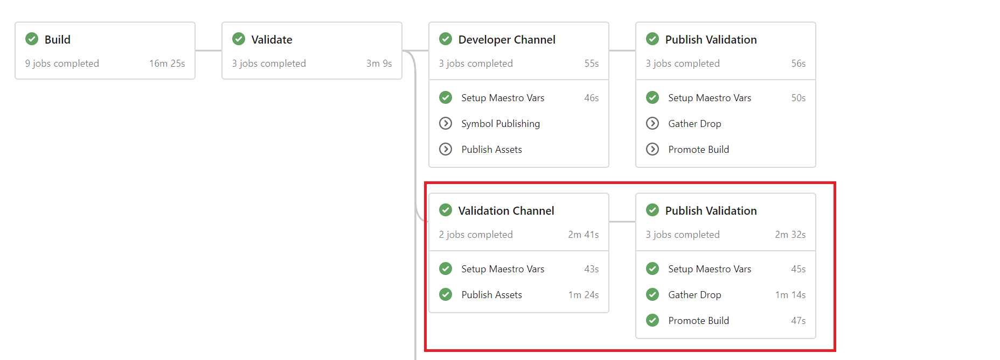

# YAML Stages Based Publishing and Validation

This document describes the new YAML based approach that will be used for build artifact publishing.
This applies for builds from public branches, as well as for internal branches, with a few additional considerations.

## What are YAML stages?

Stages are a concept introduced by Azure DevOps to organize the jobs in a pipeline. Just as Jobs are a
collection of Steps, Stages can be thought about as a collection
of Jobs, where for example, the same pipeline can be split into Build, Test, Publishing,
and deployment stages.
Stages are the way that Azure DevOps is bringing build and release pipelines together, and are going to
be the replacement for the RM UI based release pipelines.
The official documentation for YAML Stages can be found [here](https://docs.microsoft.com/en-us/azure/devops/pipelines/process/stages?view=azure-devops&tabs=yaml).

## Why use YAML stages for publishing?

Using stages for publishing seeks to unify the Arcade SDK build artifact publishing mechanisms into a single
solution that brings together the advantages of both the in-build synchronous publishing and the release
pipeline based asynchronous publishing approaches.

* Clearly separate the concepts of build, publishing and validation(s)
* Support publishing/validation related errors to be reported in the same UI as the build errors.
* Additional stages can be added after the publishing has happened, allowing for extensibility to the default
arcade publishing.

## How to onboard onto YAML based publishing

In order to use this new publishing mechanism, the easiest way to start is by making your existing build pipeline a single stage, and adding a second stage that is driven by a template distributed with Arcade.

1. Update the repo's arcade version to `1.0.0-beta.19360.8` or newer.

1. Disable package publishing during the build:

    Set the `enablePublishUsingPipelines` template parameter to `true` when calling the `/eng/common/templates/jobs/jobs.yml` template.

    ```YAML
    jobs:
    - template: /eng/common/templates/jobs/jobs.yml
      parameters:
        enablePublishUsingPipelines: true
    ```

    It is recommended to use the jobs.yml template to manage this property, as it will make sure to flow it to
    all the jobs and steps that require it.  The template also handles a lot of the boilerplate steps that need
    to be performed during the build, such as the publishing of build assets to the BAR. More information about
    the jobs.yml template can be found [here](../AzureDevOps/PhaseToJobSchemaChange.md#--what-is-the-engcommontemplatesjobsjobsyml-template).  If it is not possible for
    the repo to use the jobs.yml template, the following steps need to be performed:

    * Set the `enablePublishUsingPipelines` parameter  to `true` when calling the `eng/common/templates/job/job.yml` template so that the gathering of asset manifests won't be performed during the build stage.

      ```YAML
      jobs:
      - template: /eng/common/templates/job/job.yml
        parameters:
          ...
          enablePublishUsingPipelines: true
          ...
      ```

    * Set the `publishUsingPipelines` parameter to true when calling the [publish-build-assets.yml](../../eng/common/templates/job/publish-build-assets.yml) template.

      ```YAML
      - ${{ if and(ne(variables['System.TeamProject'], 'public'), notin(variables['Build.Reason'], 'PullRequest')) }}:
        - template: /eng/common/templates/job/publish-build-assets.yml
          parameters:
            ...
            publishUsingPipelines: true
            ...
      ```

1. Add the stages keyword to your existing pipeline's YAML:

    ```YAML
    jobs:
    - template: /eng/common/templates/jobs/jobs.yml
      parameters:
        enablePublishUsingPipelines: true
    ...
    ```

    becomes

    ```YAML
    stages:
    - stage: build
      displayName: Build
      jobs:
      - template: /eng/common/templates/jobs/jobs.yml
        parameters:
          enablePublishUsingPipelines: true
    ...
    ```

1. Add the new [post-build.yml](../../eng/common/templates/post-build/post-build.yml) arcade template as a separate stage for official builds:

    ```YAML
    - ${{ if and(ne(variables['System.TeamProject'], 'public'), notin(variables['Build.Reason'], 'PullRequest')) }}:
      - template: eng\common\templates\post-build\post-build.yml
        parameters:
          # Symbol validation is not entirely reliable as of yet, so should be turned off until
          https://github.com/dotnet/arcade/issues/2871 is resolved.
          enableSymbolValidation: false
          ...
    ```

    The parameters for the template are the following:

    | Name                         | Type     | Description                                                   |Default Value     |
    | -----------------------------| -------- | ------------------------------------------------------------- |----- |
    | enableSourceLinkValidation   | bool     | Run sourcelink validation during the post-build stage.        | true |
    | enableSigningValidation      | bool     | Run signing validation during the post-build stage.           | true |
    | enableSymbolValidation       | bool     | Run symbol validation during the post-build stage.            | true |
    | enableNugetValidation        | bool     | Run NuGet package validation tool during the post build stage.| true |
    | SDLValidationParameters      | object   | Parameters for the SDL job template, as documented in the [SDL template documentation](../HowToAddSDLRunToPipeline.md) | -- |

    Examples of the use of stages can be found in the Arcade family of repos:

    * [Arcade](https://github.com/dotnet/arcade/blob/master/azure-pipelines.yml)
    * [Arcade-Validation](https://github.com/dotnet/arcade-validation/blob/master/azure-pipelines.yml)
    * [Arcade-Services](https://github.com/dotnet/arcade-services/blob/master/azure-pipelines.yml)

1. Once the post-build template is added, a repo's official build will include a series of stages that will
publish to the different available feeds, depending on the BAR default channel that the build will be assigned
to.  For more information on channels, see the [Channels, Branches and Subscriptions document](../BranchesChannelsAndSubscriptions.md).

    **Note:** At the moment, triggering stages manually is not supported by Azure DevOps. Once this capability
    is in place, builds will be able to publish to additional channels besides the default.

    The pipeline for a build with stages enabled will look similar to this:

    

### Validating the changes

Since the post-build stages will only trigger during builds that run in the internal project, there are some
additional steps that need to be performed in order to test that the changes to the pipeline are correct, and that
publishing works as expected.

We are looking into ways to improve the onboarding experience, and are tracking that through https://github.com/dotnet/arcade/issues/3390

1. Publish a branch to the Azure devops mirror for the repo that includes the pipeline changes
2. Set up a default channel for the internal repo + branch combination using darc that targets the `.Net Tools - Validation` channel

    ``` Powershell
    # From a repository that contains an eng/common folder
    .\eng\common\darc-init.ps1
    darc add-default-channel --channel ".Net Tools - Validation" --branch "refs/heads/<my_new_branch>" --repo "https://dev.azure.com/dnceng/internal/_git/dotnet-arcade"
    ```

3. Queue a build for your test branch
4. Once the Build stage completes, the validation channel stage should trigger, and publish the packages to the feed during the `Publish Assets` job in the `Validation Channel`



## Advanced Scenarios

### Overriding the publishing feed used for builds in the Dev channel

By default, builds that will be published to the Validation and Dev channels will publish their assets to the
`dotnet-core` feed. The SDK provides a mechanism to override this default for cases where downstream repositories expect the assets to be located in a different feed.

The steps to enable this override are:

1. Create a PR to https://github.com/dotnet/arcade that adds a category for your assets and a target feed
for the category to the categories PropertyGroup in
[/src/Microsoft.DotNet.Arcade.Sdk/tools/SdkTasks/SetupTargetFeeds.proj](https://github.com/dotnet/arcade/blob/fd91e27589e69c0a97db2e208b112a24ab989180/src/Microsoft.DotNet.Arcade.Sdk/tools/SdkTasks/SetupTargetFeeds.proj)

    ```XML
    <PropertyGroup>
      ...
      <TargetStaticFeed Condition="'$(ArtifactsCategory.ToUpper())' == '.NETCORE'">https://dotnetfeed.blob.core.windows.net/dotnet-core/index.json</TargetStaticFeed>
      <TargetStaticFeed Condition="'$(ArtifactsCategory.ToUpper())' == '.NETCOREVALIDATION'">https://dotnetfeed.blob.core.windows.net/arcade-validation/index.json</TargetStaticFeed>
      ...
      <!-- New Category -->
      <TargetStaticFeed Condition="'$(ArtifactsCategory.ToUpper())' == 'MYNEWCATEGORY'">https://dotnetfeed.blob.core.windows.net/my-feed/index.json</TargetStaticFeed>
      ...
      <TargetStaticFeed Condition="'$(TargetStaticFeed)' == ''">https://dotnetfeed.blob.core.windows.net/dotnet-core/index.json</TargetStaticFeed>
    </PropertyGroup>
    ```

1. Add a variable to your pipeline's YAML called `_DotNetArtifactsCategory` and set the value as your new category.

    ```YAML
    variables:
    ...
      - name: _DotNetArtifactsCategory
        value: MyNewCategory
    ...
    ```

### Integrating custom publishing logic

Repositories that perform additional publishing during their build outside the Arcade SDK publishing should move away
from doing so, as they would likely end up publishing to incorrect feeds for servicing builds. To help with this, the
Arcade SDK provides the [PushToAzureDevOpsArtifacts](https://github.com/dotnet/arcade/blob/master/src/Microsoft.DotNet.Build.Tasks.Feed/src/PushToAzureDevOpsArtifacts.cs) task, which will generate an appropriately
populated asset manifest, and will publish the assets to the build's artifacts. The post-build stages will then publish the assets to the correct location based on the channel that the build will be assigned to, and the artifact categories.

A conversion to this model for repos that are using the `PushToBlobFeed` task inside their build would like like this:

1. Replace the `PushToBlobFeed` task with `PushToAzureDevOpsArtifacts`:

    ```XML
      <AssetManifestFileName>ManifestFileName</AssetManifestFileName>
      <AssetManifestPath>$(ArtifactsLogDir)AssetManifest\$(SdkAssetManifestFileName)</AssetManifestPath>

      <PushToBlobFeed
      ExpectedFeedUrl="$(FeedURL)"
      AccountKey="$(FeedKey)"
      ItemsToPush="@(ItemsToPush)"
      ManifestBuildData="Location=$(FeedURL)"
      ManifestRepoUri="$(BUILD_REPOSITORY_URI)"
      ManifestBranch="$(BUILD_SOURCEBRANCH)"
      ManifestBuildId="$(BUILD_BUILDNUMBER)"
      ManifestCommit="$(BUILD_SOURCEVERSION)"
      AssetManifestPath="$(AssetManifestPath)"
      PublishFlatContainer="$(PublishFlatContainer)" />
    ```

    becomes

    ```XML

      <AssetManifestFileName>ManifestFileName</AssetManifestFileName>
      <AssetManifestPath>$(ArtifactsLogDir)AssetManifest\$(SdkAssetManifestFileName)</AssetManifestPath>

      <!-- Create a temporary directory to store the generated asset manifest by the task -->
      <TempWorkingDirectory>$(ArtifactsDir)\..\AssetsTmpDir\$([System.Guid]::NewGuid())</TempWorkingDirectory>
      <MakeDir Directories="$(TempWorkingDirectory)"/>

      <!-- Generate the asset manifest using the PushToAzureDevOpsArtifacts task -->
      <PushToAzureDevOpsArtifacts
      ItemsToPush="@(ItemsToPush)"
      ManifestBuildData="Location=$(FeedURL)"
      ManifestRepoUri="$(BUILD_REPOSITORY_URI)"
      ManifestBranch="$(BUILD_SOURCEBRANCH)"
      ManifestBuildId="$(BUILD_BUILDNUMBER)"
      ManifestCommit="$(BUILD_SOURCEVERSION)"
      PublishFlatContainer="$(PublishFlatContainer)"
      AssetManifestPath="$(AssetManifestPath)"
      AssetsTemporaryDirectory="$(TempWorkingDirectory)" />

      <!-- Copy the generated manifest to the build's artifacts -->
      <Copy
      SourceFiles="$(AssetManifestPath)"
      DestinationFolder="$(TempWorkingDirectory)\$(AssetManifestFileName)" />

      <Message
        Text="##vso[artifact.upload containerfolder=AssetManifests;artifactname=AssetManifests]$(TempWorkingDirectory)/$(AssetManifestFileName)"
        Importance="high" />
    ```

    This will do something similar to what the SDK does for its default publishing pipeline, as seen in [publishToPackageFeed.proj](https://github.com/dotnet/arcade/blob/master/eng/common/PublishToPackageFeed.proj)

## Additional considerations for internal and stable builds

In order to publish packages for stable and internal servicing releases, some additional setup is required so
that publishing, dependency flow and package restore work correctly.

### Builds from internal/* branches

Packages from internal/ branches will not be published to public feeds, but will instead be published to a
private transport feed provided by @dnceng. In order to be able to restore packages from this feed, repos will
need to add the feed to their NuGet.config file.

### Stable builds

For stable builds, where every build will produce packages with the same version, the publishing pipeline will
generate a new package feed to publish the build artifacts on every build. In order for dependent repos to be
able to restore these packages, Maestro++ will flow the feed information required to restore packages located in
any such feeds into the repo's NuGet.config as part of a dependency update PR.

```XML
<?xml version="1.0" encoding="utf-8"?>
<configuration>
  <packageSources>
    <clear />
    <!--Begin: Package sources managed by Dependency Flow automation. Do not edit the sources below.-->
    <add key="darc-int-dotnet-arcade" value="<private-feed-containing the packages>" />
    <!--End: Package sources managed by Dependency Flow automation. Do not edit the sources above.-->
    <add key="arcade" value="https://dotnetfeed.blob.core.windows.net/dotnet-tools-internal/index.json" />
    <add key="dotnet-core" value="https://dotnetfeed.blob.core.windows.net/dotnet-core/index.json" />
    <add key="nuget.org" value="https://api.nuget.org/v3/index.json" />
  </packageSources>
</configuration>
```

The PackageSources enclosed in the
`<!--Begin: Package sources managed by Dependency Flow automation. Do not edit the sources below.-->` and
`<!--End: Package sources managed by Dependency Flow automation. Do not edit the sources above.-->` comments
are managed by automation, and will be added and removed by dependency update pull requests as they are needed.
