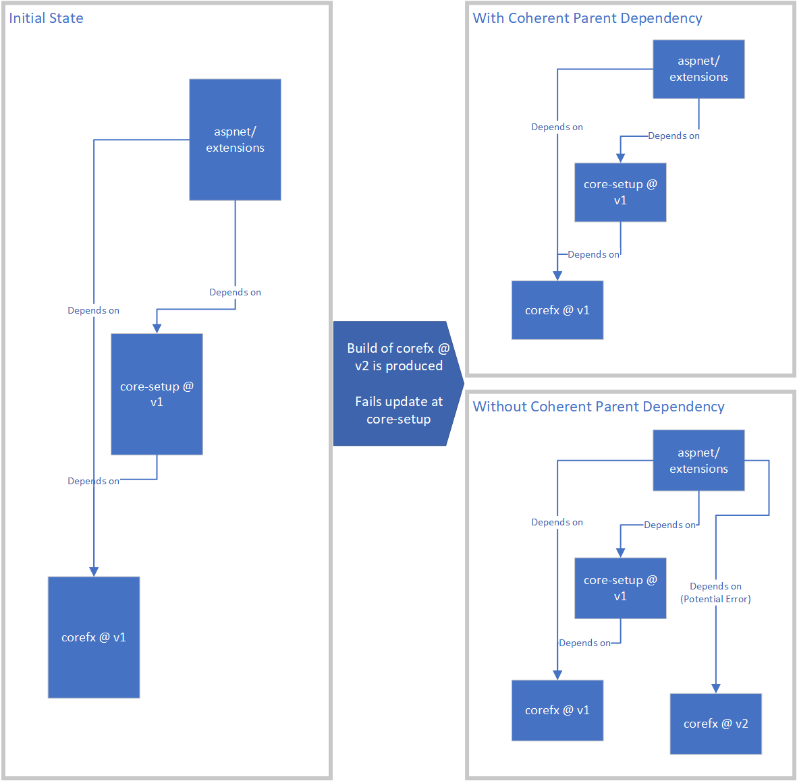

# Darc 

Darc is a tool for managing and querying the relationships between repositories
in the .NET Core ecosystem. This document describes various scenarios and how to
use darc to achieve them, as well as a general reference guide to darc commands.

## Index
- [Scenarios](#scenarios)
  - [Setting up your darc client](#setting-up-your-darc-client)
  - [Adding dependencies to a repository](#adding-dependencies-to-a-repository)
  - [Updating dependencies in your local repository](#updating-dependencies-in-your-local-repository)
  - [Removing dependencies from a repository](#removing-dependencies-from-a-repository)
  - [Changing a dependency's type](#changing-a-dependencys-type)
  - ['Pinning' dependencies so they do not
    update](#pinning-dependencies-so-they-do-not-update)
  - [Coherent parent dependencies](#coherent-parent-dependencies)
  - [Adding dependency flow](#adding-dependency-flow)
  - [Halting and restarting dependency flow](#halting-and-restarting-dependency-flow)
  - [Viewing the dependency graph](#viewing-the-dependency-graph)
  - [Gathering a build drop](#gathering-a-build-drop)
  
- [Command Reference](#command-reference)
  - [Common Parameters](#common-parameters)
  - [add-channel](#add-channel) - Creates a new channel.
  - [add-dependency](#add-dependency) - Add a new dependency to Version.Details.xml.
  - [add-default-channel](#add-default-channel) - Add a channel that a build of a branch+repository is automatically applied to.
  - [add-subscription](#add-subscription) - Add a new subscription.
  - [add-build-to-channel](#add-build-to-channel) - Adds an existing build to a channel
  - [authenticate](#authenticate) - Stores the Azure DevOps and GitHub tokens
    required for remote operations.
  - [clone](#clone) - Clone a remote repo and all of its dependency repos.
  - [default-channel-status](#default-channel-status) - Enables or disables a default channel association.
  - [delete-channel](#delete-channel) - Deletes an existing channel.
  - [delete-default-channel](#delete-default-channel) - Remove a default channel association.
  - [delete-subscription](#delete-subscription) - Remove a subscription.
  - [gather-drop](#gather-drop) - Gather a drop of the outputs for a build.
  - [get-asset](#get-asset) - Get information about an asset.
  - [get-build](#get-build) - Retrieves a specific build of a repository,
  - [get-channels](#get-channels) - Get a list of channels.
  - [get-default-channels](#get-default-channels) - Gets a list of repo+branch combinations and their associated default channels for builds.
  - [get-dependencies](#get-dependencies) - Get local dependencies.
  - [get-dependency-graph](#get-dependency-graph) - Build repository dependency
    graph.
  - [get-flow-graph](#get-flow-graph) - Get dependency flow graph.
  - [get-health](#get-health) - Evaluate health.
  - [get-latest-build](#get-latest-build) - Retrieves the latest builds matching
    the specified criteria. If more than one build matches then multiple builds
    are returned.
  - [get-repository-policies](#get-repository-policies) - Retrieves information about repository merge policies.
  - [get-subscriptions](#get-subscriptions) - Get information about
    subscriptions.
  - [set-repository-policies](#set-repository-policies) - Set merge policies for
    the specific repository and branch.
  - [subscription-status](#subscription-status) - Enables or disables a subscription matching the id.
  - [trigger-subscriptions](#trigger-subscriptions) - Trigger a subscription or set of subscriptions matching criteria.
  - [update-dependencies](#update-dependencies) - Update local dependencies from
    a channel.
  - [update-subscription](#update-subscription) - Update an existing subscription.
  - [verify](#verify) - Verify that the dependency information in the repository is correct.


## Scenarios

### Setting up your darc client

The darc client is a .NET Core global tool.  It requires that a .NET Core SDK be
installed globally on the machine. The client can be installed using the
eng\common\darc-init.ps1 script located under any arcade enabled repository.
The version number is currently baked into the install script, so ensuring you
have the latest arcade is a good idea.

#### Start by making sure you're part of the **arcade-contrib** team:
- If not you'll get 'Forbidden' errors when trying to use darc
- Go to https://github.com/orgs/dotnet/teams/arcade-contrib/members
- Click on "Request to join"

#### Install the darc client:
```
PS C:\enlistments\arcade> .\eng\common\darc-init.ps1

Tool 'microsoft.dotnet.darc' (version '1.1.0-beta.19057.9') was successfully uninstalled.
Installing Darc CLI version 1.1.0-beta.19081.1...
You may need to restart your command window if this is the first dotnet tool you have installed.
  Restoring packages for C:\Users\mmitche\AppData\Local\Temp\jlbo0wgo.ki2\restore.csproj...
  Installing Microsoft.DotNet.Darc 1.1.0-beta.19081.1.
  Restore completed in 13.12 sec for C:\Users\mmitche\AppData\Local\Temp\jlbo0wgo.ki2\restore.csproj.
You can invoke the tool using the following command: darc
Tool 'microsoft.dotnet.darc' (version '1.1.0-beta.19081.1') was successfully installed.
```

After your client is installed, you should be able to launch it by typing 'darc'
on the command line.  If this is the first global tool you've installed, you may
need to first restart your command window.

```
PS C:\enlistments\arcade> darc
Microsoft.DotNet 1.1.0-beta.19081.1+270fa76db13d4c103a6dec2b03f1fd79730ff429
c Microsoft Corporation. All rights reserved.
ERROR(S):
No verb selected.

  add-channel                  Creates a new channel.

  add-dependency               Add a new dependency to Version.Details.xml.

  add-default-channel          Add a channel that a build of a branch+repository is automatically applied to.

  add-subscription             Add a new subscription.

  authenticate                 Stores the VSTS and GitHub tokens required for remote operations.

  delete-channel               Deletes an existing channel.

  delete-default-channel       Remove a default channel association.

...
```

#### Additional PATs for Azure DevOps and GitHub operations

When executing most operations, the client needs to make some remote queries.
These remote queries require authentication in most circumstances. There are 3
PATs that may be used:
- A GitHub PAT for downloading files from GitHub (e.g. eng/Version.Details.xml or
  arcade script files.  Required scopes: None
- An Azure DevOps PAT for downloading files from Azure DevOps. (e.g.
  eng/Version.Details.xml)  Required scopes: Code-Read
- A Build Asset Registry (BAR) password for interacting with Maestro++/BAR (e.g.
  obtaining build information needed for a drop).

These tokens can either be passed on the command line using parameters (see [Common parameters](#common-parameters)), or
cached locally on the machine using the [`darc authenticate`](#authenticate) command.

After supplying your secrets, a simple `darc get-channels` operations should succeed.

```
PS C:\enlistments\arcade> darc get-channels
.NET Tools - Latest
.NET Core 3 Dev
.NET Engineering Services - Int
.NET Engineering Services - Prod
.NET Tools - Validation
```

### Adding dependencies to a repository

Adding a new dependency to a repository means adding a dependency that is
tracked by the Maestro++/darc system. This dependency's version can then be automatically updated,
along with its sha and repository uri. It can contribute to the repository
dependency graph, and the build producing it will be included in a drop.

Dependencies are tracked in eng/Version.Details.xml, along with the following
information about each one:
- Name
- Source sha
- Source repository
- Is the dependency version pinned (can be it automatically updated?)
- Dependency type (toolset or product)

The [`darc add-dependency`](#add-dependency) command adds a new dependency.  It takes a number of
parameters, though only `--name` and `--type` are initially required.  It is
highly recommended at least the `--repo` parameter be provided so that the
sha/version data can be filled in using [`darc update-dependencies`](#update-dependencies). See [Toolset
vs. Product Dependencies](#toolset-vs-product-dependencies) below for
information on type. For example:

```
darc add-dependency --name 'Microsoft.NETCore.App' --type 'product' --repo https://github.com/dotnet/core-setup
```

This will add a new dependency called 'Microsoft.NETCore.App' to eng/Version.Details.xml under the
product section. The version, repo, and sha information will be left blank.  A
corresponding PropertyGroup entry in eng/Versions.props will be added, with the same
version number. The property name is derived off of the dependency name, with
the .'s and -'s removed and "PackageVersion" added onto the end. *Note: If
eng/Versions.props's existing version property names end with the suffix
'Version', darc will append that instead.*

eng/Versions.props after add command.
```
<MicrosoftNETCoreAppPackageVersion></MicrosoftNETCoreAppPackageVersion>
```

After doing this, you can use the generated `MicrosoftNETCoreAppPackageVersion`
property as inputs to a PackageReference element or wherever else may need a
version number.

After adding, it is recommended that you use darc to fill out the missing
dependency information.  The information can also be filled in after committing by Maestro++
using dependency flow, but passing your CI without a filled-in version number
may be difficult. See [Updating dependencies in your local repository](#updating-dependencies-in-your-local-repository)

#### Toolset vs. Product Dependencies

There are two types of dependencies: 'Product' and 'Toolset'. Choosing between
them involves answering the question:

"Does my repository repackage the input dependency's binaries, or information
about those binaries in the outputs it creates for the product?" If so, that
dependency is 'Product', otherwise, it's 'Toolset'.

Some examples:

##### Toolset
- **Arcade SDK or other arcade packages** - These packages are not customer
  facing and do not ship as part of the product.
- **dotnet/corefx's dependency on Microsoft.NETCore.App** - This is a circular
  dependency for testing purposes.

##### Product
- **dotnet/core-setup's dependency on dotnet/coreclr's runtime packages** - Even though
  these packages are not 'shipped' to nuget.org, they are repackaged by dotnet/core-setup.
- **dotnet/core-sdk's dependency on dotnet/core-setup** - The SDK repackages
  information about Microsoft.NETCore.App.
- **dotnet/winforms's dependency on dotnet/corefx's outputs** - Winforms repackages
  information about the dotnet/corefx api surface area, and thus those dotnet/corefx binaries
  should be 'shipped'.  While we wouldn't necessarily want to ship multiple
  versions of the same binary in a release, we would ensure that the same dotnet/corefx
  version is coherent across the stack.

### Updating dependencies in your local repository

Sometimes it may be useful to update the dependency state of your local
repository against the latest builds. This might be useful when:
- Manually updating to create a new PR.
- Filling out missing information (e.g. version and sha) in Version.Details.xml
  prior to committing a new dependency.
- Updating to the latest binaries on a different channel for testing.

darc reads the Version.Details.xml file and notes the dependency name and
repository uri of each dependency.  Then, given an input channel, it looks up
the latest build of each dependency's repository that has been applied to the
channel. It then updates the Version.Details.xml and other version files (e.g.
Versions.props) based on the newest information.

Continuing with the example from [Adding dependencies to a
repository](#Adding-dependencies-to-a-repository), let's say I just added a
dependency on Microsoft.NETCore.App out of core-setup. I want to fill in the
missing information prior to check-in.  I know that the channel that .NET Core 3
day to day development for core-setup targeting is '.NET Core 3 Dev', so by
doing:

```
PS C:\enlistments\arcade> darc update-dependencies --channel ".NET Core 3 Dev" --name "Microsoft.Netcore.app"

Updating 'Microsoft.NETCore.App': '' => '3.0.0-preview-27401-3' (from build '20190201.3' of 'https://github.com/dotnet/core-setup')
  Dependency name normalized to 'Microsoft.NETCore.App'
Local dependencies updated from channel '.NET Core 3 Dev'.

PS C:\enlistments\arcade> git diff
diff --git a/eng/Version.Details.xml b/eng/Version.Details.xml
index edadff27..516e8e6e 100644
--- a/eng/Version.Details.xml
+++ b/eng/Version.Details.xml
@@ -1,6 +1,11 @@
 <?xml version="1.0" encoding="utf-8"?>
 <Dependencies>
-  <ProductDependencies></ProductDependencies>
+  <ProductDependencies>
+    <Dependency Name="Microsoft.NETCore.App" Version="3.0.0-preview-27401-3">
+      <Uri>https://github.com/dotnet/core-setup</Uri>
+      <Sha>b50554ac9a96fedc8580fa6090b6e9e75a23193b</Sha>
+    </Dependency>
+  </ProductDependencies>
   <ToolsetDependencies>
     <Dependency Name="Microsoft.DotNet.Arcade.Sdk" Version="1.0.0-beta.19080.6">
       <Uri>https://github.com/dotnet/arcade</Uri>
diff --git a/eng/Versions.props b/eng/Versions.props
index a1d683c1..dbf3fe0e 100644
--- a/eng/Versions.props
+++ b/eng/Versions.props
@@ -60,6 +60,7 @@
     <MicrosoftVisualStudioWebCodeGenerationDesignVersion>2.0.4</MicrosoftVisualStudioWebCodeGenerationDesignVersion>
     <MicrosoftDiaSymReaderConverterVersion>1.1.0-beta1-62810-01</MicrosoftDiaSymReaderConverterVersion>
     <MicrosoftDiaSymReaderNativeVersion>1.7.0</MicrosoftDiaSymReaderNativeVersion>
+    <MicrosoftNETCoreAppVersion>3.0.0-preview-27401-3</MicrosoftNETCoreAppVersion>
   </PropertyGroup>
   <PropertyGroup>
     <RestoreSources>
@@ -69,4 +70,8 @@
       https://dotnet.myget.org/F/symreader/api/v3/index.json
     </RestoreSources>
   </PropertyGroup>
+  <!--Package names-->
+  <PropertyGroup>
+    <MicrosoftNETCoreAppPackage>Microsoft.NETCore.App</MicrosoftNETCoreAppPackage>
+  </PropertyGroup>
 </Project>

```

Alternately, let's say I'm working on updating to the latest arcade, which has a
change I need to react to.  I check out a branch locally off of master, then run
update-dependencies against the tools channel ('.NET Tools - Latest') to pull in the latest script files:

```
PS C:\enlistments\core-setup> darc update-dependencies --channel ".NET Tools - Latest"
Updating 'Microsoft.DotNet.Arcade.Sdk': '1.0.0-beta.19080.6' => '1.0.0-beta.19081.3' (from build '20190131.3' of 'https://github.com/dotnet/arcade')
Local dependencies updated from channel '.NET Tools - Latest'.

PS C:\enlistments\core-setup> git diff
diff --git a/eng/Version.Details.xml b/eng/Version.Details.xml
index 2b845202..1fb125a0 100644
--- a/eng/Version.Details.xml
+++ b/eng/Version.Details.xml
@@ -21,9 +21,9 @@
     </Dependency>
   </ProductDependencies>
   <ToolsetDependencies>
-    <Dependency Name="Microsoft.DotNet.Arcade.Sdk" Version="1.0.0-beta.19080.6">
+    <Dependency Name="Microsoft.DotNet.Arcade.Sdk" Version="1.0.0-beta.19081.3">
       <Uri>https://github.com/dotnet/arcade</Uri>
-      <Sha>14d1133b6074b463784a7adbbf385df0462f4010</Sha>
+      <Sha>1e859f1c17fffbe9c4fb6bbfc0fc71cd0c56563b</Sha>
     </Dependency>
   </ToolsetDependencies>
 </Dependencies>
diff --git a/eng/common/darc-init.ps1 b/eng/common/darc-init.ps1
index 96cad844..57db185d 100644
--- a/eng/common/darc-init.ps1
+++ b/eng/common/darc-init.ps1
@@ -19,7 +19,7 @@ function InstallDarcCli ($darcVersion) {
   # Until we can anonymously query the BAR API for the latest arcade-services
   # build applied to the PROD channel, this is hardcoded.
   if (-not $darcVersion) {
-    $darcVersion = '1.1.0-beta.19057.9'
+    $darcVersion = '1.1.0-beta.19081.1'
   }

   $arcadeServicesSource = 'https://dotnetfeed.blob.core.windows.net/dotnet-arcade/index.json'
diff --git a/global.json b/global.json
index 8e5dab10..ede83435 100644
--- a/global.json
+++ b/global.json
@@ -3,6 +3,6 @@
     "dotnet": "2.1.300"
   },
   "msbuild-sdks": {
-    "Microsoft.DotNet.Arcade.Sdk": "1.0.0-beta.19080.6"
+    "Microsoft.DotNet.Arcade.Sdk": "1.0.0-beta.19081.3"
   }
 }
```

### Removing dependencies from a repository

Removing a dependency from a repository involves simply removing the appropriate
`Dependency` block from eng/Version.Details.xml and committing. At that point, neither darc nor
Maestro++ will know anything about it any longer.

### Changing a dependency's type

To change a dependency's type, move the `Dependency` element from the
parent `ProductDependencies` element into `ToolsetDependencies` (or vice versa)
and commit.  See [Toolset
vs. Product Dependencies](#toolset-vs-product-dependencies)

### 'Pinning' dependencies so they do not update.

By default on each operation (e.g. subscription updates or `darc
update-dependencies`), darc and Maestro will update all applicable dependencies
in eng/Version.Details.xml and associated files.  For instance, if a
subscription from core-setup's '.NET Core 3 Dev' channel to core-sdk's master
branch produces 3 outputs, Maestro will attempt to update any matching inputs in
core-sdk's eng/Version.Details.xml file. In some cases, it may be necessary to
pin dependencies so they do not move (e.g. if a breaking change requires
extended work).

This is possible by adding a Pinned="true" attribute to the dependency
information.  If Pinned is not supplied, the default is "false".

```
PS C:\enlistments\arcade> cat .\eng\Version.Details.xml
<?xml version="1.0" encoding="utf-8"?>
<Dependencies>
  <ProductDependencies>
    <Dependency Name="Microsoft.NETCore.App" Version="3.0.0-preview-27401-3" Pinned="true">
      <Uri>https://github.com/dotnet/core-setup</Uri>
      <Sha>b50554ac9a96fedc8580fa6090b6e9e75a23193b</Sha>
    </Dependency>
  </ProductDependencies>
  <ToolsetDependencies>
    <Dependency Name="Microsoft.DotNet.Arcade.Sdk" Version="1.0.0-beta.19080.6">
      <Uri>https://github.com/dotnet/arcade</Uri>
      <Sha>14d1133b6074b463784a7adbbf385df0462f4010</Sha>
    </Dependency>
    <Dependency Name="Microsoft.DotNet.Build.Tasks.Feed" Version="2.2.0-beta.19080.6">
      <Uri>https://github.com/dotnet/arcade</Uri>
      <Sha>14d1133b6074b463784a7adbbf385df0462f4010</Sha>
    </Dependency>
    <Dependency Name="Microsoft.DotNet.Maestro.Tasks" Version="1.0.0-beta.19060.8"> 
      <Uri>https://github.com/dotnet/arcade</Uri>
      <Sha>67384d20d310611afc1c2b4dd3b953fda182def4</Sha>
    </Dependency>
    <Dependency Name="Microsoft.DotNet.SignTool" Version="1.0.0-beta.19080.6">
      <Uri>https://github.com/dotnet/arcade</Uri>
      <Sha>14d1133b6074b463784a7adbbf385df0462f4010</Sha>
    </Dependency>
    <Dependency Name="Microsoft.DotNet.Helix.Sdk" Version="2.0.0-beta.19080.6">
      <Uri>https://github.com/dotnet/arcade</Uri>
      <Sha>14d1133b6074b463784a7adbbf385df0462f4010</Sha>
    </Dependency>
  </ToolsetDependencies>
</Dependencies>
```

### Coherent parent dependencies

Coherent parent dependencies are a way to relate two dependencies within your
repository. A dependency with a coherent parent will update its version based on
the version of the dependency that appears within the subtree of the coherent
parent. This essentially keeps the dependency from moving 'ahead' of another
dependency in your repo.



This is most typically used when referencing corefx, coreclr, and core-setup
outputs. Microsoft.NETCore.App encodes information about the corefx and
coreclr runtime binaries that it has as dependencies itself.  Repositories
downstream may need to take dependencies on both Microsoft.NETCore.App as well
as specific corefx packages. If the corefx packages move ahead of what is
referenced in Microsoft.NETCore.App, issues may occur. Specifying a coherent
parent that ties the corefx dependencies to Microsoft.NETCore.App will avoid
this.

#### Specifying a coherent parent

To specify a coherent parent, add "CoherentParentDependency" attributes in your
Version.Details.xml file, as shown below:

```
PS D:\enlistments\extensions\eng> cat .\Version.Details.xml
<?xml version="1.0" encoding="utf-8"?>
<!--

  This file is used by automation to update Versions.props and may be used for other purposes, such as
  static analysis to determine the repo dependency graph.  It should only be modified manually when adding
  or removing dependencies. Updating versions should be done using the `darc` command line tool.

  See https://github.com/dotnet/arcade/blob/master/Documentation/Darc.md for instructions on using darc.

-->
<Dependencies>
  <ProductDependencies>
    <Dependency Name="Microsoft.Win32.Registry" Version="4.6.0-preview6.19279.8" CoherentParentDependency="Microsoft.NETCore.App">
      <Uri>https://github.com/dotnet/corefx</Uri>
      <Sha>e23119d577e644d2c2a25419c88c1181681358e0</Sha>
    </Dependency>
    <Dependency Name="System.ComponentModel.Annotations" Version="4.6.0-preview6.19279.8" CoherentParentDependency="Microsoft.NETCore.App">
      <Uri>https://github.com/dotnet/corefx</Uri>
      <Sha>e23119d577e644d2c2a25419c88c1181681358e0</Sha>
    </Dependency>
    <Dependency Name="System.Data.SqlClient" Version="4.7.0-preview6.19279.8" CoherentParentDependency="Microsoft.NETCore.App">
      <Uri>https://github.com/dotnet/corefx</Uri>
      <Sha>e23119d577e644d2c2a25419c88c1181681358e0</Sha>
    </Dependency>
    <Dependency Name="System.Diagnostics.DiagnosticSource" Version="4.6.0-preview6.19279.8" CoherentParentDependency="Microsoft.NETCore.App">
      <Uri>https://github.com/dotnet/corefx</Uri>
      <Sha>e23119d577e644d2c2a25419c88c1181681358e0</Sha>
    </Dependency>
    <Dependency Name="System.Diagnostics.EventLog" Version="4.6.0-preview6.19279.8" CoherentParentDependency="Microsoft.NETCore.App">
      <Uri>https://github.com/dotnet/corefx</Uri>
      <Sha>e23119d577e644d2c2a25419c88c1181681358e0</Sha>
    </Dependency>
    <Dependency Name="System.IO.Pipelines" Version="4.6.0-preview6.19279.8" CoherentParentDependency="Microsoft.NETCore.App">
      <Uri>https://github.com/dotnet/corefx</Uri>
      <Sha>e23119d577e644d2c2a25419c88c1181681358e0</Sha>
    </Dependency>
    <Dependency Name="System.Reflection.Metadata" Version="1.7.0-preview6.19279.8" CoherentParentDependency="Microsoft.NETCore.App">
      <Uri>https://github.com/dotnet/corefx</Uri>
      <Sha>e23119d577e644d2c2a25419c88c1181681358e0</Sha>
    </Dependency>
    <Dependency Name="System.Runtime.CompilerServices.Unsafe" Version="4.6.0-preview6.19279.8" CoherentParentDependency="Microsoft.NETCore.App">
      <Uri>https://github.com/dotnet/corefx</Uri>
      <Sha>e23119d577e644d2c2a25419c88c1181681358e0</Sha>
    </Dependency>
    <Dependency Name="System.Security.Cryptography.Cng" Version="4.6.0-preview6.19279.8" CoherentParentDependency="Microsoft.NETCore.App">
      <Uri>https://github.com/dotnet/corefx</Uri>
      <Sha>e23119d577e644d2c2a25419c88c1181681358e0</Sha>
    </Dependency>
    <Dependency Name="System.Security.Cryptography.Xml" Version="4.6.0-preview6.19279.8" CoherentParentDependency="Microsoft.NETCore.App">
      <Uri>https://github.com/dotnet/corefx</Uri>
      <Sha>e23119d577e644d2c2a25419c88c1181681358e0</Sha>
    </Dependency>
    <Dependency Name="System.ServiceProcess.ServiceController" Version="4.6.0-preview6.19279.8" CoherentParentDependency="Microsoft.NETCore.App">
      <Uri>https://github.com/dotnet/corefx</Uri>
      <Sha>e23119d577e644d2c2a25419c88c1181681358e0</Sha>
    </Dependency>
    <Dependency Name="System.Text.Encodings.Web" Version="4.6.0-preview6.19279.8" CoherentParentDependency="Microsoft.NETCore.App">
      <Uri>https://github.com/dotnet/corefx</Uri>
      <Sha>e23119d577e644d2c2a25419c88c1181681358e0</Sha>
    </Dependency>
    <Dependency Name="System.Text.Json" Version="4.6.0-preview6.19279.8" CoherentParentDependency="Microsoft.NETCore.App">
      <Uri>https://github.com/dotnet/corefx</Uri>
      <Sha>e23119d577e644d2c2a25419c88c1181681358e0</Sha>
    </Dependency>
    <Dependency Name="Microsoft.NETCore.App" Version="3.0.0-preview6-27730-01">
      <Uri>https://github.com/dotnet/core-setup</Uri>
      <Sha>63abc77da6d99470caa5bfa0465afe244105e595</Sha>
    </Dependency>
    <Dependency Name="NETStandard.Library.Ref" Version="2.1.0-preview6-27730-01">
      <Uri>https://github.com/dotnet/core-setup</Uri>
      <Sha>63abc77da6d99470caa5bfa0465afe244105e595</Sha>
    </Dependency>
  </ProductDependencies>
  <ToolsetDependencies>
    <Dependency Name="Microsoft.DotNet.Arcade.Sdk" Version="1.0.0-beta.19302.2">
      <Uri>https://github.com/dotnet/arcade</Uri>
      <Sha>e6a5d5f970bb872451c6310ae34eda31041fb552</Sha>
    </Dependency>
    <Dependency Name="Microsoft.DotNet.GenAPI" Version="1.0.0-beta.19302.2">
      <Uri>https://github.com/dotnet/arcade</Uri>
      <Sha>e6a5d5f970bb872451c6310ae34eda31041fb552</Sha>
    </Dependency>
    <Dependency Name="Microsoft.DotNet.Helix.Sdk" Version="2.0.0-beta.19302.2">
      <Uri>https://github.com/dotnet/arcade</Uri>
      <Sha>e6a5d5f970bb872451c6310ae34eda31041fb552</Sha>
    </Dependency>
    <Dependency Name="Microsoft.NETCore.Platforms" Version="3.0.0-preview6.19279.8" CoherentParentDependency="Microsoft.NETCore.App">
      <Uri>https://github.com/dotnet/corefx</Uri>
      <Sha>e23119d577e644d2c2a25419c88c1181681358e0</Sha>
    </Dependency>
  </ToolsetDependencies>
</Dependencies>
```

### Adding dependency flow

Dependency flow is the automatic movement of dependency information between
repositories. This is done by Maestro++ keeping track of new builds in each
repository and opening PRs in other repositories when those repositories' input
dependencies in eng/Version.Details.xml match the outputs of the new builds.

These updates are selective and based on 'subscriptions'. A subscription describes an update
operation for a specific repository+branch combination, mapping outputs of a
repository that have been applied to a channel (virtual branch) onto matching
inputs of the target repository+branch.

For example, a build of dotnet/corefx might be applied to the ".NET Core 3 Dev"
channel. dotnet/core-setup maps new outputs of dotnet/corefx on the ".NET Core 3 Dev"
channel onto its master branch.

A subscription has a few parts:
- Mapping of source repo + source channel => target repo + target branch
- An update rate (e.g. every day, every build, not at all)
- Whether a subscription is batchable or not. If batchable, all batchable
  subscriptions targeting the same repo+branch combination will share a PR.
  *Note: Batchable subscriptions is currently only supported by the REST API.
  Please contact @dnceng to set up batchable subscriptions.*
- A set of auto merge policies, if the subscription is not batchable.  If batchable,
  merge policies are set on a repository level rather than a per-subscription
  level, as they end up shared between several subscriptions. *Note: repository
  merge policies are currently unsupported in darc. Please contact @dnceng to
  set up repository merge policies.*

For additional information and samples, see [add-subscription](#add-subscription)

#### When should a subscription be used to update my repository's inputs?

Whenever you want regular dependency flow between two repositories. For example,
every day (when there is a new source build) or on every new build.

#### What input channel should be used?

There are generally two channels for day to day use:
- '.NET Core 3 Dev' - Day to day builds of .NET Core 3 repositories are placed on
  this channel.
- '.NET Tools - Latest' - Arcade releases are placed on this channel.

So, if you're not adding a dependency on the https://github.com/dotnet/arcade
repo, the source channel should be '.NET Core 3 Dev'. If you have other specific
needs, contact @dnceng.

### Halting and restarting dependency flow

Sometimes it's necessary to halt dependency flow into or out of a repository for
a period of time. While there are lots of cases where this might be done, here
are some typical examples:
- **Shutting down changes for a release** - The 'last' build of a repository
  like corefx has been produced, and now needs to propagate to the many places
  in the repository graph it is referenced.
- **A change in another repository has a breaking change** - Because Maestro++
  can auto-merge PRs, a breaking change that isn't caught by CI might be
  continually propagated as it is the 'latest' build.
- **A specific, isolated dependency of a specific repository needs to be kept at
  a specific version** - A few dependencies of a repository should be kept at a
  specific version, while the rest are allowed to update.

darc and Maestro++ have a few mechanisms to enable such scenarios:

- **Disabling or deleting a default channel association** - By disabling a
  default channel association for a repo, no new builds of that repo will be
  automatical assigned to the targeted channel.  This effectively halts
  dependency flow without altering all the subscriptions sourcing from that
  repository.  Furthermore, if a selective fix needs to be flowed, the build
  containing that fix can be selectively assigned to correct channel and the
  existing subscriptions will flow as normal.

  Today this can only be done by either deleting or disabling an existing
  default channel association. Examples:

  Pausing new flow from aspnet/Extensions:

  ```
  # Disable by repo+branch+channel
  
  darc default-channel-status --disable --repo https://github.com/aspnet/Extensions --branch refs/heads/master --channel ".NET Core 3 Dev"
  
  # Disable by id.
  # Use get-default-channels to get the ID of the default channel association,
  then use default-channel-status to disable.
  
  darc get-default-channels
  
  # Find id of association in list
  (63)   https://github.com/aspnet/Extensions @ refs/heads/master -> .NET Core 3 Dev

  darc default-channel-status --disable --id 63
  ```

  Resuming flow from aspnet/Extensions:

  ```
  ```
- **Disabling or deleting a subscription** - By disabling or deleting a
  subscription, flow between two specific points can be halted.  For instance,
  if arcade has a breaking change that passed core-setup's CI, then it may be
  necessary to remove flow temporarily while the issue is dealt with.  Today,
  this is only possible via the command line tool by deleting the subscription,
  then recreating it when normal flow should be resumed:

  Pausing new flow from arcade to core-setup

  ```
  PS C:\enlistments\arcade> darc get-subscriptions --source-repo arcade --target-repo core-setup 
  
  https://github.com/dotnet/arcade (.NET Tools - Latest) ==> 'https://github.com/dotnet/core-setup' ('master')
  - Id: 21e611eb-ab71-410e-ca98-08d61f236c94
  - Update Frequency: everyDay
  - Merge Policies:
    AllChecksSuccessful
      ignoreChecks =
                     [
                       "WIP",
                       "license/cla"
                     ]
  - Last Build: N/A

  PS C:\enlistments\arcade> darc delete-subscription --id 21e611eb-ab71-410e-ca98-08d61f236c94
  Successfully deleted subscription with id '21e611eb-ab71-410e-ca98-08d61f236c94'
  ```

  Resuming flow:

  ```
  PS C:\enlistments\arcade> darc add-subscription --channel '.NET Tools - Latest' --target-repo https://github.com/dotnet/core-setup
                            --target-branch master --update-frequency everyDay --all-checks-passed
                            --source-repo https://github.com/dotnet/arcade --ignore-checks 'WIP,license/cli'

  Successfully created new subscription with id '689a946e-2c12-4b0c-ccf6-08d688804ce4'.
  ```
- **Pinning specific dependencies** - Specific dependencies can be pinned when
  they should not move.  This keeps the dependency from moving without altering
  subscriptions or channels. This is useful when only a **subset** of a
  specific repos dependencies should not move.

  To do this, add a `Pinned="true"` attribute to the dependency that should not
  move.
  ```
  PS C:\enlistments\arcade> cat .\eng\Version.Details.xml
  <?xml version="1.0" encoding="utf-8"?>
  <Dependencies>
    <ProductDependencies>
      <Dependency Name="Microsoft.NETCore.App" Version="3.0.0-preview-27401-3" Pinned="true">
        <Uri>https://github.com/dotnet/core-setup</Uri>
        <Sha>b50554ac9a96fedc8580fa6090b6e9e75a23193b</Sha>
      </Dependency>
    </ProductDependencies>
  ```
  Resume flow by removing the attribute or setting its value to "false".
'
### Viewing the dependency graph

The dependency graph is the transitive set of dependencies defined by the data in Version.Details.xml.
Each dependency listed contains information on the source of the dependency,
specifically which repository and sha it was generated from. Visiting that repository
at the specified sha will yield another set of dependencies. Transitively
visiting these repository+sha combinations will build up a repository graph. The
graph may have cycles, and the transitive walk is stopped at those nodes.  It
may also be stopped at any toolset dependency unless those are specifically
included with `--include-toolset`.

For detailed information on generating the dependency graph, see
[`get-dependency-graph`](#get-dependency-graph).

#### How to interpret incoherencies

Incoherencies in the graph are places where the same repo appears twice with
different shas, or the same dependency appears twice at different versions (even
if it was sourced from the same sha).  Incoherencies are caused by multiple
paths to the root node that run through the same repository, combined with
different flow rates between repositories, varying graph depth, build breaks, etc.

Incoherencies aren't necessarily bad. During most of the development cycle, the
graph is highly incoherent.  What matters is whether those incoherencies will
produce semantic differences in behavior. This is something that can generally only be
interpreted by developers/product owners by looking at the substantive
differences.  The default position for day to day development is that
incoherencies are not a big deal, but the default position for a shipping
product is that non-toolset incoherencies should be removed.  This can be done
by halting dependency flow after "final" builds are done of incoherent repos.
See [Halting and restarting dependency
flow](#halting-and-restarting-dependency-flow) for some options here.

For a rough example, let's say that at the end of the shipping cycle core-setup
flows its 'last' build to core-sdk and other repos.  The graph stabilizes.
Then, at the last moment, they make a test only fix and check it in.  It flows
to core-sdk quickly, but gets held up in the other repos that pull
Microsoft.NETCore.App due to them not taking any new PRs.  This certainly counts
as an incoherency, but because there is no semantic product difference between
the two versions in the graph there may be no harm in shipping with that
incoherency.

### Gathering a build drop

Gathering a drop of the product or subpiece part of the product is a typical
activity done by developers, release automation, etc.  The darc tool can do this
using the Build Asset Registry information alongside the dependency graph
information.

A build drop is a gathering of all the outputs of a specific build that were
reported to the Build Asset Registry into a local location. Optionally, this
build drop may also include any builds that were inputs to this build, based on
the dependency information in Version.Details.xml. Builds produce various
outputs that go to various locations. For example, they may produce NuGet
packges, zips, MSIs, etc. These may be available in the build artifacts, or may
be located in various storage accounts.  Gather-drop mines the Build Asset
Registry for these locations and downloads them all to the local directory.

The drop is generally divided into two sections: shipping and non-shipping.
Shipping dependencies are those that must be visible to customers.  Non-shipping
dependencies are those that generally serve as inter-repo transport.  Some
examples:
- Packages shipping to nuget.org - Shipping
- Coreclr transport packages - Nonshipping, since they get repackaged by
  core-setup
- Symbols - Shipping, since they go to symbol servers

#### What can I gather a drop for?

You can gather either an isolated or full (includes dependencies) drop for any
build in the repository graph. Since the major components of the .NET Core stack
are rooted at 3 different repositories, gathering a drop of those repositories
will generate a drop for those 3 components and any of their inputs if `--full`
is supplied.
- https://github.com/dotnet/core-sdk - SDK
- https://github.com/aspnet/AspNetCore - ASP.NET Core
- https://github.com/dotnet/core-setup - Runtime.

#### How do I find the root build for a drop?

`gather-drop` must be able to find a root build. This root build today is
identified by either a repo+sha combo or a direct BAR build ID. For most
repositories that build on every commit, providing the repo uri and latest sha
will generate a drop:

```
PS C:\enlistments\core-sdk> git rev-parse HEAD
465a336c7a5ca3af2f6cf5172ddc0ebde620803b
PS C:\enlistments\core-sdk> darc gather-drop --repo https://github.com/dotnet/core-sdk
                            --commit 465a336c7a5ca3af2f6cf5172ddc0ebde620803b --output-dir C:\scratch\drop
...
```

If no build exists at that drop, darc will show an error. In this case, you
might try other recents shas, or use the BAR swagger API
(https://maestro-prod.westus2.cloudapp.azure.com/swagger) to look up a build
id. Remember to authenticate using a token from
https://maestro-prod.westus2.cloudapp.azure.com/.  Better methods of obtaining
the root build are coming soon.

The root build can then be provided using --id

```
PS C:\enlistments\core-sdk> darc gather-drop --id 1234 --output-dir C:\scratch\drop
```

## Command Reference

### **`Common parameters`**

There are a few common parameters available on every command:

- `-p, --password` - Build Asset Registry password.  You can obtain this
  password by going to https://maestro-prod.westus2.cloudapp.azure.com/, logging
  in using the link in the top right, then generating a token using the menu in
  the top right.  This setting overrides whatever BAR password was provided through `darc authenticate`.
- `--github-pat` - Personal access token used to authenticate GitHub. This is a GitHub PAT used
  to avoid rate limiting when accessing github to download arcade script files
  or version files. You only need a GitHub PAT with **no** authorization scopes
  checked. This setting overrides whatever GitHub PAT was provided through
  `darc authenticate`.
- `--azdev-pat` - Personal access token used to authenticate to Azure DevOps.
  This token should have Code Read permissions. This setting overrides whatever
  Azure DevOps PAT was provided through `darc authenticate`.
- `--bar-uri` - URI of the build asset registry service to use.  Typically left
  as its default (https://maestro-prod.westus2.cloudapp.azure.com) This setting
  overrides the Build Asset Registry URI provided through `darc authenticate`.
- `--verbose` - Turn on additional output.
- `--debug` - Turn on debug output
- `--help` - Display help
- `--version` - Display version of darc.

Individual darc commands are described below.

### **`add-channel`**

Add a new channel. This creates a new tag that builds can be applied to.

*This is not a typical operation and you should consult with the (`@dnceng`)
engineering team before doing so.*

**Sample**:
```
PS D:\enlistments\arcade> darc add-channel --name "Foo"

Successfully created new channel with name 'Foo'.
```

**Parameters**

- `-n, --name` -  **(Required)**. Name of channel to create.
- `-c, --classification` - Classification of channel. Defaults to 'dev'.  Today,
  this classification does not affect any functionality
- `-i, --internal` - Channel is internal only. This option is currently
  non-functional

**See also**:
- [delete-channel](#delete-channel)
- [get-channels](#get-channels)

### **`add-dependency`**

Add a new tracked dependency to the Version.Detail.xml file in your local repo.
This dependency is also added to eng/Versions.props as well as global.json (for certain
dependencies, such as the Arcade SDK). This new dependency can then be updated using
[update-dependencies](#update-dependencies). After merging the changes into
the remote github or AzDO repository, the dependency can be updated by Maestro++
if there is a corresponding subscription targeting that repo.

When adding a new dependency, only name and type are required.  For a detailed
discussion on adding new dependencies to a repository, see [Adding dependencies to a repository](#adding-dependencies-to-a-repository)

**Parameters**

- -n, --name - **(Required)** Name of dependency to add. This is the name of the
  package you wish to track.  For example, this might be "Microsoft.NETCore.App"
  or 'System.Security.Cryptography.Cng'
- -t, --type - **(Required)** 'toolset' or 'product'. See [Adding dependencies
  to a repository](#adding-dependencies-to-a-repository) for a discussion on
  dependency types.
- -v, --version - Dependency version.
- -r, --repo - Repository where the dependency was built.
- -c, --commit - SHA at which the dependency was produced.

**Sample**

*eng\Version.Details.xml* before running add:

```
PS D:\enlistments\arcade> cat .\eng\Version.Details.xml
<?xml version="1.0" encoding="utf-8"?>
<Dependencies>
  <ProductDependencies></ProductDependencies>
  <ToolsetDependencies>
    <Dependency Name="Microsoft.DotNet.Arcade.Sdk" Version="1.0.0-beta.19080.6">
      <Uri>https://github.com/dotnet/arcade</Uri>
      <Sha>14d1133b6074b463784a7adbbf385df0462f4010</Sha>
    </Dependency>
    <Dependency Name="Microsoft.DotNet.Build.Tasks.Feed" Version="2.2.0-beta.19080.6">
      <Uri>https://github.com/dotnet/arcade</Uri>
      <Sha>14d1133b6074b463784a7adbbf385df0462f4010</Sha>
    </Dependency>
    <Dependency Name="Microsoft.DotNet.Maestro.Tasks" Version="1.0.0-beta.19060.8">
      <Uri>https://github.com/dotnet/arcade</Uri>
      <Sha>67384d20d310611afc1c2b4dd3b953fda182def4</Sha>
    </Dependency>
    <Dependency Name="Microsoft.DotNet.SignTool" Version="1.0.0-beta.19080.6">
      <Uri>https://github.com/dotnet/arcade</Uri>
      <Sha>14d1133b6074b463784a7adbbf385df0462f4010</Sha>
    </Dependency>
    <Dependency Name="Microsoft.DotNet.Helix.Sdk" Version="2.0.0-beta.19080.6">
      <Uri>https://github.com/dotnet/arcade</Uri>
      <Sha>14d1133b6074b463784a7adbbf385df0462f4010</Sha>
    </Dependency>
  </ToolsetDependencies>
</Dependencies>
```

Running add-dependency

```
PS D:\enlistments\arcade> darc add-dependency --name "Microsoft.NETCore.App" --type "product" --version 1
                          --commit 2 --repo https://github.com/dotnet/core-setup
```

*eng\Version.Details.xml* after add-dependency:

```
PS D:\enlistments\arcade> cat .\eng\Version.Details.xml
<?xml version="1.0" encoding="utf-8"?>
<Dependencies>
  <ProductDependencies>
    <Dependency Name="Microsoft.NETCore.App" Version="1">
      <Uri>https://github.com/dotnet/core-setup</Uri>
      <Sha>2</Sha>
    </Dependency>
  </ProductDependencies>
  <ToolsetDependencies>
    <Dependency Name="Microsoft.DotNet.Arcade.Sdk" Version="1.0.0-beta.19080.6">
      <Uri>https://github.com/dotnet/arcade</Uri>
      <Sha>14d1133b6074b463784a7adbbf385df0462f4010</Sha>
    </Dependency>
    <Dependency Name="Microsoft.DotNet.Build.Tasks.Feed" Version="2.2.0-beta.19080.6">
      <Uri>https://github.com/dotnet/arcade</Uri>
      <Sha>14d1133b6074b463784a7adbbf385df0462f4010</Sha>
    </Dependency>
    <Dependency Name="Microsoft.DotNet.Maestro.Tasks" Version="1.0.0-beta.19060.8">
      <Uri>https://github.com/dotnet/arcade</Uri>
      <Sha>67384d20d310611afc1c2b4dd3b953fda182def4</Sha>
    </Dependency>
    <Dependency Name="Microsoft.DotNet.SignTool" Version="1.0.0-beta.19080.6">
      <Uri>https://github.com/dotnet/arcade</Uri>
      <Sha>14d1133b6074b463784a7adbbf385df0462f4010</Sha>
    </Dependency>
    <Dependency Name="Microsoft.DotNet.Helix.Sdk" Version="2.0.0-beta.19080.6">
      <Uri>https://github.com/dotnet/arcade</Uri>
      <Sha>14d1133b6074b463784a7adbbf385df0462f4010</Sha>
    </Dependency>
  </ToolsetDependencies>
</Dependencies>
```

**See also**:
- [update-dependencies](#update-dependencies)
- [Adding dependencies to a repository](#adding-dependencies-to-a-repository)

### **`add-default-channel`**

Adds a new default channel mapping.  A default channel maps each new build of a specific
branch of a repository onto a specific channel. While builds can be selectively
and manually applied to channels, this is generally inconvenient for day to day development
in most cases.  In general, until release shutdown, each build of a branch
should always be applied to its "normal" channel.

***Note that the branch specified should almost always be
"refs/heads/{branchName}", unless you explicitly know otherwise***.

This is because the BAR reporting functionality pulls the branch name from the
Azure Devops built in pipeline variables, which specify refs/heads/foo vs. foo.
If your repository is manually reporting to BAR without using the Arcade
templates, then this name may be different.

Default channel mappings can be deleted with [delete-default-channel](#delete-default-channel).

**Parameters**
- `--channel` - **(Required)** Name of channel that a build of 'branch' and 'repo' should be applied to.
- `--branch` - **(Required)** Build of 'repo' on this branch will be
  automatically applied to 'channel'.  Should generally be "refs/heads/branchName"
- `--repo` - **(Required)** Build of this repo on 'branch' will be automatically applied to 'channel'

**Sample**
```
PS D:\enlistments\arcade> darc add-default-channel --channel ".Net Core 3 Dev" --branch refs/heads/master --repo https://github.com/dotnet/arcade
```

**See also**:
- [get-channels](#get-channels)
- [get-default-channels](#get-default-channels)
- [delete-default-channel](#delete-default-channel)

### **`add-subscription`**

Adds a new subscription to Maestro++.

A subscription describes an update
operation for a specific repository+branch combination, mapping outputs of a
repository that have been applied to a channel (virtual branch) onto matching
inputs of the target repository+branch.

For example, a build of dotnet/corefx might be applied to the ".NET Core 3 Dev"
channel. dotnet/core-setup maps new outputs of corefx on the ".NET Core 3 Dev"
channel onto its master branch.

A subscription has a few parts:
- Mapping of source repo + source channel => target repo + target branch
- An update rate (e.g. every day, every build, not at all)
- Whether a subscription is batchable or not. If batchable, all batchable
  subscriptions targeting the same repo+branch combination will share a PR.
  *Note: Batchable subscriptions are currently unsupported in darc*
- A set of auto merge policies, if the subscription is not batchable.  If batchable,
  merge policies are set on a repository level rather than a per-subscription
  level, as they end up shared between several subscriptions. *Note: repository
  merge policies are currently unsupported in darc*
  
`add-subscription` has two modes of operation:
- Interactive mode (default) - Interactive mode will take whatever input parameters were
  provided on the command line (if any) and pop an editor where the user can
  provide the subscription input prameters.
- Command-line only mode (`-q`) - In this mode, the full set of input options must be
 supplied.

Upon saving and closing the editor, or running the darc command if in command
line mode (`-q`), the darc tool submits the new subscription to Maestro++. If
successful, the id of the new subscription is returned.

**Parameters**

- `-channel` - **(Required if -q is passed)** Name of channel that is the source of the subscription. For a
  list of channels, see [get-channels](#get-channels)
- `--source-repo` - **(Required if -q is passed)** Source repository for the subscription.  Builds of this
  repository that appear on the specified `--channel` will have matching outputs
  applied to the inputs (specified in eng/Version.Details.xml) of `--target-repo` and `--target-branch`.
- `--target-repo` - **(Required if -q is passed)** Target repository for the subscription.  Builds of
  `--source-repo` that appear on the specified `--channel` will have matching
  outputs applied to the inputs (specified in eng/Version.Details.xml) of this
  repo's `--target-branch`
- `--target-branch` - **(Required if -q is passed)** Target branch for the subscription. Builds of
  `--source-repo` that appear on the specified `--channel` will have matching
  outputs applied to the inputs (specified in eng/Version.Details.xml) on this
  branch of `--target-repo`.
- `--update-frequency` - **(Required if -q is passed)** Frequency of updates. Valid values are: 'none',
  'everyDay', or 'everyBuild'.  everyDay is applied at 5am.  Subscriptions with
  'none' frequency can still be triggered using [trigger-subscriptions](#trigger-subscriptions)
- `--all-checks-passed` - Merge policy. A PR is automatically merged by Maestro++ if there is at least one
  check and all are passed. Optionally provide a comma separated list of
  ignored check with --ignore-checks.
- `--ignore-checks` - Merge policy. For use with --all-checks-passed. A set of checks that are
  ignored. Typically, in github repos the "WIP" and "license/cla" checks are ignored.
- `--no-extra-commits` - Merge policy. A PR is automatically merged if no non-bot
  commits exist in the PR.
- `--no-requested-changes` - Merge policy.  A PR is automatically merged as long
  as no changes are requested on the PR.
- `--standard-automerge` - Merge policy. A PR is automatically merged if all
  checks are passed and no changes are requested.
- `-q, --quiet` - Non-interactive mode (requires all elements to be passed on the command line).

**Sample**:
```
PS D:\enlistments\arcade-services> darc add-subscription --channel ".NET Tools - Latest" 
                                   --source-repo https://github.com/dotnet/arcade
                                   --target-repo https://dev.azure.com/dnceng/internal/_git/dotnet-optimization
                                   --target-branch master --update-frequency everyDay --all-checks-passed -q

Successfully created new subscription with id '4f300f68-8800-4b14-328e-08d68308fe30'.
```

**Available merge policies**

- Standard - This is the recommended merge policy. It encompasses two existing
  merge policies:
  - All PR checks must be successful, ignoring typical checks in GitHub in AzDO
    that do not indicate the quality of the PR (e.g. the WIP check) as well as a
    check that no changes have been requested on the PR.
  
  YAML format for interactive mode:
  ```
   - Name: Standard
  ```

- AllChecksSuccessful - All PR checks must be successful, potentially ignoring a
  specified set of checks. Checks might be ignored if they are unrelated to PR
  validation. The check name corresponds to the string that shows up in GitHub/Azure DevOps.
  
  YAML format for interactive mode:
  ```
   - Name: AllChecksSuccessful
     Properties:
       ignoreChecks:
       - WIP
       - license/cla
       - <other check names>
  ```
   
- RequireChecks - Require that a specific set of checks pass. The check name
  corresponds to the string that shows up in GitHub/Azure DevOps.
  
  YAML format for interactive mode:
  ```
   - Name: RequireChecks
     Properties:
       checks:
       - MyCIValidation
       - CI
       - <other check names>
  ```
   
- NoExtraCommits - If additional non-bot commits appear in the PR, the PR should not be merged.

  YAML format for interactive mode:
  ```
   - Name: NoExtraCommits
  ```

**See also**:
- [delete-subscription](#delete-subscription)
- [get-subscriptions](#get-subscriptions)
- [trigger-subscriptions](#trigger-subscriptions)
- [get-channels](#get-channels)

### **`add-build-to-channel`**

Adds an existing build to a channel.

Much of the time, builds are automatically added to channels with default
channel associations (See [add-default-channel](#add-default-channel)).
Occasionally, automatic assignment is turned off for various reasons but we may
still need to assign a specific build to a channel.

This can be done with the `add-build-to-channel` command.  It takes two
parameters:
- Name of the channel you want to assign a build to
- BAR build id of the build to assign to the specified channel. This can be
  found by looking at the "Publish to Build Asset Registry" leg of an official build.

**Parameters**

- `--id` - **(Required)**. BAR id of build to assign to channel.
- `--channel` - **(Required)**. Channel to assign build to.

**Sample**
```
PS D:\enlistments\arcade> darc add-build-to-channel --id 13078 --channel ".NET Core 3 Release"
Assigning the following build to channel '.NET Core 3 Release':

Repository:    https://github.com/dotnet/core-setup
Branch:        refs/heads/release/3.0
Commit:        e4e28a834dcbf63b8ef098b32996a35bbb9f3699
Build Number:  20190603.02
Date Produced: 6/3/2019 10:09 AM
Build Link:    https://dev.azure.com/dnceng/internal/_build/results?buildId=209556
BAR Build Id:  13078
Channels:
The following repos/branches will apply this build immediately:
  https://github.com/dotnet/core-sdk @ release/3.0.1xx
  https://github.com/aspnet/Extensions @ release/3.0-preview6
  https://github.com/dotnet/toolset @ release/3.0.1xx
  https://github.com/dotnet/winforms-datavisualization @ release/3.0
The following repos/branches will apply this change at a later time, or not by default.
To flow immediately, run the specified command
  https://github.com/dotnet/corefx @ release/3.0 (update freq: None)
    darc trigger-subscriptions --id 79f1e123-800e-410f-94d7-08d690bc143a
  https://github.com/dotnet/wpf @ release/3.0 (update freq: None)
    darc trigger-subscriptions --id acbc5f33-ff41-488a-1647-08d6c4e9a7a0
  https://github.com/dotnet/coreclr @ release/3.0 (update freq: None)
    darc trigger-subscriptions --id 9a4bff4b-85c2-4174-9247-08d6c732a216
  https://dev.azure.com/dnceng/internal/_git/dotnet-wpf-int @ release/3.0 (update freq: None)
    darc trigger-subscriptions --id 15a2995c-1b8e-41af-54c5-08d6c734018a
  https://github.com/dotnet/winforms @ release/3.0 (update freq: None)
    darc trigger-subscriptions --id 22859ac6-b4a6-4fce-54c7-08d6c734018a
```

### **`authenticate`**

Set up your darc client so that the PAT or password inputs do not need to be
passed on each command invocation.  This command opens up an editor form with
various password settings. These values are overridden by the `--password`,
`--bar-uri`, `--azdev-pat` and `--github-pat` settings common to all commands.

See [Setting up Your Darc Client](#setting-up-your-darc-client) for more
information.

**Parameters**

None.

**Sample**
```
PS D:\enlistments\arcade> darc authenticate

(opens in editor)

# Create new BAR tokens at https://maestro-prod.westus2.cloudapp.azure.com/Account/Tokens
bar_password=***
# Create new GitHub personal access tokens at https://github.com/settings/tokens (no auth scopes needed)
github_token=***
# Create new Azure Dev Ops tokens at https://dev.azure.com/dnceng/_details/security/tokens (code read scope needed)
azure_devops_token=***
build_asset_registry_base_uri=https://maestro-prod.westus2.cloudapp.azure.com/

# Storing the required settings...
# Set elements above depending on what you need

```

### **`clone`**

Clone a remote repo and all of its dependency repos. This is typically used for source build purposes.

**Parameters**

- `--repo` - Remote repository to start the clone operation at.  If none specified, clone all that the current repo depends on.
- `-v, --version` - Branch, commit or tag to start at in the remote repository.  Required if repo is specified.
- `--repos-folder` - Full path to folder where all the repos will be cloned to, e.g. C:\repos.  Default: current directory.
- `--git-dir-folder` - Advanced: Full path to folder where .git folders will be stored, e.g. C:\myrepos\.git\modules.  Default: each repo's folder.
- `--include-toolset` - Include toolset dependencies.
- `--ignore-repos` - Semicolon-separated list of repo URIs to ignore.  e.g. 'https://dev.azure.com/devdiv/DevDiv/_git/DotNet-Trusted;https://github.com/dotnet/arcade-services'
- `-d, --depth` - (Default: 4294967295) Depth to clone the repos to.  Defaults to infinite.

### **`default-channel-status`**

Enables or disables a default channel association. Default channels associations
that are disabled will not apply to new builds. This effectively turns off flow
out of the repository. Builds may still be applied manually to any channel.
using [add-build-to-channel](#add-build-to-channel).

**Parameters**

- `-e, --enable` - Enable default channel.
- '-d, --disable` - Disable default channel.
- '--id` - (Default: -1) Existing default channel id
- '--channel` - Existing default channel association target channel name.
- '--branch` - Existing default channel association source branch name.
- '--repo` - Existing default channel association source repository name.

**Sample**:
```
PS D:\enlistments\websdk> darc get-default-channels --source-repo core-setup --branch release/3.0
(192)  https://github.com/dotnet/core-setup @ refs/heads/release/3.0 -> .NET Core 3 Release

PS D:\enlistments\websdk> darc default-channel-status --disable --id 192
Default channel association has been disabled.

PS D:\enlistments\websdk> darc default-channel-status --enable --id 192
Default channel association has been enabled.
```

**See also**:
- [add-build-to-channel](#add-build-to-channel)
- [add-default-channel](#add-default-channel)
- [delete-default-channel](#delete-default-channel)
- [get-default-channels](#get-default-channels)

### **`delete-channel`**

Delete a channel. This channel must not be in use by any subscriptions.

*This is not a typical operation and you should consult with the (`@dnceng`)
engineering team before doing so.*

**Parameters**

- `-n, --name` - **(Required)** Name of channel to delete.

**Sample**:
```
PS D:\enlistments\arcade> darc delete-channel --name "Foo"

Successfully deleted channel 'Foo'.
```

**See also**:
- [add-channel](#add-channel)
- [get-channels](#get-channels)

### **`delete-default-channel`**

Deletes a default channel mapping. Deleting will not affect any existing builds,
but new builds of the specified repos will not be applied to the target
channel.

You can obtain a list of current default channel mappings with
[get-default-channels](#get-default-channels)

- `--channel` - **(Required)** Name of channel that builds of 'repository' and 'branch' should not apply to.
- `--branch` - **(Required)** Repository that should have its default association removed.
- `--repo` - **(Required)** Branch that should have its default association
  removed.

**Sample**
```
PS D:\enlistments\arcade> darc delete-default-channel --channel ".Net Core 3 Dev" --branch refs/heads/master
                          --repo https://github.com/dotnet/arcade
```

**See also**:
- [add-default-channel](#add-default-channel)
- [get-default-channels](#get-default-channels)

### **`delete-subscription`**

Deletes a specified subscription by its id. This removes the subscription from
Maestro and no new updates based on the subscription will be created. Any
updates currently in progress will not be closed, but will not auto-merge.  To
obtain the id of a subscription to be deleted, see [get-subscriptions](#get-subscriptions).

**Sample**:
```
PS D:\enlistments\arcade-services> darc delete-subscription --id 4f300f68-8800-4b14-328e-08d68308fe30

Successfully deleted subscription with id '4f300f68-8800-4b14-328e-08d68308fe30'
```

**See also**:
- [add-subscription](#add-subscription)
- [get-subscriptions](#get-subscriptions)
- [trigger-subscriptions](#trigger-subscriptions)

### **`gather-drop`**

Gathers a build drop of a repository into a local directory.

A build drop is a gathering of all the outputs of a specific build that were
reported to the Build Asset Registry into a local location. Optionally, this
build drop may also include any builds that were inputs to this build, based on
the dependency information in Version.Details.xml. Builds produce various
outputs that go to various locations. For example, they may produce NuGet
packges, zips, MSIs, etc. These may be available in the build artifacts, or may
be located in various storage accounts.  Gather-drop mines the Build Asset
Registry for these locations and downloads them all to the local directory.

`gather-drop` operates in two modes: normal and full.  In normal mode, only the
outputs for the desired build (the 'root' build) are downloaded.  In full mode,
the tool will then look up the dependency version information for the sha that
was built, then find the builds that created those inputs. The same is done
until all potential nodes are visited. Traversal will break when a cycle is
reached, when a node has no additional dependencies, or when the dependencies it
has are only toolset and `--include-toolset` has not been supplied.

The output directory structure is as follows:
- Default:
  All outputs will be downloaded under the root folder, in either a 'shipping'
  or 'nonshipping' folder  (if `--nonshipping`
  is passed and the build contains non-shipping binaries). Under these
  folders will be two additional folders: 'assets' and 'packages'. Assets
  contains all non-package outputs, while 'packages' contains all NuGet packages.
- If `--separated` is passed:
  Each repository in the build structure will be placed in a separate directory,
  with the ID of the build under that directory. Under each build will be a
  'shipping' folder and potentially a 'nonshipping' folder (if `--nonshipping`
  is passed and the build contains non-shipping binaries). Under these
  folders will be two additional folders: 'assets' and 'packages'. Assets
  contains all non-package outputs, while 'packages' contains all NuGet
  packages.
  
**Parameters**

- `-i, --id` - BAR ID of build to download. For information on locating the
  "root build", see [Gathering a build drop](#gathering-a-build-drop)
- `-r, --repo` - If set, gather a build drop for a build of this repo. Requires
  --commit. For information on locating the
  "root build", see [Gathering a build drop](#gathering-a-build-drop)
- `-c, --commit` - Branch, commit or tag to look up and gather a build drop for.
  For information on locating the
  "root build", see [Gathering a build drop](#gathering-a-build-drop)
- `-o, --output-dir` - **(Required)** Output directory to place build drop.
- `-f, --full` - Gather the full drop (build and all input builds).
- `-s, --separated` - Separate out each source repo in the drop into separate directories.
- `--continue-on-error` - Continue on error rather than halting.  Allows for
  gathering drops in cases where some outputs might not be able to be
  downloaded.
- `--non-shipping` - (Default: true) Include non-shipping assets.
- `--overwrite` - Overwrite existing files at the destination.
- `--dry-run` - Do not actually download files, but print what we would do.
- `--include-toolset` - Include toolset dependencies.

**Sample**:

Isolated drop:

```
PS C:\enlistments\core-sdk> darc gather-drop --output-dir C:\scratch\core-sdk-drop\ 
                            --commit 465a336c7a5ca3af2f6cf5172ddc0ebde620803b
                            --repo https://github.com/dotnet/core-sdk

Determining what builds to download...
Looking up builds of https://github.com/dotnet/core-sdk@465a336c7a5ca3af2f6cf5172ddc0ebde620803b
Root build - Build number 20190201.2 of https://github.com/dotnet/core-sdk @ 465a336c7a5ca3af2f6cf5172ddc0ebde620803b

Gathering drop for build 20190201.2 of https://github.com/dotnet/core-sdk
  Downloading asset Sdk/3.0.100-preview-010204/dotnet-sdk-3.0.100-preview-010204-osx-x64.pkg.sha
  https://dotnetclichecksums.blob.core.windows.net/dotnet/Sdk/3.0.100-preview-010204/dotnet-sdk-3.0.100-preview-010204-osx-x64.pkg.sha => C:\scratch\core-sdk-drop\shipping\assets\Sdk/3.0.100-preview-010204/dotnet-sdk-3.0.100-preview-010204-osx-x64.pkg.sha...Done
  Downloading asset Sdk/3.0.100-preview-010204/dotnet-sdk-3.0.100-preview-010204-win-x64.zip.sha
  https://dotnetclichecksums.blob.core.windows.net/dotnet/Sdk/3.0.100-preview-010204/dotnet-sdk-3.0.100-preview-010204-win-x64.zip.sha => C:\scratch\core-sdk-drop\shipping\assets\Sdk/3.0.100-preview-010204/dotnet-sdk-3.0.100-preview-010204-win-x64.zip.sha...Done
  Downloading asset Sdk/3.0.100-preview-010204/dotnet-sdk-3.0.100-preview-010204-win-x64.wixpdb.sha
  https://dotnetclichecksums.blob.core.windows.net/dotnet/Sdk/3.0.100-preview-010204/dotnet-sdk-3.0.100-preview-010204-win-x64.wixpdb.sha => C:\scratch\core-sdk-drop\shipping\assets\Sdk/3.0.100-preview-010204/dotnet-sdk-3.0.100-preview-010204-win-x64.wixpdb.sha...Done
  
...
```

Full drop:
```
PS C:\enlistments\core-sdk> darc gather-drop --output-dir C:\scratch\core-sdk-drop
                            --commit 465a336c7a5ca3af2f6cf5172ddc0ebde620803b
                            --repo https://github.com/dotnet/core-sdk --full

Determining what builds to download...
Looking up builds of https://github.com/dotnet/core-sdk@465a336c7a5ca3af2f6cf5172ddc0ebde620803b
Root build - Build number 20190201.2 of https://github.com/dotnet/core-sdk @ 465a336c7a5ca3af2f6cf5172ddc0ebde620803b
Getting dependencies of root build...
Filtering toolset dependencies from the graph...
Building graph of all dependencies under root build...
There are 164 unique dependencies in the graph.
Finding builds for all dependencies...
Finding build for Microsoft.WindowsDesktop.App@3.0.0-preview-27331-15...
Looking up Microsoft.WindowsDesktop.App@3.0.0-preview-27331-15 in Build Asset Registry...
Looking up build 2123 in Build Asset Registry...
Finding build for Microsoft.NETCore.App@3.0.0-preview-27331-3...
Looking up Microsoft.NETCore.App@3.0.0-preview-27331-3 in Build Asset Registry...
Looking up build 2156 in Build Asset Registry...
Finding build for Microsoft.AspNetCore.App@3.0.0-preview-19080-0484...
Looking up Microsoft.AspNetCore.App@3.0.0-preview-19080-0484 in Build Asset Registry...
Looking up build 2083 in Build Asset Registry...
Finding build for dotnet-ef@3.0.0-preview.19081.2...
Looking up dotnet-ef@3.0.0-preview.19081.2 in Build Asset Registry...
Looking up build 2114 in Build Asset Registry...
Finding build for Microsoft.DotNet.Common.ItemTemplates@1.0.2-beta5.19066.2...
Looking up Microsoft.DotNet.Common.ItemTemplates@1.0.2-beta5.19066.2 in Build Asset Registry...
Looking up build 1542 in Build Asset Registry...
Finding build for Microsoft.Dotnet.Toolset.Internal@3.0.100-preview.19080.2...
Looking up Microsoft.Dotnet.Toolset.Internal@3.0.100-preview.19080.2 in Build Asset Registry...
Looking up build 2038 in Build Asset Registry...
Finding build for Microsoft.DotNet.Cli.Runtime@3.0.100-preview.19075.1...
Looking up Microsoft.DotNet.Cli.Runtime@3.0.100-preview.19075.1 in Build Asset Registry...
Looking up build 1946 in Build Asset Registry...
Finding build for Microsoft.NET.Sdk@3.0.100-preview.19075.2...
Looking up Microsoft.NET.Sdk@3.0.100-preview.19075.2 in Build Asset Registry...
Looking up build 1931 in Build Asset Registry...
Finding build for Microsoft.Build@16.0.0-preview.386...
Looking up Microsoft.Build@16.0.0-preview.386 in Build Asset Registry...
Looking up build 2010 in Build Asset Registry...
Finding build for Microsoft.NETCore.Compilers@3.0.0-beta3-19067-14...
Looking up Microsoft.NETCore.Compilers@3.0.0-beta3-19067-14 in Build Asset Registry...
Looking up build 1598 in Build Asset Registry...
Finding build for Microsoft.NET.Sdk.Razor@3.0.0-preview-19079-02...
Looking up Microsoft.NET.Sdk.Razor@3.0.0-preview-19079-02 in Build Asset Registry...
Looking up build 2015 in Build Asset Registry...
Finding build for Microsoft.NET.Sdk.WindowsDesktop@3.0.0-preview-27329-5...
Looking up Microsoft.NET.Sdk.WindowsDesktop@3.0.0-preview-27329-5 in Build Asset Registry...
Looking up build 2021 in Build Asset Registry...
Finding build for Microsoft.NET.Sdk.Web@3.0.100-preview.19064.1...
Looking up Microsoft.NET.Sdk.Web@3.0.100-preview.19064.1 in Build Asset Registry...
Looking up build 1414 in Build Asset Registry...
Finding build for Microsoft.Private.Winforms@1.0.0-preview.19074.2...
Looking up Microsoft.Private.Winforms@1.0.0-preview.19074.2 in Build Asset Registry...
Looking up build 1892 in Build Asset Registry...
Finding build for runtime.win-x64.Microsoft.DotNet.Wpf.Private@4.8.0-prerelease.19064.4...
Looking up runtime.win-x64.Microsoft.DotNet.Wpf.Private@4.8.0-prerelease.19064.4 in Build Asset Registry...
Looking up build 1434 in Build Asset Registry...
Finding build for Microsoft.Private.CoreFx.NETCoreApp@4.6.0-preview.19073.11...
Looking up Microsoft.Private.CoreFx.NETCoreApp@4.6.0-preview.19073.11 in Build Asset Registry...
Looking up build 1847 in Build Asset Registry...
Finding build for Microsoft.Private.PackageBaseline@4.6.0-preview.19073.11...
Finding build for Microsoft.NETCore.Platforms@3.0.0-preview.19073.11...
Finding build for Microsoft.Windows.Compatibility@2.1.0-preview.19073.11...
Finding build for System.Windows.Extensions@4.6.0-preview.19073.11...
Finding build for Microsoft.NETCore.Runtime.CoreCLR@3.0.0-preview-27322-72...
Looking up Microsoft.NETCore.Runtime.CoreCLR@3.0.0-preview-27322-72 in Build Asset Registry...
Looking up build 1761 in Build Asset Registry...
Finding build for Microsoft.NETCore.DotNetHost@3.0.0-preview-27324-5...
Looking up Microsoft.NETCore.DotNetHost@3.0.0-preview-27324-5 in Build Asset Registry...
Looking up build 1869 in Build Asset Registry...
Finding build for Microsoft.NETCore.DotNetHostPolicy@3.0.0-preview-27324-5...
Finding build for Microsoft.NETCore.App@3.0.0-preview-27324-5...
Finding build for Microsoft.Win32.Registry@4.6.0-preview.19073.11...
Finding build for System.Configuration.ConfigurationManager@4.6.0-preview.19073.11...
Finding build for System.Drawing.Common@4.6.0-preview.19073.11...
Finding build for Microsoft.Win32.SystemEvents@4.6.0-preview.19073.11...
Finding build for System.Security.Cryptography.Cng@4.6.0-preview.19073.11...
Finding build for System.CodeDom@4.6.0-preview.19073.11...
Finding build for System.Security.Permissions@4.6.0-preview.19073.11...
Finding build for Microsoft.Extensions.CommandLineUtils.Sources@3.0.0-preview.19078.2...
Looking up Microsoft.Extensions.CommandLineUtils.Sources@3.0.0-preview.19078.2 in Build Asset Registry...
Looking up build 2006 in Build Asset Registry...
Finding build for Microsoft.Extensions.HashCodeCombiner.Sources@3.0.0-preview.19078.2...
Finding build for Microsoft.Extensions.NonCapturingTimer.Sources@3.0.0-preview.19078.2...
Finding build for System.Diagnostics.DiagnosticSource@4.6.0-preview.19073.11...
Finding build for System.Text.Encodings.Web@4.6.0-preview.19073.11...
Finding build for Microsoft.Extensions.DependencyModel@3.0.0-preview-27324-5...
Finding build for System.ComponentModel.Annotations@4.6.0-preview.19073.11...
Finding build for System.Data.SqlClient@4.7.0-preview.19073.11...
Finding build for System.Diagnostics.EventLog@4.6.0-preview.19073.11...
Finding build for System.IO.Pipelines@4.6.0-preview.19073.11...
Finding build for System.Reflection.Metadata@1.7.0-preview.19073.11...
Finding build for System.Runtime.CompilerServices.Unsafe@4.6.0-preview.19073.11...
Finding build for System.Security.Cryptography.Xml@4.6.0-preview.19073.11...
Finding build for Microsoft.TemplateEngine.Cli@1.0.2-beta5.19066.2...
Finding build for Microsoft.DotNet.Cli.CommandLine@1.0.0-preview.19074.1...
Looking up Microsoft.DotNet.Cli.CommandLine@1.0.0-preview.19074.1 in Build Asset Registry...
Looking up build 1887 in Build Asset Registry...
Finding build for Microsoft.CSharp@4.6.0-preview.19080.5...
Looking up Microsoft.CSharp@4.6.0-preview.19080.5 in Build Asset Registry...
Looking up build 2090 in Build Asset Registry...
Finding build for Microsoft.Extensions.Caching.Memory@3.0.0-preview.19079.8...
Looking up Microsoft.Extensions.Caching.Memory@3.0.0-preview.19079.8 in Build Asset Registry...
Looking up build 2044 in Build Asset Registry...
Finding build for Microsoft.Extensions.Configuration.Abstractions@3.0.0-preview.19079.8...
Finding build for Microsoft.Extensions.Configuration.EnvironmentVariables@3.0.0-preview.19079.8...
Finding build for Microsoft.Extensions.Configuration.Json@3.0.0-preview.19079.8...
Finding build for Microsoft.Extensions.Configuration@3.0.0-preview.19079.8...
Finding build for Microsoft.Extensions.DependencyInjection@3.0.0-preview.19079.8...
Finding build for Microsoft.Extensions.DependencyModel@3.0.0-preview-27330-4...
Looking up Microsoft.Extensions.DependencyModel@3.0.0-preview-27330-4 in Build Asset Registry...
Looking up build 2086 in Build Asset Registry...
Finding build for Microsoft.Extensions.HostFactoryResolver.Sources@3.0.0-preview.19079.8...
Finding build for Microsoft.Extensions.Logging@3.0.0-preview.19079.8...
Finding build for System.Collections.Immutable@1.6.0-preview.19080.5...
Finding build for System.ComponentModel.Annotations@4.6.0-preview.19080.5...
Finding build for System.Data.SqlClient@4.7.0-preview.19080.5...
Finding build for System.Diagnostics.DiagnosticSource@4.6.0-preview.19080.5...
Finding build for Microsoft.AspNetCore.Razor.Language@3.0.0-preview-19074-06...
Looking up Microsoft.AspNetCore.Razor.Language@3.0.0-preview-19074-06 in Build Asset Registry...
Looking up build 1903 in Build Asset Registry...
Finding build for Microsoft.AspNetCore.Mvc.Razor.Extensions@3.0.0-preview-19074-06...
Finding build for Microsoft.CodeAnalysis.Razor@3.0.0-preview-19074-06...
Finding build for Microsoft.NET.Sdk.Razor@3.0.0-preview-19074-06...
Finding build for dotnet-ef@3.0.0-preview.19074.3...
Looking up dotnet-ef@3.0.0-preview.19074.3 in Build Asset Registry...
Looking up build 1880 in Build Asset Registry...
Finding build for Microsoft.EntityFrameworkCore.InMemory@3.0.0-preview.19074.3...
Finding build for Microsoft.EntityFrameworkCore.Relational@3.0.0-preview.19074.3...
Finding build for Microsoft.EntityFrameworkCore.Sqlite@3.0.0-preview.19074.3...

...

Finding build for Microsoft.NETCore.Runtime.CoreCLR@3.0.0-preview-27331-71...
Looking up Microsoft.NETCore.Runtime.CoreCLR@3.0.0-preview-27331-71 in Build Asset Registry...
Looking up build 2103 in Build Asset Registry...
Finding build for Microsoft.NETCore.DotNetHost@3.0.0-preview-27331-2...
Looking up Microsoft.NETCore.DotNetHost@3.0.0-preview-27331-2 in Build Asset Registry...
Looking up build 2116 in Build Asset Registry...
Finding build for Microsoft.NETCore.DotNetHostPolicy@3.0.0-preview-27331-2...
Finding build for Microsoft.NETCore.App@3.0.0-preview-27331-2...
Finding build for Microsoft.Win32.Registry@4.6.0-preview.19079.11...
Looking up Microsoft.Win32.Registry@4.6.0-preview.19079.11 in Build Asset Registry...
Looking up build 2032 in Build Asset Registry...
Finding build for System.Configuration.ConfigurationManager@4.6.0-preview.19079.11...
Finding build for System.Drawing.Common@4.6.0-preview.19079.11...
Finding build for Microsoft.Win32.SystemEvents@4.6.0-preview.19079.11...
Finding build for System.Security.Cryptography.Cng@4.6.0-preview.19079.11...
Finding build for System.CodeDom@4.6.0-preview.19079.11...
Finding build for System.Security.Permissions@4.6.0-preview.19079.11...
Finding build for System.Windows.Extensions@4.6.0-preview.19079.11...
Full set of builds in graph:
  Build - 20190201.2 of https://github.com/dotnet/core-sdk @ 465a336c7a5ca3af2f6cf5172ddc0ebde620803b
  Build - 20190131.15 of https://devdiv.visualstudio.com/DevDiv/_git/DotNet-Trusted @ adcdf504ddb283fa0160d4f3291cc372fbce496e
  Build - 20190131.3 of https://github.com/dotnet/core-setup @ 75ccdb6828e3706930ad49f061230e9e0fd24d18
  Build - 3.0.0-preview-19080-0484 of https://github.com/aspnet/AspNetCore @ 7d21ee1a5a5f4caf64900e601b011be264964bbb
  Build - 20190131.2 of https://github.com/aspnet/EntityFrameworkCore @ 5fecaf002ee8fe67aa10be7efd0b2a080ec66a2a
  Build - 20190116.2 of https://github.com/dotnet/templating @ ac8f12b90238542dfd2ea596178ae24ea20a0f55
  Build - 20190130.2 of https://github.com/dotnet/toolset @ 536d6a237f4de7b248e75b63256b75c1798e1bd7
  Build - 20190125.1 of https://github.com/dotnet/cli @ 511071e1e199c8ccd8fad072cc31327db0737577
  Build - 20190125.2 of https://github.com/dotnet/sdk @ 010b0fb362878d3eb8dfff7f521fc0db6b7e3a50
  Build - 20190129.3 of https://github.com/Microsoft/msbuild @ a1e757f759060f131c2145f8898ce6a1bcbdd454
  Build - 20190117.14 of https://github.com/dotnet/roslyn @ 359844cc9c32a5b4c1ba72a6e73a32989bd5daeb
  Build - 20190129.2 of https://github.com/aspnet/AspNetCore-Tooling @ 99938c9b7e62896060b7d6f8a225cceb28da2c8d
  Build - 20190129.5 of https://devdiv.visualstudio.com/DevDiv/_git/DotNet-Trusted @ 0a15bac8cd4f0646642dcd40ddebd0513a2de5d3
  Build - 20190114.1 of https://github.com/aspnet/websdk @ c92b1354da7d7290ec63984cf445a4d2cc9667e8
  Build - 20190124.2 of https://github.com/dotnet/winforms @ 63c7e76b747e67819a00b153b2d9dea6d9045d7b
  Build - 20190114.4 of https://github.com/dotnet/wpf @ dbd3bd96849f6bca8c0ca0275de36895bd77a835
  Build - 20190123.11 of https://github.com/dotnet/corefx @ 351ca391579740ae8af8a5405cffa16d152ad6b2
  Build - 20190122.72 of https://github.com/dotnet/coreclr @ b9e88989458e24fa9764e045917b141e3338eae7
  Build - 20190124.5 of https://github.com/dotnet/core-setup @ 63a01b08e5d1d1a6b8544f598b3d3bda76e6e424
  Build - 20190128.02 of https://github.com/aspnet/Extensions @ a58a80bdf5ad971167f73e501661131c3e34a901
  Build - 20190124.1 of https://github.com/dotnet/cliCommandLineParser @ d8f545b1995fb62fd5c64f794491afbfcf6a84ca
  Build - 20190130.5 of https://github.com/dotnet/corefx @ 9e074e4a3f3626fa953f36ab79e3cd3e6db1c9de
  Build - 20190129.8 of https://github.com/aspnet/Extensions @ f41cfded3c12eec0efea89ece1dafe43afa9c6b8
  Build - 20190130.4 of https://github.com/dotnet/core-setup @ 373df9c049aaa6daa967f0bea3bac44c065051f0
  Build - 20190124.6 of https://github.com/aspnet/AspNetCore-Tooling @ bd7fc9ddf67dec0d582168bcd3d1d4681747f81a
  Build - 20190124.3 of https://github.com/aspnet/EntityFrameworkCore @ 3d1e08eb08789a9dde3ac20851d3c82fdf9272e5
  Build - 20190124.02 of https://github.com/aspnet/Extensions @ 0de62ae930da31048ba7e54c8cd0c6c0bcbd9095
  Build - 20190130.4 of https://github.com/dotnet/winforms @ f3aaf4d671390a7b81f0bec15a2cd2b3c94b11cd
  Build - 20190131.1 of https://github.com/dotnet/corefx @ 4e7ce8acfae39beab8c30053d3da95417b5a16dc
  Build - 20190131.71 of https://github.com/dotnet/coreclr @ 10ba67ac50a2152464981db11f2a893b87f8deee
  Build - 20190131.2 of https://github.com/dotnet/core-setup @ 75ccdb6828e3706930ad49f061230e9e0fd24d18
  Build - 20190129.11 of https://github.com/dotnet/corefx @ 673fe7880790e79549266cea25a385af82917b6e

Gathering drop for build 20190201.2 of https://github.com/dotnet/core-sdk
...
```

**See also**:
- [get-dependency-graph](#get-dependency-graph)

### **`get-asset`**

Get information about an asset. Given an asset name and optional version,
channel, and maximum age, find out general information about the asset.

**Parameters**

- '--name` - **(Required)**. Name of asset to look up. This is typically a
  package name.
- '--version` - Look up specific version of an asset.
- '--channel` - Look up the asset produced from builds applied to this channel.
- '--max-age` - (Default: 30) Show builds with a max age of this many days.

**Sample**:
```
PS D:\enlistments\websdk> darc get-asset --name 'Microsoft.Extensions.Logging.Abstractions' --channel "3 Rel" --max-age 1
Looking up assets with name 'Microsoft.Extensions.Logging.Abstractions' on channel '.NET Core 3 Release' in the last 1 days
Microsoft.Extensions.Logging.Abstractions @ 3.0.0-preview6.19304.6
Repository:    https://github.com/aspnet/Extensions
Branch:        refs/heads/release/3.0-preview6
Commit:        54d51a340698b6883dd3e47be372c07e0acf75bc
Build Number:  20190604.6
Date Produced: 6/4/2019 12:31 PM
Build Link:    https://dev.azure.com/dnceng/internal/_build/results?buildId=211715
BAR Build Id:  13260
Channels:
- .NET Core 3 Release
```

**See also**:

None.

### **`get-build`**

Retrieves a specific build of a repository. Find the BAR build ID of a new build
in the logs of the "Publish Build Assets" step of the  "Publish to Build Asset
Registry" leg of an official build.

**Parameters**

- '--id` - **(Required)**. Build id.

**Sample**:
```
# Looking at logs of the "Publish Build Assets" step of the 
# "Publish to Build Asset Registry" leg of a recent build:

D:\a\1\s\.dotnet\sdk\3.0.100-preview4-011223\Sdks\Microsoft.NET.Sdk\targets\Microsoft.NET.RuntimeIdentifierInference.targets(151,5): message NETSDK1057: You are using a preview version of .NET Core. See: https://aka.ms/dotnet-core-preview [D:\a\1\s\.packages\microsoft.dotnet.arcade.sdk\1.0.0-beta.19263.3\tools\SdkTasks\PublishBuildAssets.proj]
  Starting build metadata push to the Build Asset Registry...
  Getting a collection of dependencies from 'eng/Version.Details.xml' in repo 'D:\a\1\s\'...
  Reading 'eng/Version.Details.xml' in repo 'D:\a\1\s\' and branch ''...
  Reading 'eng/Version.Details.xml' from repo 'D:\a\1\s\' and branch '' succeeded!
  Calculated Dependencies:
      13325, IsProduct: True
      13337, IsProduct: True
      13225, IsProduct: True
      13379, IsProduct: True
      13298, IsProduct: True
      13331, IsProduct: True
      13167, IsProduct: True
      13184, IsProduct: True
      11261, IsProduct: False
  Metadata has been pushed. Build id in the Build Asset Registry is '13386'

Build succeeded.
    0 Warning(s)
    0 Error(s)

PS D:\enlistments\websdk> darc get-build --id 13386
Repository:    https://github.com/dotnet/core-sdk
Branch:        refs/heads/master
Commit:        7996f7e53ffdf42feec5f1344df29ba53fcdf9ed
Build Number:  20190605.3
Date Produced: 6/5/2019 7:12 AM
Build Link:    https://dev.azure.com/dnceng/internal/_build/results?buildId=212972
BAR Build Id:  13386
Channels:
- .NET Core 3 Dev
```

**See also**:

- [get-asset](#get-asset)

### **`get-channels`**

Retrieves a list of channels. Channels are something like a virtual cross
repository branch. They are a tag that is applied to a build which indicates the
purpose of the outputs of that build. Channels are used as sources in a
subscription, indicating that the repository wants dependency updates from
builds meant for the purpose associated with the channel.

For instance, there is a channel called `.NET Core 3 Dev`. Builds that appear on
this channel are intended for day to day .NET Core 3 development. Repositories
may have dependencies on other .NET Core repositories when building their own
part of the .NET Core 3 stack. By subscribing to that repository's `.NET Core 3
Dev` channel, they map .NET Core 3 daily development outputs onto their own
target branch.

**Parameters**

None.

**Sample**:
```
PS D:\enlistments\arcade> darc get-channels

.NET Tools - Latest
.NET Core 3 Dev
.NET Engineering Services - Int
.NET Engineering Services - Prod
.NET Tools - Validation
```

**See also**:
- [add-channel](#get-dependency-graph)

### **`get-default-channels`**

Retrieves a list of default channel mappings. A default channel maps each new build of a specific
branch of a repository onto a specific channel. While builds can be selectively
and manually applied to channels, this is generally inconvenient for day to day development
in most cases.  In general, until release shutdown, each build of a branch
should always be applied to its "normal" channel. The internal ID of the default
channel association is also presented for convenience with other operations like
[default-channel-status](#default-channel-status).

**Parameters**

- `--source-repo` - Filter by a specific source repository. Matches on substring.
- `--branch` - Filter by a branch. Matches on substring.
- `--channel` - Filter by a channel name. Matches on substring.

**Sample**
```
PS D:\enlistments\websdk> darc get-default-channels --channel ".NET Core 3 release"
(201)  https://dev.azure.com/dnceng/internal/_git/dotnet-optimization @ refs/heads/release/3.0 -> .NET Core 3 Release
(140)  https://dev.azure.com/dnceng/internal/_git/dotnet-wpf-int @ refs/heads/release/3.0 -> .NET Core 3 Release
(242)  https://github.com/aspnet/AspNetCore @ refs/heads/release/3.0-preview6 -> .NET Core 3 Release
(251)  https://github.com/aspnet/AspNetCore-Tooling @ refs/heads/release/3.0-preview6 -> .NET Core 3 Release
(248)  https://github.com/aspnet/Blazor @ refs/heads/release/0.10.0-preview6 -> .NET Core 3 Release
(250)  https://github.com/aspnet/EntityFramework6 @ refs/heads/release/6.3-preview6 -> .NET Core 3 Release
(249)  https://github.com/aspnet/EntityFrameworkCore @ refs/heads/release/3.0-preview6 -> .NET Core 3 Release
(252)  https://github.com/aspnet/Extensions @ refs/heads/release/3.0-preview6 -> .NET Core 3 Release
(89)   https://github.com/aspnet/websdk @ refs/heads/release/3.0.1xx -> .NET Core 3 Release
(78)   https://github.com/dotnet/cli @ refs/heads/release/3.0.1xx -> .NET Core 3 Release
(80)   https://github.com/dotnet/CliCommandLineParser @ refs/heads/master -> .NET Core 3 Release
(170)  https://github.com/dotnet/coreclr @ refs/heads/release/3.0 -> .NET Core 3 Release
(193)  https://github.com/dotnet/corefx @ refs/heads/release/3.0 -> .NET Core 3 Release
(77)   https://github.com/dotnet/core-sdk @ refs/heads/release/3.0.1xx -> .NET Core 3 Release
(192)  https://github.com/dotnet/core-setup @ refs/heads/release/3.0 -> .NET Core 3 Release
(247)  https://github.com/dotnet/roslyn @ refs/heads/release/dev16.1-vs-deps -> .NET Core 3 Release
(81)   https://github.com/dotnet/sdk @ refs/heads/release/3.0.1xx -> .NET Core 3 Release
(186)  https://github.com/dotnet/standard @ refs/heads/release/3.0 -> .NET Core 3 Release
(83)   https://github.com/dotnet/symreader @ refs/heads/master -> .NET Core 3 Release
(84)   https://github.com/dotnet/symreader-portable @ refs/heads/master -> .NET Core 3 Release
(90)   https://github.com/dotnet/templating @ refs/heads/release/3.0 -> .NET Core 3 Release
(92)   https://github.com/dotnet/toolset @ refs/heads/release/3.0.1xx -> .NET Core 3 Release
(194)  https://github.com/dotnet/winforms @ refs/heads/release/3.0 -> .NET Core 3 Release
(243)  https://github.com/dotnet/wpf @ refs/heads/release/3.0 -> .NET Core 3 Release
(88)   https://github.com/Microsoft/msbuild @ refs/heads/vs16.0 -> .NET Core 3 Release
```

**See also**:
- [add-default-channel](#add-default-channel)
- [delete-default-channel](#delete-default-channel)
- [default-channel-status](#default-channel-status)
- [get-channels](#get-channels)

### **`get-dependencies`**

Retrieves the dependencies listed in the local repo. This command reads the
Version.Details.xml file from the local repository and prints out the relevant
information.  By default, the command lists all dependencies.

For information on toolset vs. product dependencies, see [Toolset vs. Product
Dependencies](#toolset-vs-product-dependencies)

**Parameters**

- `n, --name` - Name of dependency to query for.

**Sample**
```
PS C:\enlistments\arcade-services> darc get-dependencies

Name:    Microsoft.DotNet.Arcade.Sdk
Version: 1.0.0-beta.19081.3
Repo:    https://github.com/dotnet/arcade
Commit:  1e859f1c17fffbe9c4fb6bbfc0fc71cd0c56563b
Type:    Toolset

Name:    Microsoft.DotNet.SignTool
Version: 1.0.0-beta.19081.3
Repo:    https://github.com/dotnet/arcade
Commit:  1e859f1c17fffbe9c4fb6bbfc0fc71cd0c56563b
Type:    Toolset

Name:    Microsoft.DotNet.Build.Tasks.Feed
Version: 2.2.0-beta.19081.3
Repo:    https://github.com/dotnet/arcade
Commit:  1e859f1c17fffbe9c4fb6bbfc0fc71cd0c56563b
Type:    Toolset

Name:    Microsoft.DotNet.Maestro.Tasks
Version: 1.0.0-beta.19060.8
Repo:    https://github.com/dotnet/arcade
Commit:  67384d20d310611afc1c2b4dd3b953fda182def4
Type:    Toolset
```

**See Also**
- [get-dependency-graph](#get-dependency-graph)

### **`get-dependency-graph`**

Given a starting repository and sha, builds the full repository dependency
graph.

The dependency graph is defined by the dependencies in Version.Details.xml.
Each dependency listed contains information on the source of the dependency,
specifically which repository and sha it was generated from. Visiting that repository
at the specified sha will yield another set of dependencies. Transitively
visiting these repository+sha combinations will build up a repository graph. The
graph may have cycles, and the transitive walk is stopped at those nodes.  It
may also be stopped at any toolset dependency unless those are specifically
included with `--include-toolset`.

The graph output comes in 3 forms:
- (Default) A full textual graph representation indicating all involved repositories,
  their input dependencies, and the repositories that created those input
  dependencies.
- A 'flat' graph where only unique repository+sha combinations are shown. The
  individual package dependencies are ignored.
- A graph-viz text format that can be used to generate a visual presentation of
  the graph.

In flat and full modes, after printing the graph, a set of "incoherencies" and
the paths to those incoherences are displayed. Incoherencies are cases where either:
- The same repository exists in the graph at two different shas
- The same input dependency exists in the graph at two different versions.
  While generally this also leads to the same repository existing multiple times
  in the graph at different shas, it's also possible for the same sha to be
  built more than once, producing different package versions.

  While by default, this command uses remote resources to generate the graph,
  it's possible to generate if you have all potential input repositories
  available in a folder with all the necessary shas downloaded.  In this mode,
  starting from the root repository, darc will scan the folder for git repos
  that contain the input shas to that repository. It will then build up the
  dependency graph based on that information.

  By default, if no parameters are passed, the head sha of the current
  repository is used as the starting point.

**Parameters**'
- `-l, --local` - Get the graph using only local information.  Requires that repos-folder be passed.
- `--repo` - If set, gather dependency information from the remote repository. Requires --version.
- `-v, --version` - Branch, commit or tag to look up if looking up version information remotely.
- `--asset-name` - Get the graph based on a single asset and not the whole Version.Details.xml contents.
- `--repos-folder` - Full path to folder where all the repos are locally stored. i.e. C:\repos
- `--remotes-map` - ';' separated key value pair defining the remote to local path mapping.
- `-f, --flat` - Returns a unique set of repository+sha combination.
- `--graphviz` - Writes the repository graph in GraphViz (dot) form, into the specified file.
- `--output-file` - Writes the non-GraphViz (dot) output to the specified file into the specified file.
- `--include-toolset` - Include toolset dependencies.
- `--skip-builds` - Do not look up build information.
- `--delta-from` - (Default: newest-in-graph) Determine the delta of each node
  in the graph from a target. Valid values: [none, newest-in-channel,
  newest-in-graph]
- `--coherency` - Report coherency information.

**Sample**

Full mode:

```
PS C:\enlistments\core-setup> darc get-dependency-graph
Getting root dependencies from local repository...
Building repository dependency graph...
Removing toolset dependencies...
Repositories:
  - Repo:    C:/enlistments/core-setup/.git
    Commit:  b50554ac9a96fedc8580fa6090b6e9e75a23193b
    Dependencies:
    - Name:    Microsoft.Private.CoreFx.NETCoreApp
      Version: 4.6.0-preview.19073.11
    - Name:    Microsoft.NETCore.Platforms
      Version: 3.0.0-preview.19073.11
    - Name:    Microsoft.NETCore.Runtime.CoreCLR
      Version: 3.0.0-preview-27322-72
    Input Repositories:
    - Repo:    https://github.com/dotnet/corefx
      Commit:  351ca391579740ae8af8a5405cffa16d152ad6b2
    - Repo:    https://github.com/dotnet/coreclr
      Commit:  b9e88989458e24fa9764e045917b141e3338eae7
```

Flat mode:

```
PS C:\enlistments\core-setup> darc get-dependency-graph --flat
Getting root dependencies from local repository...
Building repository dependency graph...
Removing toolset dependencies...
Repositories:
  - Repo:     C:/enlistments/core-setup/.git
    Commit:   b50554ac9a96fedc8580fa6090b6e9e75a23193b
  - Repo:     https://github.com/dotnet/corefx
    Commit:   351ca391579740ae8af8a5405cffa16d152ad6b2
  - Repo:     https://github.com/dotnet/coreclr
    Commit:   b9e88989458e24fa9764e045917b141e3338eae7
```

**See Also**
- [gather-drop](#gather-drop)
- [get-flow-graph](#get-flow-graph)

### **`get-flow-graph`**

Get dependency flow graph in graphviz form. This graph represents inter-repository flow vs.
[get-dependency-graph](#get-dependency-graph) which represents current
repository inter-dependencies. This visualization can be useful to understand
the flow of changes in between repositories. Pictorial graphs can be generated
using dot.exe or other GraphViz tools.

**Parameters**

- `--graphviz` - Writes the flow graph in GraphViz (dot) form, into the specified file.
- `--include-disabled-subscriptions` - Include edges that have disabled subscriptions
- `--frequencies` - (Default: everyWeek twiceDaily everyDay everyBuild none) Include only subscriptions with the specific update frequencies in the graph.
- `--channel` - Only include nodes/edges with flow on this channel.

**Sample**
```
PS D:\enlistments\websdk> darc get-flow-graph --channel "3 Rel"
digraph repositoryGraph {
    node [shape=record]
    arcademaster[label="arcade\nmaster"];
    CliCommandLineParsermaster[label="CliCommandLineParser\nmaster"];
    symreadermaster[label="symreader\nmaster"];
    symreaderportablemaster[label="symreader-portable\nmaster"];
    coresdkrelease301xx[label="core-sdk\nrelease/3.0.1xx"];
    clirelease301xx[label="cli\nrelease/3.0.1xx"];
    sdkrelease301xx[label="sdk\nrelease/3.0.1xx"];
    msbuildvs160[label="msbuild\nvs16.0"];
    websdkrelease301xx[label="websdk\nrelease/3.0.1xx"];
    templatingrelease30[label="templating\nrelease/3.0"];
    toolsetrelease301xx[label="toolset\nrelease/3.0.1xx"];
    dotnetwpfintrelease30[label="dotnet-wpf-int\nrelease/3.0"];
    coreclrrelease30[label="coreclr\nrelease/3.0"];
    standardrelease30[label="standard\nrelease/3.0"];
    coresetuprelease30[label="core-setup\nrelease/3.0"];
    corefxrelease30[label="corefx\nrelease/3.0"];
    winformsrelease30[label="winforms\nrelease/3.0"];
    dotnetoptimizationrelease30[label="dotnet-optimization\nrelease/3.0"];
    AspNetCorerelease30preview6[label="AspNetCore\nrelease/3.0-preview6"];
    wpfrelease30[label="wpf\nrelease/3.0"];
    roslynreleasedev161vsdeps[label="roslyn\nrelease/dev16.1-vs-deps"];
    Blazorrelease0100preview6[label="Blazor\nrelease/0.10.0-preview6"];
    EntityFrameworkCorerelease30preview6[label="EntityFrameworkCore\nrelease/3.0-preview6"];
    EntityFramework6release63preview6[label="EntityFramework6\nrelease/6.3-preview6"];
    AspNetCoreToolingrelease30preview6[label="AspNetCore-Tooling\nrelease/3.0-preview6"];
    Extensionsrelease30preview6[label="Extensions\nrelease/3.0-preview6"];
    arcademaster -> arcademaster [style=dashed]
    arcademaster -> sdkrelease301xx [style=dotted]
    arcademaster -> toolsetrelease301xx [style=dotted]
    arcademaster -> websdkrelease301xx [style=dotted]
    arcademaster -> clirelease301xx [style=dotted]
    arcademaster -> winformsrelease30 [style=dotted]
    arcademaster -> wpfrelease30 [style=dotted]
    arcademaster -> coreclrrelease30 [style=dotted]
    arcademaster -> coresdkrelease301xx [style=dotted]
    arcademaster -> templatingrelease30 [style=dotted]
    arcademaster -> msbuildvs160 [style=dotted]
    arcademaster -> corefxrelease30 [style=dotted]
    arcademaster -> coresetuprelease30 [style=dotted]
    arcademaster -> standardrelease30 [style=dotted]
    arcademaster -> dotnetwpfintrelease30 [style=dotted]
    arcademaster -> Blazorrelease0100preview6 [style=dotted]
    arcademaster -> EntityFrameworkCorerelease30preview6 [style=dotted]
    arcademaster -> AspNetCorerelease30preview6 [style=dotted]
    arcademaster -> AspNetCoreToolingrelease30preview6 [style=dotted]
    arcademaster -> dotnetoptimizationrelease30 [style=dotted]
    arcademaster -> Extensionsrelease30preview6 [style=dotted]
    arcademaster -> EntityFramework6release63preview6 [style=dotted]
    subgraph cluster_NETCore3Release {
        label = ".NET Core 3 Release"
        CliCommandLineParsermaster
        symreadermaster
        symreaderportablemaster
        coresdkrelease301xx
        clirelease301xx
        sdkrelease301xx
        msbuildvs160
        websdkrelease301xx
        templatingrelease30
        toolsetrelease301xx
        dotnetwpfintrelease30
        coreclrrelease30
        standardrelease30
        coresetuprelease30
        corefxrelease30
        winformsrelease30
        dotnetoptimizationrelease30
        AspNetCorerelease30preview6
        wpfrelease30
        roslynreleasedev161vsdeps
        Blazorrelease0100preview6
        EntityFrameworkCorerelease30preview6
        EntityFramework6release63preview6
        AspNetCoreToolingrelease30preview6
        Extensionsrelease30preview6
    clirelease301xx -> toolsetrelease301xx [style=bold]
    roslynreleasedev161vsdeps -> toolsetrelease301xx [style=bold]
    sdkrelease301xx -> toolsetrelease301xx [style=bold]
    toolsetrelease301xx -> coresdkrelease301xx [style=bold]
    websdkrelease301xx -> toolsetrelease301xx [style=bold]
    CliCommandLineParsermaster -> clirelease301xx [style=bold]
    coreclrrelease30 -> corefxrelease30 [style=bold]
    coresetuprelease30 -> coresdkrelease301xx [style=bold]
    templatingrelease30 -> coresdkrelease301xx [style=bold]
    AspNetCoreToolingrelease30preview6 -> toolsetrelease301xx [style=bold]
    AspNetCorerelease30preview6 -> coresdkrelease301xx [style=bold]
    corefxrelease30 -> coresetuprelease30 [style=bold]
    sdkrelease301xx -> clirelease301xx [style=bold]
    coreclrrelease30 -> coresetuprelease30 [style=bold]
    msbuildvs160 -> toolsetrelease301xx [style=bold]
    corefxrelease30 -> coreclrrelease30 [style=dotted]
    coresetuprelease30 -> corefxrelease30 [style=dotted]
    standardrelease30 -> coresetuprelease30 [style=bold]
    templatingrelease30 -> clirelease301xx [style=bold]
    wpfrelease30 -> dotnetwpfintrelease30 [style=bold]
    clirelease301xx -> coresdkrelease301xx [style=bold]
    winformsrelease30 -> wpfrelease30 [style=bold]
    AspNetCorerelease30preview6 -> websdkrelease301xx [style=bold]
    dotnetoptimizationrelease30 -> coreclrrelease30 [style=dotted]
    dotnetoptimizationrelease30 -> corefxrelease30 [style=dotted]
    coresetuprelease30 -> wpfrelease30 [style=dotted]
    coresetuprelease30 -> coreclrrelease30 [style=dotted]
    sdkrelease301xx -> coresdkrelease301xx [style=bold]
    corefxrelease30 -> standardrelease30 [style=dotted]
    coresetuprelease30 -> dotnetwpfintrelease30 [style=dotted]
    coresetuprelease30 -> winformsrelease30 [style=dotted]
    standardrelease30 -> corefxrelease30 [style=bold]
    EntityFrameworkCorerelease30preview6 -> AspNetCorerelease30preview6 [style=bold]
    coresetuprelease30 -> EntityFramework6release63preview6 [style=bold]
    coresetuprelease30 -> toolsetrelease301xx [style=bold]
    dotnetwpfintrelease30 -> coresetuprelease30 [style=bold]
    AspNetCoreToolingrelease30preview6 -> AspNetCorerelease30preview6 [style=bold]
    Blazorrelease0100preview6 -> AspNetCorerelease30preview6 [style=bold]
    dotnetwpfintrelease30 -> wpfrelease30 [style=dotted]
    Extensionsrelease30preview6 -> EntityFrameworkCorerelease30preview6 [style=bold]
    Extensionsrelease30preview6 -> AspNetCoreToolingrelease30preview6 [style=bold]
    coresetuprelease30 -> Extensionsrelease30preview6 [style=bold]

    }
    subgraph cluster1 {
        rankdir=RL;
        label = "Legend"
        shape = rectangle;
        color = black;
        a[style = invis];
        b[style = invis];
        c[style = invis];
        d[style = invis];
        e[style = invis];
        f[style = invis];
        c->d[label = "Updated Every Build", style = bold];
        a->b[label = "Updated Every Day", style = dashed];
        e->f[label = "Disabled/Updated On-demand", style = dotted];
    }
}
```

**See Also**
- [get-subscriptions](#get-subscriptions)
- [trigger-subscriptions](#trigger-subscriptions)
- [get-dependency-graph](#get-dependency-graph)

### **`get-health`**

Evaluate the dependency flow-related health of the .NET Core repositories,
channels, etc. `get-health` evaluates a number of metrics (e.g. cycles in
dependency flow).  Each metric either passes, fails, or generates warnings.

**Parameters**

- `--repo` - Narrow health checkups by this repository.
- `--channel` - Narrow health checkups by this channel.

**Sample**
```
PS D:\enlistments\arcade-services> darc get-health --channel ".NET Core 3 Release"
Evaluating the following channels:
  .NET Core 3 Release
Evaluating the following repositories:
  https://github.com/dotnet/sdk
  https://github.com/dotnet/cli
  https://github.com/dotnet/standard
  https://github.com/dotnet/arcade
  https://github.com/dotnet/winforms
  https://github.com/dotnet/wpf
  https://github.com/Microsoft/msbuild
  https://github.com/Microsoft/vstest
  https://github.com/dotnet/CliCommandLineParser
  https://github.com/dotnet/symreader
  https://github.com/dotnet/symreader-portable
  https://github.com/aspnet/websdk
  https://github.com/dotnet/toolset
  https://github.com/dotnet/test-templates
  https://github.com/aspnet/AspNetCore-Tooling
  https://github.com/aspnet/AspNetCore
  https://github.com/aspnet/EntityFrameworkCore
  https://github.com/dotnet/coreclr
  https://github.com/dotnet/core-setup
  https://github.com/dotnet/core-sdk
  https://github.com/aspnet/Extensions
  https://github.com/dotnet/roslyn
  https://github.com/dotnet/templating
  https://github.com/dotnet/corefx
  https://github.com/dotnet/format
  https://github.com/dotnet/roslyn-sdk
  https://github.com/Microsoft/visualfsharp
  https://github.com/dotnet/arcade-validation
  https://dev.azure.com/dnceng/internal/_git/dotnet-wpf-int
  https://github.com/aspnet/EntityFramework6
  https://github.com/dotnet/source-build-reference-packages
  https://github.com/mono/linker
  https://github.com/dotnet/iot
  https://dev.azure.com/dnceng/internal/_git/dotnet-optimization
  https://github.com/mono/mono
  https://github.com/aspnet/Blazor

warn: Microsoft.DotNet.Darc.Operations.Operation[0]
      https://github.com/nuget/nuget.client@27af96bdb7ba8d6d7ea9ad53fc76cd1d1aa80703 does not have an eng/Version.Details.xml.
warn: Microsoft.DotNet.Darc.Operations.Operation[0]
      https://github.com/microsoft/vstest@
       does not have an eng/Version.Details.xml.
warn: Microsoft.DotNet.Darc.Operations.Operation[0]
      https://github.com/nuget/nuget.client@27af96bdb7ba8d6d7ea9ad53fc76cd1d1aa80703 does not have an eng/Version.Details.xml.
warn: Microsoft.DotNet.Darc.Operations.Operation[0]
      https://github.com/microsoft/vstest@
       does not have an eng/Version.Details.xml.
Subscription health for https://github.com/dotnet/toolset @ release/3.0.1xx - (Failed)

  Dependencies missing subscriptions:
    NuGet.Build.Tasks
    Microsoft.NET.Test.Sdk
    ILLink.Tasks
  Dependencies that do not flow automatically (disabled or frequency=none):
    Microsoft.DotNet.Arcade.Sdk
  Subscriptions that do not have any effect:
    https://github.com/nuget/nuget.client (.NET Core 3 Release) ==> 'https://github.com/dotnet/toolset' ('release/3.0.1xx') (1ffcc88a-b02a-4b5a-2812-08d690bc5860)
    https://github.com/microsoft/vstest (.NET Core 3 Release) ==> 'https://github.com/dotnet/toolset' ('release/3.0.1xx') (4be36948-e631-40b6-b4ea-08d6910bdae0)
    https://github.com/mono/linker (.NET Core 3 Release) ==> 'https://github.com/dotnet/toolset' ('release/3.0.1xx') (3013901c-3f64-4351-50e3-08d6c516cc75)

Subscription health for https://github.com/dotnet/core-sdk @ release/3.0.1xx - (Warning)

  Dependencies that do not flow automatically (disabled or frequency=none):
    Microsoft.DotNet.Arcade.Sdk
  Subscriptions that do not have any effect:
    https://github.com/dotnet/test-templates (.NET Core 3 Release) ==> 'https://github.com/dotnet/core-sdk' ('release/3.0.1xx') (2fb6d4f8-61cf-4278-94da-08d690bc143a)

Subscription health for https://github.com/dotnet/cli @ release/3.0.1xx - (Warning)

  Dependencies that do not flow automatically (disabled or frequency=none):
    Microsoft.DotNet.Arcade.Sdk

Subscription health for https://github.com/dotnet/corefx @ release/3.0 - (Failed)

  Dependencies missing subscriptions:
    Microsoft.NETCore.Platforms
    runtime.native.System.IO.Ports
    optimization.windows_nt-x64.IBC.CoreFx
  Dependencies that do not flow automatically (disabled or frequency=none):
    Microsoft.NETCore.App
    Microsoft.NETCore.DotNetHost
    Microsoft.NETCore.DotNetHostPolicy
    Microsoft.DotNet.Arcade.Sdk
    Microsoft.DotNet.Helix.Sdk
    Microsoft.DotNet.ApiCompat
    Microsoft.DotNet.GenAPI
    Microsoft.DotNet.GenFacades
    Microsoft.DotNet.XUnitExtensions
    Microsoft.DotNet.XUnitConsoleRunner
    Microsoft.DotNet.Build.Tasks.Packaging
    Microsoft.DotNet.CodeAnalysis
    Microsoft.DotNet.CoreFxTesting
    Microsoft.DotNet.RemoteExecutor
    Microsoft.DotNet.Build.Tasks.Configuration
    Microsoft.DotNet.Build.Tasks.Feed
    Microsoft.DotNet.VersionTools.Tasks
  Subscriptions that do not have any effect:
    https://dev.azure.com/dnceng/internal/_git/dotnet-optimization (.NET Core 3 Release) ==> 'https://github.com/dotnet/corefx' ('release/3.0') (fc000152-53a0-4a98-0b3e-08d6bc6f2d11)

Subscription health for https://github.com/dotnet/core-setup @ release/3.0 - (Warning)

  Dependencies that do not flow automatically (disabled or frequency=none):
    Microsoft.DotNet.Arcade.Sdk

Subscription health for https://github.com/dotnet/coreclr @ release/3.0 - (Failed)

  Dependencies missing subscriptions:
    optimization.IBC.CoreCLR
    optimization.PGO.CoreCLR
  Dependencies that do not flow automatically (disabled or frequency=none):
    Microsoft.DotNet.Arcade.Sdk
    Microsoft.DotNet.Helix.Sdk
    Microsoft.DotNet.Build.Tasks.Feed
    Microsoft.DotNet.Build.Tasks.Packaging
    Microsoft.Private.CoreFx.NETCoreApp
    Microsoft.NETCore.Platforms
    Microsoft.Bcl.AsyncInterfaces
    Microsoft.NETCore.App
  Subscriptions that do not have any effect:
    https://dev.azure.com/dnceng/internal/_git/dotnet-optimization (.NET Core 3 Release) ==> 'https://github.com/dotnet/coreclr' ('release/3.0') (2b95475b-d147-4b39-6306-08d6bc51899c)

Subscription health for https://dev.azure.com/dnceng/internal/_git/dotnet-wpf-int @ release/3.0 - (Warning)

  Dependencies that do not flow automatically (disabled or frequency=none):
    Microsoft.DotNet.Arcade.Sdk
    Microsoft.NETCore.App

Subscription health for https://github.com/dotnet/wpf @ release/3.0 - (Warning)

  Dependencies that do not flow automatically (disabled or frequency=none):
    Microsoft.NETCore.App
    Microsoft.DotNet.Arcade.Sdk
    Microsoft.DotNet.CodeAnalysis
    Microsoft.DotNet.Wpf.DncEng

Subscription health for https://github.com/aspnet/websdk @ release/3.0.1xx - (Warning)

  Dependencies that do not flow automatically (disabled or frequency=none):
    Microsoft.DotNet.Arcade.Sdk
  Subscriptions that do not have any effect:
    https://github.com/aspnet/xdt (.NET Core 3 Release) ==> 'https://github.com/aspnet/websdk' ('release/3.0.1xx') (28d0cfb5-71e0-4e27-8453-08d6c4e800ae)

Subscription health for https://github.com/dotnet/standard @ release/3.0 - (Warning)

  Dependencies that do not flow automatically (disabled or frequency=none):
    Microsoft.DotNet.Arcade.Sdk
    Microsoft.DotNet.ApiCompat
    Microsoft.DotNet.Build.Tasks.Packaging
    Microsoft.DotNet.CodeAnalysis
    Microsoft.DotNet.GenAPI
    Microsoft.DotNet.GenFacades
    System.Reflection.Emit
    System.Reflection.Emit.ILGeneration
    System.Reflection.Emit.Lightweight

Subscription health for https://github.com/dotnet/winforms @ release/3.0 - (Warning)

  Dependencies that do not flow automatically (disabled or frequency=none):
    Microsoft.NETCore.App
    Microsoft.DotNet.Arcade.Sdk
    Microsoft.DotNet.GenFacades
    Microsoft.DotNet.Helix.Sdk
    Microsoft.DotNet.XUnitExtensions

Subscription health for https://github.com/aspnet/AspNetCore @ release/3.0-preview6 - (Warning)

  Dependencies that do not flow automatically (disabled or frequency=none):
    Microsoft.DotNet.GenAPI
    Microsoft.DotNet.Arcade.Sdk
    Microsoft.DotNet.Helix.Sdk

Subscription health for https://github.com/aspnet/EntityFramework6 @ release/6.3-preview6 - (Warning)

  Dependencies that do not flow automatically (disabled or frequency=none):
    Microsoft.DotNet.Arcade.Sdk

Subscription health for https://github.com/aspnet/EntityFrameworkCore @ release/3.0-preview6 - (Warning)

  Dependencies that do not flow automatically (disabled or frequency=none):
    Microsoft.DotNet.Arcade.Sdk

Subscription health for https://github.com/aspnet/AspNetCore-Tooling @ release/3.0-preview6 - (Warning)

  Dependencies that do not flow automatically (disabled or frequency=none):
    Microsoft.DotNet.Arcade.Sdk

Subscription health for https://github.com/aspnet/Extensions @ release/3.0-preview6 - (Warning)

  Dependencies that do not flow automatically (disabled or frequency=none):
    Microsoft.DotNet.Arcade.Sdk
    Microsoft.DotNet.GenAPI
    Microsoft.DotNet.Helix.Sdk

Subscription health for https://github.com/dotnet/CliCommandLineParser @ master - (Warning)

  Dependencies that do not flow automatically (disabled or frequency=none):
    Microsoft.DotNet.Arcade.Sdk

Subscription health for https://github.com/dotnet/sdk @ release/3.0.1xx - (Warning)

  Dependencies that do not flow automatically (disabled or frequency=none):
    Microsoft.DotNet.Arcade.Sdk
    Microsoft.DotNet.SignTool

Subscription health for https://github.com/dotnet/symreader @ master - (Warning)

  Dependencies that do not flow automatically (disabled or frequency=none):
    Microsoft.DotNet.Arcade.Sdk

Subscription health for https://github.com/dotnet/symreader-portable @ master - (Warning)

  Dependencies that do not flow automatically (disabled or frequency=none):
    Microsoft.DotNet.Arcade.Sdk

Subscription health for https://github.com/Microsoft/msbuild @ vs16.0 - (Warning)

  Dependencies that do not flow automatically (disabled or frequency=none):
    Microsoft.DotNet.Arcade.Sdk
    Microsoft.DotNet.SignTool

Subscription health for https://github.com/dotnet/templating @ release/3.0 - (Warning)

  Dependencies that do not flow automatically (disabled or frequency=none):
    Microsoft.DotNet.Arcade.Sdk

Subscription health for https://dev.azure.com/dnceng/internal/_git/dotnet-optimization @ release/3.0 - (Warning)

  Dependencies that do not flow automatically (disabled or frequency=none):
    Microsoft.DotNet.Arcade.Sdk
    Microsoft.DotNet.Build.Tasks.Feed

Subscription health for https://github.com/dotnet/roslyn @ release/dev16.1-vs-deps - (Failed)

  Dependencies missing subscriptions:
    Microsoft.DotNet.Arcade.Sdk

Subscription health for https://github.com/aspnet/Blazor @ release/0.10.0-preview6 - (Warning)

  Dependencies that do not flow automatically (disabled or frequency=none):
    Microsoft.DotNet.Arcade.Sdk

Product dependency cycle health for https://github.com/dotnet/toolset @ release/3.0.1xx - (Passed)
Product dependency cycle health for https://github.com/dotnet/core-sdk @ release/3.0.1xx - (Passed)
Product dependency cycle health for https://github.com/dotnet/cli @ release/3.0.1xx - (Passed)
Product dependency cycle health for https://github.com/dotnet/corefx @ release/3.0 - (Passed)
Product dependency cycle health for https://github.com/dotnet/core-setup @ release/3.0 - (Passed)
Product dependency cycle health for https://github.com/dotnet/coreclr @ release/3.0 - (Passed)
Product dependency cycle health for https://dev.azure.com/dnceng/internal/_git/dotnet-wpf-int @ release/3.0 - (Passed)
Product dependency cycle health for https://github.com/dotnet/wpf @ release/3.0 - (Passed)
Product dependency cycle health for https://github.com/aspnet/websdk @ release/3.0.1xx - (Passed)
Product dependency cycle health for https://github.com/dotnet/standard @ release/3.0 - (Passed)
Product dependency cycle health for https://github.com/dotnet/winforms @ release/3.0 - (Passed)
Product dependency cycle health for https://github.com/aspnet/AspNetCore @ release/3.0-preview6 - (Passed)
Product dependency cycle health for https://github.com/aspnet/EntityFramework6 @ release/6.3-preview6 - (Passed)
Product dependency cycle health for https://github.com/aspnet/EntityFrameworkCore @ release/3.0-preview6 - (Passed)
Product dependency cycle health for https://github.com/aspnet/AspNetCore-Tooling @ release/3.0-preview6 - (Passed)
Product dependency cycle health for https://github.com/aspnet/Extensions @ release/3.0-preview6 - (Passed)
Product dependency cycle health for https://github.com/dotnet/CliCommandLineParser @ master - (Passed)
Product dependency cycle health for https://github.com/dotnet/sdk @ release/3.0.1xx - (Passed)
Product dependency cycle health for https://github.com/dotnet/symreader @ master - (Passed)
Product dependency cycle health for https://github.com/dotnet/symreader-portable @ master - (Passed)
Product dependency cycle health for https://github.com/Microsoft/msbuild @ vs16.0 - (Passed)
Product dependency cycle health for https://github.com/dotnet/templating @ release/3.0 - (Passed)
Product dependency cycle health for https://dev.azure.com/dnceng/internal/_git/dotnet-optimization @ release/3.0 - (Passed)
Product dependency cycle health for https://github.com/dotnet/roslyn @ release/dev16.1-vs-deps - (Passed)
Product dependency cycle health for https://github.com/aspnet/Blazor @ release/0.10.0-preview6 - (Passed)
```

**See Also**

None.

### **`get-latest-build`**

Retrieves the latest builds matching the specified criteria. If more than one
build matches then multiple builds are returned. This is useful for a quick
check of what the latest build of a repository is, especially if it has not been assigned to a channel.

**Parameters**

- `--repo` - **(Required)**. Name of repository to determine the latest build for. Match on substring
- `--channel` - Name of channel to query for the latest build on. Match on substring

**Sample**:
```
PS D:\enlistments\arcade-services> darc get-latest-build --repo core-setup --channel ".NET Core 3 Dev"
Repository:    https://github.com/dotnet/core-setup
Branch:        refs/heads/master
Commit:        de0cba8d344629f38eba10596cb9c69fb8214f0c
Build Number:  20190605.01
Date Produced: 6/5/2019 9:09 AM
Build Link:    https://dev.azure.com/dnceng/internal/_build/results?buildId=213014
BAR Build Id:  13398
Channels:
- .NET Core 3 Dev
```

**See also**:

None.

### **`get-repository-policies`**

Retrieves information about repository merge policies. Merge policies dictate
the checks that must be satisfied for a pull request to be automatically merged.
These merge policies come from two sources:
- Non-batchable subscriptions specify their own merge policies.
- Batchable subscriptions share a merge policy per repo+branch combination.

**Parameters**

- `--repo` - Name of repository to get repository merge policies for. Match on substring
- `--branch` - Name of repository to get repository merge policies for. Match on substring
- `--all` - List all repositories. Otherwise, branches not targeted by a batchable subscription are not listed.

**Sample**:
```
S D:\enlistments\websdk> darc get-repository-policies --repo extensions
Filtered 3 policies for branches not targeted by an active batchable subscription. To include, pass --all.

https://github.com/aspnet/Extensions @ master
- Merge Policies:
  Standard
https://github.com/aspnet/Extensions @ release/3.0-preview6
- Merge Policies:
  Standard
```

**See also**:

- [get-subscriptions](#get-subscriptions)
- [set-repository-policies](#set-repository-policies)
- [add-subscription](#add-subscription)

### **`get-subscriptions`**

Retrives information about existing subscriptions. This command is generally
useful to determine what kind of dependency flow will happen on new builds, or
to obtain the id of a subscription for use in
[delete-subscription](#delete-subscription).

The top line of the listing shows the subscription mapping and is read:
```
https://github.com/aspnet/AspNetCore (.NET Core 3 Dev) ==> 'https://github.com/dotnet/core-sdk' ('master')

Builds of https://github.com/aspnet/AspNetCore that have been applied to channel ".NET Core 3 Dev" will be applied to the master branch of https://github.com/dotnet/core-sdk.
```

**Parameters**

If no parameters are specified, `get-subscriptions` will show a full list of
Maestro++ subscriptions. This list can be filtered by various input parameters
to be more useful.

- `--target-repo` - Filter by target repo (matches substring unless --exact or --regex is passed).
- `--source-repo` - Filter by source repo (matches substring unless --exact or --regex is passed).
- `--channel` - Filter by source channel (matches substring unless --exact or --regex is passed).
- `--target-branch` - Filter by target branch (matches substring unless --exact or --regex is passed).
- `--exact` - Match subscription parameters exactly (cannot be used with --regex).
- `--regex` - Match subscription parameters using regex (cannot be used with --exact).

**Sample**:
```
PS D:\enlistments\arcade-services> darc get-subscriptions --target-repo core-sdk --source-repo aspnet

https://github.com/aspnet/AspNetCore (.NET Core 3 Dev) ==> 'https://github.com/dotnet/core-sdk' ('master')
  - Id: 70b86840-e31e-4be9-d5d5-08d670f9e862
  - Update Frequency: everyDay
  - Merge Policies:
    AllChecksSuccessful
      ignoreChecks =
                     [
                       "WIP",
                       "license/cla"
                     ]
  - Last Build: N/A
https://github.com/aspnet/EntityFrameworkCore (.NET Core 3 Dev) ==> 'https://github.com/dotnet/core-sdk' ('master')
  - Id: 07401c84-7cc6-41dd-8c40-08d66611bea4
  - Update Frequency: everyDay
  - Merge Policies:
    AllChecksSuccessful
      ignoreChecks =
                     [
                       "WIP",
                       "license/cla"
                     ]
  - Last Build: N/A
```

**See also**:
- [add-subscription](#add-subscription)
- [get-subscriptions](#get-subscriptions)
- [trigger-subscriptions](#trigger-subscriptions)

### **`set-repository-policies`**

Set merge policies for the specific repository and branch. These policies only
apply to batchable subscriptions. When all repository policies are satisfied,
the dependency update pull request is automatically merged.

If -q is not passed, the command pops up a edit dialog so that the repository
policies may be edited.

**Parameters**

- `--repo` - Name of repository to set repository merge policies for.
- `--branch` - Name of repository to get repository merge policies for.
- `--standard-automerge` - Use standard auto-merge policies. GitHub ignores WIP
  and license/cla checks,Azure DevOps ignores comment, reviewer and work item
  linking. Neither will auto-merge if changes are requested.
- `--all-checks-passed` - PR is automatically merged if there is at least one
  check and all are passed. Optionally provide a comma separated list of ignored
  checks with --ignore-checks.
- `--ignore-checks` - For use with --all-checks-passed. A set of checks that are ignored.
- `--no-requested-changes` - PR is not merged if there are changes requested or the PR has been rejected.
- `--no-extra-commits` - PR is automatically merged if no non-bot commits exist in the PR.
- `-q, --quiet`- Non-interactive mode (requires all elements to be passed on the command line).

**Sample**:
```
PS D:\enlistments\websdk> darc set-repository-policies --repo https://github.com/dotnet/corefx --branch master --standard-automerge -q
Successfully updated merge policies for https://github.com/dotnet/corefx@master.

PS D:\enlistments\websdk> darc get-repository-policies --repo https://github.com/dotnet/corefx --branch master --all
https://github.com/dotnet/corefx @ master
- Merge Policies:
  Standard
https://github.com/dotnet/corefxlab @ master
- Merge Policies: []
```

**See also**:
- [get-repository-policies](#get-repository-policies)
- [get-subscriptions](#get-subscriptions)
- [add-subscription](#add-subscription)

### **`subscription-status`**

Enables or disables a subscription matching the id. You can find out whether a
subscription is disabled or enabled using get-subscriptions.

**Parameters**

- `--id` - **(Required)**. Subscription's id.
- `-e, --enable` - Enable subscription. Either --enable or --disable is required.
- `-d, --disable` - Disable subscription. Either --enable or --disable is required.

**Sample**:
```
PS D:\enlistments\websdk> darc subscription-status --id 1abbb4c1-19d8-4912-fab8-08d6a19aff91 --disable
Successfully disabled subscription with id '1abbb4c1-19d8-4912-fab8-08d6a19aff91'.

PS D:\enlistments\websdk> darc get-subscriptions --source-repo aspnetcore --target-repo websdk --channel Dev
https://github.com/aspnet/AspNetCore (.NET Core 3 Dev) ==> 'https://github.com/aspnet/websdk' ('master')
  - Id: 1abbb4c1-19d8-4912-fab8-08d6a19aff91
  - Update Frequency: EveryDay
  - Enabled: False
  - Batchable: False
  - Merge Policies:
    Standard

PS D:\enlistments\websdk> darc subscription-status --id 1abbb4c1-19d8-4912-fab8-08d6a19aff91 --enable
Successfully enabled subscription with id '1abbb4c1-19d8-4912-fab8-08d6a19aff91'.

PS D:\enlistments\websdk> darc get-subscriptions --source-repo aspnetcore --target-repo websdk --channel Dev
https://github.com/aspnet/AspNetCore (.NET Core 3 Dev) ==> 'https://github.com/aspnet/websdk' ('master')
  - Id: 1abbb4c1-19d8-4912-fab8-08d6a19aff91
  - Update Frequency: EveryDay
  - Enabled: True
  - Batchable: False
  - Merge Policies:
    Standard
```

**See also**:
- [get-subscriptions](#get-subscriptions)

### **`trigger-subscriptions`**

Triggers one or more subscriptions. For each subscription triggered, Maestro++
will determine whether the latest build on the source channel of the source repository has been applied (or is currently in PR)
to the target repo and branch. If not, a new PR will be created or updated
(depending on existing PRs and/or subscription batchability).

This update is not asynchronous and usually takes a few minutes, as Maestro++ needs
to do a fair bit of work in the background.  New PRs created by
trigger-subscriptions have `dotnet-maestro[bot]` as their author.

Like get-subscriptions, `trigger-subscriptions` takes a number of input parameters
to filter the available subscriptions to the desired set, though at least one
input must be specified. Unless `-q, --quiet` is specified, darc will ask for
confirmation before sending the trigger request.

**Parameters**

- `--id` - Trigger subscription by id.  Not compatible with other filtering parameters.
- `--target-repo` - Filter by target repo (matches substring unless --exact or --regex is passed).
- `--source-repo` - Filter by source repo (matches substring unless --exact or --regex is passed).
- `--channel` - Filter by source channel (matches substring unless --exact or --regex is passed).
- `--target-branch` - Filter by target branch (matches substring unless --exact or --regex is passed).
- `--exact` - Match subscription parameters exactly (cannot be used with --regex).
- `--regex` - Match subscription parameters using regex (cannot be used with
  --exact).
- `-q, --quiet` - Trigger subscriptions without confirmation.  Be careful!

**Sample**:
```
PS D:\enlistments\arcade> darc trigger-subscriptions --source-repo arcade --target-repo arcade-services

Will trigger the following 1 subscriptions...
  https://github.com/dotnet/arcade (.NET Tools - Latest) ==> 'https://github.com/dotnet/arcade-services' ('master')
Continue? (y/n) y
Triggering 1 subscriptions...done
```

**See also**:
- [add-subscription](#add-subscription)
- [get-subscriptions](#get-subscriptions)
- [trigger-subscriptions](#trigger-subscriptions)

### **`update-dependencies`**

Updates the local repository's dependencies against a channel.

This operation is similar to what a Maestro++ subscription does, only local.
darc reads the Version.Details.xml file and notes the dependency name and
repository uri of each dependency.  Then, given an input channel, it looks up
the latest build of each dependency's repository that has been applied to the
channel. It then updates the Version.Details.xml and other version files (e.g.
Versions.props) based on the newest information.

This command has two additional non-default modes:
- Use a local package folder as input, avoiding a remote call to the
build asset registry (--packages-folder)
- Update a specific dependency to a new version (--name and --version)

This command is especially useful after adding new dependencies to a repository.
See [Updating dependencies in your local
repository](#updating-dependencies-in-your-local-repository) for more
information.

**Parameters**

- `-c, --channel` - Channel to pull dependencies from.
- `-n, --name` - Optional name of dependency to update.  Otherwise all dependencies existing on 'channel' are updated.
- `-v, --version` - The new version of dependency with the name specified by --name.
- `--source-repo` - Only update dependencies whose source uri contains this string.
- `--packages-folder` - An optional path to a folder which contains the NuGet packages whose versions will be used to update existing dependencies.
- `--dry-run` - Show what will be updated, but make no changes.

**Sample**
```
PS C:\enlistments\core-setup> darc update-dependencies --channel ".NET Core 3 Dev"

Updating 'Microsoft.Private.CoreFx.NETCoreApp': '4.6.0-preview.19073.11' => '4.6.0-preview.19101.1' (from build '20190201.1' of 'https://github.com/dotnet/corefx')
Updating 'Microsoft.NETCore.Platforms': '3.0.0-preview.19073.11' => '3.0.0-preview.19101.1' (from build '20190201.1' of 'https://github.com/dotnet/corefx')
Updating 'Microsoft.NETCore.Runtime.CoreCLR': '3.0.0-preview-27322-72' => '3.0.0-preview-27401-71' (from build '20190201.71' of 'https://github.com/dotnet/coreclr')
Local dependencies updated from channel '.NET Core 3 Dev'.
```

**See Also**:
- [add](#add)
- [get-dependencies](#get-dependencies)
- [get-channels](#get-channels)

### **`update-subscription`**

Update an existing subscription. Opens an editor so that some properties of a
subscription may be altered. Because of the way that Maestro++ tracks pull
requests, the *target* parameters of a subscription (target repository and
target branch) may not be edited.

**Parameters**

- `--id` - **(Required)**. Subscription's id.

**Sample**:
```
PS D:\enlistments\websdk> darc get-subscriptions --source-repo aspnetcore --target-repo websdk --channel Dev
https://github.com/aspnet/AspNetCore (.NET Core 3 Dev) ==> 'https://github.com/aspnet/websdk' ('master')
  - Id: 1abbb4c1-19d8-4912-fab8-08d6a19aff91
  - Update Frequency: EveryDay
  - Enabled: True
  - Batchable: False
  - Merge Policies:
    AllChecksSuccessful
      ignoreChecks = []

PS D:\enlistments\websdk> darc update-subscription --id 1abbb4c1-19d8-4912-fab8-08d6a19aff91
Successfully updated subscription with id '1abbb4c1-19d8-4912-fab8-08d6a19aff91'.

PS D:\enlistments\websdk> darc get-subscriptions --source-repo aspnetcore --target-repo websdk --channel Dev
https://github.com/aspnet/AspNetCore (.NET Core 3 Dev) ==> 'https://github.com/aspnet/websdk' ('master')
  - Id: 1abbb4c1-19d8-4912-fab8-08d6a19aff91
  - Update Frequency: EveryDay
  - Enabled: True
  - Batchable: False
  - Merge Policies:
    Standard
```

**See also**:
- [get-subscriptions](#get-subscriptions)
- [add-subscription](#add-subscription)

### **`verify`**

Verifies the local repository state is valid.  This checks that:
- The Version.Details.xml file is readable and in the expected format.
- The Versions.props file is in an appropriate xml format.
- The global.json file is in the expected format.
- Dependencies in the Version.Details.xml files are utilized in the
  Versions.props or global.json files.
- Version numbers match between Version.Details.xml and corresponding
  expression of those dependencies in Versions.props/global.json

**Parameters**

None.

**Sample**
```
PS C:\enlistments\core-setup> darc verify
Dependency verification succeeded.
```
