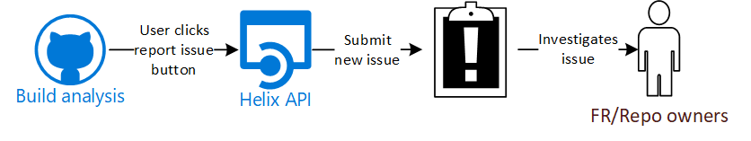
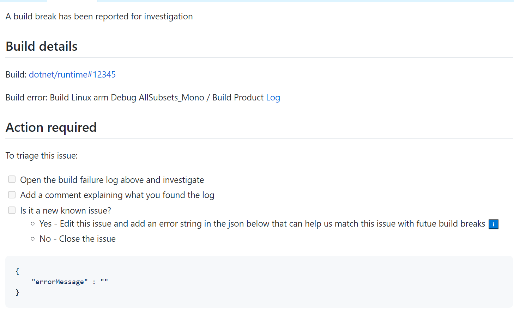
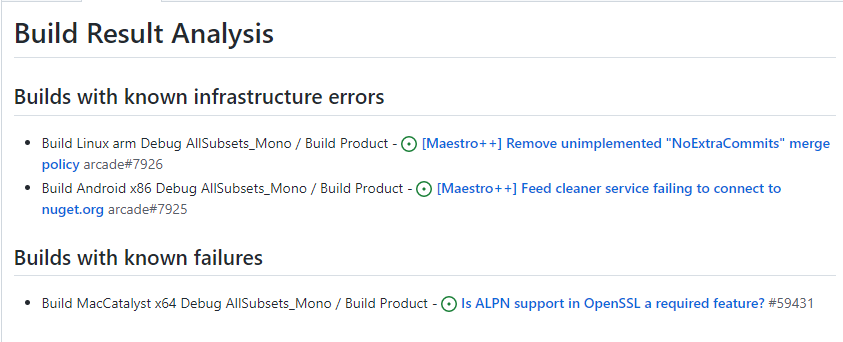

# Reporting an issue in build analysis check
The workflow to report a new known product/infrastructure issue from the build analysis check is:



1. Click "Report infrastructure issue" or "Report product issue" ([Mockup](GitHub-Check-Mockup/Unique-Build-Failure.md)) for a unique build failure in build analysis check
2. The Helix API receives the request and submit a new issue. The service submits infrastructure issue in Arcade and product issues in the same repo where the user reported the problem. The issue follows this format.
3. The user sees a pop-up confirming the issue has been submitted
4. FR/Repo owners investigate the issue. If it is indeed a new known issue, they identify a string that can be used to match similar future build failures and updates the issue

## Issue format
The submitted issue will look like this:



The issue will have the following labels:
- First Responder (In case of infrastructure issues)
- Detected By - Customer
- Build Error Needs Triage

## Investigation

FR people or report owners will look at the logs provided in the issue and  decide if the build break should be a new known issue. If they decide that issue is real, they will edit the issue and add a string that shows up when a build hits this infrastructure issue.

For example, for the following error:

```log
##[error].dotnet/sdk/6.0.100-rc.1.21411.28/NuGet.RestoreEx.targets(19,5): error : (NETCORE_ENGINEERING_TELEMETRY=Restore) Failed to retrieve information about 'Microsoft.Extensions.Hosting.WindowsServices' from remote source 'https://pkgs.dev.azure.com/dnceng/9ee6d478-d288-47f7-aacc-f6e6d082ae6d/_packaging/c9f8ac11-6bd8-4926-8306-f075241547f7/nuget/v3/flat2/microsoft.extensions.hosting.windowsservices/index.json'.
```

We could choose the string "Failed to retrieve information about 'Microsoft.Extensions.Hosting.WindowsServices' from remote source" as the string we will use to match future build failures with this particular issue.

The string should be added to the issue using the format:

```json
{
    "errorMessage" : "Failed to retrieve information about 'Microsoft.Extensions.Hosting.WindowsServices'"
}
```

# Matching build errors

During build analysis, we will query GitHub to get open issues with the labels above and the triaged label (**Known build error**). We will query arcade for infrastructure issues and the repository where the PR happened for product issues. 

From each issue we will get a string that shows up every time the known issue manifests. Once we have all error lines we will look for them in the AzDo logs of failed builds.

We will have a list of all failed builds where we were able to match a error message to a line in the log ([Mockup](GitHub-Check-Mockup\Build-Failure-Infra-Issue.md))



# Telemetry

In other to later build reporting for known issues, we will save the following information, in an Azure table, every time build analysis finds a match between a build break and a known issues

- Build number
- GitHub issue number & repo
- Build stage
- Build job
- Build step
- Build start time
- Repository
- Repo/Infrastructure issue

## Ideas to consider

- Once a new known issue is submitted, regenerate build analysis check for affected builds
- Regenerate build analyses check once a potential new known issue is submitted


<!-- Begin Generated Content: Doc Feedback -->
<sub>Was this helpful? [](https://helix.dot.net/f/p/5?p=Documentation%5CDevWorkflow%5CDesign%5CDev-Design-Infra-Known-Issues.md) [](https://helix.dot.net/f/n/5?p=Documentation%5CDevWorkflow%5CDesign%5CDev-Design-Infra-Known-Issues.md)</sub>
<!-- End Generated Content-->
