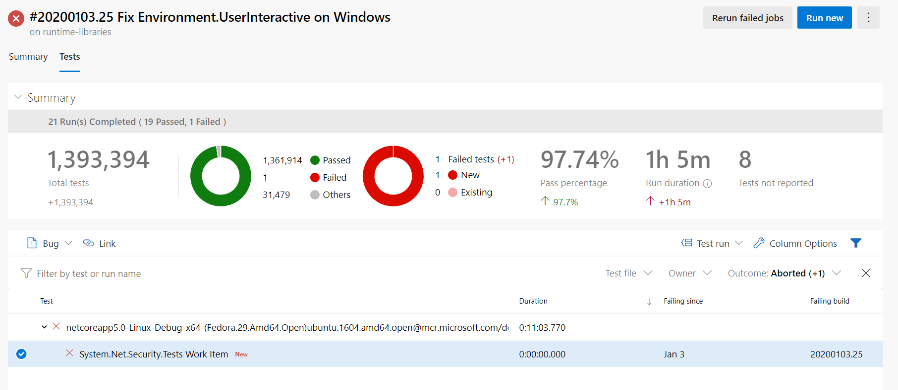
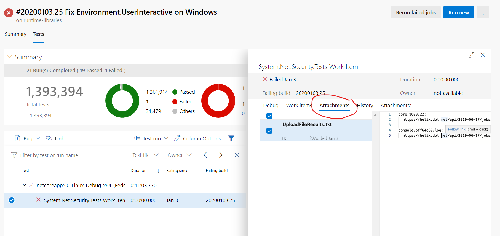

# Retrieving Dump Files and Other Logs From a Crash or Timeout

Crash dumps are uploaded to an Azure storage account in the same manner as test results, logs, and other output related to the work item. When a work item contains a failure, a special file containing links to these files is created and attached to the test result named after the work item that failed. It may be viewed along with the other tests in the Azure DevOps Test tab.

To retrieve the dump files:

1. Navigate to the Test tab in Azure DevOps.

2. Find the failing work item in the list and click on the link. It will open up a blade on the right side with more details. 

3. Click on the `Attachments` tab (not `Attachments*`) to see the UploadFileResults.txt. Click on that file to open the preview.

4. You will find a list of files that link back to the file that was uploaded to Azure Storage. From there, you can download the dump files or log files or other files that were uploaded as a result from the work item. 
