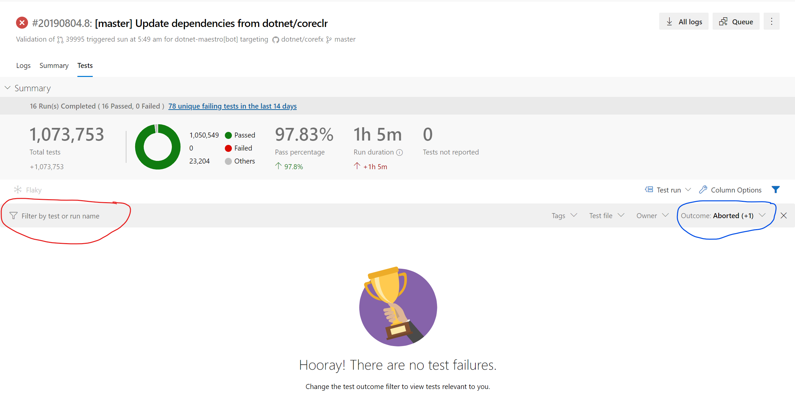
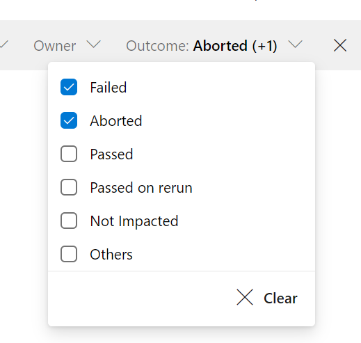
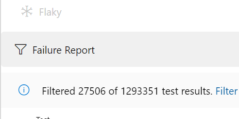
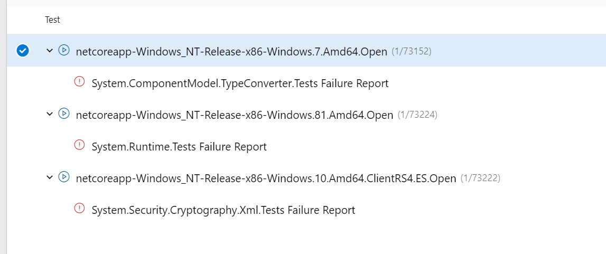
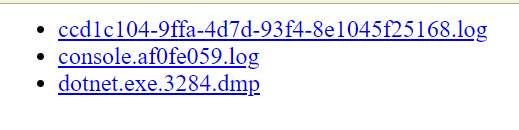

# Retrieving Dump Files and Other Logs From a Crash or Timeout

Crash dumps are uploaded to an Azure storage account in the same manner as test results, logs, and other output related to the work item. When a work item contains a failure, a special file containing links to these files is created and attached to a test result named "{Work Item} Failure Results". It may be viewed along with the other tests in the Azure DevOps Test tab.

To retrieve the dump files:

1. Navigate to the Test tab in Azure DevOps.

2. Click the Outcome dropdown (circled in blue), and click "X Clear" or select "Others". 

The Test Result that contains the link to the dumps and other files is of type "Error" which shows up under "Others". 

3. Filter by "Failure Report" in the "Filter by test or run name" text box (circled in red). 

The Test Result will be named: workitem name + "Failure Report"

4. After filtering down to the Failure Reports, you should see the Test Results of the appropriate name. You may need to expand the Test Run to see the Failure Report Test Result. 

5. Click on the Test Result link to open up the Test Result blade. Click on the Attachments tab to view the attached UploadFileResult.html file. 

6. Download the UploadFileResult.html file and open it. There, you will find a list of files that link back to the file that was uploaded to Azure Storage. From there, you can download the dump files or log files or other files that were uploaded as a result from the work item. 

