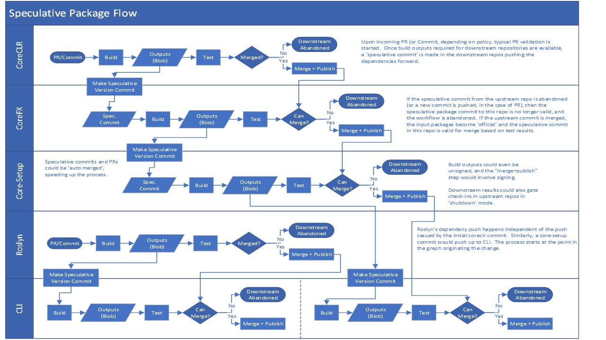

# Dependency flow automation => Maestro ++

Maestro++ is an automation of the work a developer would do to flow dependencies across repos using [Darc](./Darc.md).

## Requirements:
- Triggers:
    - Package publish
    - Schedule task
    - Requested in a PR (i.e. @dotnet-bot test product build) by following a speculative product build.
    - Manual trigger
- It must work for GitHub/Azure DevOps and Public/Internal builds/repos (all combos).
- Manage channels subscriptions for each repo.
- It must be able to set policies for each repo:
    - When to trigger Maestro++
    - When to merge an auto-PR. (i.e. auto-merge when all the checks are green).
    - When to abort a flow of dependencies (i.e. what to do when test failed for a specific repo).
- It must have the option to auto-merge PRs when all the required checks are green.
- It must signal when an Official Build is being built in order to produce signed bits.
-	Notify the result of the build triggered by maestro++. Did the target repo get the update? Does the source repo know if the children were updated?

## Considerations:
- It must manage [speculative version flow](#Speculative-Version-Flow) (Once the product build is done, in parallel execute tests and queue product builds for the dependents).
- It must manage [speculative product build](#Speculative-Product-Build) (Dev test build. Flow dependencies until the last dependent validating build and option to not consider test results).
-	Secret management
- Diamond dependency problem. There are cases where, for example, CLI depends on the package Microsoft.NetCore.App that comes from Core-Setup. ASP.NET depends on the same package. In order for the product
to work, the version of Microsoft.NetCore.App needs to be the same across all the dependencies that end in CLI. This involves management on transient dependencies. We could think of this as having a check
in the auto-pr that will validate this (using Darc?). => We still need to think about this.

## Speculative Version Flow 
Speculative version flow is the concept that we do not need a commit to a mainline branch in a repository to begin flowing dependencies to downstream repositories.  As soon as assets required for downstream repository builds are available, we can begin to flow those bits. 
For example, a change originating in CoreCLR would have bits flowed in the following way: 
1. Dev creates a PR that after approval, gets merged. 
2. Official build starts on trigger 
3. Upon completion of build+package step of CoreCLR official build, assets are now available for downstream consumption (i.e. CoreFx).  Tests for CoreCLR continue asynchronously. 
4. Maestro++ uses Darc to create a commit containing dependency updates and starts new dependency update PR in CoreFx.  Because this “official” PR comes from the
 Maestro++ bot, signed bits are generated. 
5. Upon completion of build+package steps in CoreFx, assets are now available for downstream consumption (core-setup, corefxlab). Tests for CoreFx continue asynchronously. 
6. Maestro++ uses Darc to create a commit containing dependency updates and starts new dependency update PR in core-setup and corefxlab.  Because this “official” PR comes from the Maestro++ bot, signed bits are generated. 
7. Dependency update PRs are automatically merged by Maestro++ into target branches based on configurable policy. Typically, they would only get merged if tests passed for that PR as well as any speculative parents.  For example, if core-setup’s tests pass with speculative CoreFx bits, but CoreFx's tests fail with speculative CoreCLR bits, then core-setup’s PR is not eligible for merge.  
8. As PRs are merged, the assets they produced speculatively are merged into the mainline blob feeds and downstream PRs can be merged. 

## Speculative Product Builds 
It answers the question of “what would the product (or subproduct) look like if a specific version of a repo was injected into the dependency graph. 
While these assets are generated in the process of flowing dependencies, the “default” model is to abort the flow if tests fail.  When attempting a speculative product build, the flow could be continued, without committing results, as long as builds complete successfully.
The important part to recognize is that a speculative product build is NOT a shippable product.  It is intended to be used by devs as a “what if” tool to view a commit in context of other repositories.
