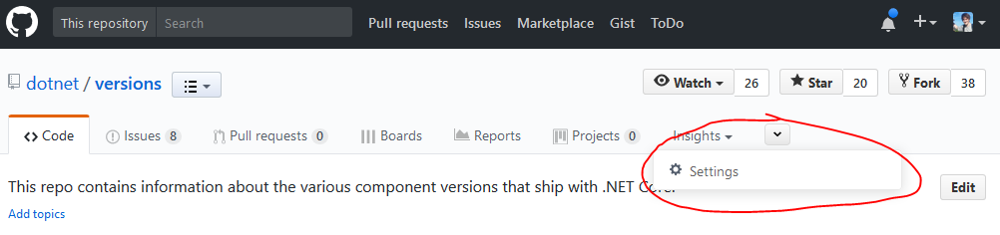
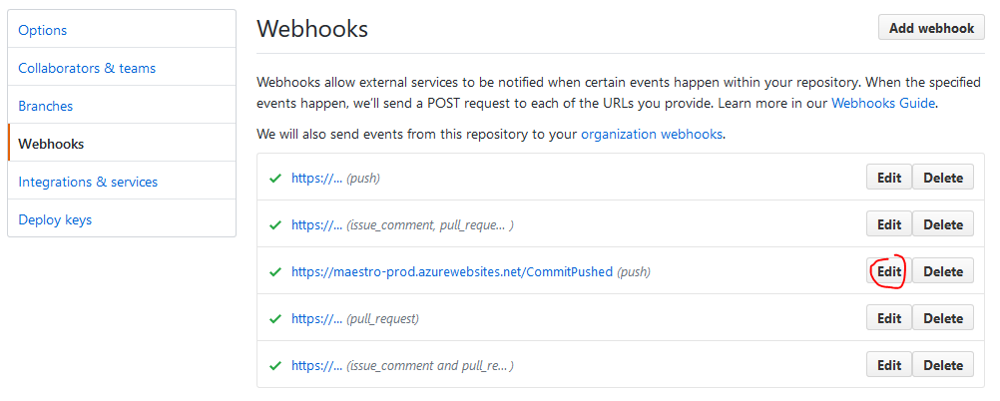
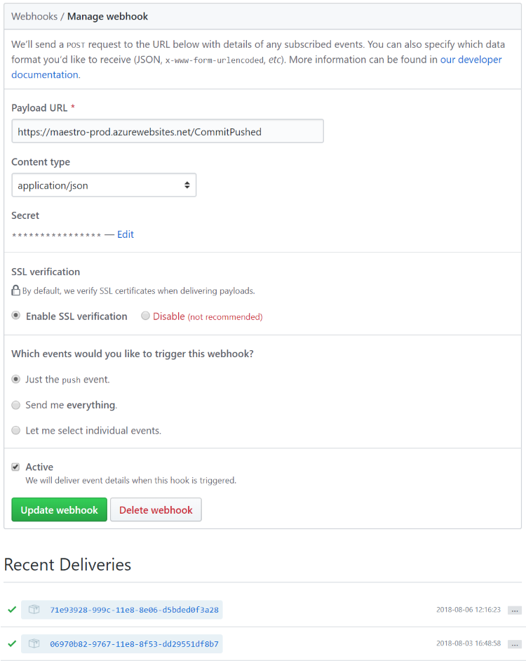

# Maestro GitHub web hooks

Some GitHub repositories have commit web hooks pointing at Maestro. The dotnet/versions commit hook is used for build-info change notifications, and individual repos can use commit hooks to trigger CI builds.

For example, Core-Setup release/1.0.0 and release/1.1.0 pipebuilds. GitHub sends a commit callback to Maestro, then Maestro queues the VSTS build.

## Finding web hook settings

On the repository page, go to the **Settings** tab and click **Webhooks**. You may need to click on a dropdown to find **Settings** due to ZenHub.

---

If you don't see **Settings** anywhere, you don't have permission. Check https://repos.opensource.microsoft.com/DotNet/repos to see who has admin permission.

Example web hooks page url: https://github.com/dotnet/versions/settings/hooks/

## Web hook configuration

 * Payload URL: `https://maestro-prod.azurewebsites.net/CommitPushed`
 * Content Type: `application/json`
 * Secret: [Maestro-WebhookSecretToken on EngKeyVault](https://ms.portal.azure.com/#asset/Microsoft_Azure_KeyVault/Secret/https://engkeyvault.vault.azure.net/secrets/Maestro-WebhookSecretToken/e6b838f3a9ce420d8ef3f9bf97047020)
   * to get read access, join the **dncengkvread** SG on IDWEB
 * "Which events would you like to trigger this webhook?": `Just the push event.`
 * Active: checked

<!-- Begin Generated Content: Doc Feedback -->
Was this helpful?  
<!-- End Generated Content-->
