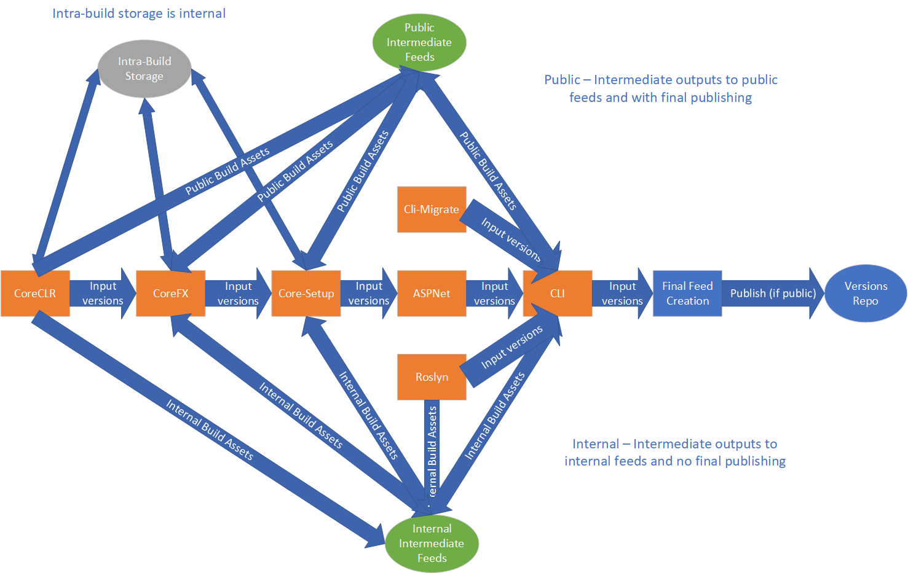

# .NET Core 2.1/2.2 Servicing Workflow

This document is intended to provide a practical servicing workflow for .NET Core 2.1.

## Overview

.NET Core 2.1/2.2 were built via the "ProdCon v1" model, in which repositories are strung together via the PipeBuild orchestration system (see below). A build produces outputs to a specified per-repository location.  Those outputs are analyzed and an msbuild property file is created with version numbers for all package outputs.  That property file is fed into any builds of repositories that depend on the previously built repository, which in term produces new outputs, which are analyzed, and so on until a product is produced. Building each individual repo after this commit can produce functionally equivalent assets to the final build.

The general servicing flow looks like this:
  1. Modify ProdCon definition to reflect the minimal set of repos that must be built.
  2. Update branding in repositories
  2. Check in fixes.
  3. Invoke product construction build

### Pipebuild

Pipebuild is an orchestration system that predates native Azure DevOps orchestration. It is an executable that reads a json description of a build pipeline, then executes that build pipelines. Each build in the pipeline consists of an Azure DevOps build definition, a set of input parameters, and other builds that the build definition depends on.  Pipebuild evaluates the dependency graph of builds, launch any that have had their dependencies complete successfully (or that have no dependencies). As builds complete, the dependency graph is evaluated again and more builds are launched until all builds have been completed (or failed).

### Build Definitions and Pipebuild Definitions

The pipebuild descriptions for the builds are held in https://dev.azure.com/devdiv/DevDiv/_git/DotNet-BuildPipeline. For 2.1 and 2.2, the definitions are comprised of 'outer' pipebuild definition which orchestrates inner pipebuild and utility build definitions. For example, the orchestrated pipebuild build definition launches the corefx pipebuild build definition with specific parameters, waits for it to complete, then launches the corefx pipebuild build definition.

- **Public Servicing** - Public builds will use publicly visible intermediate storage and publish build information to the dotnet/versions repo on completion.
  - **2.1 Build Definition** - https://dev.azure.com/devdiv/DevDiv/_build/index?definitionId=8287
  - **2.2 Build Definition** - https://dev.azure.com/devdiv/DevDiv/_build/index?definitionId=9482
  - **2.1 Pipebuild Description** - https://dev.azure.com/devdiv/DevDiv/Default/_git/DotNet-BuildPipeline?path=%2Fsrc%2FPipeBuild%2FPipeBuild%2Fpipelines.orchestrated-release-2.1.json&version=GBmaster
  - **2.2 Pipebuild Description** - https://dev.azure.com/devdiv/DevDiv/Default/_git/DotNet-BuildPipeline?path=%2Fsrc%2FPipeBuild%2FPipeBuild%2Fpipelines.orchestrated-release-2.2.json&version=GBmaster
- **Internal Servicing** - Internal builds will use private intermediate storage, including private blob feeds and will not publish build information to the dotnet/versions repo on completion.
  - **2.1 Build Definition** - https://dev.azure.com/devdiv/_build/index?definitionId=9010
  - **2.2 Build Definition** - https://dev.azure.com/devdiv/_build/index?definitionId=10367
  - **2.1 Pipebuild Definition** - `https://dev.azure.com/devdiv/DevDiv/Default/_git/DotNet-BuildPipeline?path=%2Fsrc%2FPipeBuild%2FPipeBuild%2Fpipelines.orchestrated-release-2.1-internal.json&version=GBmaster
  - **2.2 Pipebuild Definition** - `https://dev.azure.com/devdiv/DevDiv/Default/_git/DotNet-BuildPipeline?path=%2Fsrc%2FPipeBuild%2FPipeBuild%2Fpipelines.orchestrated-release-2.2-internal.json&version=GBmaster

## Step-by-Step

1. Update branding in required repos to reflect the servicing event. How this is done is repository dependent, but generally post-release, the pre-release label is updated in each of the servicing branches to 'servicing' (or something like that) and the patch version element is incremented. The `PB_VersionStamp` default should be changed on the build definition.
2. Check in fixes to required repositories.
3. Update ProdCon pipebuild descriptions
    1. Change to reflect the minimal set of repos that must be built. Typically, the description does not change and contains all the core repositories (coreclr, corefx, core-setup aspnet, extensions, cli). Occasionally, sdk will have a servicing fix and require an entry in the description file.  When adding or removing builds from prodcon, ensure that dependency and input/output merges are updated.
    2. Verify/Update input branches
    3. For build of CLI, update the **MicrosoftNETCoreAppLatestVersion1_0** (2.1 + 2.2),
       **MicrosoftNETCoreAppLatestVersion1_1** (2.1 + 2.2), **MicrosoftNETCoreAppLatestVersion2_0** (2.1 only),
       **MicrosoftNETCoreAppLatestVersion2_1** (2.2),
       **MicrosoftAspNetCoreAppLatestVersion2_1** (2.2) and
       **MicrosoftAspNetCoreAllLatestVersion2_1** (2.2) parameters to reflect the
      versions of those products that will be produced in the current servicing cycle.

    Each repository in the graph is described in the following way in the description file.

        // Create inputs pipeline merges outputs from input builds
        // (CoreClr-Build) to PB_OutputFeed.
        {
          "Name": "CoreFx-CreateInputs",
          "DependsOn": [ "CoreClr-Build" ],
          "Parameters": {
            "TreatWarningsAsErrors": "false"
          },
          "BuildParameters": {},
          "Definitions": [
            {
              "Name": "DotNet-Orchestration-Merge-Feeds",
              "Parameters": {
                "PB_InputFeeds": "$(PB_FeedBaseUrl)/$(ProductBuildId)/coreclr/index.json",
                "PB_OutputFeed": "$(PB_FeedBaseUrl)/$(ProductBuildId)/corefx-inputs/index.json",
                "PB_OutputPropsLocation": "orchestration-metadata/PackageVersions.props"
              },
              "ReportingParameters": {
                "Type": "build/productconstruction/",
                "Source": "prodcon/packageversions/CoreFx"
              }
            },
            {
              "Name": "DotNet-Orchestration-Merge-Blobs",
              "Parameters": {
                "PB_InputUrls": "$(PB_FeedBaseUrl)/$(ProductBuildId)/coreclr/assets/symbols",
                "PB_OutputUrl": "$(PB_FeedBaseUrl)/$(ProductBuildId)/corefx-inputs/assets/symbols"
              },
              "ReportingParameters": {
                "Type": "build/productconstruction/",
                "Source": "prodcon/packageversions/CoreFx"
              }
            }
          ]
        },
        // Delete existing repo specific outputs
        {
          "Name": "CoreFx",
          "DependsOn": [
            "CoreFx-CreateInputs"
          ],
          "Parameters": {
            "TreatWarningsAsErrors": "false"
          },
          "BuildParameters": {},
          "Definitions": [
            {
              "Name": "DotNet-Orchestration-Create-Outputs",
              "Parameters": {
                "PB_OutputUrl": "$(PB_FeedBaseUrl)/$(ProductBuildId)/corefx/"
              },
              "ReportingParameters": {
                "Type": "build/orchestration/",
                "Source": "prodcon/createoutputs/CoreFx"
              }
            }
          ]
        },
        // Call actual corefx build
        {
          "Name": "CoreFx-Build",
          "DependsOn": [
            "CoreFx"
          ],
          "Parameters": {
            "TreatWarningsAsErrors": "false"
          },
          "BuildParameters": {},
          "Definitions": [
            {
              "Name": "DotNet-CoreFx-PipeBuild-Master",
              "Parameters": {
                // Branch name
                "Branch": "release/2.2",
                "PB_PublishBlobFeedUrl": "$(PB_FeedBaseUrl)/$(ProductBuildId)/corefx/index.json",
                "PB_PackageVersionPropsUrl": "$(PB_FeedBaseUrl)/$(ProductBuildId)/corefx-inputs/orchestration-metadata/PackageVersions.props",
                "PB_RestoreSource": "$(PB_FeedBaseUrl)/$(ProductBuildId)/corefx-inputs/index.json",
                "PB_AssetRootUrl": "$(PB_FeedBaseUrl)/$(ProductBuildId)/corefx-inputs/assets/"
              },
              "ReportingParameters": {
                "Type": "build/orchestration/"
              }
            }
          ]
        },

4. Perform **initial** validation builds with pre-release branding (e.g. date varying)
    - **If public** - Launch public servicing build definition with the default parameters and monitor progress. Monitoring can be done via the Azure DevOps console output.  Use links to launched builds to drill down into launched builds.
    - **If internal** - Launch internal servicing build definition with the default parameters and monitor progress. Monitoring can be done via the Azure DevOps console output.  Use links to launched builds to drill down into launched builds.
5. Perform any partial build respins as necessary (e.g. failures, new fixes, etc.) - New builds can be partially spun starting from a specific repo.  To do this, requeue the build definition with the following parameters:
    - `ProductBuildId` - `ProductBuildId` of the build being respun
    - `PB_PipelineRoots` - A comma separated list of the repos that need respinning.  These correspond to `Name` elements of the `Pipelines` array in the pipeline definition json. Typically, to respin a repo just type the repo name.  This corresponds to deletion of previous outputs prior to the build rerun.

    The repository sha that a build uses is always the **latest at the time that the build is queued**. For example, if a new fix is checked into corefx, but coreclr has already been produced final outputs, launching pipebuild again starting with corefx will pick up the new fix.

    **Warning: To avoid an excessive amount of time spent merging and creating input sets, the input feeds are not cleaned automatically on a respin. If you are respinning a previously *successful* build, delete the *-inputs* feeds in Azure Storage Explorer prior to launching the build**.

6. Validate outputs based on build definition input parameters
    - **If public** - Check dotnet/versions repo once build definition for README containing links to build outputs, including blob feed.  Raw outputs can be found in `$(PB_FeedBaseUrl)/$(ProductBuildId)/final`
        - Assets - `$(PB_FeedBaseUrl)/$(ProductBuildId)/final/assets`
        - Feed - `$(PB_FeedBaseUrl)/$(ProductBuildId)/final/index.json`
    - **If internal** - Find outputs in: $(PB_FeedBaseUrl)/$(ProductBuildId)/final/assets
        - Assets -  `$(PB_FeedBaseUrl)/$(ProductBuildId)/final/assets`
        - Feed - `$(PB_AuthenticatedFeedBaseUrl)/$(ProductBuildId)/final/index.json`
7. Perform final stabilized build - Typically for public builds, outputs are published to public feeds post-build based on triggers in the versions repo.  For the final stabilized build this is not desirable, since any respins will need to overwrite those outputs.  Instead, the final build manifest is initially published to a different path in the versions repo which does not trigger the final publish steps.  For internal builds nothing changes. Parameters should be set as follows:
    - `PB_VersionStamp` - `<empty string>`
    - `PB_IsStable` - `true`
    - `PB_VersionsRepoPath` - `build-info/dotnet/product/cli/release/2.1.<servicing suffix>` (e.g. 2.1.6)
    - `PB_VersionsRepoPath` - `build-info/dotnet/product/cli/release/2.2.<servicing suffix>` (2.2.5)
8. Validate final stabilized build - **See step 6 for info on how to obtain build.** For internal builds, the asset outputs are typically copied to a share with a link to the internal feed url for ease of access.
9. Add triggers for final publishing steps in the versions repo - This file contains a set of actions that are taken when outputs are seen at specific paths in the repo. These actions take the form of launching Azure DevOps build definitions. For 2.1 and 2.2, the following activities are performed:
    - Push symbols to symweb and MSDL
    - Validate signatures
    - Push installers (may not be required if installer outputs have already been staged. Talk to Lee Coward.)
    - Push packages to dotnetfeed.
    - Send dependency update PRs to various repositories

    Triggers are added by adding or updating blocks in the https://github.com/dotnet/versions/blob/master/Maestro/subscriptions.json file.  Please see https://github.com/dotnet/versions/pull/459/files for an example.

10. Perform final release - In conjunction with normal tic-toc activities, final release can be done by ensuring the build description is published to the versions repo, then adding triggers for that location.
    1. **If public** - Poke the "build.semaphore" file by adding a digit to the end of the versions repo file where the stabilized build was published. For example: https://github.com/dotnet/versions/commit/641b24a434bbb4fc801ec56a7ad9eef36e5c5a01
    2. **If internal** - Execute [DotNet-Orchestrated-Release-2-1-Move-To-Public](https://dev.azure.com/devdiv/DevDiv/_build?definitionId=11719&_a=summary)
       or
       [DotNet-Orchestrated-Release-2-2-Move-To-Public](https://dev.azure.com/devdiv/DevDiv/_build?definitionId=11723&_a=summary)
       build definitions with appropriate parameters to move the builds to
       public storage
        - `ProductBuildId` = build product build id
        - `PB_VersionsRepoPath` -
          `build-info/dotnet/product/cli/release/2.1.<servicing suffix>` (2.2.5,
          2.1.12, etc.)

## Build Flow Diagram

## Things to pay attention to

There are a number of things that require attention to ensure a working product construction build, as well as avoiding leaks of internal assets or stabilized assets before the product is finalized for a servicing event.
- What kind of changes have been made to the build definitions or repositories lately?  Prodcon v1 treats each repository's build infrastructure as a black box.  Each of them only needs to conform to the following contract:
    - Versions for dependencies are obtained from `PB_PackageVersionPropsUrl`
    - Restore sources should include `PB_RestoreSource`
    - Results should be published to `PB_PublishBlobFeedUrl`
    - Non-nuget assets should be pulled from `PB_AssetRootUrl`
    - If `PB_IsStable=true` is passed, stable build numbers should be produced
    - If `PB_PublishType` is `blob`, only publish assets to the `PB_PublishBlobFeedUrl` location (e.g. avoid myget, NuGet.org, etc.).  `PB_PublishType=blob` is only passed for product construction builds, so some repos have chosen to use the existence of PB_PublishBlobFeedUrl as an equivalent marker.  The point is that outputs shouldn't be visible outside the isolated orchestrated blob feed.
    
    If significant changes have been made to build definitions or repo infrastructure code, ensuring that this contract is still abided by can ensure a proper isolated product build.
- Did all repos update their branding properly?
- Are intra-build storage accounts publicly visible?  Intra-build storage (typically only used in corefx, coreclr and core-setup) should not be publicly visible in internal build scenarios. 
