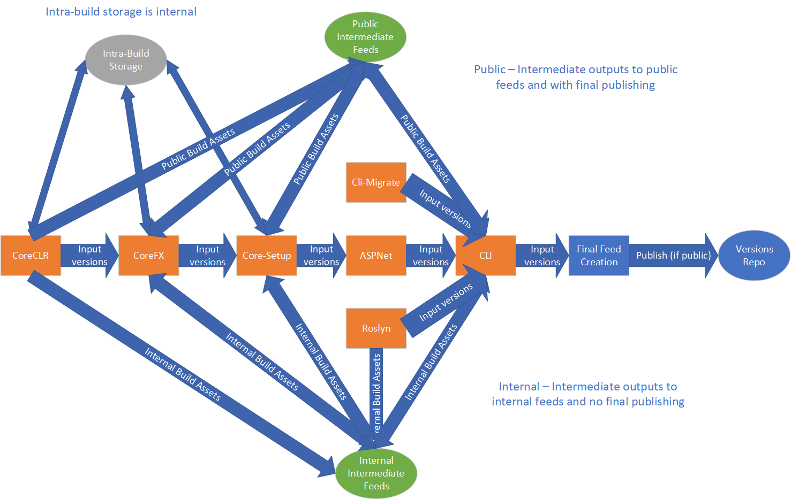

# .NET Core 2.1 Servicing Workflow

This document is intended to provide a practical servicing worflow for .NET Core 2.1.

## Overview

.NET Core 2.1 was built via the "ProdCon v1" model, in which repositories are strung together via the PipeBuild orchestration system, supplying inputs from previously built stages automatically into downstream stages. After a build completes, the version numbers of the assets built are then updated in the repos. For example, if Microsoft.NETCore.App version 2.1.0-rtm-12354-01 was produced, then CLI will be updated to reference that published version after the build completes.  Building each invdividual repo after this commit can produce functionally equivalent assets to the final build.  This means mechanically there are two ways to service:
- **Isolated Build**
  1. Fixes are checked into target repositories
  2. A repo is built in an isolated fashion
  3. Its outputs are published
  4. Downstream repos are updated to reference those outputs
  5. Downstream repos are built
  6. Repeat 1-4 until all required repos are rebuilt (typically CLI, though could be CoreFX)
- **Full Build**
  1. Fixes are checked into required repos
  2. Full product construction build is invoked from the root

The mechanics of servicing the 2.1 build hinge on two factors:
- **The scope of servicing (number/which repos involved)** - This only really affects the efficiency of servicing mechanics.
  - A small servicing scope can potentially be done on a per-repo basis without invoking a full product build using the **Isolated Build** method outlined above.  In a similar fashion, during the 2.1 shutdown timeframe, some repositories froze the version of their component appearing in the larger build by commiting the desired version into the referencing repo (usually CLI) and then removing themselves from dependency flow.  **If a repository is not in the product construction, either this method must be used, or dependencies must flow to a repo in the product construction build before the Full Build is invoked**
  - A larger servicing scope, or if the repositories being serviced are at the base of the stack (e.g. coreclr) should be done using the **Full Build** process.  Fixes are checked into each repository, then the entire product construction build is run bottom to top.
- **The internal or public nature of the servicing event** - Public servicing events can expose outputs externally during and after the build.  Internal servicing events must keep them private.  For simplicity, internal servicing events should always use the **Full Build** method, though it may be possible to avoid this if desired.

Given the complexity of producing a build, it's recommended that the **Full Build** be used in most cases.

### Build Definitions and Pipebuild Definitions

The pipebuild descriptions for the builds are held in https://devdiv.visualstudio.com/DefaultCollection/DevDiv/_git/DotNet-BuildPipeline.  The definitions are comprised of an outer pipebuild definition which orchestrates inner pipebuild and utility build definitions.  For example, the orchestrated pipebuild build definition launches the corefx pipebuild build definition with specific parameters, waits for it to complete, then launches the corefx pipebuild build definition.
- **Public Servicing** - Public builds will use publicly visible intermediate storage and publish build information to the dotnet/versions repo on completion.
  - **Build Definition** - https://devdiv.visualstudio.com/DevDiv/_build/index?definitionId=8287
  - **Pipebuild Definition** - https://devdiv.visualstudio.com/DefaultCollection/DevDiv/Default/_git/DotNet-BuildPipeline?path=%2Fsrc%2FPipeBuild%2FPipeBuild%2Fpipelines.orchestrated-release-2.1.json&version=GBorchestrated
- **Internal Servicing** - Internal builds will use private intermediate storage, including private blob feeds and will not publish build information to the dotnet/versions repo on completion.
  - **Build Definition** - https://devdiv.visualstudio.com/DevDiv/_build/index?definitionId=9010
  - **Pipebuild Definition** - `https://devdiv.visualstudio.com/DefaultCollection/DevDiv/Default/_git/DotNet-BuildPipeline?path=%2Fsrc%2FPipeBuild%2FPipeBuild%2Fpipelines.orchestrated-release-2.1-internal.json&version=GBorchestrated

## Step-by-Step

1. Update branding in required repos to reflect the servicing event. How this is done is repository dependent, but generally post-release, the pre-release label is updated in each of the servicing branches to 'servicing' (or something like that) and the patch version element is incremented. The `PB_VersionStamp` default should be changed on the build definition.
2. Check in fixes to required repositories.
3. Update branch names in pipeline definition files if necessary.  This is typically only necessary if 2.1 branch names change for repos or for internal servicing where some branches come from internal repos.  This can be done via adding or updating the `Branch` element in `-Build` pipelines.  e.g. `CoreFx-Build` from `release/2.1` to `release/2.1-servicingfix`
4. Perform **initial** validation builds with pre-release branding (e.g. date varying)
    - **If public** - Launch public servicing build definition with the default parameters and monitor progress.  Monitoring can be done via the VSTS console or mission control.
    - **If internal** - Launch internal servicing build definition with the default parameters and monitor progress.  Monitoring can be done via the VSTS console or mission control.
5. Perform any partial build respins as necessary (e.g. failures, new fixes, etc.) - New builds can be partially spun starting from a specific repo.  To do this, requeue the build definition with the following parameters:
    - `ProductBuildId` - `ProductBuildId` of the build being respun
    - `PB_PipelineRoots` - A comma separated list of the repos that need respinning.  These correspond to `Name` elements of the `Pipelines` array in the pipeline definition json. Typically, to respin a repo just type the repo name.  This corresponds to deletion of previous outputs prior to the build rerun.
6. Validate outputs based on build definition input parameters
    - **If public** - Check dotnet/versions repo once build definition for README containing links to build outputs, including blob feed.  Raw outputs can be found in `$(PB_FeedBaseUrl)/$(ProductBuildId)/final`
        - Assets - `$(PB_FeedBaseUrl)/$(ProductBuildId)/final/assets`
        - Feed - `$(PB_FeedBaseUrl)/$(ProductBuildId)/final/index.json`
    - **If internal** - Find outputs in: $(PB_FeedBaseUrl)/$(ProductBuildId)/final/assets
        - Assets -  `$(PB_FeedBaseUrl)/$(ProductBuildId)/final/assets`
        - Feed - `$(PB_AuthenticatedFeedBaseUrl)/$(ProductBuildId)/final/index.json`
7. Perform final stabilized build - Typically for public builds, outputs are published to public feeds post-build based on triggers in the versions repo.  For the final stabilized build this is not desirable, since any respins will need to overwrite those outputs.  Instead, the final build manifest is initially published to a different path in the versions repo which does not trigger the final publish steps.  For internal builds nothing changes. Parameters should be set as follows:
    - `PB_VersionStamp` - `<empty string>`
    - `PB_IsStable` - `true`
    - `PB_VersionsRepoPath` - `build-info/dotnet/product/cli/release/2.1-<servicing suffix>`
8. Validate final stabilized build - **See step 6 for info.**
9. Perform final release - In conjunction with normal tic-toc activities, final release can be done by publishing/re-publishing the final build manifest to a location in the versions repo that has triggers for final publishing. Final publishing pushes assets, symbols, etc. to desired output locations.
    1. **If public** - Relaunch final build with:
        - `PB_PipelineRoots` - `Final-PushOrchestratedBuildManifest`
        - `ProductBuildId` - `ProductBuildId` of the build being released
        -  `PB_VersionsRepoPath` - `build-info/dotnet/product/cli/release/2.1` or other path with triggers (see https://github.com/dotnet/versions/blob/master/Maestro/subscriptions.json)
    2. **If internal** - Copy build outputs from internal storage account to dotnetfeed storage account.  This is typically done just by copying the whole build output directory (`$(PB_FeedBaseUrl)/$(ProductBuildId)/`) to another container (e.g. orchestrated-foo-bar-baz).  Then launch the **public** build definition with the following parameters:
        - `PB_PipelineRoots` - `Final` **note that Final is used here so that the final output feed is created correctly, as the feed contains internal uri references**
        - `ProductBuildId` - `ProductBuildId` of the build being released
        -  `PB_VersionsRepoPath` - `build-info/dotnet/product/cli/release/2.1` or other path with triggers (see https://github.com/dotnet/versions/blob/master/Maestro/subscriptions.json)
        - `PB_FeedBaseUrl` - `<path to container containing build>`

## Build Flow Diagram

## Things to pay attention to

There are a number of things that require attention to ensure a working product construction build, as well as avoiding leaks of internal assets or stabilized assets before the product is finalized for a servicing event.
- What kind of changes have been made to the build definitions or repositories lately?  Prodcon v1 treats each repository's build infrastructure as a black box.  Each of them only needs to conform to the following contract:
    - Versions for dependencies are obtained from `PB_PackageVersionPropsUrl`
    - Restore sources should include `PB_RestoreSource`
    - Results should be published to `PB_PublishBlobFeedUrl`
    - Non-nuget assets should be pulled from `PB_AssetRootUrl`
    - If `PB_IsStable=true` is passed, stable build numbers should be produced
    - If `PB_PublishType` is `blob`, only publish assets to the `PB_PublishBlobFeedUrl` location (e.g. avoid myget, nuget.org, etc.).  `PB_PublishType=blob` is only passed for product construction builds, so some repos have chosen to use the existence of PB_PublishBlobFeedUrl as an equivalent marker.  The point is that outputs shouldn't be visible outside the isolated orchestrated blob feed.
    
    If significant changes have been made to build definitions or repo infrastructure code, ensuring that this contract is still abided by can ensure a proper isolated product build.
- Did all repos update their branding properly?
- Are intra-build storage accounts publicly visible?  Intra-build storage (typically only used in corefx, coreclr and core-setup) should not be publicly visible in internal build scenarios. 