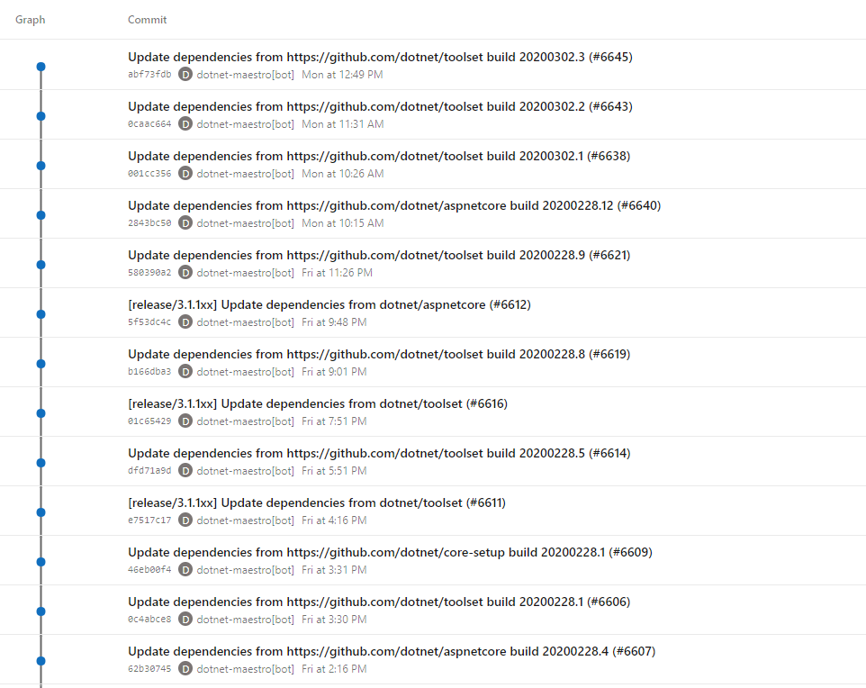

# Improved Dependency Flow for .NET 5

## Goals

* Eliminate the need for opening Pull Requests for inter-repository dependency
  updates in channels where breaking changes are the exception, in order to
  reduce the total time it takes to achieve a full product build by skipping PR
  validation builds.

* Keep the existing dependency flow PR functionality in place for channels and
  repos that won't benefit from the new flow.

## Non-Goals

* We are not looking to optimize dependency flow for channels and repos that are
  in active development. Constant commits to the target branches for
  subscriptions will result in the new flow not being able to automatically
  merge changes, and will instead result in delays opening the dependency update
  PRs.

* We won't thoroughly validate builds that result from applying dependency
  updates with the new flow. Since we will only run the official builds for the
  target repositories, any testing that is performed during PRs will be skipped,
  and any failures during CI builds won't have an associated PR that caused the
  break.

## Overview

In order to reduce the number of dependency update PRs that flow across the
stack, we will attempt to apply dependency updates directly on the branches that
subscriptions are targetting. In order to accomplish this, Maestro++ will
dynamically create branches to apply dependency updates to, run an official
build for the repo, and if both the build succeeds, and a fast-forward merge to
the target branch is possible, it will directly merge the dependency updates. In
cases where there's an error in the build that takes the new dependencies, or in
cases where a fast-forward merge is not possible, we will fall back to opening a
PR just like it happens today.

This flow will ensure that dependency updates are seamlessly flowing across the
stack without manual intervention, especially for release channels, where
breaking changes are the exception, and dependency update commits make up the
brunt of the branch's history. This means that PR validation builds are
constantly increasing the times required to flow depenencies.

## Repository Requirements

We would like to keep the changes that product repositories need to perform to a
minimum. However, some configuration will need to be performed for repos that
wish to participate.

* Since we will depend on running an official build of the repo from a branch
  that is created and deleted once the dependeny flow process finishes, we will
  require that there are no unwanted side effects based on the branch name that
  runs the build. (For example, "Unless running the build from the master
  branch, copy blobs from location A -> B, and fail in other cases)

* Branch policies need to be configured such that the bot account that will
  perform the merging of updates needs to have push permissions to any branch
  where this functionality is to be enabled.

## Subscription Changes

* We will introduce a new option for subscriptions to opt-in into the new direct
  merge behavior. This option will be provided for both existing and new
  subscriptions.

* As Maestro++ will have to be able to monitor the official builds for a
  subscription's target repository, we will use the build information currently
  in the BAR to attempt to pre-populate the Azure DevOps mirror for the
  repository, along with the build definition that hosts its official build. In
  cases where it's not possible to infer, this information will need to be
  provided by the user when setting up or updating the subscription.

## Maestro++ Service Changes

When processing dependency updates for a subscription that has the new option
enabled, the Maestro++ service will:

  1. Create a branch in the internal target repository (internal AzDO mirror for
     GitHub repos, the base repo for Azure DevOps repos) based off the head of
     the target branch for the subscription in the format:
     `darc-flow-<target-branch>-<shortened commit SHA for the HEAD commit for
     the target branch at the time of creation>`

  1. Apply the version updates to the `darc-flow` branch, In the case of batched
     subscriptions, the service will wait some time for the various updates to
     come in and apply them to the same branch.

  1. Trigger and monitor an official build of the repository for the `darc-flow`
     branch.

  1. If the build is successful, attempt a fast-forward only merge into the
     target branch. If successful:
      * Trigger the [Dnceng Build Promotion
        Pipeline](https://dnceng.visualstudio.com/internal/_build/results?buildId=550056&view=results)
        or the [DevDiv Build Promotion
        Pipeline](https://devdiv.visualstudio.com/DevDiv/_build?definitionId=12603&_a=summary)
        depending on which org hosts the official build pipeline for the repo to
        publish the build assets to the feeds and blob storage, and add the
        build to the target channel for the subscription. This will cause
        downstream dependency updates to trigger.
      * Once merged into the main repository, the commit into the internal
        mirror will end up triggering another official build, which will for all
        intents and purposes produce identical assets as the ones produced in
        step 4. This build will be tagged to indicate it's a duplicate, and will
        be cancelled and deleted from the build pipeline's history.

  1. If the fast-forward merge fails:
      * Attempt to merge the version updates with a merge commit. The official
        build will be triggered by this commit once it gets mirrored to the
        internal repo, and this build will publish and be added to the channels
        automatically via the branch's default channel.

  1. If there's a failure in the official build, or if there are merge conflicts
     when attempting to merge, the version updates will be re-applied against
     the HEAD of the target branch, and the existing flow model that opens Pull
     Requests in the target repo will kick in.

  1. Clean up the `darc-flow` branch.

**Note:** In cases where additional dependency updates targetting the same
branch need to be processed after the official build has been triggered but
before the commit has been merged into the taget branch, the new dependency
update will be queued until the steps have finished for the current set of
updates.

## Timeline Ingestion Changes

In order to avoid skewing the data used for the various reports, we will modify
the Telemetry application so that builds that have been tagged by Maestro++ as
duplicates are ignored and not ingested into Kusto.

## Rollout and Validation Plan

1. We will initially enable the functionality in the test repositories in the
   [maestro-auth-test](https://github.com/maestro-auth-test) org and will only
   be exercised by the Scenario tests that run on every check-in of the
   arcade-services repository.
1. Enable it in the Arcade-services and Arcade-Validation repositories. These
   repos won't need any only take dependency updates from Arcade at a
   predictable cadence and have stable official builds. We should see the new
   flow working most of the time. This will require some work to make sure that
   only the build stages of the Arcade-Services pipeline run, as to not actually
   deploy anything during the official build of the `darc-flow` branches.
1. Once we are comfortable with the results of the controlled testing, we can
   start enabling the functionality in product repos for the .NET 5 preview
   channels.

<!-- Begin Generated Content: Doc Feedback -->
Was this helpful?  
<!-- End Generated Content-->
