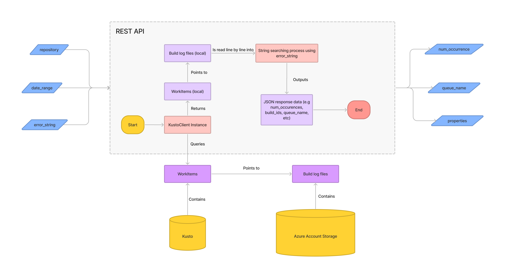

# ✔️ Introduction
## Requirements
We want to create a REST API that allows users to find the frequency of a specific error string in a repository's Helix test logs. So we want to be able to query an endpoint with a `repository`, `error_string`, `start_date`, and `end_date` to get a list of all the error occurrences of the string in the build logs matching those arguments.

# 🖥️ Implementation
## High-level diagram

## Logic
1. Take and sanitize user input
2. Execute Kusto query (filter by repository, date_ranges, fail status)
3. Iterate through Kusto's results to retrieve log files' path in Azure Storage
4. Read log file's content line by line using file stream
5. Use string searching/matching to find error string in the lines.
6. If match is found, keep track of it and increment occurrences found.
7. Return the results found as a JSON object. 

### Kusto query
    let RepoJobs = Jobs
    | where Repository == "REPO_NAME"
    | project JobId, Properties;
    WorkItems
    | where JobId in (RepoJobs)
    | project JobId, JobName, Status, Started, Finished, ConsoleUri, QueueName, Properties
    | where Status == "Fail"
    | where Started between (datetime(YYYY-MM-DD) .. datetime(YYYY-MM-DD))

## Input
- Arguments
    - `repository`
    - `error_string`
    - `start_date`
    - `end_date`

- Constraints
    - `repository` must be an existing, public repository. Its spelling must match the repo name exactly.
    - `error_string` should probably have some kind of limit on length.
    - The duration between `start_date` and `end_date` should have a maximum of ~~12~~ 3 months (?). If user input exceeds this value, one possible way of handling this is to just query jobs between our defined max number of months before the given `end_date` and alert the user that this was done instead of their original query.

## Dependencies
- Kusto
- Azure Account Storage

## String Matching
The three possible string matching methods ranked by speed/performance are:
1. C# `String.contains`, `String.replace`, etc
2. Boyer-Moore string searching algorithm
3. Regex

This ranking is based on the following articles:

[Boyer-Moore VS String.contains](http://www.blackbeltcoder.com/Articles/algorithms/fast-text-search-with-boyer-moore)

**TLDR;** Although Boyer-Moore is considered one of the fastest string-matching algorithms, C#'s `String.contains` method is faster as it uses assembly optimization. Although we might need a performance test since we will need to go line by line and load the strings from each log file if we use `String.contains` and that might take even longer.

[String.contains VS Regex.isMatch](https://theburningmonk.com/2012/05/performance-test-string-contains-vs-string-indexof-vs-regex-ismatch/#:~:text=As%20you%20can%20see%2C%20Regex.IsMatch%20is%20by%20far,turned%20out%20to%20be%20significantly%20faster%20than%20String.IndexOf.)

**TLDR;** Regex matching is way slower than String methods. It's only more useful if we want to pattern match as opposed to finding a fixed string. (Actually this raises the question - do we want to pattern match?)

Also, this article [Fastest Ways to Count Substring Occurences in C#](https://cc.davelozinski.com/c-sharp/c-net-fastest-way-count-substring-occurrences-string) compares the speeds of different methods of counting substring occurences.

**TLDR;** Using the basic counting code below was the fastest method for the following performance tests:
> Counting the number of times 1 string occurs in 5,000, 25,000, 100,000, and 1,000,000 million strings.
> 
> Counting the number of times 100 strings occur in 5,000, 25,000, 100,000, and 1,000,000 million strings.
> 
> Counting the number of times 1,000 strings occur in 5,000, 25,000, 100,000, and 1,000,000 million strings.

It also corroborates the article saying Regex matching is very slow for long strings.

    for (int y = 0; y &lt; sf.Length; y++)
    {
        c[y] += (ss[x].Length - ss[x].Replace(sf[y], String.Empty).Length) / sf[y].Length;
    }
    
   
## File Reading
Since we will potentially need to be reading text from thousands of files, it's worth taking a look at fastest ways to read file input. The following article benchmarks the time it takes for different ways of reading file input. 

[Fastest Ways to Read Text Files in C#](https://cc.davelozinski.com/c-sharp/fastest-way-to-read-text-files)

**TLDR;** There was no one fastest method found, but in general, reading line by line and storing each line into a string was fast, and should be sufficient for this program. We can also make it faster using parallel threads if needed (but probably not to avoid race conditions with counting). 

## Output
#### Possible JSON output:
        {
          "filter": {
            "repository": "...",
            "error_string": "",
            "start_date": "",
            "end_date": "",
            "num_hits": 00,
          },
          "hits": 
          [
            {
              "document_uri": "uri to document",
              "build_id": 1234567,
              "job_id": "helix guid"
              "workitem_id": "helix guid",
              "job_name": "",
              "started": "",
              "finished": "",
              "queue_name": "",
            },
            {
              "document_uri": "uri to document",
              "build_id": 1234567,
              "job_id": "helix guid"
              "workitem_id": "helix guid",
              "job_name": "",
              "started": "",
              "finished": "",
              "queue_name": "",
            },
            ...
          ]
        }
 
# 👓 Proof-of-Concept
- Console app
- Will test out string matching on a fixed number of log files first to see the speed of parsing a single log file.
- May also use POC to compare the performance of `String.contains` and Boyer-Moore.

# 📓 Additional Notes
This section is just temporary notes + to-dos for me (will delete it from final doc iteration)

### Possible additional features
- Include line number and character index that a string match was found
- Allow user to pass either/or these 2 options as arguments:
    - `repository`, `error_string`, `date_range`
    - `build_id` list

### Issues/questions to look into
- Are we still only searching for the input string in failed builds? What about the case where a build automatically retries, then works, and is automatically marked as passed?

### Action items
- [ ] Define metrics for POC test for the speed of parsing log files (be more formal in how you define how you’re gonna run those tests lol)
