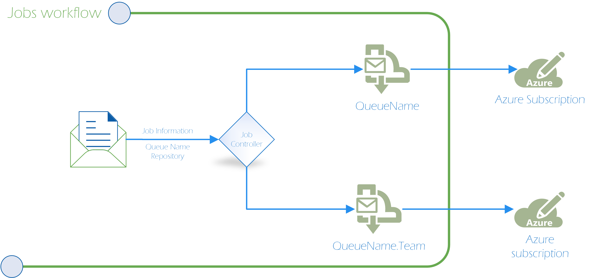

# Repositories working on their own azure subscription

In order to meet our SLA and to limit our azure spending, there are repositories that need to run on their own subscription<sup>1</sup>. 

There are some guidelines to decide when a repository needs to be transferred to their own subscription. This is going to be shared later. 

## How do I transfer a repository to its own subscription? 

To transfer a repository to their own subscription we will go through the following process:

1. Work with DDFun<sup>2</sup> to create a new Azure Subscription. You will need to provide the number of cores that you need, for which [region](https://docs.microsoft.com/en-us/azure/virtual-machines/regions) and which [VM type](https://docs.microsoft.com/en-us/azure/virtual-machines/sizes) you need. The process of creating the new subscription takes around 1-2 weeks.

2. Identify the Helix queues this repository needs. A repository usually only uses a subset of the available Helix queues, so it is important to identify the ones that will be duplicated.

3. Create the description of the subscription on subscriptions.yaml: 
	- Subscription - Name of the subscription.
	- TeamName - Name that is going to identify the queues for this subscription.
	- Repositories - The repository/repositories you want to migrate.

4. Add the list of queues to the corresponding yaml definition files. The name should be of the form `<QueueName>.<TeamName>`. The **QueueName** is the name of the queue you are duplicating and the **TeamName** is the one defined in the step above for that subscription. 

5.  The last step is to let the AutoScaler and the Core Rebalancer know about the new subscription. This should be done in [*AutoScaleQuotaConfigProd.json*](https://dev.azure.com/dnceng/internal/_git/dotnet-helix-machines?path=%2Fsrc%2FServiceFabric%2FProcessAutoScaleService%2FConfigs%2FAutoScaleQuotaConfigProd.json&version=GBmaster&_a=contents) where the subscriptionId and the quota for the subscription needs to be added. 
One important thing to keep in mind is that in most cases the cores added to the new subscription account for our overall core consumption in other words the cores for the new subscription needs to be subtracted from another subscription most likely HelixProd. 

## How this works 


1. The user sends the Job to the *Queue* and as part of the job information the user includes the *Repository*. 

2. The Helix JobController gets a list of all the queues under that repository and if the ```*Queue*``` exists as part of that list a new queue is assigned for that job, the new queue is going to be ```*Queue.TeamName*```. 

If there is not any match the queue doesn't change, which in most case means that this is going to be processed by HelixProd. This could happen for queues that the repository doesn't usage on a significant way, but if this start happening in queues in which the impact is notable for HelixProd, we should create a specific queue for the repository. 

Internally *Queue* and *Queue.TeamName* lives on different subscription so as soon as we send the job to another queue, we are sending that job to another subscription. 

It's important to keep in mind that we are maintaining all these new queues and these queues works on the same way that the rest. This means that as soon as a job has been redirected this jobs is going to wait for a machine on that queue (until the queue scales up), retry work items on that queue if the work item fails and if there is any problem we need to handle that problem on the *Queue.TeamName* queue.

# How many cores should I assign to the new subscription

Our service is authorized to consume a specific number of cores so even after splitting the queues to a new subscription we should stay under that authorized limit. For example, HelixProd can have 6500 cores authorized and we plan to have a new subscription (splitting it from HelixProd) we could end having HelixProd with 4500 and the new subscriptions with 2000, having in total the 6500 cores.

After identifying which are the queues you are going to duplicate you need to know the number of cores that are used by that repository, for that you can do the following steps, for every queue:

1. Get the `total number of cores` consumed by that queue during a timespan.
2. In the same timespan, identify what `percentage` of the jobs that are sent to that queue belongs to the repositories that you are creating a new subscription for. 
3. Compute the number of cores that the repository is consuming in that queue, based on the `percentage` and the `total number of cores` (`total number of cores` * `percentage`)

Once the total cores needed per queue is calculated, sum up the total cores for the queues in question to get an idea on how many cores is needed for that repository. **Suggestion:** Give 5% more to the total cores that you calculated. 


#
###### <sup>1</sup>Unit of Azure Billing and organization
###### <sup>2</sup> Reach out to @ilyas1974


<!-- Begin Generated Content: Doc Feedback -->
<sub>Was this helpful? [](https://helix.dot.net/f/p/5?p=Documentation%5CProject-Docs%5CRepositoriesInTheirOwnSubscription.md) [](https://helix.dot.net/f/n/5?p=Documentation%5CProject-Docs%5CRepositoriesInTheirOwnSubscription.md)</sub>
<!-- End Generated Content-->
