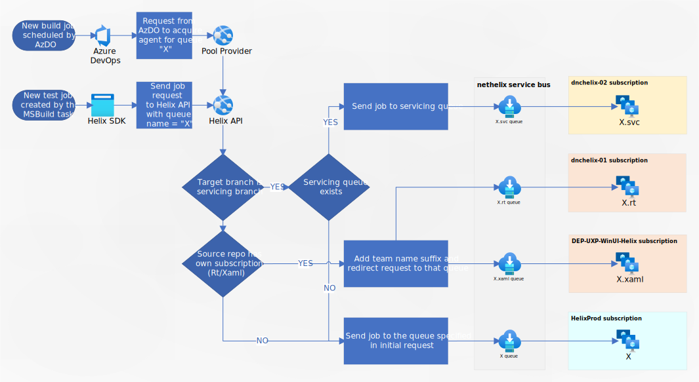

# Design doc for executing servicing Helix jobs in a COGS Azure subscription

Epic link: https://github.com/dotnet/core-eng/issues/11639

## Motivation

In order to reduce costs of running our `HelixProd` Azure subscription we want to redirect all servicing builds to `dncenghelix-02` subscription. The difference between those subscriptions is that `HelixProd` is assigned to R&D budget, `dncenghelix-02` on the other hand is assigned to COGS budget (Cost Of Goods Sold). The latter one should be used for all released software but currently we are using R&D budget for everything. Moving servicing builds to COGS-based subscription will allow us to optimize the usage of our current R&D bugdet.

More information about how we use different subscription types can be found at the following links:
- [Guidance for Production and Non Production](https://dev.azure.com/devdiv/Engineering/_wiki/wikis/CNEKB/7968/Guidance-for-Production-and-Non-Production)
- [Categories of R&D Subscriptions in DevDiv](https://dev.azure.com/devdiv/Engineering/_wiki/wikis/CNEKB/10037/Categories-of-R-D-Subscriptions-in-DevDiv)

All 2.1, 3.1 and 5.x builds and tests should be redirected. Any servicing branches that are created in the future will also have to be onboarded into this mechanism which must be taken into account in this epic.

Parts of the changes in this epic will leverage the work we already did to enable team/repository based redirection for `runtime` and `xaml` subscriptions. The documentation on this can be found here: [Documentation/Project-Docs/RepositoriesInTheirOwnSubscription.md](https://github.com/dotnet/arcade/blob/main/Documentation/Project-Docs/RepositoriesInTheirOwnSubscription.md).

Following diagram depicts high level view of the components that will be involved in the implementation and the general logic of redirecting jobs to queues located in separate subscriptions:

## Development work overview

The changes have to be done in four areas: Helix SDK, pool provider, OSOB and Helix API. They are mostly independent of each other so can be done in any order but it makes the most sense to do changes in OSOB before we update Helix API.

The needed changes are:

### arcade-pool-provider

Repository: https://github.com/dotnet/arcade-pool-provider

Pool Provider has to send additional information in Helix API SendJob request - in particular the name of branch that is being built or the target branch for the PR. Based on this data Helix API will be able to differentiate servicing builds from normal ones. Luckily when AzDO calls our pool provider to acquire agent it gives us `getAssociatedJobUrl` property as part of the request and we can call this endpoint to get more detailed information about the job. We also receive `authenticationToken` from AzDO so there's no need to add additional secrets or configuration on our side.

The process will look like this:
1. AzDO calls our pool provider to acquire new agent
2. We check if the base queue specified in request exists, if not we return error to AzDO. This check already exists so there are no changes needed here.
3. We add new HTTP request to `getAssociatedJobUrl` to get the data about the job
4. The response contains list of all build variables. We need to extract following ones:
    - `build.reason` to distinguish between PR and non-PR builds
    - for PR: at least `system.pullRequest.targetBranch` but it may be also useful to include `system.pullRequest.sourceBranch` and `system.pullRequest.sourceRepositoryUri` at the same time as they may be useful for debugging.
    - for non-PR: at least `build.sourceBranch` and optionally also `build.repository.name`.
5. We store the extracted variables as properties on job creation request sent to Helix API
6. If `getAssociatedJobUrl` fails we send job anyway without additional properties to not block it's execution. It will be then sent to standard subscription by Helix API.

When adding this functionality we have to pay attention to performance because:
1. We have hard limit of 30s to respond to each acquire agent call
2. AzDO sends acquire agent requests synchronously so any slowdown in processing of this call will affect other jobs irregardless if they are servicing or not

For this reason we will need to prepare monitoring for pool provider acquire agent calls in Grafana. If the slowdown will be significant then we need to change pool provider so that it returns response earlier and then calls `getAssociatedJobUrl` and Helix API asynchronously in the background.

### dotnet-helix-machines

Repository: https://dev.azure.com/dnceng/internal/_git/dotnet-helix-machines

We need to add new servicing queues in OSOB. We will duplicate the minimum set of queues that is currently needed for any servicing builds and instantiate the copies of them in `dncenghelix-02` subscription. New queues will inherit all settings from original queues in `HelixProd` subscription with the exception of new suffix `.svc`. For example there will exist queue called `windows.10.amd64.svc` and the related scaleset `windows.10.amd64.svc-a-scaleset` placed in `dncenghelix-02` subscription. This new queue and scaleset will have the same configuration as original `windows.10.amd64` queue and scaleset. This will be done in similar way as for `runtime` jobs redirection. An example can be found here: [definitions/shared/windows.yaml](https://dev.azure.com/dnceng/internal/_git/dotnet-helix-machines?path=%2Fdefinitions%2Fshared%2Fwindows.yaml&version=GC72af1ddb6e9ff7c7374512ccad6f78e93778066c&line=1754&lineEnd=1756&lineStartColumn=1&lineEndColumn=33&lineStyle=plain&_a=contents). As we can see in the example the servicing queue will inherit all future changes to the base queue. There will be technical possibility to modify servicing queue directly so that it diverges from the base queue that it was based on but to ease maintenance we will probably try to avoid this situation whenever possible. This will be the same approach we have chosen for `xaml` and `runtime` subscriptions (https://github.com/dotnet/core-eng/issues/10630#issuecomment-707224671).

By querying Kusto we can find around 57 queues (out of total 108 non-onprem queues) that were used by servicing branch in last 200 days. Copying only those queues that are actually used for servicing lowers the overall number of resources we have to manage but on the other hand it means that we will have to create new queues after any new servicing branches are created in the future. We will need to prepare the documentation on how to do it and put it into some post-release checklist if we have one. We will also have monitoring in place that will catch any cases in which we missed some queues.

### dotnet-helix-service

Repository: https://dev.azure.com/dnceng/internal/_git/dotnet-helix-service

We need to extend the logic in Helix API to check additional job properties specified in request - in particular the branch name. If the job is related to servicing branch (i.e. `release/X.X`) or PR targeted at servicing branch then the `.svc` suffix will be appended to the queue name specified in original request and job will be redirected to this new queue (e.g. from `windows.10.amd64` to `windows.10.amd64.svc`).

If the servicing queue does not exist for any reason then the job will be sent to standard queue to not block it's execution but we will log an error in AppInsights and have Grafana alert that will notify us about this situation.

The changes have to be made in `ValidateAndNormalizeRequest` controller method: [JobController.cs#L104](https://dev.azure.com/dnceng/internal/_git/dotnet-helix-service?path=%2Fsrc%2FServiceFabric%2FHelix%2FHelixAPI%2FApi%2Fv2019_06_17%2FControllers%2FJobController.cs&version=GBmaster&line=104&lineEnd=105&lineStartColumn=1&lineEndColumn=1&lineStyle=plain&_a=contents) 

This mechanism will be done in similar way as currently implemented team-based redirection (`runtime`/`xaml`) - the difference will be that we will check source branch instead of source repository when redirecting jobs. This servicing branch check will take priority over the team check.

### arcade (Helix SDK)

Repository: https://github.com/dotnet/arcade

Currently we miss the name of PR target branch for test jobs so wee need to extend the `SendHelixJob` task to include that property. We already copy some variables here: [SendHelixJob.cs#L219](https://github.com/dotnet/arcade/blob/d244d21e54bd1778ae68b3ecf676e3c95fffac2e/src/Microsoft.DotNet.Helix/Sdk/SendHelixJob.cs#L219) so it should just require to add `system.pullRequest.targetBranch` to that list. After that we will also need to update the version of Helix SDK package in existing servicing branches.

For 2.1 servicing branches it may be necessary to manually update the files in each branch because they don't use the same mechanisms as newer 3.1/5.0 Helix SDK-based builds. There are using groovy scripts and `upload-tests.proj` files (and maybe even other mechanisms) to schedule tests in Helix.

<!-- Begin Generated Content: Doc Feedback -->
Was this helpful?  
<!-- End Generated Content-->
