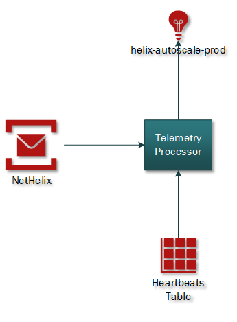
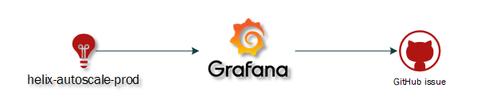
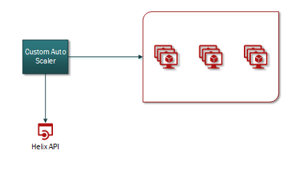
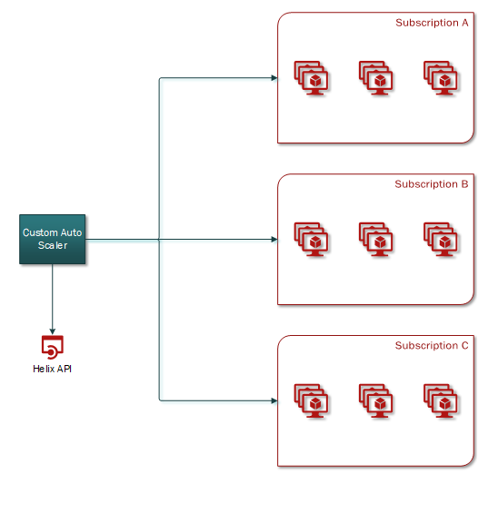

# Custom Auto-Scaler v2

The goal of this project is to build a reliable and cost-efficient scaling system to manage Azure Scale sets for Helix VMs.

## Telemetry processor

Telemetry processor collects the following data:
- From service bus, the number of workitems in the queue 
- From the heartbeats table, the number of machines that have had a heartbeat in the last minute
It is implemented as a service in service fabric, runs every 30 seconds and sends the collected data to AppInsights.

 
This replaces ProcessTelemetry Azure function in Custom Auto-Scaler v1

## Alerting

The system uses Grafana to create alerts when Helix queues aren’t scaling, it will create a GitHub issue when there has been work in a queue waiting for more than 30 minutes and no machines have showed up in the heartbeats table. Grafana doesn’t query the heartbeats table directly, instead it reads the data from AppInsights to tell how long the work items have been waiting for a machine. 

At first, the Auto Scaler team monitors these alerts but after the stabilization phase FR will investigate these alerts.

## Scale in

Custom Auto-Scale v2 scales to any capacity the service requires.
For scaling in, the service uses Helix API to take machines offline and then deletes the machine from the corresponding scale set. It will delete the oldest idle machine in the queue trying to keep the machines as fresh as possible, it uses the information in the heartbeats table to get the creation date of each machine.

## Telemetry

The service sends to AppInsights the following telemetry
- Time it took for a queue to scale to the desirable capacity
- State of the queue and the desired capacity for this state

Core-eng uses this data to make adjustment in the scaling rules

## Multiple subscriptions

Every team, that requires it, has its own queues for their work reducing the noise caused by using shared queries, giving information of how much money is being spent running their jobs and allowing to modify their scaling rules as needed.

<!-- Begin Generated Content: Doc Feedback -->
Was this helpful?  
<!-- End Generated Content-->
