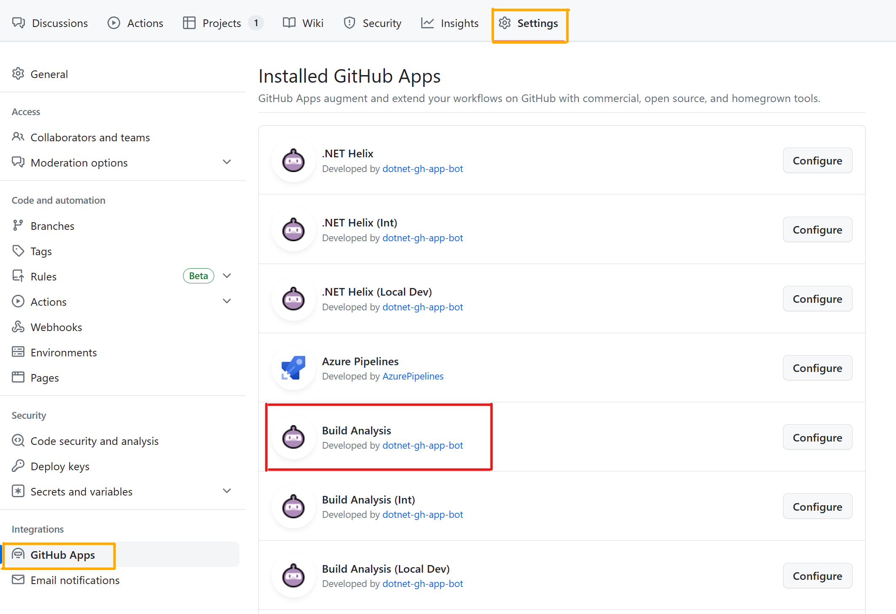
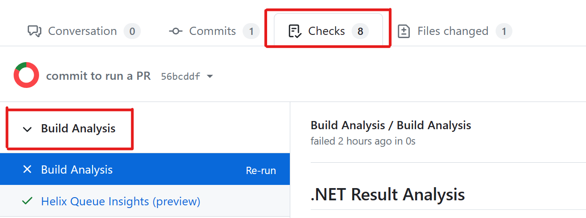

# Build Analysis

The Build Analysis Check makes GitHub Pull Request results more actionable. It is a service to improve the GitHub Pull Request experience by highlighting build and test information most helpful to .NET developers. 

## What does it do?

High-level features include:

- Highlight most important failure information
- Add context by combining information in Azure DevOps and Helix
- Reduce distance to most helpful analysis tools, such as Azure DevOps Test Result History for a particular test or the Helix artifact logs

For more details, see the [specifics](Specifics.md) document.

## How do I get it?

Build Analysis is enabled on a per-repository basis. Contact the [.NET Engineering Services Team](https://github.com/dotnet/arcade/wiki/How-to-get-a-hold-of-.NET-Engineering-Services) to request it be enabled in your repository.

**Note**: This feature requires your repository's pull request builds to occur in the `dnceng-public/public` Azure DevOps organization/project. Unfortunately, we cannot accommodate builds that occur in other Azure DevOps organizations (such as DevDiv). 

### How do I know if it's enabled in my repository? 

An easy way to see if Build Analysis is enabled in your repository is by viewing a pull request (particularly a recent one) and look for the `Build Analysis` check. 

Additionally, if you have sufficient permissions on your repository, you can browse to the Installed GitHub Apps settings and verify that the `.NET Helix` app is installed in your repository. (See the following screenshot)

## How do I use it?

Once enabled, a new GitHub check suite will be included in all pull requests. Navigate to the `Checks` tab, then look for the `.NET Helix` suite.

The data that is used in the Build Analysis check is provided by each pipeline (in the dnceng/public Azure DevOps project) that your pull request runs. From that data we are able to present you with errors that occurred during the build process, tests that failed, and even match the error messages with currently open [Known Issues](KnownIssues.md). 

As each pipeline completes, the Build Analysis Processor evaluates the results from the build (e.g. build failures, test failures) and updates the GitHub check run to reflect errors it detected in your build. 

Check out the [specifics](Specifics.md) page for a deeper dive into the features provided by Build Analysis. 

## Other Features

Related to the work done for Build Analysis, we also provide the following features: 
- [**Automatic Build Retries**](BuildRetryOnboard.md): Configure your repo's pull request builds to automatically retry when it encounters specific errors. 
- [**Automatic Test Retries**](Test%20Retry%20Documentation.md): Configure tests in your repo's pull requests to automatically retry when they encounter specific errors. *This feature requires tests to use Helix as it leverages Helix to retry specific tests.* 
- [**Test Reporting**](../../AzureDevOps/TestReportingQueries.md): We've collected your test results data into Kusto for ease of querying and put together a few queries to get started. 

## Frequently Asked Questions

### Is this useful even if my project does not use Helix?

Yes! The Build Analysis result leverages Azure DevOps history and information to provide context and workflow improvements. Though it may bring additional information for Helix-based execution, it is not required. 

### Why am I not seeing all the errors from my build/tests in Build Analysis? 

Technical limitations, such as message size and API throttling, constrain the information shown in the check. The service tries to always include the most pertinent information with links to more complete views.

However, we provide links from Build Analysis to logs and test results in Azure DevOps for deeper investigations. 

### What benefit does Build Analysis provide over going directly to Azure DevOps?

- One click to see errors that occurred on pipelines your pull request ran through. 
- A single place to look at a combination of build and test errors. 
- Notification that an error that occurred on your pull request is related to a [Known Issue](KnownIssues.md).
- One click to create a Known Issue related to an error on your pull request for either the product team or infrastructure team. 

<!-- Begin Generated Content: Doc Feedback -->
Was this helpful?  
<!-- End Generated Content-->
