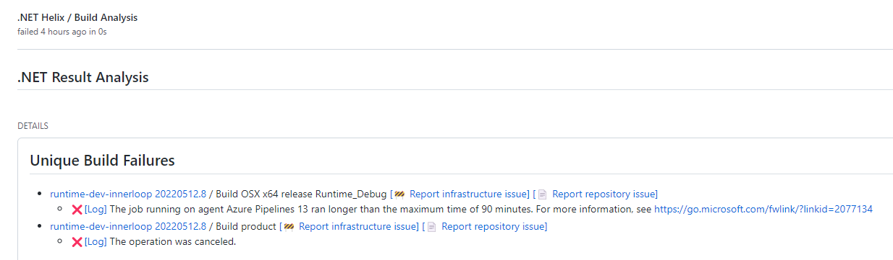
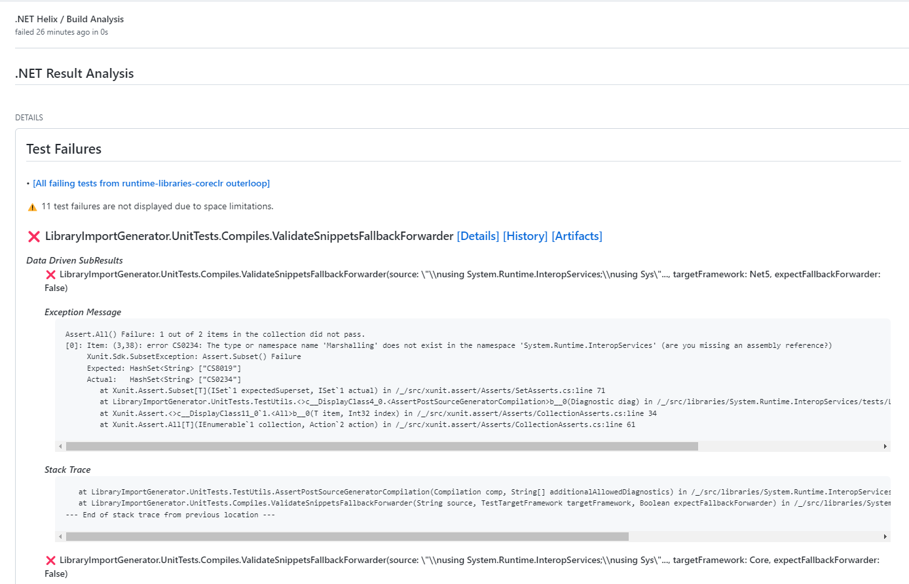
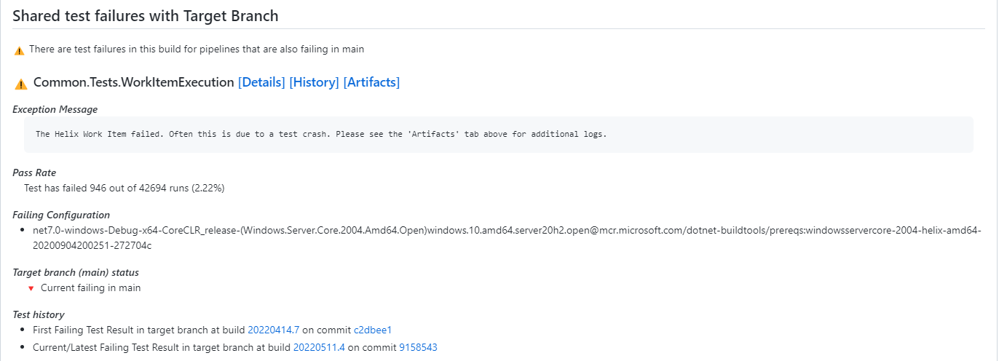

# Build Analysis Specifics

The Build Analysis check includes these details:

- Collapse failures of the same name across Jobs and Pipelines to improve discoverability. For example, failures of the same test across multiple operating systems are grouped together. 
- Highlight a failure's state in the target branch
- Provide direct links to the most common pages for continuing analysis
  - Link to the Azure DevOps build
  - Link to the log of the specific step that failed
  - Link to the Azure DevOps Test History for the pipeline
  - Link to test history of the specific test
  - Link to the Helix artifacts produced by a test
  - Link to the test execution details 
- Alerting on errors that are occurring on the pull request that are related to reported Known Issues. 
  - Links to create a new Known Issue for either a product issue or an infrastructure issue. 

Each Build Analysis page also includes a "was this helpful" link. This allows you to call out specific highlights or lowlights in your experience with the check. This feedback is then used by the Dev WF team to refine the analysis.

## Known Issues

Dive into the Known Issues documentation [here](KnownIssues.md).

## Unique Build Failures

When failures are detected in the result of the build, Build Analysis compares them to errors currently occurring in the target branch the PR is wanting to merge into (e.g. main). If the errors are not occurring on the target branch, Build Analysis will display these errors on the GitHub check. 

In addition to listing out errors that have occurred on the build, links to the Azure DevOps pipeline are also included if you want to investigate the error directly from Azure DevOps. 

## Test Failures

Build Analysis will display two types of test failures on the PR in which they occur: failures occurring only on the PR, and failures that are occurring on the target branch as well as the PR. 

Test failure data also includes the following: 
- Stack Traces and Exception Messages (if available)
- How often the test passes
- Which configuration it failed on
- Links to sections of the Azure DevOps Result Details:
    - *Details*: Debug panel
    - *History*: History panel
    - *Artifacts*: Artifacts panel
- Link to the whole Azure DevOps test results (useful if more tests have failed than we are able to display on the GitHub check)

<!-- Begin Generated Content: Doc Feedback -->
Was this helpful?  
<!-- End Generated Content-->
