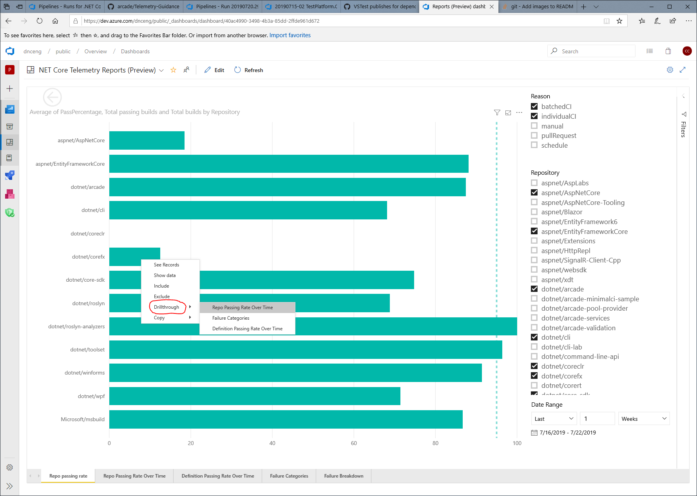

# NET Core Telemetry Reports

- [Overview](#overview)

- [Walkthrough](#walkthrough)

  - [Repo Passing Rate report](#repo-passing-rate)

  - [Failure categories report](#failure-categories)

- [Telemetry Message Filtering](#telemetry-message-filtering)

- [Images](#images)

## Overview

The [NET Core telemetry reports](https://dev.azure.com/dnceng/public/_dashboards/dashboard/40ac4990-3498-4b3a-85dd-2ffde961d672) are available via an Azure DevOps dashboard.  The reports are used to help analyze the health of our CI builds and failure categories via [telemetry categorization](https://github.com/dotnet/arcade/blob/master/Documentation/Projects/DevOps/CI/Telemetry-Guidance.md).

## Walkthrough

### Repo passing rate

Screenshot is shown in [image 1](#image-1) below.

The first page you end up on is the “Repo passing rate” page which shows you the current passing percentage for CI builds in a few select repos (we can adjust the default list of repos to monitor).

Hovering over a bar, allows you to see how many builds went into the repo pass rate calculation.

#### Repo passing rate drillthrough

Right-clicking on one of the bar items will allow you to select "Drillthrough" and then either "Repo Passing Rate Over Time" or "Definition Passing Rate Over Time" (see [image 1](#image-1))

Note: If the repo's passing rate is at 0%, then you can't click on the bar and you have to go directly to either the "Repo Passing Rate Over Time" or "Definition Passing Rate Over Time" pages and manually filter to the repository you are interested in.

**Next Step** Select a bar for a repo, right-click, go to "Drillthrough", and click "Definition Passing Rate Over Time".

### Definition Passing Rate Over Time

Screenshot is show in [image 2](#image-2) below.

This page shows you the build definitions for a particular repo and their pass/fail rate over an extended time period.  This view allows you to see how the build definition is trending in terms of build pass / fail.

**Next Step** The next thing to investigate is "what are the issues causing a build definition to fail".  You can investigate failure categories either by going back to the [repo passing rate](#repo-passing-rate) page and "drilling through" to "Failure Categories" or directly going to the [Failure Categories](failure-categories) page and filtering results as desired.

### Failure Categories

Screenshot is shown in [image 3](#image-3) below.

This page shows you the failure categories which have been seen in the build.

"Code" and "Unknown" are similar buckets.

- "Unknown" are groups of failures which have not been bucketed either via [telemetry categorization](https://github.com/dotnet/arcade/blob/master/Documentation/Projects/DevOps/CI/Telemetry-Guidance.md) or [telemetry message filtering](#telemetry-message-filtering).

- "Code" is the same as "Unknown" except it's the set of issues that "Azure DevOps" itself does limited bucketing (ie, one category) and decided was the code that Azure DevOps was running and not something that Azure DevOps was responsible for.

We could do some transformation of these categories and combine them, but for now they are separate.

**Next Step** Select a category bar, right-click, choose "Drillthrough" and then [Failure Breakdown](#failure-breakdown)

### Failure Breakdown

Screenshot is shown in [image 4](#image-4) below.

This page shows you the build failure messages for categories and also includes links to logs for further investigation.

## Telemetry Message Filtering

Screenshot is shown in [image 5](#image-5] below.)

The telemetry message filtering page shows you a list of error strings.  When an uncategorized error message is seen, it is automatically associated with the specified category if the "Message" is matched in the error string.

Note: We don't, currently, have a good way to permit developers to edit this list and help categorize error messages.  It's not even clear that this is the best way to handle external (to Arcade) errors, but it was the most expedient method.  If you have areas you want to categorize, please reach out to @chcosta.

## Images

### Image 1

### Image 2

### Image 3

### Image 4

### Image 5

