# Master to main renaming guide

This is a detailed guide on how to approach renaming of the `master` branch to `main`.
It is primarily intended for repositories in the dotnet organization.
The whole process should take approximately 1-2 hours, depending on the time your PR builds take.
In case of any problems, please reach out to **@dotnet/dnceng**.
You can also use the [**First Responder** channel](https://teams.microsoft.com/l/channel/19%3aafba3d1545dd45d7b79f34c1821f6055%40thread.skype/First%2520Responders?groupId=4d73664c-9f2f-450d-82a5-c2f02756606d&tenantId=72f988bf-86f1-41af-91ab-2d7cd011db47).

Please sit back and enjoy the moment of your career where you are actually asked to delete the master branch of your project.

# Before you start

Before you start the actual renaming, **please announce the change couple of days prior using a pinned issue in your repository**.

Make sure to link the [official announcement](https://github.com/dotnet/announcements/issues/172).
You can use this template:
```md
On <date> we're going to rename the default branch in this repository to main. For more details, see [our earlier announcement](https://github.com/dotnet/announcements/issues/172).
```

Make also sure you go through the [prerequisites](#prerequisites) so that you have confidence you'll actually be able to migrate the repository once you get to it.

# How long will this take?

The actions in the steps themselves are mostly matters of a minute or so.
However, some steps require changes to some repositories and the overall time spent on this depends on how long your PR builds and your CI take.
The amount of custom work needed for your repository because of internal references and dependencies on master can vary for each repository.
Our experience shows that **you should reserve 1 to 4 hours for this**.

The steps that require changes are:
- [Step 2](#2-add-main-triggers-to-yaml-pipelines) and [step 6](#6-search-your-repository-for-any-references-to-the-main-branch-specific-to-your-repo) inside of your GitHub repository,
- [Step 3](#3-update-the-build-mirroring-in-subscriptionsjson) requires a change to the [`dotnet/versions`](https://github.com/dotnet/versions) repo for which you will need an approval of someone from **@dotnet/dnceng**,
- [Step 11](#11-remove-the-master-branch-triggers-from-your-yaml-pipelines) is a clean-up step in your repo and can happen after.

We recommend:
- Prepare PRs for these steps beforehand
- Ideally, get the `dotnet/versions` repo pre-approved as you won't be able to do it yourself (most likely)

# Prerequisites

These prerequisites are required for a successful migration. If you're not sure about any of these, please reach out to **@dotnet/dnceng**.

Please verify that you:
- Ideally have skimmed through this guide beforehand to get an idea of what needs to happen
- **Have announced the change in your repo by pinning an issue**
  - Ideally say when it is going to happen
  - You can link the [official announcement](https://github.com/dotnet/announcements/issues/172)
  - [Example issue](https://github.com/dotnet/aspnetcore/issues/29475)
  - After you're done, you can either edit this or can create a new pinned issue saying the renaming has happened. This is up to you. Additionally, GitHub will also display a banner on the homepage of the repo once the change happens
- Know whether your repo is part of the [Maestro/darc dependency flow](https://github.com/dotnet/arcade/blob/master/Documentation/DependencyFlowOnboarding.md)
  - If so, have the [`darc`](https://github.com/dotnet/arcade/blob/master/Documentation/Darc.md) command installed, updated and authenticated
  - Make sure tokens set using `darc authenticate` are still valid ([details at Darc.md#authenticate](https://github.com/dotnet/arcade/blob/master/Documentation/Darc.md#authenticate))
  - If your repository's organization requires single sign-on (SSO), you need to enable it on the GitHub token which is used by DARC. Otherwise, you will get error 403 Forbidden during Maestro migration.
  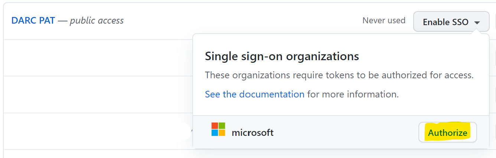
  - Have PowerShell installed so that you can run scripts provided by us (any version should be ok)
- Make sure that you have access to [M2MTool](https://devdiv.visualstudio.com/DefaultCollection/Engineering/_git/M2MTool?path=%2FREADME.md&_a=preview) and you can download the latest version. M2MTool was created by VSEng and shared with our division.
- Know whether your repository is mirrored to the [internal AzDO dnceng project](https://dev.azure.com/dnceng/internal/_git)
  - Make sure you have sufficient permissions to manage branches/branch policies for the internal AzDO mirror of your repository
    - You need to have the `Force push` permission in branch security settings for the `master` branch to be able to delete it:
        1. Navigate to the repo in AzDO
        2. Go to `Branches`
        3. Three dots by the `master` branch and `Branch security`
        4. Search for yourself in the identities search box
        5. Verify value in `Force push (rewrite history, delete branches and tags)` is `Allow` (can be through inheritance)
    - Make sure you see the `Set as default branch` dropdown menu item in branch management (verify with some random branch)
    - If you don't have access to update policies, you need to ask [.NET Core Engineering <dnceng@microsoft.com>](mailto://dnceng@microsoft.com). Beware, the steps described in [M2MTool documentation](https://devdiv.visualstudio.com/DefaultCollection/Engineering/_git/M2MTool?path=%2FREADME.md&_a=preview) are applicable for devdiv.
  - Make sure you have permissions to manage pipeline's settings in the AzDO portal (if unsure, see screenshots in `8. Change the default branch for AzDO pipelines`)
- Have permissions to manage branches and branch policies in GitHub for your repo (access to Settings > Branches)
- Are aware of any custom hard-coded references to the `master` branch inside of your repository
  - Non-Arcade related, only specific to your repository (disregard references in `/.git`, `/eng/common/` and `/azure-pipelines.yaml` for the moment)
  - These can be some custom build scripts, documentation, makefiles...
     > Please note that GitHub has a new feature that will try to redirect you to the default branch for certain 404s,
     > e.g. https://github.com/dotnet/efcore/blob/master/README.md will lead to the `README.md` on the default `release/5.0` branch

## Step labels

Some steps are only intended for some cases, they are labelled in the following way:
-  Step is intended only for repositories that are mirrored to the [internal AzDO dnceng project](https://dev.azure.com/dnceng/internal)*
-  Step is intended only for repositories that are part of our [dependency flow](https://github.com/dotnet/arcade/blob/master/Documentation/DependencyFlowOnboarding.md)**
- The guide should also work for non-GitHub AzDO-only repositories. In this case, just follow steps that apply to AzDO.

> \* You can tell that your repo is being mirrored by searching the git repositories in the [internal AzDO dnceng project](https://dev.azure.com/dnceng/internal/_git). In case your repository's name on GitHub is `dotnet/foo`, there should be a git repository named `dotnet-foo`. You should then also be able to find your repo in the [subscriptions.json](https://github.com/dotnet/versions/blob/master/Maestro/subscriptions.json#L627) file on which the mirroring is based.
>
> \*\* You can tell that your repo is part of our dependency flow when your repo contains the `/eng/Version.Details.xml` and `/eng/Versions.props` files. You are then also probably getting automatic updates (PRs) by the `dotnet-maestro` bot.

# Step-by-step guide

We suggest trying to not merge any PRs during the process described below. However, the instructions are ordered in a way that should prevent it and keep a consistent state even when it happens.

All of the steps are easily revert-able, so it is not a problem to go back to `master` in case you find some problems maybe only specific to your repository that would prevent you from migrating.

## Overview of steps
1. [Disable Maestro subscriptions](#1-disable-maestro-subscriptions)
2. [Add `main` triggers to YAML pipelines](#2-add-main-triggers-to-yaml-pipelines)
3. [Update the build mirroring in `subscriptions.json`](#3-update-the-build-mirroring-in-subscriptionsjson)
4. [Create the `main` branch in the internal mirrored AzDO repository](#4-create-the-main-branch-in-the-internal-mirrored-azdo-repository)
5. [Change the default branch to `main` for your GitHub repository](#5-change-the-default-branch-to-main-for-your-github-repository)
6. [Search your repository for any references to the `master` branch specific to your repo](#6-search-your-repository-for-any-references-to-the-master-branch-specific-to-your-repo)
7. [Use a `darc` script to migrate channels and subscriptions](#7-use-a-darc-script-to-migrate-channels-and-subscriptions)
8. [Change the default branch for AzDO builds for pipelines](#8-change-the-default-branch-for-azdo-pipelines)
9. [Switch the default branch of the AzDO repository to `main`](#9-switch-the-default-branch-of-the-azdo-repository-to-main)
10. [Delete the `master` branch of the AzDO repository](#10-delete-the-master-branch-of-the-azdo-repository)
11. [Remove the `master` branch triggers from your YAML pipelines](#11-remove-the-master-branch-triggers-from-your-yaml-pipelines)
12. [Configure **Component Governance** to track the `main` branch](#12-configure-component-governance-to-track-the-main-branch)
13. [Fix AzDO dashboards](#13-fix-any-azdo-dashboards-based-off-of-the-pipelines--repository)
14. [FAQ](#faq)

## 1. Disable Maestro subscriptions


Generate json data file describing Maestro migration, review it and disable all subscriptions targeting internal and GitHub repositories:

1. Download the script [m2m-dotnet.ps1](https://raw.githubusercontent.com/dotnet/arcade/master/scripts/m2m-dotnet.ps1).
2. Generate json file which describes DARC migration (safe operation which executes only DARC read operations):
```
./m2m-dotnet.ps1 -GenerateDataFile -Repository [short repository name (e.g. dotnet/wpf)]
```
3. Verify that the file `m2m-dotnet_[timestamp].json` was generated and check that subscriptions and default channels were properly filled.
4. Disable DARC subscriptions targeting your repository:
```
./m2m-dotnet.ps1 -DisableSubscriptions -DataFile m2m-dotnet_[timestamp].json
```

## 2. Add `main` triggers to YAML pipelines

**Please read**
Before you get on with this step, you should know, that once you change the default branch in your GitHub repository ([step 5](#5-change-the-default-branch-to-main-for-your-github-repository)), all open PRs targeting `master` will be retargeted and all PR builds will be triggered again.
This can cause a large strain on the engineering systems, so please consider the amount of opened pull requests in your repository.
Please consider - based on the heaviness of your PR build and the number of PRs - whether you want to disable the PR builds for the time being or not.

1. Find all YAML definitions of pipelines in your repository that are triggered by changes in the `master` branch
2. Either add the `main` branch or not based on your assumption. Do not remove `master` yet!
3. Merge this change to the `master` of your GitHub repo

**Example:**

*azure-pipelines.yml*
```yaml
# CI and PR triggers
trigger:
  batch: true
  branches:
    include:
    - master

pr:
  branches:
    include:
    - master
```

changes to

```yaml
# CI and PR triggers
trigger:
  batch: true
  branches:
    include:
    - master
    - main

pr:
  branches:
    include:
    - master
    - main
```

## 3. Update the build mirroring in `subscriptions.json`


1. Fork [`https://github.com/dotnet/versions`](https://github.com/dotnet/versions)
2. Edit file [`/Maestro/subscriptions.json`](https://github.com/dotnet/versions/blob/master/Maestro/subscriptions.json#L627)
3. Find the row for your repo targeting the `master` branch (e.g. [this one](https://github.com/dotnet/versions/blob/ec8ac418546cdafbb8d3fbf5079e923aead33bd6/Maestro/subscriptions.json#L787))
4. Change it to `main`
  Example
    > `"https://github.com/dotnet/xharness/blob/master/**/*",`

    changes to

    > `"https://github.com/dotnet/xharness/blob/main/**/*",`

5. Wait for code-mirroring of the trigger change from last step
6. Open a PR and get it merged (contact **@dnceng**).

This will effectively disable code mirroring.

## 4. Create the `main` branch in the internal mirrored AzDO repository


1. Go to the [internally mirrored repository](https://dev.azure.com/dnceng/internal/_git) - repository should have the same name, only replace `/` with `-`, e.g. `dotnet/xharness` becomes `dotnet-xharness`
2. Wait for the code-mirror build to propagate changes made in **step 2** to the internal mirrored repository (meaning: internal repo has main triggers)
    > Note: You can go to the [code-mirror build](https://dev.azure.com/dnceng/internal/_build?definitionId=16&_a=summary) and filter the pipeline runs by Tags (select your repo).
3. Go to `Branches`
4. Create a new branch called `main` off of the `master` branch
5. Mirror policies from branch `master` to branch `main` using [M2MTool](https://devdiv.visualstudio.com/DefaultCollection/Engineering/_git/M2MTool?path=%2FREADME.md&_a=preview)

Example for `dotnet/xharness`:
```
.\M2MTool.exe mirror-policies --frombranch=master --tobranch=main --url=https://dev.azure.com/dnceng/internal/_git/dotnet-xharness
```

> Note: Do **not** change the default branch for the AzDO repository yet, it will be done later in [step 9](#9-switch-the-default-branch-of-the-azdo-repository-to-main).


## 5. Change the default branch to `main` for your GitHub repository

> Notes:
> * The `main` branch will be created as part of this step automatically. It shouldn't exist yet at this stage.
> * When user opens GitHub repo it automatically shows steps how to update local repository.
> * Automation updates target branch in all PRs against master.
> * GitHub raw links are automatically redirected. For example link https://raw.githubusercontent.com/dotnet/xharness/master/README.md still works even after rename and is equivalent to link https://raw.githubusercontent.com/dotnet/xharness/main/README.md.

> **Warning:** The `master` branch will be deleted during this step!

> **Warning:** This step will retrigger all PR builds on all PRs opened against master. If there is a large number of PRs (50+), please consider removing the branch trigger and then continuing here.

1. Navigate to your repository: `https://github.com/dotnet/[REPO NAME]`
2. In case you don't see settings tab, you don't have sufficient permissions and won't be able to proceed (please check the [prerequisites](#prerequisites))
3. Navigate to `Settings > Branches`
4. Ensure that UI looks the same as on the picture bellow. If it doesn't look the same than the GitHub rename tool isn't enabled for you. You should stop here and contact us.
5. Under the first section `Default branch` you should see branch master
6. Click `Rename branch` button to change the default branch to `main`
7. If any, close all PRs opened by the **dotnet-maestro** bot since Maestro won't be able to update those anymore - they are for a different subscription. New PRs will automatically start flowing for the `main` branch once you update the darc subscriptions later in the guide.

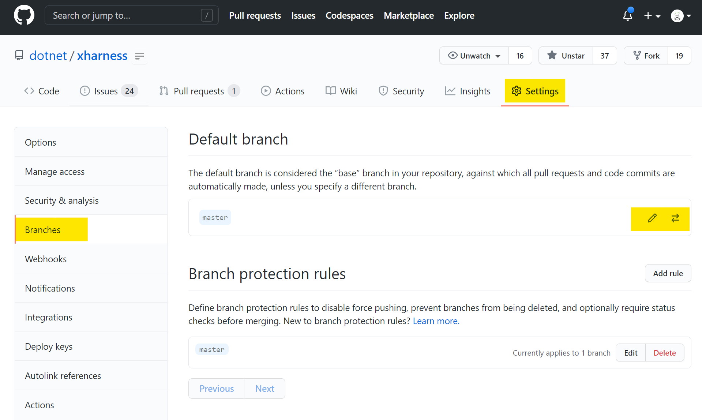

## 6. Search your repository for any references to the `master` branch specific to your repo

Search your repository for any references to the `master` branch specific to your repo, replace them to `main` and push them to `main`.

- Ignore the AzDO pipeline YAML for now (you have updated this before and the master trigger will be removed later on)
- These can be some custom build scripts, documentation, makefiles...
- We leave you here to your own device as this can vary between repos
- Do not rename anything inside of the `/eng/common` directory, `.git` directory
    ```
    grep -r master . | grep -v "^\./\(\.git\|eng/common\)"
    ```
- Consider also any code that is kept in sync using GitHub actions between repos, [such as this example](https://github.com/dotnet/aspnetcore/blob/main/.github/workflows/runtime-sync.yml).
- There also might be references **to your repo from other repos**. You don't have to worry about these much as GitHub will redirect all links automatically (see [FAQ / What happens to links to files in my repo](#what-happens-to-links-to-files-in-my-repo)). Ideally take care of those at the end of this guide
- There might also be `aka.ms/` links leading to your repo that will need changing

## 7. Use a `darc` script to migrate channels and subscriptions


> **Note:** This uses [darc](https://github.com/dotnet/arcade/blob/master/Documentation/Darc.md) and migrates default channels and subscriptions

1. You can optionally run DARC migration script in a dry run mode. This doesn't update anything, but displays DARC commands which would be executed.
```
./m2m-dotnet.ps1 -Migrate -DataFile m2m-dotnet_[timestamp].json -DryRun
```
2. Run DARC migration script (it is safe to execute it repeatedly):
```
./m2m-dotnet.ps1 -Migrate -DataFile m2m-dotnet_[timestamp].json
```
3. Validate migration (make sure that you don't see any errors):
```
./m2m-dotnet.ps1 -Verify -DataFile m2m-dotnet_[timestamp].json
```

## 8. Change the default branch for AzDO pipelines


### 1. Pipelines based on AzDO repository can be updated by M2MTool
First, you need to prepare a configuration file for [M2MTool](https://devdiv.visualstudio.com/DefaultCollection/Engineering/_git/M2MTool?path=%2FREADME.md&_a=preview). Example can be found [here](https://devdiv.visualstudio.com/DefaultCollection/Engineering/_git/M2MTool?path=%2FConfigFiles%2Fconfigfile.csv).

Example of M2MTool configuration file for `dotnet-xharness`:
```
Org,Project,Repo
dnceng,internal,dotnet-xharness
```
Once you have the configuration file, execute the M2MTool with command `pipeline` and supply the configuration file:
```
.\M2MTool.exe pipeline --config=configfile.csv
```

### 2. Pipelines based on GitHub repository have to be updated manually
- Do this for all pipelines that are based off a YAML in the GitHub repo that you are working with (these are usually in the public AzDO project)
- You can use [this script](https://raw.githubusercontent.com/dotnet/arcade/master/scripts/list-repo-pipelines.ps1) to list all pipelines associated with a given repo:
  > ```ps
  > .\list-repo-pipelines.ps1 -GitHubRepository "[GH REPO NAME]"
  > ```

- Example for `dotnet/xharness`:
  > ```ps
  > .\list-repo-pipelines.ps1 -GitHubRepository "dotnet/xharness"
  > ```

To update the pipeline:
1. Go to AzDO pipelines, find your pipeline
2. Click `Edit`
   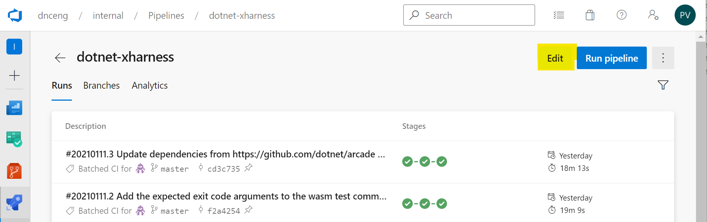
3. Click the `...` three dots and then `Triggers`
   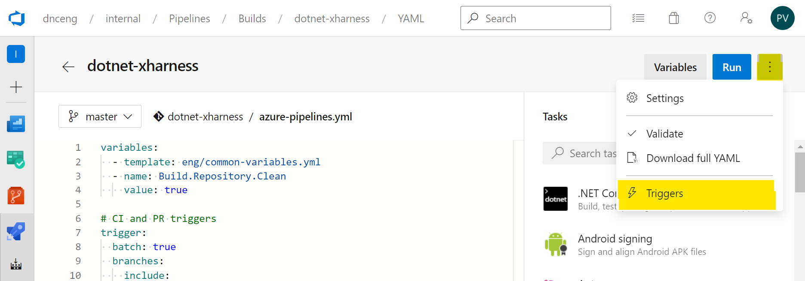
4. Click `YAML`, `Get sources` and change the `Default branch for manual and scheduled builds`
   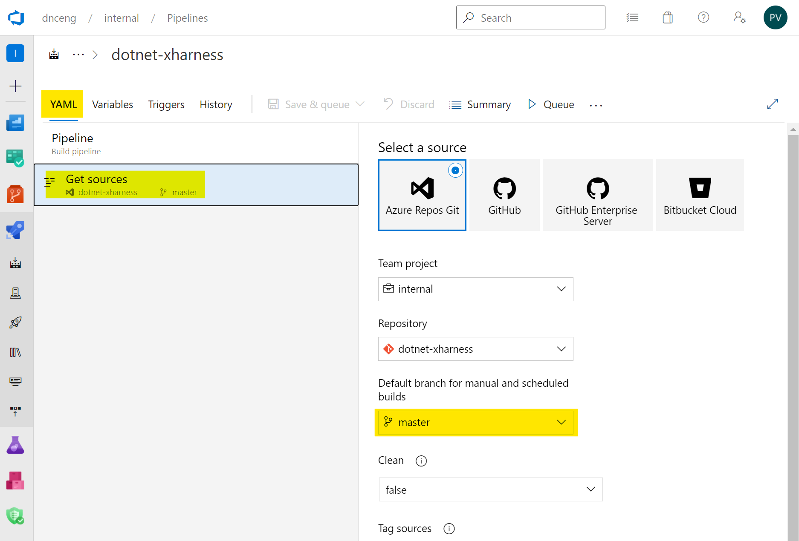
5. Save the changes
   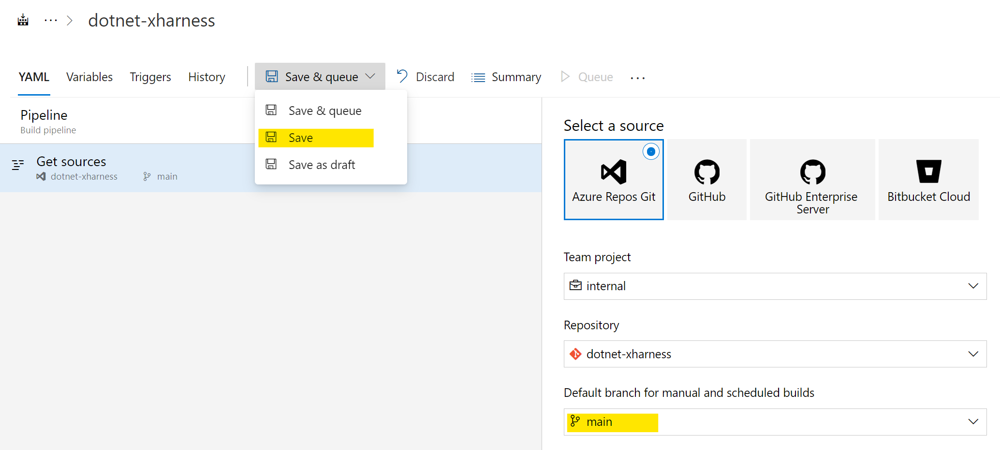

## 9. Switch the default branch of the AzDO repository to `main`


1. Go to the [internal AzDO dnceng](https://dev.azure.com/dnceng/internal/_git) mirror of your repository
2. Go to `Branches`
3. Click the three dots by the `main` branch
4. Click `Set as default branch`

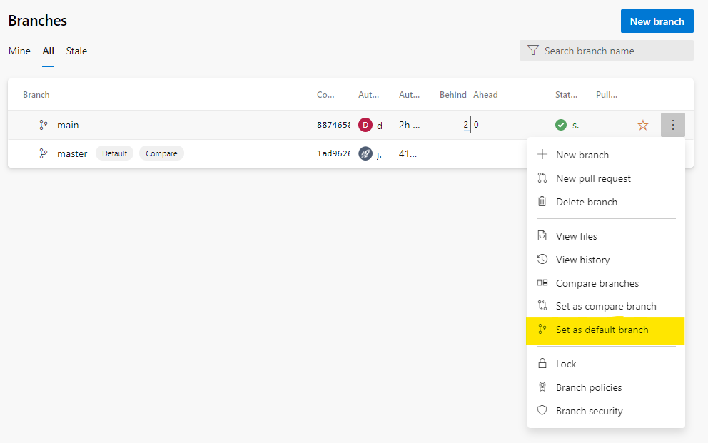


## 10. Delete the `master` branch of the AzDO repository


- For this you need to have the `Force push` permission in branch security settings

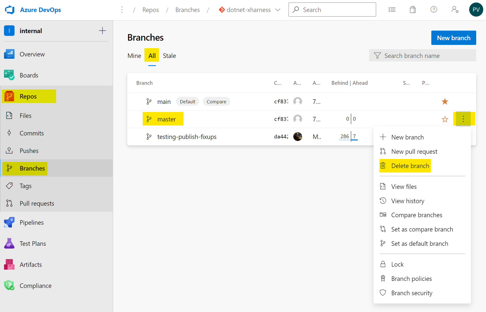


## 11. Remove the `master` branch triggers from your YAML pipelines

1. Go to the GitHub repo and remove the `master` branch triggers from your pipelines YAML (similar to [step 2.](#2-add-main-triggers-to-yaml-pipelines))
2. Merge this change to the `main` branch of the GitHub repo

**Example:**

*azure-pipelines.yml*
```yaml
# CI and PR triggers
trigger:
  batch: true
  branches:
    include:
    - master
    - main

pr:
  branches:
    include:
    - master
    - main
```

changes to

```yaml
# CI and PR triggers
trigger:
  batch: true
  branches:
    include:
    - main

pr:
  branches:
    include:
    - main
```

3. Verify that the PR build runs correctly
4. After merging, verify that the [code-mirror build](https://dev.azure.com/dnceng/internal/_build?definitionId=16&_a=summary) was triggered
5. After merging, verify that the internal pipeline was triggered in AzDO

## 12. Configure **Component Governance** to track the `main` branch

> **Note:** this step only applies to repositories that deploy to cloud and have a required Component Governance setup due to SDL.
> Your repository might not be and that's ok.

> Make sure that Component Governance task on the main branch has finished before starting this step!

Go to the internal AzDO mirror of your repository and configure **Component Governance** to track the right branch/pipeline.
- Copy the settings from the `master` branch and set up tracking for `main`
- Stop tracking the `master` branch

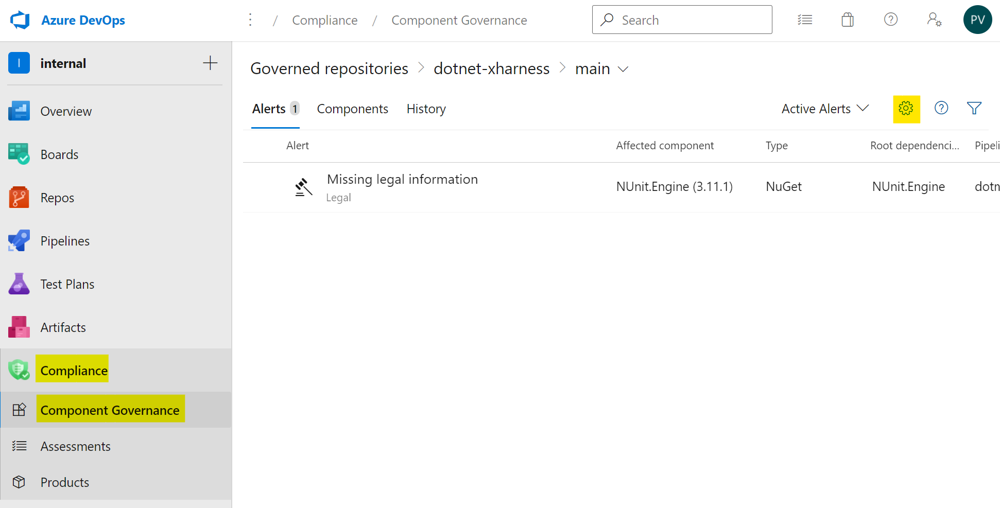
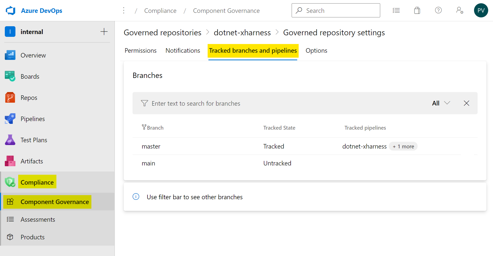

## 13. Fix any AzDO dashboards

Fix any AzDO dashboards based off of the pipelines / repository.
This can be done through the AzDO website in most cases.

**You are now done with the migration!**

# FAQ

## What happens to open PRs?
When branch is renamed in GitHub then open PRs against master are automatically re-targeted (forks as well).

## What if PRs get merged/opened during the process?
We suggest trying to not merge any PRs during the process described below. However, the instructions are ordered in a way that should prevent it and keep a consistent state even if it happens.

## Can I revert if something goes sideways?
All the steps are easily revert-able, so it is not a problem to go back to master in case you find some problems maybe only specific to your repository that would prevent you from migrating.

## How do I migrate Maestro subscriptions?
Scripts for Maestro migration are part of this renaming guide.

## How will repo users learn about this?
GitHub users are automatically notified through UI that the branch was renamed and it gives them steps how to update their local repository.

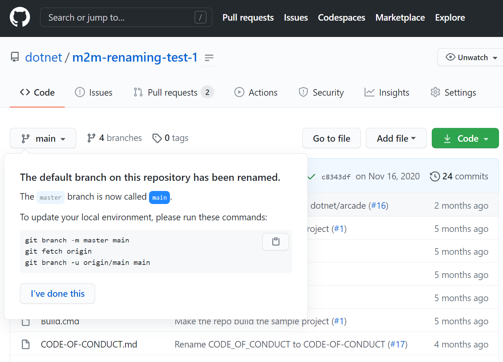

## What happens to links to files in my repo?
GitHub links are automatically redirected. For example https://github.com/dotnet/xharness/blob/master/README.md will still work after the rename and will point to https://github.com/dotnet/xharness/blob/main/README.md.

GitHub raw links are automatically redirected. For example link https://raw.githubusercontent.com/dotnet/xharness/master/README.md still works even after rename and is equivalent to link https://raw.githubusercontent.com/dotnet/xharness/main/README.md.

## How to revert Maestro migration?

1. Edit file `m2m-dotnet_[timestamp].json` and update following fields for public and internal repository:
```
"newBranch":  "master",
"oldBranch":  "main",
```
2. Run DARC migration script:
```
./m2m-dotnet.ps1 -Migrate -DataFile m2m-dotnet_[timestamp].json
```
3. Validate migration (make sure that you don't see any errors):
```
./m2m-dotnet.ps1 -Verify -DataFile m2m-dotnet_[timestamp].json
```
4. Reach out to us in case of any questions or issues with these scripts.


<!-- Begin Generated Content: Doc Feedback -->
<sub>Was this helpful? [](https://helix.dot.net/f/p/5?p=Documentation%5CProjects%5CM2MRenaming%5CMaster-to-Main-renaming-guide.md) [](https://helix.dot.net/f/n/5?p=Documentation%5CProjects%5CM2MRenaming%5CMaster-to-Main-renaming-guide.md)</sub>
<!-- End Generated Content-->
