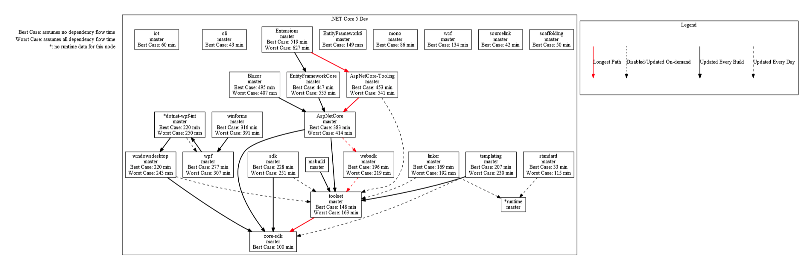
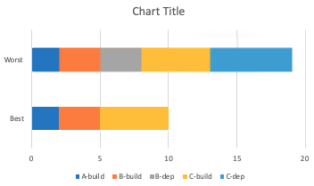
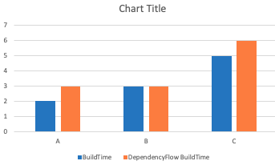
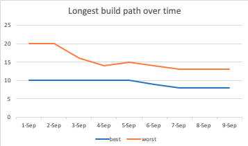

# PKPIs - Longest Build Path

This document will describe how we define longest build path and how we will demonstrate longest build path in context the PKPI work.

## Goal

The goal of the longest build path calculation is to answer the question: if a change is made in a repository, how long will it take that change to make it to the composed product?

## Definitions

* Source Repository: a repository that flows changes from itself to downstream repositories.
* Product Repository: a repository that does not flow changes to any other repositories (ie a shipping product).

## Metrics

We will use three metrics to measure longest build path time:

* Best-case: Best-case is defined by the absolute fastest path through the dependency graph, assuming no issues flowing dependencies through each node of the graph. We will use official build time of each of the nodes in the graph to calculate best-case scenario.
* Worst-case: Worst-case assumes all dependency updates fail and must go through the slowest method for dependency flow. This will be measured by adding official build time of each node with the time a PR takes for each node that is not the leaf node. When we have the new dependency flow, worst case will be defined by doubling the official build time of each node that requires dependency flow.

## Views

We are proposing to visualize the longest path per repository by adding the longest path time to each node on the dependency flow graph. For each node, we will display the best case time and worst case time. We will also mark any node that we don't have any runtime information for. We will also highlight the longest path through the graph in a different color.

## Potential Future Work

As potential future work, we leave creating charts that display this data over time and in bar graph form. We also leave adding a confidence factor.

### Additional Metrics

* Confidence factor: how likely the longest build path is to be closer to the best-case scenario vs the worst case scenario. This will be determined by our dependency flow metrics, specifically the metric that determines how likely dependencies flow automatically.

### Additional Views

We will have two views of the longest build path time: an average over a specific period of time, and a line graph that displays how our longest build path time is changing over time.

#### Longest Build Path time in a given time period

This graph will be a bar graph and display two measurements: the best case measurement in the time period and the worst case measurement in the time period.

#### Longest Build Path time over time

This graph will be a line graph and display the same measurements as the first, but over time. We will include a single option slicer to narrow our view to a single source repository.

