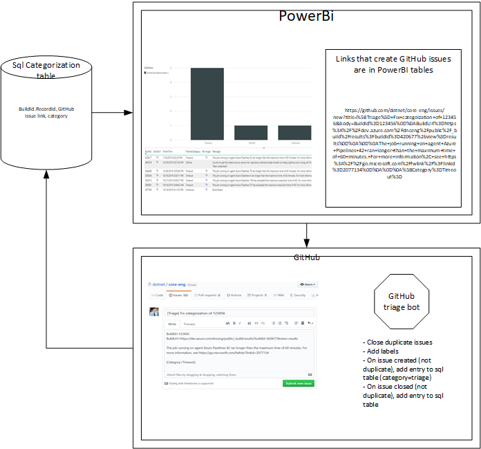

# Triage design for CI failures

## Problem

[Telemetry categorization](../DevOps/CI/Telemetry-Guidance.md) has allowed us to bucket Azure DevOps failures.  Improvements to telemetry categorization (mostly) only affect future builds.  There is no method to fix categorization for builds that have already completed or which were improperly categorized.

## Proposed solution

### Sql table

- Create a table that contains BuildId / RecordId, category, GitHub issue link

### PowerBI

- Link to Sql table, latest row in Sql table  for a given BuildId / RecordId supersede existing categorization

- Add column which contains links that will create GitHub issues if no GitHub issue is already present for a given BuildId / RecordId

  - Example: https://github.com/dotnet/core-eng/issues/new?title=%5BTriage%5D+Fix+categoization+of+123456&body=BuildId%3D123456%0D%0ABuildUrl%3Dhttps%3A%2F%2Fdev.azure.com%2Fdnceng%2Fpublic%2F_build%2Fresults%3FbuildId%3D420677%26view%3Dresults%0D%0A%0D%0AThe+job+running+on+agent+Azure+Pipelines+42+ran+longer+than+the+maximum+time+of+60+minutes.+For+more+information%2C+see+https%3A%2F%2Fgo.microsoft.com%2Ffwlink%2F%3Flinkid%3D2077134%0D%0A%0D%0A%5BCategory%3DTimeout%5D

- Add column which contains links for rows that already have a GitHub issue entry present in the Sql table

### GitHub bot

- for created issues (if it's a triage issue)

  - Determines if an issue already exists

    - if yes, then add a link and close

    - if no, then add an entry into the sql table with github link and category=Triage

- for closed issues (if it's a triage issue)

  - Find last comment with some metadata like "category=Build", add row to table with category and GitHub link

  - If no triage category is specified, then [TBD]
