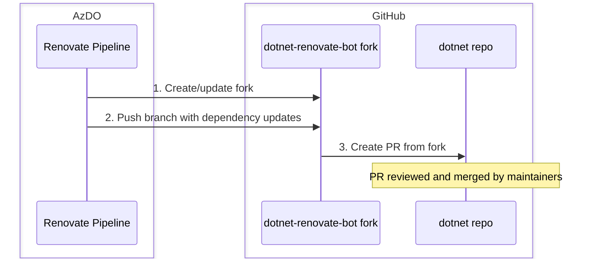

# Renovate Dependency Update Tool

## Table of Contents

- [Introduction](#introduction)
- [Design](#design)
- [Security](#security)
- [Setting Up Renovate](#setting-up-renovate-for-your-repository)
- [Renovate Configuration Patterns](#renovate-configuration-patterns)
- [Troubleshooting](#troubleshooting)

## Introduction

This document outlines the integration of [Renovate](https://github.com/renovatebot/renovate) into Arcade to automate dependency updates.
Renovate is an automated dependency update tool that generates PRs for updating dependencies from a wide variety of sources.

Renovate is similar to Dependabot in its purpose.
Dependabot should be used when possible.
However, Renovate supports a much broader range of [dependency types](https://docs.renovatebot.com/modules/datasource/), most notably Docker and GitHub releases.
For example, Renovate can automatically generate a PR to update a referenced Docker image when a newer version is available.

### Example Scenarios

Here are some scenarios demonstrating the usefulness of Renovate automatically making dependency updates:

#### Container Tags

Repos that reference container tags from the [dotnet/dotnet-buildtools-prereqs-docker](https://github.com/dotnet/dotnet-buildtools-prereqs-docker) repo need to maintain those tags to ensure they are supported.

This can be as simple as automatically updating to a new major version of Linux distro:

```diff
-mcr.microsoft.com/dotnet-buildtools/prereqs:debian-11-helix-amd64
+mcr.microsoft.com/dotnet-buildtools/prereqs:debian-12-helix-amd64
```

Or automatically pinning to the latest version of a tag by its digest value:

```diff
-mcr.microsoft.com/dotnet-buildtools/prereqs:debian-12-helix-amd64@sha256:b99da50c4cb425e72ee69c2b8c1fdf99e0f71059aee19798e2f9310141ea48fb
+mcr.microsoft.com/dotnet-buildtools/prereqs:debian-12-helix-amd64@sha256:6bb6fef390e6f09a018f385e346b0fe5999d7662acd84ca2655e9a3c3e622b71
```

Renovate can detect when these new container images are available and submit PRs to update sources accordingly.

Related issue: [Automatically update image references in consuming repos (#1321)](https://github.com/dotnet/dotnet-buildtools-prereqs-docker/issues/1321)

#### GitHub Release

There are many cases where a version of OSS published via GitHub releases is being referenced by a .NET repository.
Those versions can be kept updated automatically as new releases occur.

For example, there are Dockerfiles in the [dotnet/dotnet-buildtools-prereqs-docker](https://github.com/dotnet/dotnet-buildtools-prereqs-docker) repo which reference the LLVM version that can be maintained by having Renovate automatically check for new [LLVM releases](https://github.com/llvm/llvm-project/releases).

```diff
-LLVM_VERSION=19.1.7
+LLVM_VERSION=20.1.0
```

#### Others

- GitHub Actions: Workflow files that reference GitHub Actions can be kept up to date as new action versions are released.
- Custom Version References: Any file containing version strings can be tracked, allowing Renovate to update versions in scripts, config files, or other custom formats.

## Design

### Fork Mode

Protecting GitHub repositories in the dotnet organization from direct access by the Renovate tool is crucial.
Renovate will be used in fork mode, limiting its permissions to forked repositories.
This avoids giving write permissions to Renovate on any dotnet repository.
This means that Renovate acts as though it's any other outside contributor, not requiring any special permissions in the dotnet organization or repositories.

A GitHub bot account, `dotnet-renovate-bot`, is used to manage the Renovate operations.
This account has the ability to create forks from dotnet repositories, which will be the source of the head branch for PRs that are created.
The PRs generated by Renovate will be done using this bot account.
Renovate also handles synchronization from the upstream branch automatically.
GitHub scopes required by this account: `repo`, `workflow`.



### Repo Usage

Arcade provides an [Azure DevOps pipeline YAML job template](../eng/common/core-templates/job/renovate.yml) that repositories should utilize when making use of Renovate.
This template handles the execution of Renovate, ensuring a standardized approach across all repositories.
Repositories wishing to make use of Renovate can define a pipeline by following the [onboarding instructions](#setting-up-renovate-for-your-repository).
Consuming repositories are responsible for providing their own [Renovate configuration file](https://docs.renovatebot.com/configuration-options/) that describes which dependencies should be updated.

## Security

### Bot Account Permissions

The `dotnet-renovate-bot` account has minimal permissions by design:

| Permission | Scope | Purpose |
|------------|-------|---------|
| `repo` | Bot's own forks only | Create branches and commits in forked repos |
| `workflow` | Bot's own forks only | Update workflow files if needed |

**The bot has NO write access to any dotnet organization repositories.** All changes come through PRs from the fork.

### What Renovate Can and Cannot Do

**✅ Can Do:**
- Create PRs from its fork
- Update dependency versions
- Run on a schedule you control

**❌ Cannot Do:**
- Push directly to your repo
- Access secrets or credentials
- Merge its own PRs
- Access private repos

### PR Review Best Practices

Since Renovate PRs come from an external fork, treat them like any external contribution:

1. **Review the diff carefully** - Verify the version change is expected
2. **Check CI results** - Ensure all tests pass before merging
3. **Verify the upstream source** - Confirm the new version exists in the expected registry/repository

## Setting Up Renovate for Your Repository

This section provides step-by-step instructions for repo owners who want to enable automated dependency updates using Renovate.

### Prerequisites

Before setting up Renovate, verify the following requirements:

- Your repository has Arcade's `eng/common` folder synchronized (via darc)

### Create the Renovate Configuration File

Create a Renovate configuration file at `eng/renovate.json` in your repository. This file defines which dependencies Renovate should monitor and update.

Start with this base configuration:

```json
{
  "$schema": "https://docs.renovatebot.com/renovate-schema.json",
  "enabledManagers": [
    "custom.regex"
  ]
}
```

This configuration enables only the [custom regex manager](https://docs.renovatebot.com/modules/manager/regex/), disabling all built-in [managers](https://docs.renovatebot.com/modules/manager/) (e.g., dockerfile, nuget, github-actions) to prevent unwanted PRs. Without making any other changes to this configuration, it will result in no dependency updates. Add [presets](https://docs.renovatebot.com/config-presets/) to enable specific dependency types (see [Renovate Configuration Patterns](#renovate-configuration-patterns)). 

For more configuration options, see the [Renovate configuration documentation](https://docs.renovatebot.com/configuration-options/).

### Create the Pipeline YAML

Create a new pipeline YAML file in your repository (e.g., `eng/pipelines/renovate.yml`) that references the [Arcade Renovate job template](../eng/common/core-templates/job/renovate.yml).

```yaml
# Renovate Dependency Update Pipeline
# This pipeline runs Renovate to automatically create PRs for dependency updates.

trigger: none  # Manual trigger only; use schedules for automation

schedules:
- cron: '0 8 * * 1'  # Runs every Monday at 8:00 AM UTC
  displayName: Weekly Renovate Run
  branches:
    include:
    - main
  always: true  # Run even if there are no code changes

parameters:
- name: dryRun
  displayName: Dry Run (preview without creating PRs)
  type: boolean
  default: false
- name: forceRecreatePR
  displayName: Force Recreate PR (recreate even if closed)
  type: boolean
  default: false

resources:
  repositories:
  - repository: 1ESPipelineTemplates
    type: git
    name: 1ESPipelineTemplates/1ESPipelineTemplates
    ref: refs/tags/release

variables:
- name: gitHubRepo
  # TODO: Replace with your GitHub repo
  value: 'dotnet/your-repo-name'

extends:
  template: v1/1ES.Official.PipelineTemplate.yml@1ESPipelineTemplates
  parameters:
    pool:
      name: NetCore1ESPool-Internal
      image: Azure-Linux-3-Amd64
      os: linux
    stages:
    - stage: Renovate
      displayName: Run Renovate
      jobs:
      - template: /eng/common/core-templates/job/renovate.yml@self
        parameters:
          dryRun: ${{ parameters.dryRun }}
          forceRecreatePR: ${{ parameters.forceRecreatePR }}
          gitHubRepo: ${{ variables.gitHubRepo }}
```

### Test with Dry Run

Before enabling automatic PR creation, test your configuration using [dry run mode](https://docs.renovatebot.com/self-hosted-configuration/#dryrun).
Any existing dependencies that Renovate detects that should be updated will appear in the `Run Renovate`
step's log as `INFO: DRY-RUN: Would create PR...`.
Examine the log to determine whether it meets your expectation.
See [Troubleshooting](#troubleshooting) for more information on investigating the Renovate log.

## Renovate Configuration Patterns

This section provides common configuration patterns for typical dependency update scenarios.

### Dockerfile Version Variables

Use the [`customManagers:dockerfileVersions`](https://docs.renovatebot.com/presets-customManagers/#custommanagersdockerfileversions) preset to automatically detect and update version variables used within Dockerfiles.
This preset matches common patterns like `ARG VERSION=x.y.z` or `ENV VERSION=x.y.z` and can update them from various [datasources](https://docs.renovatebot.com/modules/datasource/) like GitHub releases.

```json
{
  "$schema": "https://docs.renovatebot.com/renovate-schema.json",
  "extends": [
    "customManagers:dockerfileVersions"
  ]
}
```

This preset automatically matches variables in Dockerfiles that follow the pattern:

```dockerfile
# renovate: datasource=github-releases depName=owner/repo
ARG SOME_VERSION=1.2.3
```

The comment annotation tells Renovate where to look for updates. For example, to track LLVM releases:

```dockerfile
# renovate: datasource=github-releases depName=llvm/llvm-project
ARG LLVM_VERSION=19.1.7
```

Renovate will automatically create PRs when new versions are released on GitHub.

#### Supported Annotations

The [`dockerfileVersions` preset](https://docs.renovatebot.com/presets-customManagers/#custommanagersdockerfileversions) recognizes these annotations in the comment as defined by the `matchStrings` field of the preset:

| Annotation | Description | Example |
|------------|-------------|---------|
| `datasource` | Where to look for updates | `github-releases`, `docker`, `npm` |
| `depName` | The dependency name/path | `llvm/llvm-project`, `node` |
| `versioning` | Version scheme to use | `semver`, `loose`, `regex:...` |
| `extractVersion` | Regex to extract version from release tag | `^llvmorg-(?<version>.+)$` |

#### Example: LLVM with Custom Version Extraction

LLVM uses release tags like `llvmorg-19.1.7`, so you need to extract the version:

```dockerfile
# renovate: datasource=github-releases depName=llvm/llvm-project extractVersion=^llvmorg-(?<version>.+)$
ARG LLVM_VERSION=19.1.7
```

#### Example: CMake from GitHub Releases

```dockerfile
# renovate: datasource=github-releases depName=Kitware/CMake
ARG CMAKE_VERSION=3.28.1
```

For more information, see the [Renovate dockerfileVersions preset documentation](https://docs.renovatebot.com/presets-customManagers/#custommanagersdockerfileversions).

### Common packageRules Examples

The [`packageRules`](https://docs.renovatebot.com/configuration-options/#packagerules) configuration allows fine-grained control over how Renovate handles specific dependencies.

#### Group Related Updates Together

Combine related dependency updates into a single PR:

```json
{
  "packageRules": [
    {
      "groupName": "LLVM toolchain",
      "matchDepNames": ["llvm/llvm-project", "llvm/clang"]
    }
  ]
}
```

#### Pin to Major Version

Prevent major version updates for stability:

```json
{
  "packageRules": [
    {
      "matchDepNames": ["node"],
      "allowedVersions": ">=18.0.0 <19.0.0"
    }
  ]
}
```

#### Exclude Specific Dependencies

Skip updates for dependencies you want to manage manually:

```json
{
  "packageRules": [
    {
      "matchDepNames": ["some-internal-tool"],
      "enabled": false
    }
  ]
}
```

### Multiple Schedules or Configurations

If you need different update schedules for different dependencies:

1. Create separate Renovate config files (e.g., `eng/renovate-docker.json`, `eng/renovate-tests.json`)
2. Create separate pipeline YAML files, each referencing a different config via `renovateConfigPath`

    ```yaml
    - template: /eng/common/core-templates/job/renovate.yml@self
      parameters:
        dryRun: ${{ parameters.dryRun }}
        forceRecreatePR: ${{ parameters.forceRecreatePR }}
        gitHubRepo: ${{ variables.gitHubRepo }}
        renovateConfigPath: 'eng/renovate-docker.json'
    ```

3. Configure different schedules for each pipeline

## Troubleshooting

This section helps diagnose issues when Renovate isn't behaving as expected.

### Finding the Log File

The Renovate pipeline publishes detailed debug logs as pipeline artifacts after each run. To access them:

Find the two log files in the pipeline artifacts:
- **`renovate-log.json`** - The main Renovate execution log with debug-level details
- **`renovate-config-validator.json`** - Log from the Renovate configuration file validation step

The log files are in JSON Lines format (one JSON object per line), which can be viewed in any text editor or processed with tools like `jq`.

### Understanding the Log File

The `renovate-log.json` file contains detailed information about what Renovate did during execution. Each line is a JSON object with a `msg` field describing the action and additional context fields.

#### Finding Which Files Are Being Scanned

To see which files Renovate is checking for dependencies, search for entries related to file discovery and package extraction.

Using `jq` to filter file matching information:

```bash
# Find all files being matched by managers
cat renovate-log.json | jq -s 'map(select(.packageFile)) | .[] | {packageFile,msg}'
```

#### Finding Dependencies That Need Updating

To identify which dependencies Renovate found that need updates, search for:

```bash
# Find all dependency updates detected
cat renovate-log.json | jq -s 'map(select(.msg == "packageFiles with updates")) | .[0].config'

# Find PRs that would be created (dry run mode)
cat renovate-log.json | jq -s 'map(select(.msg | contains("DRY-RUN"))) | .[].msg'

# Find PRs that were actually created
cat renovate-log.json | jq -s 'map(select(.msg == "PR created")) | .[] | {pr, prTitle}'
```

### Common Issues

#### No Files Being Matched

If Renovate isn't finding your dependency files:

1. Check your [`managerFilePatterns`](https://docs.renovatebot.com/configuration-options/#managerfilepatterns) patterns in your Renovate configuration file (e.g. `eng/renovate.json`)
2. Verify the file paths are relative to the repository root
3. Use dry run mode and check the logs for `"packageFile"` entries
4. Ensure regex patterns use proper escaping (double-escape in JSON: `\\.` for a literal dot)

#### Dependencies Found But No PRs Created

If Renovate finds dependencies but doesn't create PRs:

1. Check if PRs already exist for those updates
2. Look for `"msg": "Skipping"` entries in the log explaining why
3. Verify the update isn't being filtered by your configuration (e.g., [`ignoreDeps`](https://docs.renovatebot.com/configuration-options/#ignoredeps), [`packageRules`](https://docs.renovatebot.com/configuration-options/#packagerules))
4. Check if the dependency version is already at the latest

#### Regex Manager Not Matching

For custom regex patterns:

1. Test your regex at [regex101.com](https://regex101.com/) (use ECMAScript/JavaScript flavor)
2. Ensure named capture groups are correct: `(?<depName>...)`, `(?<currentValue>...)`, etc.
3. Check the log for `"manager": "regex"` entries to see what's being matched
4. Verify `matchStrings` patterns don't have JSON escaping issues
