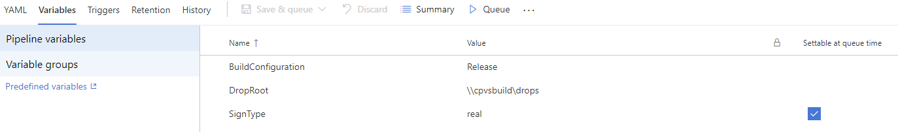
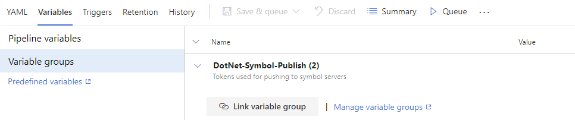
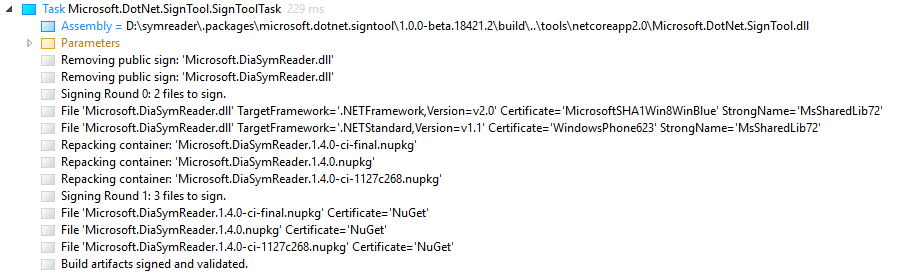

To migrate your repo to the latest Arcade SDK it’s recommended to first switch to the latest RepoToolset and then switch to Arcade SDK.
If your repository contributes to .NET Core 3.0 stack build I’d also recommend first migrate to Arcade and then work on plugging the repo into the rest of .NET Core build infrastructure (Meastro, Helix, BAR, etc.)

To get an idea what changes are needed to migrate to the latest Arcade SDK check out the following PRs and repos:
-	http://github.com/dotnet/roslyn-analyzers: [move to RepoToolset 63103-01](https://github.com/dotnet/roslyn-analyzers/commit/b63e7bd97f9e9f73140a1858761f5373bf879259), move to [Arcade](https://github.com/dotnet/roslyn-analyzers/commit/fb5890b88ff98cc346a060a18d86e7f0d0a1b270)
-	http://github.com/dotnet/roslyn-tools: [move to Arcade](https://github.com/dotnet/roslyn-tools/commit/e6bf1434af7dfa89f3574a1342dab47f875e7b43)
-	http://github.com/dotnet/interactive-window  
-	http://github.com/symreader 

Below is a list of changes required to migrate to Arcade.

## RepoToolset 1.0.0-beta2-63103-01

### Shipping vs NonShipping packages

  1. Set `IsShipping` property according to the Arcade SDK [guidelines](https://github.com/dotnet/arcade/blob/master/Documentation/ArcadeSdk.md#isshipping-bool)
  2. Update package directory used by `NuGetPublisher@0` task in `.vsts-ci.yml`
     - Add `*Shipping` subdir, which will match `Shipping` and `NonShipping` like so:
       searchPattern: `artifacts\$(BuildConfiguration)\packages\*Shipping\*.nupkg`
  3. Remove PublishOutputToSymStore property from projects if your projects used it before.
     - By default Windows PDBs for all shipping projects are published to symbol server.
     - PublishWindowsPdb property can be used to suppress publishing Windows PDB for the project.
  4. Review usages of $(PackageOutputPath)
     Replace with `$(ArtifactsShippingPackagesDir)` or `$(ArtifactsNonShippingPackagesDir)`.

### Building NuGet packages with hand-written nuspec
 - `_InitializeStandardNuspecProperties` target has been renamed to `InitializeStandardNuspecProperties`
 - This target flows [a standard set of msbuild properties](https://github.com/dotnet/arcade/blob/master/src/Microsoft.DotNet.Arcade.Sdk/tools/Workarounds.targets#L81-L97) to nuspec.
 - Add non-standard custom properties to `NuspecProperty` item group, if needed
 - PackageProjectUrl is now set automatically from `RepositoryUrl`, which is retrieved automatically from git remote origin by SourceLink.

### New `-publish` build parameter
A new option `-publish` was added to `build.ps1` script that needs to be set for CI builds. If the repo uses a custom `CIBuild.cmd` pass `-publish` when invoking `build.ps1`. See [CIBuild.cmd](https://github.com/dotnet/symreader/blob/master/eng/common/CIBuild.cmd#L2).

## Arcade.SDK 

### Global.json
```
{
  "tools": {
    "dotnet": "2.1.401",
    "vswhere": "2.2.7"    // Only present for repositories that require desktop msbuild to build their projects (shipped with VS)
  },
  "msbuild-sdks": {
    "Microsoft.DotNet.Arcade.Sdk": "1.0.0-beta.18476.3" // Pick the latest
  }
}
```

### eng directory
- If you had build scripts (build.ps1, Version.props, etc.) in build directory, rename the directory to eng.

### CI build 

The following applies to CI build definition, not PR validation build definitions.

- YAML definition (`.vsts-ci.yml`)
  - repository participates in .NET Core build: https://github.com/dotnet/arcade/.vsts-ci.yml 
  - otherwise example to follow: https://github.com/dotnet/roslyn-analyzers/.vsts-ci.yml 
- pipeline variables (settable in build definition web UI)
  - Add SignType definition variable settable at queue time
    
  - Link DotNet-Symbol-Server-Pats variable group. If you don’t see the group in the UI you might not have permissions. Let me know and I'll add it to your definition.
    

### Versioning changes
- Arcade has a new versioning scheme for packages
  - SHA is included in the package version
  - The version number is calculated differently, which means you need to rev the pre-release label (or major/minor/revision number) to avoid version conflicts and keep correct ordering. For example, if your PreReleaseVersionLabel was beta before update it to beta2. 
  - By default Arcade uses SemVer2. It allows for opting for SemVer1
-	eng\Versions.props
  - Update PreReleaseVersionLabel property to avoid version number collisions
  - Set SemanticVersioningV1 property to true if you want to continue using SemVer1.

### XUnit updated
-	Arcade uses XUnit 2.4.1 by default, which introduces new diagnostics that might fail the build.
-	You can override the version in Version.props if absolutely necessary.

### Output directory layout change
- configuration\bin\project-name -> bin\project-name\configuration
- Update `build.ps1`, `build.sh`
  - Usage of `$configuration` variable
-	Update YAML: 
  - TestResults 
     - `artifacts/$(BuildConfiguration)/TestResults/*.xml` -> `artifacts/TestResults/$(BuildConfiguration)/*.xml`
   - VS insertion
   - NuGet publishing
     - `artifacts\$(BuildConfiguration)\packages\Shipping\*.nupkg` -> `artifacts\packages\$(BuildConfiguration)\Shipping\*.nupkg`
- Publish Artifacts
  - `artifacts\$(BuildConfiguration)\xxx` -> `artifacts\xxx\$(BuildConfiguration)`
-	Update netci.groovy:
  - `addXUnitDotNETResults`
  - `def filesToArchive = "**/artifacts/${configName}/**"` -> `def filesToArchive = "artifacts/**"`

### Signing
- `SignToolData.json` not needed anymore. 
- All NuGet packages under `Artifacts\packages` are signed.
- All VSIX files under `Artifacts\VSSetup` are signed.
- All PE files contained in these packages are signed.
- Default certificates used for signing:
  - For managed PE files with PublicKeyToken=31bf3856ad364e35: MsSharedLib72 strong name and Microsoft400 certificates
  - For native PE files: Microsoft400 certificate
- If a file needs to be signed by non-default certificate, specify so in `eng\Versions.props` file like so:

```xml  
  <ItemGroup>
    <FileSignInfo Include="Microsoft.DiaSymReader.dll" PublicKeyToken="31bf3856ad364e35" TargetFramework=".NETFramework,Version=v2.0" CertificateName="MicrosoftSHA1Win8WinBlue"/>
    <FileSignInfo Include="Microsoft.DiaSymReader.dll" PublicKeyToken="31bf3856ad364e35" TargetFramework=".NETStandard,Version=v1.1" CertificateName="WindowsPhone623"/>
  </ItemGroup>
```

- `PublicKeyToken` and `TargetFramework` attributes are optional, allow to distinguish between multiple flavors of a multi-targeted file
- Sign tool is now a build task producing the following output to the binlog:
 
-	After switching double-check that the binaries are signed as expected.

### NuGet packaging
-	Use `<PackageDescription>` in projects building nuget packages and `$PackageDescription$` in handwritten nuspec files, instead of `<Description>` and `$Description$`.
- The toolset no longer automatically triggers `publish` when building a package .NET Core. To work around add the following to the project that generates nuget package and needs publishing:

```xml
<PropertyGroup>
  <TargetsForTfmSpecificContentInPackage>_CorePublish;$(TargetsForTfmSpecificContentInPackage)</TargetsForTfmSpecificContentInPackage> 
</PropertyGroup>

<Target Name="_CorePublish" DependsOnTargets="Publish" Condition="'$(TargetFrameworkIdentifier)' == '.NETCoreApp'" />
```

## Arcade SDK (19055.1)

- MicroBuildSwixPlugin installation step not required anymore: https://github.com/dotnet/arcade/pull/1692
- A project that generates pkgdef file but does not produce a VSIX container does _not_ need to include the `Microsoft.VSSDK.BuildTools` PackageReference explicitly anymore.
