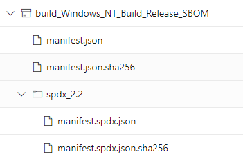

# SBOM Generation Guidance

## Background

An SBOM (Software Bill of Materials) is a formal record containing the details and supply chain
relationships of various components used in building software. Physically, an SBOM is usually a
single file (such as .json) that captures this information about the software from the build. As
part of the requiements to be compliant with the Executive Order on Cyber Security, each repository
involved in the composition of .NET needs to produce and upload an SBOM for each job of their
official build that produces or modifies any assets. In this initial phase, we are focusing our
efforts to have 6.0 and 7.0 builds generate the SBOMs.


## Use with Arcade

As an initial phase for SBOM generation, Arcade provides [a new YAML
template](https://github.com/dotnet/arcade/tree/main/eng/common/templates/steps/generate-sbom.yml)
to encapsulate the creation and upload of the SBOM to the build's artifacts, leveraging the [ADO
SBOM generator
task](https://eng.ms/docs/cloud-ai-platform/devdiv/one-engineering-system-1es/1es-docs/secure-supply-chain/ado-sbom-generator).
This section describes how to integrate this template into your repo's official build depending on
your current usage of the YAML templates that Arcade provides.

### Repositories using Arcade's job(s).yml templates

If you are using Arcade from the ".NET Eng - latest" or ".NET 6 Eng", and using the provided job
templates ([job.yml](https://github.com/dotnet/arcade/tree/main/eng/common/templates/job/job.yml),
[jobs.yml](https://github.com/dotnet/arcade/blob/main/eng/common/templates/jobs/jobs.yml)), Your
build legs should start attempting to generate and upload SBOMs automatically.

For most cases, this is all that a repository using the arcade templates will need to do to generate
and upload their SBOMs. If the generation doesn't work as expected, follow the [troubleshooting
instructions](#troubleshooting). Once you have verified the SBOMs are being generated for all of your
jobs, you can [review your SBOMs for correctness](#reviewing-generated-sboms-for-correctness).

### Repositories not using Arcade's job(s).yml templates

We encourage the usage of the job templates, as it's the best way for newer changes to the
infrastructure to be added to your repository via the Arcade dependency flow. In cases where it's
not possible for your repository to use the job templates, you will have to insert the
[generate-sbom.yml](https://github.com/dotnet/arcade/tree/main/eng/common/templates/steps/generate-sbom.yml)
template directly into each of your jobs that produce or modify assets. 

A minimal example follows:

```yaml
# One stage, one job: just build and generate an sbom
stages:
- stage: build
  displayName: Build
  jobs:
    - job: build (Windows)
        pool:
          name: NetCore1ESPool-Internal
          demands: ImageOverride -equals Build.Server.Amd64.VS2019

        steps:
        - checkout: self
          clean: true

        - script: eng\common\cibuild.cmd
            -configuration release
            -prepareMachine
          displayName: Windows Build / Publish
          
        - template: eng\common\templates\steps\generate-sbom.yml
```

Much of this template can be used as-is for most repositories, with defaults based on the common
Arcade configurations. The template allows customization of behavior via the following parameters:

- `PackageVersion`: Version that will be reported by the SBOM. For repositories based on Arcade's
  main branch, this should be "7.0.0", and "6.0.0" for .NET 6 release branches. 
- `PackageName`: default is '.NET'. Contact @dotnet/dnceng if you think your repo should use a
  different name.
- `ManifestDirPath`: Determines where in the build agent the SBOM will be generated to, defaults to
  `$(Build.ArtifactStagingDirectory)/sbom`
- `BuildDropPath` : Determines the directory that the SBOM tooling will use to find build outputs.
  Defaults to $`(Build.SourcesDirectory)/artifacts` to match Arcade's convention. 
- `sbomContinueOnError`: By default the tasks are set up to not break the build and instead continue
  on error if anything goes wrong in the generation process.


## Reviewing generated SBOMs for correctness

To verify that the functionality worked as expected in your repository:

1. The following steps should have been added to every job that is using the templates:
    - `Prep for SBOM generation`: Prepares the output directory for the sbom manifest and sets up
      the name of the artifact that will be uploaded.
    - `Create SBOM output folder`: Creates the directory where the sbom will be stored in the build
      agent.
    - `Generate SBOM manifest`: calls the SBOM generator task to produce the SBOM.
    - `Publish generated SBOM`: Uploads the SBOM to the build's artifacts

1. In the build's artifacts, you should find a new artifact for every job that added these new
   steps. The artifacts will be named with a pattern of `<stage>_<job>_<SBOM>`

      

For each SBOM produced, you should download the `spdx2.2/manifest.spdx.json` file to make sure all the
build output, OSS (Open Source Software) dependencies are captured in the manifest and to make sure
the product name and version for the SBOM match expectations.

It's recommended to open the manifest files with VSCode and format them so they are slightly more
readable.

- `Build outputs`: These should be present in the `files` collection of the manifest. At this time,
  we are not concerned with the tooling overreporting the build outputs, but the SBOMs should be
  checked for missing output packages. 

- `Dependencies`: These should be present in the `packages` collection of the manifest, and use the
  same detection mechanism as the component governance tasks. 

- After the packages section, the last entry should mention the correct name and version for the
  software that the SBOM is about. The `name` property should read as ".NET 7.0" for main branches,
  and ".NET 6.0" for .NET 6 release branches.

  ```JSON
  "spdxVersion": "SPDX-2.2",
      "dataLicense": "CC0-1.0",
      "SPDXID": "SPDXRef-DOCUMENT",
      "name": ".NET 7.0",
      "documentNamespace": "https://sbom.microsoft/1:7eRdtVpLFUKo5AoKX3Hn2A:bhGpfqyfPUCyWLMfzxuykw/286:1593108/w6ix__ZFGEGpJcSV4N1qbA",
      "creationInfo": {
          "created": "2022-02-04T21:15:00Z",
          "creators": [
              "Organization: Microsoft",
              "Tool: Microsoft.SBOMTool-2.1.4"
          ]
      },
      "documentDescribes": [
          "SPDXRef-RootPackage"
      ]
  ```


## Troubleshooting

- If the SBOM generation task fails with the message:

  ```
  Encountered error while running ManifestTool generation workflow. Error: BuildDropPath directory not found: <directory>
  ```

  It means that your build outputs might not match with the expected location for Arcade:
  `$(Build.SourcesDirectory)/Artifacts`. In this case you should modify the `BuildDropPath`
  parameter of the template to point to your build's output directory. 

- For any other problems with the tasks or templates, you can reach out to the [.NET Engineering
  Services
  team](https://github.com/dotnet/core-eng/wiki/How-to-get-a-hold-of-Engineering-Servicing).

## Further Reading

- [More information on
  SBOMs](https://eng.ms/docs/initiatives/executive-order/executive-order-requirements/executiveorderoncybersecurity/softwarebillofmaterials)
- [Manifest Generation task
  documentation](https://eng.ms/docs/cloud-ai-platform/devdiv/one-engineering-system-1es/1es-docs/secure-supply-chain/ado-sbom-generator)
