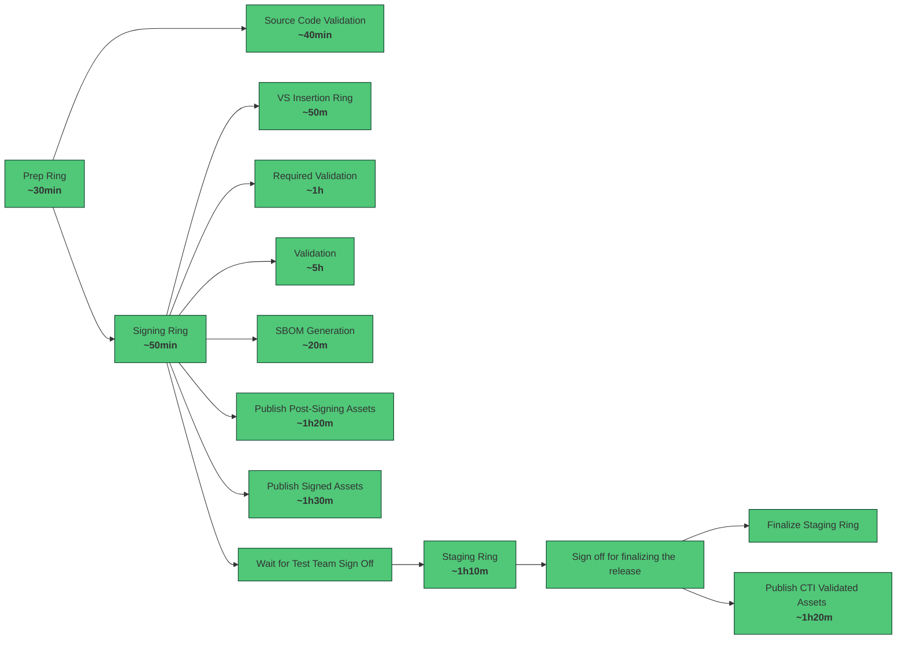

# Emergency staging pipeline optimizations

## Goals

As part of https://github.com/dotnet/arcade/issues/12261 we need to introduce emergency mode to Stage-DotNet and Stage-DotNet-Test pipelines that can be run to prepare a .NET release as fast as possible. Currently the critical stages in the pipeline depend on multiple validation stages (Source Code Validation, Validation, Required Validation) that run for a long time, which is one of the causes for the overall long run time of the pipeline. We need to implement a sped up version of the pipeline, skipping some of the validation jobs and running stages in parallel where possible.

## Proposed Implementation

The proposed implementation is introducing a "emergency switch" parameter in the Stage-DotNet pipeline. Stage dependencies can be rearranged according to this parameter. That will require no changes to the release pipeline that depends on the staging pipeline outputs. (Stage-DotNet is coded as a resourse in Release-DotNet-*). We can test the changes using the available testing pipeline (Stage-DotNet-Test) as it uses the same yaml.  

Another approach was discussed - creating a separate pipeline that will contain the stages in the emergency order. This approach would require changes to the release pipeline and would be harder to maintain as changes to Stage-DotNet would also need to be mirrored to the new pipeline and that can cause divergence from the original in the future. Therefore, the "emergency switch" parameter is the better option. 

The sequence of stages in the current pipeline is:

```mermaid
flowchart LR
  prep["Prep Ring \n <b>~30min</b>"] --> prep_override[Prep Ring Override]
  prep_override --> signing["Signing Ring \n <b>~50min</b>"]
  prep_override --> source_code_validation["Source Code Validation \n <b>~40min</b>"]
  source_code_validation --> source_code_validation_override[Source Code Validation Override]
  signing --> required_validation["Required Validation \n <b>~1h</b>"]
  signing --> validation["Validation \n <b>~5h</b>"]
  required_validation --> sbom_generation["SBOM Generation \n <b>~20m</b>"]
  required_validation --> required_validation_override[Required Validation Override]
  validation --> validation_override[Validation Override]
  required_validation_override --> publishing_v3_signed["Publish Post-Signing Assets \n <b>~1h20m</b>"]
  required_validation_override --> post_signing_publishing["Publish Signed Assets \n <b>~1h30m</b>"]
  required_validation_override --> vs_insertion["VS Insertion Ring \n <b>~50m</b>"]
  sbom_generation --> sbom_generation_override[SBOM Generation Override]
  vs_insertion --> vs_insertion_override[VS Insertion Override]
  vs_insertion_override --> cti_sign_off[Wait for Test Team Sign Off]
  cti_sign_off --> staging["Staging Ring \n <b>~1h10m</b>"]
  source_code_validation_override --> staging
  staging --> finalize_sign_off[Sign off for finalizing the release]
  finalize_sign_off --> finalize_staging[Finalize Staging Ring]
  finalize_sign_off --> publishing_v3_validated["Publish CTI Validated Assets \n <b>~1h20m</b>"]
  finalize_staging --> handoff_sign_off_dotnetcsainternal[Approve Publishing to Dotnetcsainternal]
  handoff_sign_off_dotnetcsainternal --> handoff_publishing_dotnetcsainternal["Handoff Publishing Ring (dotnetcsainternal)"]
  classDef default fill:#50C878, stroke:#023020;
  classDef Override fill:#ECFFDC, stroke:#023020;
  class prep_override,source_code_validation_override,required_validation_override,sbom_generation_override,vs_insertion_override,validation_override Override;
```

*Light colored stages are manual validation that overrides another stage (e.g. Prep - Prep Override). They are run if the corresponding stage fails or succeeds with issues and skipped otherwise.

If the parameter set to true, change the sequence of stages/jobs in the following way:

- The Staging Ring
  - skip the `validate-staging-inputs` and `validate_staging_outputs` step
  - dynamically change dependencies to
    - prep
    - prep_override
    - signing
    - cti_sign_off
  - dynamically change conditions
- VS Insertion Ring
  - skip `validate_vs_insertion_inputs` job
  - dynamically change dependencies to
    - prep
    - prep_override
- Publish Signed Assets
  - depends on:
    - signing
  - add a condition that signing was successful
- Publish Post-Signing Assets
  - depends on:
    - prep
    - prep_override
    - signing
  - remove required_validation conditions
- Validation Ring - no changes
- Sbom Generation Ring
  - depends on:
    - prep
    - prep_override
    - signing 
  - no changes in conditions
- Required Validation Ring - no changes
- Source Code Validation - no changes
- Signing Ring
  - skip `validate_signing_inputs` step
- Prep Ring - no changes 
- Configure stages to have no override on failure

## Risks

- the release pipeline is closely connected to the staging - Stage-DotNet is listed as a resource in Release-DotNet from which build artifacts are being downloaded, the release pipeline also expects that assets are published to certain feeds and storage acccounts. We need to check that all assets it needs are being published with the expected changes and in the expected location. 

- make sure that the critical stages of Stage-DotNet have all the needed assets. It is possible that additional changes need to be made in the jobs consuming or publishing artifacts, but on a first glance validation stages don't produce outputs that are used in later stages. 

## Testing

The change can be tested by running the Stage-DotNet-Test pipeline. It uses the same yml as Stage-DotNet but uploads assets to temporarily created feeds and blob storage containers so that we can run the pipeline multiple times without uploading to the official places. We should run it with the emergency switch on and off and make sure that
- stages are run in the correct order in both emergency and regular scenario
- adding the new parameter doesn't introduce any errors in the current staging process
- all stages from the diagram are run so that:
  - all files produced by the staging pipeline are published (to feeds and blob storage containers) in both the emergency and regular scenario
  - the build artifacts that are used by the release pipeline are published (`config.json`, `manifest.json`, `signed/*`, `signalr-signed/*`, `release-manifests/*`)

## Open Questions 

1. How does the change need to be communicated? 

2. Should we create a separate 1ES pool for the emergency pipeline to decrease wait time, also could we unite jobs with the same goal? (suggested by Djuradj)

  
