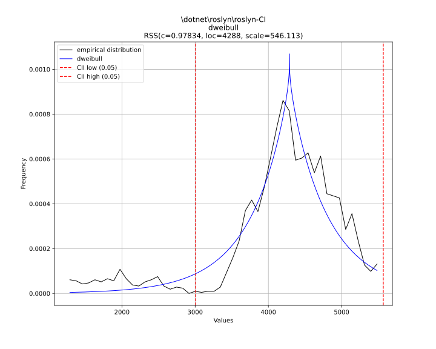
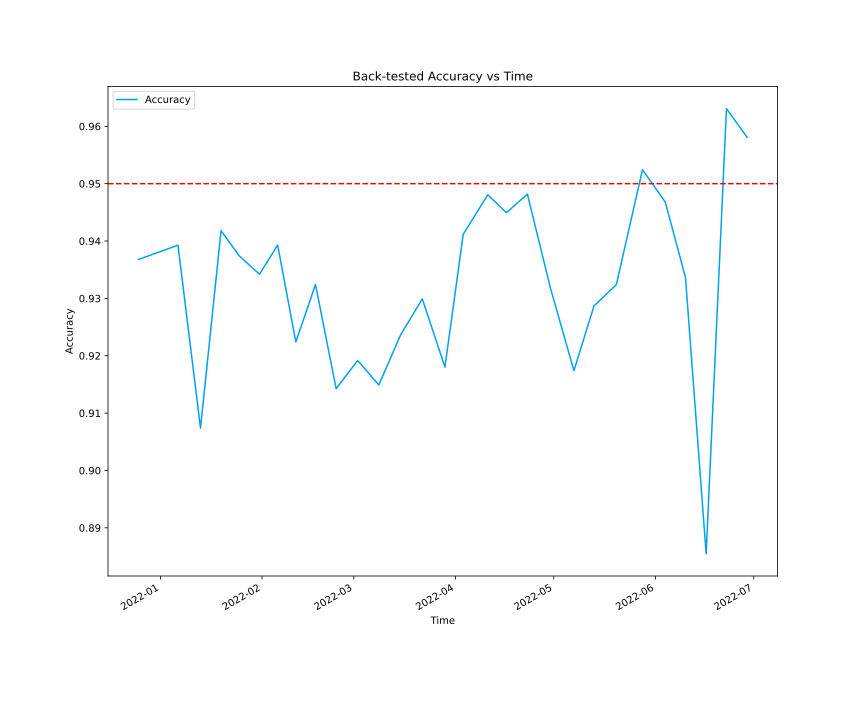

# Predicting Pipeline Durations

Our customers would love to know how long their CI pipeline takes. Ideally, we would want to build a model that can account for the current state of Helix, the work items they send, the congestion of AzDo, etc. to get a decent accurate. Unfortunately, this is a highly complex model that is quite difficult to build (but theoretically possible).

Instead, we can build a model to give us a range of estimates, based on the past durations of their pipelines.

We have tons of historical data that can enable us to make predictions and generate confidence intervals on the length of CI pipelines.

## Stakeholders

* Our Partners (@dncpartners)
* .NET Engineering Services (@dnceng)


## Proof of Concept

*[Here is a jupyter notebook](https://ml.azure.com/fileexplorerAzNB?wsid=/subscriptions/a4fc5514-21a9-4296-bfaf-5c7ee7fa35d1/resourcegroups/t-jperez/workspaces/HelixMLTest&tid=72f988bf-86f1-41af-91ab-2d7cd011db47&activeFilePath=Users/t-jperez/pipeline-machine-learning-arcade8824.ipynb) with the detailed statistics and data science that supports the following claims.*

By plotting a histogram of pipeline durations for specific pipelines, I've determined that they seem to follow distributions that we can model. For instance, here is the `roslyn-CI` pipeline, with a dweibull distribution fitted.



With this distribution, we can compute the 95% confidence interval, which for this pipeline, is:

`1:11:27 +- 0:27:57`

We can vary the confidence interval, and thus the accuracy of our predictions, for a smaller range. From testing on all pipelines that have Build Analysis enabled, here are the detailed statistics for the *ranges* of predictions we give, in seconds. This data is back-tested, meaning that at the time the range was computed, the model only had the data available previously.

```
count     534.000000
mean       69.490963
std       415.535966
min         3.197592
25%        12.124280
50%        19.041886
75%        27.074249
max      6289.076812
dtype: object
```

### Model Accuracy

With a target of 95% accurate, the back-testing concluded that we had a true accuracy of 93.3%. 

We backtested the model by training on all previous data before a point, and then testing on 1 week ahead, on data the model has not seen before. Here is a graph of the accuracy over time.



The dashed red line shows the target, 95% accurate predictions. Our predictions hold accurate, at worst dipping to just below 89%, and hovering between 90% and 95%.

This data is an aggregation of accuracy vs time for all repos with Build Analysis. When evaluating the accuracy, the data point in question was not used to fit the distribution, preventing a look-ahead bias. Accuracy is defined as:

$\frac{\text{points in predicted range}}{\text{total points}}$

### Implementation

A unique distribution for each pipeline requires a training for each pipeline, and this functionality would more than likely require an Azure Function. The added burden of maintenance and engineering machinery makes this too cumbersome.

Instead, we can use [Chebyshev's inequality](https://en.wikipedia.org/wiki/Chebyshev's_inequality), because we have the mean and variance defined for each pipeline.  Using ${\displaystyle k={\sqrt {2}}}$ shows that the probability that values lie outside the interval ${\displaystyle (\mu -{\sqrt {2}}\sigma ,\mu +{\sqrt {2}}\sigma )}$ does not exceed ${\displaystyle {\frac {1}{2}}}$. At the time of writing, here is a list of the ranges we'd give customers who have Build Analysis enabled:


| Definition                                         | Mean         | Confidence Interval |
| -------------------------------------------------- | ------------ | ------------------- |
| \dotnet\arcade\arcade-ci                           | 45m 14s      | ± 10m 41s           |
| \dotnet\arcade-services\dotnet-arcade-services     | 25m 8s       | ± 5m 26s            |
| \dotnet\arcade-validation\arcade-validation-ci     | 13m 24s      | ± 6m 17s            |
| \dotnet\aspnetcore\aspnetcore-ci                   | 1hr 32m 8s   | ± 27m 56s           |
| \dotnet\aspnetcore\aspnetcore-components-e2e       | 33m 58s      | ± 3m 11s            |
| \dotnet\aspnetcore\aspnetcore-quarantined-pr       | 1hr 4m 4s    | ± 17m 7s            |
| \dotnet\installer\installer                        | 57m 22s      | ± 36m 3s            |
| \dotnet\performance\performance-ci                 | 47m 41s      | ± 22m 7s            |
| \dotnet\roslyn\roslyn-CI                           | 1hr 10m 41s  | ± 19m 22s           |
| \dotnet\roslyn\roslyn-integration-CI               | 1hr 22m 24s  | ± 12m 23s           |
| \dotnet\roslyn\roslyn-integration-corehost         | 1hr 22m 56s  | ± 11m 2s            |
| \dotnet\runtime\dotnet-linker-tests                | 59m 55s      | ± 13m 55s           |
| \dotnet\runtime\runtime                            | 2hrs 10m 52s | ± 1hr 21m 38s       |
| \dotnet\runtime\runtime-coreclr outerloop          | 4hrs 20m 24s | ± 57m 37s           |
| \dotnet\runtime\runtime-coreclr superpmi-asmdiffs  | 1hr 20m 26s  | ± 14m 10s           |
| \dotnet\runtime\runtime-coreclr superpmi-diffs     | 1hr 53m 35s  | ± 19m 24s           |
| \dotnet\runtime\runtime-coreclr superpmi-replay    | 1hr 38m 15s  | ± 17m 26s           |
| \dotnet\runtime\runtime-dev-innerloop              | 1hr 21m 38s  | ± 8m 16s            |
| \dotnet\runtime\runtime-extra-platforms            | 2hrs 23m     | ± 52m 44s           |
| \dotnet\runtime\runtime-libraries enterprise-linux | 41m 48s      | ± 7m 57s            |
| \dotnet\runtime-assets\runtime-assets              | 2m 5s        | ± 35s               |
| \dotnet\sdk\dotnet-sdk-public-ci                   | 59m 1s       | ± 16m 15s           |

We can use a Kusto Query like so and show this information in Queue Insights. (Here, I use Definition name for clarity, but I will use the DefinitionId in production)

```
TimelineBuilds
| where Project == "public"
| where Reason == "pullRequest"
| where TargetBranch == "main"
| where Result == "succeeded"
| extend PipelineDuration = datetime_diff('second', FinishTime, StartTime) * 1s
| project-keep Definition, PipelineDuration
| join kind=inner (
    TimelineBuilds
    | where Project == "public"
    | where Reason == "pullRequest"
    | where TargetBranch == "main"
    | where Result == "succeeded"
    | project Definition, PipelineDuration = datetime_diff('second', FinishTime, StartTime) * 1s
    | summarize
        Bottom5 = percentile(PipelineDuration, 5),
        Top95 = percentile(PipelineDuration, 95),
        Count = count()
        by Definition
    | where Count >= 30)
    on Definition
| where PipelineDuration between (Bottom5..Top95)
| summarize Mean = avg(PipelineDuration), ConfidenceInterval = sqrt(2) * totimespan(stdevp(PipelineDuration)) by Definition
```

*Thanks to Nikki ([@mathaholic](https://github.com/mathaholic)) for her help with this data analysis, and her idea to use Chebyshev’s Theorem!*

### Caveats

#### Multimodal Distributions

There are some issues with this model. First, some pipelines, like `dotnet/runtime`'s have a multimodal distribution. This means we cannot accurately predict their pipeline duration. In this case, their distribution is multimodal because their first step, `Evaluate Paths` evaluates the changes in a given PR, and runs or skips different steps of their pipeline.

We will hide the estimated time and instead inform the user that their pipeline cannot be predicted as it is too variable. This will also handle the case where the range of a CI pipeline exceeds the estimated time (*e.g.* `1min ± 5min`)

#### Infrastructure Outages

In addition, there is the issue of AzDo, Helix, or builds being on the floor, and we still give customers an estimate, blissfully unaware of any infrastructure errors. In the Juptyer notebook, I dive into an anomaly detection model, based on Helix work item wait times trying to predict this, but the model only improves accuracy by 0.3%.


For Helix and/or AzDo being on the floor, we will rely on our Known Issues infrastructure, and simply hide the checks when there are any critical infrastructure issues.

## Risk

* Will the new implementation of any existing functionality cause breaking changes for existing consumers?
  * No, this will be a new feature.
* What are your assumptions?
  * We'll constantly maintain data in the `TimelineBuilds` table. This feature depends on it.
* What are your unknowns?
  * See above, how do we decompose multimodal distributions and become notified when services are down?
* What dependencies will this epic/feature(s) have?
  * `TimelineBuilds`
  * Kusto
* Are the dependencies currently in a state that the functionality in the epic can consume them now, or will they need to be updated?
  * We can consume them now.
* Is there a goal to have this work completed by, and what is the risk of not hitting that date? (e.g. missed OKRs, increased pain-points for consumers, functionality is required for the next product release, et cetera)
  * Aug 12, the end of the internship.
* Does anything the new feature depend on consume a limited/throttled API resource?
  * No.
* Have you estimated what maximum usage is?
  * No, but it wil be the same as the Queue Insights project.
* Are you utilizing any response data that allows intelligent back-off from the service?
  * We only query Kusto, so there is no need for back-off.
* What is the plan for getting more capacity if the feature both must exist and needs more capacity than available?
  * This feature wont require any additional capacity.

<!-- Begin Generated Content: Doc Feedback -->
<sub>Was this helpful? [](https://helix.dot.net/f/p/5?p=Documentation%5CTeamProcess%5COne-Pagers%5Cpipeline-machine-learning-arcade8824.md) [](https://helix.dot.net/f/n/5?p=Documentation%5CTeamProcess%5COne-Pagers%5Cpipeline-machine-learning-arcade8824.md)</sub>
<!-- End Generated Content-->
