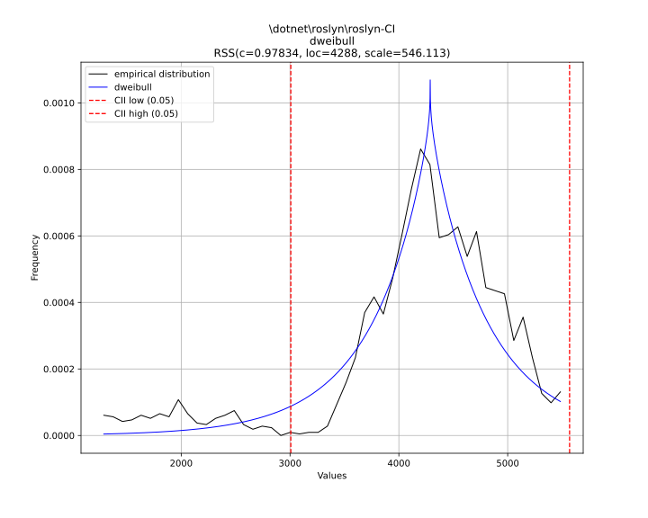
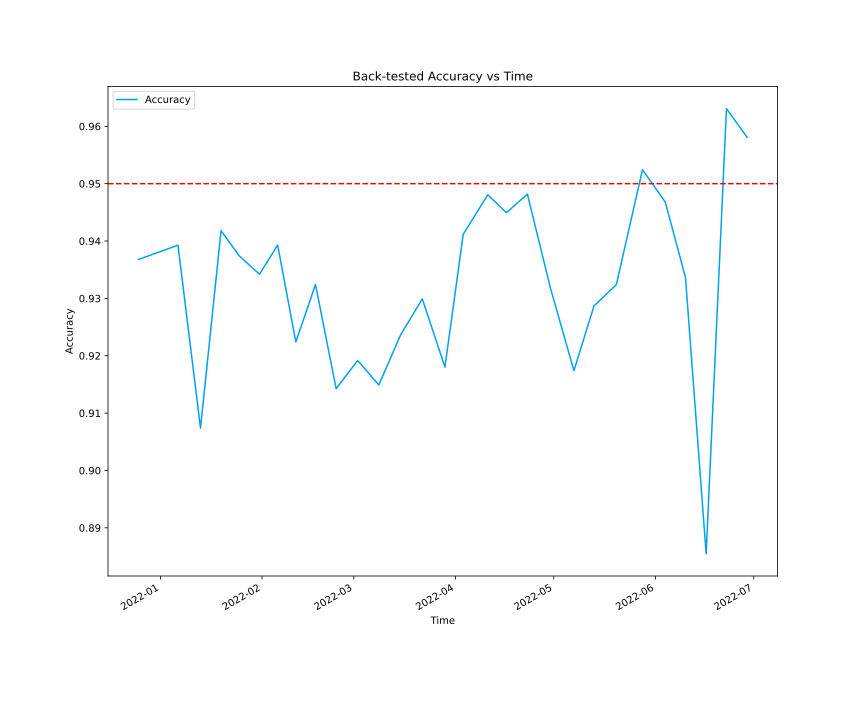

# Predicting Pipeline Durations

Our customers would love to know how long their CI pipeline takes. Ideally, we would want to build a model that can account for the current state of Helix, the workitems they send, the congestion of AzDo, etc. to get a decent accurate. Unfortunately, this is a highly complex model that is quite difficult to build (but theoretically possible).

Instead, we can build a model to give us a range of estimates, based on the past durations of their pipelines.

Thanks to our data, we have tons of historical data that can enable us to make predictions and generate confidence intervals on the length of CI pipelines.

## Stakeholders

* Our Partners (@dncpartners)
* .NET Engineering Services (@dnceng)


## Proof of Concept

*[Here is a jupyter notebook](https://ml.azure.com/fileexplorerAzNB?wsid=/subscriptions/a4fc5514-21a9-4296-bfaf-5c7ee7fa35d1/resourcegroups/t-jperez/workspaces/HelixMLTest&tid=72f988bf-86f1-41af-91ab-2d7cd011db47&activeFilePath=Users/t-jperez/pipeline-machine-learning-arcade8824.ipynb) with the detailed statistics and data science that supports the following claims.*

By plotting a histogram of pipeline durations for specific pipelines, I've determined that they seem to follow distrubtions that we can model. For instance, here is the `roslyn-CI` pipeline, with a dweibull distribution fitted.



With this distribution, we can compute the 95% confidence interval, which for this pipeline, is:

`1:11:27 +- 0:27:57`

We can vary the confidence interval, and thus the accuracy of our predictions, for a smaller range. From testing on all pipelines that have Build Analysis enabled, here are the detailed statistics for the *ranges* of predicitons we give, in seconds. This data is backtested, meaning that at the time the range was computed, the model only had the data available previously.

```count     534.000000
mean       69.490963
std       415.535966
min         3.197592
25%        12.124280
50%        19.041886
75%        27.074249
max      6289.076812
dtype: object
```

### Model Accuracy

With a target of $95\%$ accurate, the backtesting concluded that we had a true accuracy of $93.3\%$. 

We backtested the model by training on all previous data before a point, and then testing on 1 week ahead, on data the model has not seen before. Here is a graph of the accuracy over time.



### Implementation

We will implement this as an Azure function. There will be two Azure Functions, an HTTP trigger to obtain the list of confidence intervals for a given set of pipelines, and another function on a timer trigger to retrain the model weekly.

The Azure Function will be written in Python. Unfortunately, we cannot use ML.NET (or Infer.NET) since ML.NET does not allow us to fit probability density functions, and Infer.NET has this capability, but we cannot measure the accuracy of the fit to pick the best distribution.

Queue Insights will query the function for predictions, and show them inside the existing checkrun.

### Caveats

There are some issues with this model. First, some distributions, like `dotnet/runtime`'s pipeline have a multimodal distribution. This means we cannot accurately predict their pipeline duration. In this case, their distribution is multimodal because their first step, `Evaluate Paths` evaluates the changes in a given PR, and runs or skips different steps of their pipeline.

In addition, there is the issue of AzDo, Helix, or builds being on the floor, and we still give customers an estimate, blisfully unaware of any infrastructure errors. In the Juptyer notebook, I dive into an anomaly detection model, based on Helix work item wait times trying to predict this, but the model only improves accuracy by $0.3\%$.

## Risk

* Will the new implementation of any existing functionality cause breaking changes for existing consumers?
  * No, this will be a new feature.
* What are your assumptions?
  * We'll constantly maintain data in the `TimelineBuilds` table. This feature depends on it.
* What are your unknowns?
  * See above, how do we decompose multimodal distributions and become notified when services are down?
* What dependencies will this epic/feature(s) have?
  * `TimelineBuilds`
  * Python machine learning libraries (python, skikit-learn, distfit, pandas..)
  * Azure Functions
* Are the dependencies currently in a state that the functionality in the epic can consume them now, or will they need to be updated?
  * We can consume them now.
* Is there a goal to have this work completed by, and what is the risk of not hitting that date? (e.g. missed OKRs, increased pain-points for consumers, functionality is required for the next product release, et cetera)
  * Aug 12, the end of the internship.
* Does anything the new feature depend on consume a limited/throttled API resource?
  * No. Kusto will be queried once a week to retrain the models.
* Have you estimated what maximum usage is?
  * No, but it wil be the same as the Queue Insights project.
* Are you utilizing any response data that allows intelligent back-off from the service?
  * We only query Kusto, so there is no need for back-off.
* What is the plan for getting more capacity if the feature both must exist and needs more capacity than available?
  * Azure Functions should auto-scale our function if our ML endpoint is being queried hard.