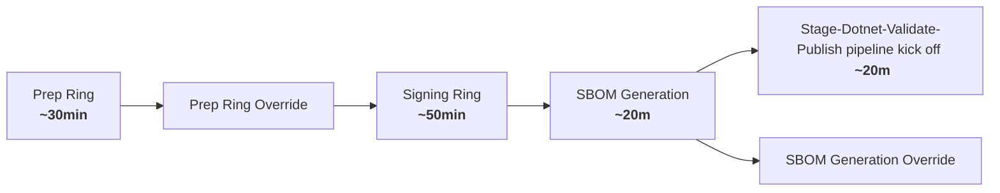
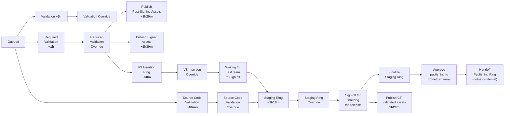
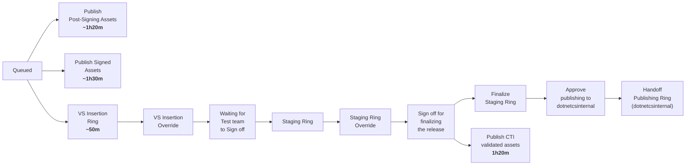

# Retrying Stages to Address Errors in Staging pipeline

## What is the current process?

Today we must run the entire Staging pipeline if we encounter any errors in the pipeline. 
For eg: When Package push fails, we need to rerun everything to fix the bug.

There is no way to test the pipeline with fewer stages. Since most of the later stages are dependent on earlier stages that takes a lot of time to complete. 
For eg: If we want to test only the Required Validation stage, we will need to run Prep and Signing.

## Problems with current process:
1.	Rerunning a single stage in the pipeline is not possible without executing the entire pipeline again.
1.	Running only the stage where changes were implemented is not feasible.
1.	Re-executing the entire process and testing consumes a considerable amount of time.
1.  Staging pipeline is complicated to understand, we need a simpler process.

## Different approach for staging pipeline: 

| Approach | Pros | Cons | 
|----------|------|-------|
| 1. We add some parameters in the pipeline, and make staging pipeline download the pipeline assets uploaded in the Signing stage of build with build id 12345 in the new pipeline run. Since the assets are already signed we just run required validation and publishing stage only We will need build id of the successful build. We will use azure apis to download the pipeline artifacts |   <li>  Easier to test     <li> We can pick and choose which stages to rerun                                                         <li>Relatively easy to implement <li> Release pipeline is doing something similar | <li> Seems primitive and hacky | 
| 2. Pipeline should be intelligent enough, like if we rerun the pipeline with the same BarId, it should look up the data in timeline builds and if the stage was previously successful from previous runs it should just not do anything. Like here if prep ring was successful, so it would skip prep and go to signing. Signing was already successful so now it will skip this stage and just download assets from the build with build if 12345. Then eventually just run Required Validation and publishing stage | <li> Lot of code change in every stage <li> Timeline data is in Kusto and they sometime take time to show up in kusto so prone to errors(waiting can help) | <li> Need to capture details which build ran with which barid <li> Seems hacky <li> Adds non determinism based on time, availability of systems. | 
| 3. Create a cache to cache the Signed assets, so next time we re run the pipeline for the same barID, We look for signed assets in the cache. The assets are hashed, so if there is no change in the bits, we do not have to run that stage. So in case required validation was previously successful for the signed assets hash  then skip this stage.| <li> Lot cleaner | <li> We may be adding  complexity to our current infra <li> Have to maintain cache <li> Need to add an explicit ovveride when we need to re-sign. <li> Does not save a lot of time  in 7.0/8.0 where in-build signing reduces the time in the signing stage. | 
| 4. Split the pipeline into 2 <li> Anything that alters the artifacts ( Signing) <li>Validation and publishing | <li> .Net 9 we are moving towards moving signing (anything that alters/creates the build artifacts is going to be moved) to main builds, so by splitting this we will align to work with .Net 9 ( which is awesome!) <li> Making the pipeline lot less complex<li> We can introduce testing infra (inject DI in the second pipeline, publish to test vs prod containers) <li> Makes the whole pipeline simpler <li> If we want to fix something in the second pipeline we don't have to rerun the first one. So fixes are and flaky test reruns are lot faster and easier. | <li> Have to maintain 2 pipeline <li> BCM work has to be reevaluated.| 

## Goal and Motivation 

After carefully analyzing the pros and cons of all the above approaches, we decided to go with splitting the pipeline. 

The proposal here is to split the Staging Pipeline into two different pipelines and add the ability to rerun stages. Thinking of this work as 2 part process.
#### Version 1 (V1):
1. First pipeline will contain anything that alters or generates the artifacts (Eg: Signing, SBOM generation). 
1. Second pipeline will contain Validation and publishing to various storage accounts.
#### Version 2 (V2): 
1. Ability to add rerun stages in the Second pipeline

## Stakeholders:
1.	Tomas team 
1.	Release team 

### Current Flow

```mermaid
flowchart LR;
  prep["Prep Ring \n <b>~30min</b>"] --> prep_override[Prep Ring Override]
  prep_override --> signing["Signing Ring \n <b>~50min</b>"]
  prep_override --> source_code_validation["Source Code Validation \n <b>~40min</b>"]
  source_code_validation --> source_code_validation_override[Source Code Validation Override]
  signing --> required_validation["Required Validation \n <b>~1h</b>"]
  signing --> validation["Validation \n <b>~5h</b>"]
  required_validation --> sbom_generation["SBOM Generation \n <b>~20m</b>"]
  required_validation --> required_validation_override[Required Validation Override]
  validation --> validation_override[Validation Override]
  required_validation_override --> publishing_v3_signed["Publish Post-Signing Assets \n <b>~1h20m</b>"]
  required_validation_override --> post_signing_publishing["Publish Signed Assets \n <b>~1h30m</b>"]
  required_validation_override --> vs_insertion["VS Insertion Ring \n <b>~50m</b>"]
  vs_insertion --> vs_insertion_override["VS Insertion \n Override \n <b></b>"]
  vs_insertion_override --> test_team_sign_off["Waiting for \n Test team \n to Sign off \n <b></b>"]
  test_team_sign_off --> staging_ring["Staging Ring \n <b></b>"]
  source_code_validation_override --> staging_ring["Staging Ring \n <b>~1h10m</b>"]
  staging_ring --> staging_ring_override["Staging Ring \n Override \n <b></b>"]
  staging_ring_override --> sign_off_for_finalizing_release["Sign off for \nfinalizing \n the release \n <b></b>"]
  sign_off_for_finalizing_release --> finalize_staging_ring["Finalize \n Staging Ring \n <b></b>"]
  sign_off_for_finalizing_release --> publish_cit_validated_assets["Publish CTI \n validated assets \n <b>1h20m</b>"]
  finalize_staging_ring --> approve_publishing_dotnetcs_internal["Approve \n publishing to \n dotnetcsinternal \n <b></b>"]
  approve_publishing_dotnetcs_internal --> handoff_publishing_ring["Handoff \n Publishing Ring \n (dotnetcsinternal) \n <b></b>"]
  sbom_generation --> sbom_generation_override[SBOM Generation Override]
```

## V1:
### Splitting Staging Pipeline:

Proposed implementation is splitting the pipeline into two pipelines.
#### 1. First pipeline: Stage-Dotnet-Prepare-Artifacts
The Stage-Dotnet-Prepare-Artifacts pipeline will contain stages that alters or generates new (e.g. SBOM) artifacts. 

#### 2. Second pipeline: Stage-Dotnet-Validate-Publish
The Stage-Dotnet-Validate-Publish pipeline will contain validation and publishing stages.

### Advantages of splitting pipeline: 
1. In .Net 9 we are going to move signing to main build. By splitting pipeline we are going to be in alignment with that plan, meaning we can retire the first pipeline when time comes and only the second pipeline will be staging pipeline then. 
1. Bug fix and testing in validation and publishing stages are lot faster. We do not have to wait for the build to be signed everytime we make a fix to validation/publishing stage or re-run flaky tests.
1. We can add ability to rerun to smaller subset of stages as compared to Stage-Dotnet pipeline.

### Interface between the Stage-Dotne-Prepare-Artifacts Pipeline and Stage-Dotnet-Validate-Publish pipeline:

The first pipeline Stage-Dotnet-Prepare-Artifacts (May be during the create SBOM stage or after) kicks off a build in the Stage-Dotnet-Validate-Publish pipeline. This is similar to what we have in maestro promotion pipeline. The Stage-Dotnet-Prepare-Artifacts is not dependent on the Stage-Dotnet-Validate-Publish pipeline to be completed.

The second pipeline Stage-Dotnet-Validate-Publish pipeline downloads the signed build artifacts from the Stage-Dotnet-Prepare-Artifacts pipeline. 

One of the main reason for adding the trigger to kick off a the Stage-Dotnet-Validate-Publish from the Stage-Dotnet-Prepare-Artifacts pipeline is so that we don't have to manually kick off the Stage-Dotnet-Validate-Publish build after the first pipeline completes. Additionally the Stage-Dotnet-Validate-Publish can be kicked off manually too. It will use BarBuildID / BuildId combination to download the signed assets from the first pipeline. 

## V2:

Rerruning stages in Stage-Dotnet-Validate-Publish pipeline:

Say Publishing Signed Assets fails and validation is successful
1. We can add the ability to pick and choose the stages to run in the second pipeline.

Here we skipped Validation stage altogether. Similarly we can can add ability to skip other stages in the pipeline.

#### Risks: 
1. We are dissecting the staging pipeline, there is a chance we might be messing up publishing to correct storage containers. 
1. Since we will retire the old pipeline only after the new pipelines Stage-Dotnet-Prepare-Artifacts and Stage-Dotnet-Validate-Publish are up and running, there may be an extended period where we need to maintain extra pipelines.

#### Additional information: 
1. Verify we don't duplicate publishing of assets is tracked in (issue)[https://github.com/dotnet/arcade/issues/13025]
1. Adding testing infra to Staging pipeline is tracked (here)[https://github.com/dotnet/arcade/issues/13462]

