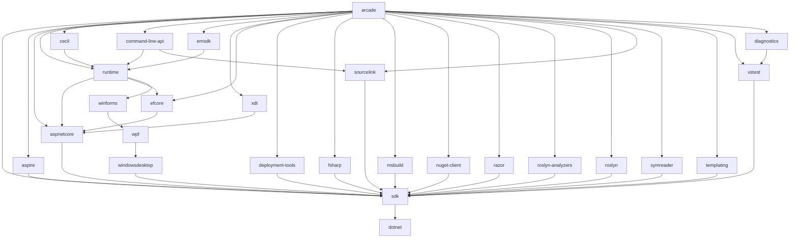
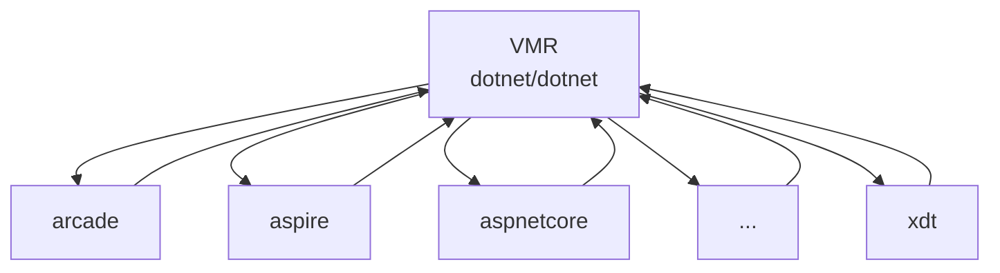

# Flat flow migration guide

> [!NOTE]
> This is part of the [Unified Build](https://github.com/dotnet/arcade/tree/main/Documentation/UnifiedBuild) effort.

This document describes how to migrate [VMR repositories](https://github.com/dotnet/dotnet/tree/main/src) from their current Maestro dependency flow to the new VMR-based flat flow.
This only applies to repositories that are part of the VMR (specifically on `main`).
Part of the migration will be done by the Unified Build vertical team, but some steps will be done by the repository owners.

## Terminology

- **Dependency flow** / **Binary flow** - Old type of Maestro subscriptions that are only flowing dependency updates, e.g. [this one](https://github.com/dotnet/sdk/pull/47085).
- **Code flow** / **Source-enabled dependency flow** - New type of Maestro subscriptions that are, together with dependency updates, also flowing sources to/from the VMR.
- **Flat flow** - A new structure of subscriptions between product repositories.
- **Product repository** - A repository that is part of SDK and is synchronized in the VMR.

Please see also [Unified Build Terminology](./Terminology.md).

## High-level overview of the change

Currently, the .NET SDK is built out of a set of individual repositories which flow dependencies among each other using Maestro dependency update PRs.
The flow ends in `dotnet/sdk` where we can gather the whole dependency tree and assemble the full SDK from the binaries flown to every commit.  
Since .NET 8, we are also mirroring sources representing this dependency tree into the [VMR](https://github.com/dotnet/dotnet) for every commit made to `dotnet/sdk`.
Every product repository has [a corresponding folder](https://github.com/dotnet/dotnet/tree/main/src) in the VMR.
The process is described [here](https://github.com/dotnet/arcade/blob/main/Documentation/UnifiedBuild/VMR-Code-And-Build-Workflow.md#internal-code-flow-and-releases) and [here](https://github.com/dotnet/arcade/blob/main/Documentation/UnifiedBuild/VMR-Design-And-Operation.md#source-synchronization-process).
The dependency tree looks something like this:

Newly, the SDK will be built from sources of the VMR instead and sources of repositories will not be synchronized into the VMR from `dotnet/sdk` but
- every repo will flow its sources directly into the VMR,
- the official builds of the product repos will be removed,
- the VMR will become the official build of the product repos
- and former dependents on product repositories will depend on the VMR instead (including the product repositories themselves).

The new dependency tree will look like this:

More details can be found [here](https://github.com/dotnet/arcade/blob/main/Documentation/UnifiedBuild/VMR-Code-And-Build-Workflow.md).

## Migration requirements

The migration will happen repository by repository and has to go in the order of the dependency tree.

#### A repository can start the migration when:

- It is part of the VMR (i.e. its sources are synchronized into the VMR),
- It builds successfully in VMR's official build (i.e. all of its packages are produced correctly in that build),
- product repositories depending on it are migrated.

#### A repository is considered migrated when:

- The current VMR synchronization for the repository is disabled (in `dotnet/sdk`).
- Subscriptions to the repository changed to subscribe to the VMR instead.
- Subscribees need to add the `dotnet10-internal` feed to their `NuGet.config` file (can happen on next dependency PR).
- It has source-enabled subscriptions to/from the VMR.
- Its official build is no longer producing packages.

## Migration process

TODO - BEFORE:
- Backup subscriptions before the migration
- Get merge override permissions for dotnet/sdk
- Prepare PRs for VMR sync disablement (per every repo)

TODO: List of things that need to happen for every repo
- Synchronization of the repository into the VMR is disabled in `dotnet/sdk` in `source-mappings.json`.
  - Ideally with a PR prepared before hand for every repo.
- Subscriptions to this repository are changed to subscribe to the VMR instead.
  - The channel needs to change to `.NET 10 UB` (channel where VMR publishes to).
  - Subscribees need to add the `dotnet10-internal` feed to their `NuGet.config` file (can happen on next dependency PR).
  - We only care about the default branch (possibly the one in `source-mappings.json`).
  - It is likely that the subscriptions to VMR will already be created when another repo was being migrated.
    In that case, we only delete it.
- The official build is wound down.
  - Can happen on its own time.

1. 
2.
1. Wind down the official build of the repository.

## FAQ

### How can I see dependency subscriptions for my repository?
TODO: maestro.dot.net / darc

### My repository is not part of the VMR. Am I still affected?
TODO: Only if you depend on a repository that is part of the VMR. Your subscriptions to that repository will be changed to depend on the VMR instead and you will get the dependencies from there.

### Where can I find the official build of the VMR?
TODO: Links

### Where can I find the dependency PRs?
TODO

### Can my product repository still subscribe to other repositories?
TODO: Yes.

### Can my product repository still produce packages?
TODO: Technically yes, but ideally only those not produced in the VMR official build.

### What happens to Arcade?
TODO: Arcade official build will stay and people can depend on it.

### My repo X depends on repo Y's packages. How will I get the new packages?
TODO: You will depend on the VMR instead of repo Y. The repo Y will be built as part of the VMR and packages will be produced by the official VMR build.

### Whom to contact and when?
TODO
