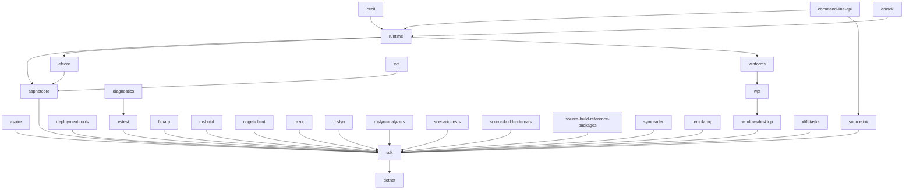
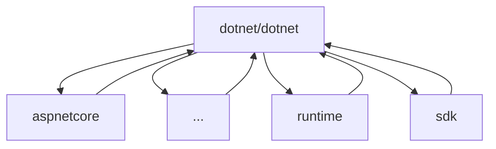

# Flat dependency flow migration FAQ

> [!NOTE]
> This is part of the [Unified Build](https://github.com/dotnet/arcade/tree/main/Documentation/UnifiedBuild) effort.

This document describes the migration of [VMR repositories](https://github.com/dotnet/dotnet/tree/main/src) from their current Maestro dependency flow to the new VMR-based flat flow.
This only applies to repositories that are part of the VMR (specifically on `main`).

## Terminology

- **Product repository** / **VMR repository** - A repository that is part of SDK and is synchronized in the VMR.
- **Dependency flow** / **Binary flow** - Old type of Maestro subscriptions that are only flowing dependency updates, e.g. [this one](https://github.com/dotnet/sdk/pull/47085).
- **Code flow** / **Source-enabled dependency flow** - New type of Maestro subscriptions that are, together with dependency updates, also flowing sources to/from the VMR.
- **Flat flow** - A new structure of subscriptions between product repositories and the VMR.

See also [Unified Build Terminology](./Terminology.md).

## High-level overview of the change

Currently, the .NET SDK is built out of a set of individual repositories which flow dependencies among each other using Maestro dependency update PRs.
The flow ends in `dotnet/sdk` where we can gather the whole dependency tree and assemble the full .NET SDK.  

> [!NOTE]
> Since .NET 8, we are also mirroring sources representing this dependency tree into the [VMR](https://github.com/dotnet/dotnet) for every commit made to `dotnet/sdk`.
> Every product repository has [a corresponding folder](https://github.com/dotnet/dotnet/tree/main/src) in the VMR.
The process is described in more detail [here](https://github.com/dotnet/arcade/blob/main/Documentation/UnifiedBuild/VMR-Code-And-Build-Workflow.md#internal-code-flow-and-releases) and [here](https://github.com/dotnet/arcade/blob/main/Documentation/UnifiedBuild/VMR-Design-And-Operation.md#source-synchronization-process).

Today's dependency tree for *product repositories* (minus `arcade`) looks something like this:

Newly, the SDK will be built from the VMR instead:
- **every repo will flow** its sources using the new source-enable Maestro subscriptions directly **into the VMR** (under `src/[reponame]`),
- the **official builds of the product repos will stop producing packages**,
- **the VMR will become the official build** of the product repos,
- former dependents on product repositories will depend on and get their package from the VMR instead (including the product repositories themselves).

The new dependency tree will look like this:

An in-depth description of this can be found [here](https://github.com/dotnet/arcade/blob/main/Documentation/UnifiedBuild/VMR-Code-And-Build-Workflow.md).

## Migration process

On the day of migration, the Unified Build team will run a script that will redirect the subscriptions connected to VMR repositories:
- If your repo depended on a VMR repository, it will be subscribed to the VMR instead.
- If your repo depended on several VMR repositories, it will be subscribed to the VMR just once.

## FAQ

### How can I see dependency subscriptions for my repository?
Either use the [Maestro website](https://maestro.dot.net/subscriptions) or use the [`darc get-subscriptions`](../Darc.md) command.

### My repository is not part of the VMR. Am I still affected?
If your repository has subscriptions to a repository that is [part of the VMR](https://github.com/dotnet/dotnet/tree/main/src), this repository will get built as part of the [VMR build](https://dev.azure.com/dnceng/internal/_build?definitionId=1330).
Your repository will be subscribed to the [VMR](https://github.com/dotnet/dotnet) (`dotnet/dotnet`) instead.
Some VMR repositories will keep their original official build though.

### Where can I find the official build of the VMR?
The official build of the VMR is [dotnet-unified-build](https://dev.azure.com/dnceng/internal/_build?definitionId=1330).

### Where can I find the new dependency PRs?
The dependency PRs look almost the same as the old ones and are still [authored by the `dotnet-maestro` bot](https://github.com/pulls?q=sort%3Aupdated-desc+is%3Apr+author%3Aapp%2Fdotnet-maestro+archived%3Afalse+).  
The forward flow PRs will be opened [against the VMR](https://github.com/dotnet/dotnet/pulls/app%2Fdotnet-maestro) while the backflow PRs will be opened in your repository and named something like `[branch] Source code changes from dotnet/dotnet`.

### Can my VMR repository still subscribe to other repositories?
Yes, you can still set up regular subscriptions to other repositories, **but not to other VMR repositories** - those will flow into your repository through the VMR.

### Can my product repository still produce packages?
Yes, but they should not overlap with those produced in VMR's official build.
[Reach out to us](#whom-to-contact-and-when) if you need help with this.

### What happens to Arcade?
Arcade's official build will stay as-is and people can depend on it the same way as before.
It will, however, be also built in VMR's official build so it's possible to subscribe to the VMR too.  
Arcade will also keep its validation loop through `dotnet/arcade-validation`.

### My repo X depends on repo Y's packages. How will I get the new packages?
If repo Y is part of the VMR, you will depend on the VMR instead of repo Y.
The packages will be produced by the official VMR build and published to the `.NET 10 UB` channel.  
The target feed for some packages might change from `dotnet-eng` to [`dotnet10-transport`](https://pkgs.dev.azure.com/dnceng/internal/_packaging/dotnet10-transport/nuget/v3/index.json).

### Whom to contact and when?
If you need help or have questions around the new flow, please either use the [First Responder channel](https://teams.microsoft.com/l/channel/19%3Aafba3d1545dd45d7b79f34c1821f6055%40thread.skype/First%20Responders?groupId=4d73664c-9f2f-450d-82a5-c2f02756606d), or tag the **@dotnet/product-construction** team on your PR/issue.
Alternatively, you can also contanct the [.NET Product Construction Services team](mailto:dotnetprodconsvcs@microsoft.com).
