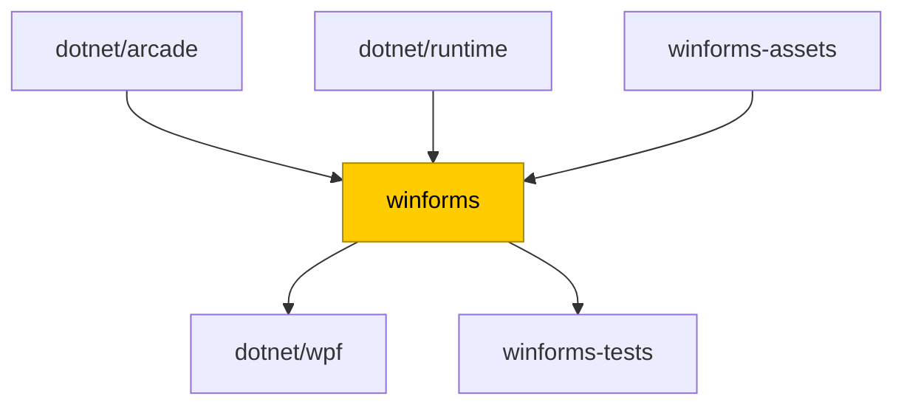
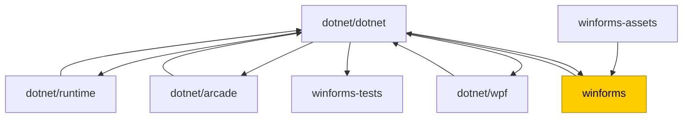

# Flat dependency flow migration FAQ

> [!NOTE]
> This is part of the [Unified Build](https://github.com/dotnet/arcade/tree/main/Documentation/UnifiedBuild) effort.

This document describes the migration of [.NET repositories](https://github.com/dotnet/dotnet/tree/main/src) from their current Maestro dependency flow to the new VMR-based flat flow which **will happen on the week of April 24th**.

## Table of contents
- [Table of contents](#table-of-contents)
- [Terminology](#terminology)
- [High-level overview of the change](#high-level-overview-of-the-change)
- [Migration process](#migration-process)
  - [Phase I - Subscription migration - April 24th](#phase-i---subscription-migration---april-24th)
  - [Phase II - Official build deprecation](#phase-ii---official-build-deprecation)
- [Example](#example)
- [FAQ](#faq)
  - [How can I see dependency subscriptions for my repository?](#how-can-i-see-dependency-subscriptions-for-my-repository)
  - [My repository is not part of the VMR. Am I still affected?](#my-repository-is-not-part-of-the-vmr-am-i-still-affected)
  - [Where can I find the official build of the VMR?](#where-can-i-find-the-official-build-of-the-vmr)
  - [Where can I find the new dependency PRs?](#where-can-i-find-the-new-dependency-prs)
  - [Can my VMR repository still subscribe to other repositories?](#can-my-vmr-repository-still-subscribe-to-other-repositories)
  - [Can my product repository still produce packages?](#can-my-product-repository-still-produce-packages)
  - [What happens to Arcade?](#what-happens-to-arcade)
  - [What happens if my repo subscribes to an older Arcade (e.g. 9.0)?](#what-happens-if-my-repo-subscribes-to-an-older-arcade-eg-90)
  - [My repo X depends on repo Y's packages. How will I get the new packages?](#my-repo-x-depends-on-repo-ys-packages-how-will-i-get-the-new-packages)
  - [I have an ongoing dependency PR in my repository with additional changes/work. What should I do?](#i-have-an-ongoing-dependency-pr-in-my-repository-with-additional-changeswork-what-should-i-do)
  - [Whom to contact and when?](#whom-to-contact-and-when)

## Terminology

- **Product repository** / **VMR repository** - A repository that is required to build the .NET SDK, and which is synchronized [into the VMR](https://github.com/dotnet/dotnet/tree/main/src).
- **Dependency flow** / **Binary flow** - Old type of Maestro subscriptions that are only flowing dependency updates, e.g. [this one](https://github.com/dotnet/sdk/pull/47085).
- **Code flow** / **Source-enabled dependency flow** - New type of Maestro subscriptions that are, together with dependency updates, also flowing sources to/from the VMR.
- **Backflow** - A PR that flows changes from the VMR back to the product repository, carrying source updates as well as dependency updates (packages built in the VMR).
- **Forward flow** - A PR that flows changes from the product repository to the VMR, carrying repository source updates.
- **Flat flow** - A new structure of subscriptions between product repositories and the VMR.

See also [Unified Build Terminology](./Terminology.md).

## High-level overview of the change

Currently, the .NET SDK is built out of a set of individual repositories which flow dependencies among each other using Maestro dependency update PRs.
The flow ends in `dotnet/sdk` where we can gather the whole dependency tree and assemble the full .NET SDK.  

> [!NOTE]
> Since .NET 8, we are also mirroring sources representing this dependency tree into the [VMR](https://github.com/dotnet/dotnet) for every commit made to `dotnet/sdk`.
> Every product repository has [a corresponding folder](https://github.com/dotnet/dotnet/tree/main/src) in the VMR.
The process is described in more detail [here](https://github.com/dotnet/arcade/blob/main/Documentation/UnifiedBuild/VMR-Code-And-Build-Workflow.md#internal-code-flow-and-releases) and [here](https://github.com/dotnet/arcade/blob/main/Documentation/UnifiedBuild/VMR-Design-And-Operation.md#source-synchronization-process).

Today's dependency tree for *product repositories* (minus `arcade`) looks something like this:

> [!CAUTION]
> Newly, the SDK will be built from the VMR instead:
> - **every repo will flow** its sources using the new source-enable Maestro subscriptions directly **into the VMR** (under `src/[reponame]`),
> - the **official builds of the product repos will stop producing packages**,
> - **the VMR will become the official build** of the product repos,
> - former dependents on product repositories will depend on and get their packages from the VMR instead (including the product repositories themselves).

The new dependency tree will look like this:

An in-depth description of this can be found [here](https://github.com/dotnet/arcade/blob/main/Documentation/UnifiedBuild/VMR-Code-And-Build-Workflow.md).

## Migration process

### Phase I - Subscription migration - April 24th

In the first phase, the Unified Build team will run a script that will redirect the subscriptions connected to VMR repositories:
- If your repo depends on a VMR repository, it will be subscribed to the VMR instead.
  - There will be [several exceptions](https://github.com/dotnet/source-build/issues/3737) when VMR repositories will keep their official builds.
    In that case, your repo will stay subscribed to the original repository.
    Once those repos turn off their official builds, the subscriptions will be migrated for you.
- If your repo depends on several VMR repositories, it will be subscribed to the VMR just once.
  - E.g. if you depend on `runtime` and `aspnetcore`, you will be subscribed to `dotnet/dotnet` only.
    All packages will flow from the VMR together in a single backflow PR.
- VMR will be subscribed to all VMR repositories and their sources will start flowing to the VMR (this is the forward flow).

### Phase II - Official build deprecation

After the main migration is done, VMR repositories will still be building in their internal pipelines.
However, for most of them, this will be extra and unnecessary.
The owners of the VMR repositories will be asked to wind down their official builds.
This can happen on their own schedule, but it is recommended to do it as soon as possible.

Further documentation will be supplied to repository owners on how to do this but, in essence,
a no-op build for every commit will still be required at first so that the build is still registered in Maestro and published into a channel.
This is so that subscriptions still trigger the same way and we don't alter the infrastructure too much at once.
However, it is expected that in the future, no builds will be required and Maestro will trigger subscriptions right after commits mirror to the internal AzDO repositories.

## Example

Let's consider the following made up example where we are migrating the `winforms` repository, which:
- Is part of the VMR,
- Builds officially via the `dotnet-winforms-ci` internal pipeline and is published to the `.NET 10` channel,
- Depends on `arcade` and `runtime` (VMR repositories),
- Depends on `winforms-assets` (a made-up, non-VMR repository),
- Flows into one VMR repository `wpf` and one non-VMR repository `winforms-tests`.

So the setup looks like this:

After the migration, the setup will look like this:

The `runtime` and `arcade` dependencies will flow into `winforms` through the VMR, and the `winforms-assets` dependency will still flow directly into `winforms` (as it's not part of the VMR). The `winforms-tests` repository will newly depend on the VMR instead of `winforms` and will get its packages from the VMR.

## FAQ

### How can I see dependency subscriptions for my repository?
Either use the [Maestro website](https://maestro.dot.net/subscriptions) or use the [`darc get-subscriptions`](../Darc.md) command.

### My repository is not part of the VMR. Am I still affected?
If your repository has subscriptions to a repository that is [part of the VMR](https://github.com/dotnet/dotnet/tree/main/src) and is **not** keeping its official build, your repository will be subscribed to the [VMR](https://github.com/dotnet/dotnet) (`dotnet/dotnet`) instead.
Some VMR repositories will keep their original official build though.

### Where can I find the official build of the VMR?
The official build of the VMR is [dotnet-unified-build](https://dev.azure.com/dnceng/internal/_build?definitionId=1330).

### Where can I find the new dependency PRs?
The dependency PRs look almost the same as the old ones and are still [authored by the `dotnet-maestro` bot](https://github.com/pulls?q=sort%3Aupdated-desc+is%3Apr+author%3Aapp%2Fdotnet-maestro+archived%3Afalse+).  
The forward flow PRs will be opened [against the VMR](https://github.com/dotnet/dotnet/pulls/app%2Fdotnet-maestro) while the backflow PRs will be opened in your repository and named something like `[branch] Source code changes from dotnet/dotnet`.

### Can my VMR repository still subscribe to other repositories?
Yes, you can still set up regular subscriptions to other repositories.
However, **consider subscribing to other VMR repositories** - most of those will turn off their official builds and their packages will flow into your repository from the VMR.
Subscriptions to repositories that will move their official builds into the VMR will be migrated for you during this process.
Subscriptions to repositories that will deprecate their official builds later will change the subscriptions to their dependents then.

### Can my product repository still produce packages?
Yes, though keep in mind two things:
- These package identities must not overlap with the VMR produced packages. The VMR already takes steps to ensure that version numbers do not overlap.
- Repositories that ship via the dotnet release process (e.g. runtime or aspnetcore) must ship all of their outputs via the VMR.
[Reach out to us](#whom-to-contact-and-when) if you need help with this.

### What happens to Arcade?
Arcade's official build will stay as-is and people can depend on it the same way as before.
It will, however, be also built in VMR's official build so it's possible to subscribe to the VMR too.  
It technically won't matter if you depend on `dotnet/dotnet` or `dotnet/arcade` as the packages produced should be practically the same.

Arcade will also keep its validation loop through `dotnet/arcade-validation`.

### What happens if my repo subscribes to an older Arcade (e.g. 9.0)?
If your repository is not part of the VMR, nothing will change, you will still be subscribed to the same Arcade (channel).

If your repository is part of the VMR, the following situation arises.
Since you will be subscribed to the VMR, the backflow PRs would try to update your repository to the same Arcade version as VMR (latest).
For this reason, **if your VMR repository depends on older Arcade**:
- The newly created backflow subscriptions will be configured to exclude Arcade (setting on the subscription itself).
- Your repository will stay subscribed to Arcade and receive Arcade updates the same way as before.

> [!NOTE]
> The above means that your repo builds using a different Arcade than what happens during the VMR build.
> This has already been the case for some time though (for Source Build scenarios) and the build might just work.
> It is not ideal and you should strive to eventually update your repository to use the latest Arcade.
> However, in some repositories, this is very difficult or not desired and you can keep operating as before.
>
> It is though recommended to consider adding VMR-insertion based validation into your repository PR builds.
> If you need help with this, please reach out to us.

### My repo X depends on repo Y's packages. How will I get the new packages?
If repo Y is part of the VMR, you will depend on the VMR instead of repo Y.
The packages will be produced by the official VMR build and published to the `.NET 10 UB` channel.  
The target feed for some packages might change from `dotnet-eng` to [`dotnet10-transport`](https://pkgs.dev.azure.com/dnceng/internal/_packaging/dotnet10-transport/nuget/v3/index.json).

Furthermore, if you depend on multiple VMR repositories, you will get all the packages in a single backflow subscription (PR).

### I have an ongoing dependency PR in my repository with additional changes/work. What should I do?
Finish the PR as you would normally. If there are conflicts with the newly merged backflow PRs, feel free to tag **@dotnet/product-construction** on the PR and we will help you resolve those.

### Whom to contact and when?
If you need help or have questions around the new flow, please either
- tag the **@dotnet/product-construction** team on your PR/issue,
- use the [First Responder channel](https://teams.microsoft.com/l/channel/19%3Aafba3d1545dd45d7b79f34c1821f6055%40thread.skype/First%20Responders?groupId=4d73664c-9f2f-450d-82a5-c2f02756606d),
- open an issue in [dotnet/arcade-services](https://github.com/dotnet/arcade-services/issues/new?template=BLANK_ISSUE),
- or contact the [.NET Product Construction Services team](mailto:dotnetprodconsvcs@microsoft.com) via e-mail.
