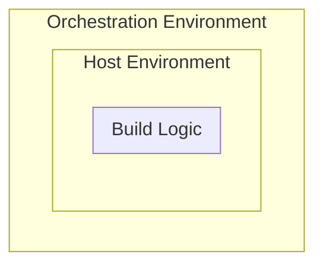

# The Unified Build Almanac (TUBA) - Foundational Concepts

## Purpose
This document describes the foundational concepts of Unified Build. The basic principles, the pillars upon which it is built, the goals, etc.

## Introduction

Unified Build for .NET is a combined effort to improve two problematic areas for .NET:
- **True upstream model** – Partners are efficient and can do the same things Microsoft can.
- **Product build and servicing complexity** – Taming .NET's incredibly complex infrastructure.

.NET is a collection of repositories that collectively ship together to form a coherent product. Each individual repository in the graph contributes build outputs that are consumed in other repositories, and potentially shipped to customers. Therefore, a 'build' of .NET is not just a build of a single repository. .NET maintains two ways of building this product. 
- **Source-build** - Building an *aggregate* of all of the repositories on a single machine (no orchestration) in a single configuration to produce a .NET SDK that is shippable by our Linux source-build partners.
- **Microsoft's official build** - The process of building each node in the dependency graph, updating any downstream repo with newly produced outputs, testing and committing those updates, and then repeating until all changes have flowed through the graph to all possible downstream nodes. As you might imagine, this process is complex. New changes in repositories reset the build. Coordinating branch management for more than a dozen repositories across multiple releases of .NET is challenge. There is a high degree of infrastructural overhead. Furthermore, even within repository builds there tends to be a large degree of complexity and orchestration.

Maintaining both these methodologies is expensive. There are meaningful differences between how source-build and Microsoft's official build produce binaries. There are different restrictions on what inputs are allowed to be used in source-build as compared to Microsoft's build. Even more, the source-build methodology today does not support building Windows. From a community perspective, these differences contribute to a lack of approachability and an inability to have a meaningful upstream/downstream model for collaboration.

One insight is that Microsoft's build, source-build, and meaningful upstream/downstream collaboration are **overlapping problems**, and can be satisfied by the same solution if considered together. Our whole-product repo structure is very costly for us and unapproachable by others. We have spent a lot on these topics over the years, with hard-won progress, and no end in sight. A different repo design-point could provide us with a better and cheaper system.

**Proposition** Focusing on the source-build philosophy (aggregate code base is the source-of-truth) as the way that the community **and** Microsoft produce the product will drastically improve development operations, servicing, and community interaction.

## Unified Build goals

The following are goals and that will be met by the Unified Build project. Please note that ".NET distro maintainers" includes Microsoft.

- A single git commit denotes all product source for a particular .NET build. All commits are coherent
- A single repo commit can produce a shippable build
- .NET's build shall be able to create a specific platform's distribution in a single build environment.
- .NET distro maintainers shall be able to efficiently update and build .NET (both collaboratively and separately) through the entire lifecycle of a .NET version (first to last commit).
- .NET distro maintainers can produce downstream distributions without use of Microsoft provided services.
- .NET distro maintainers shall be able to meet provenance and build environment requirements for their distributions.
- .NET distro maintainers shall be able to coordinate patching of downstream distributions.
- .NET distro maintainers can run verification tests against the built product.
- .NET developers shall be able to easily produce full product builds for testing, experimentation, etc.
- .NET developers shall be able to work efficiently on the section of the product for which they are concerned.

## High-Level Overview

At a high level, the following changes will be made:

### **Source-build becomes the official build**

Source-build builds the product as an aggregate codebase, which is a simpler, more reliable model than Microsoft's current official build. It is now proven and has been adopted by partners. Microsoft’s current official build will cease to exist. Logically, this means that the .NET product will be built as a series of **vertical builds** for each platform. Assets produced by these verticals will be shipped by Microsoft and its partners (Linux distros, homebrew developers, etc.). There will also exist a join point that will be used to produce assets that require multiple platforms (e.g. global tool packages). This join point may only be used for assets that are not distributed by our partners, and must remain as simple as possible.

### **Product builds move to a “virtual monolithic repository” (VMR)**

.NET's official code base moves to a “virtual monolithic repository”, which is a source layout of all the code needed to build .NET. Most existing dependency flow between repositories ceases, and instead the product builds out of this single coherent source repository. Source changes in individual repositories flow into the VMR, and product build outputs and any associated VMR source changes flow *back* into individual repositories to enable up-to-date development workflows.

### **Testing will be augmented and extended for the VMR**

The testing infrastructure will be augmented to support both individual repos *and* the aggregate VMR. Additional tests will be added for end to end product testing. This will enable Microsoft and its source-build partners to more effectively evaluate quality.

### **Upstream partners primarily focus on the VMR structure**

The VMR focused build enables partners to build and test .NET more easily. This should enable them to more effectively contribute when desired. While they of course may contribute to either the VMR or individual repos, it's expected that they will choose to work in the VMR.

### **Individual developers continue to work primarily in individual repositories for mainline development**

Though they may work in the VMR, it is expected that many developers will continue to primarily work in the individual repositories for mainline development, especially those developers who focus on specfic areas of .NET. Maintaining the individual repository workflows enables high-velocity development for changes in isolated components. It also allows for continued community building in specific product areas. Cross-repo breaking changes will be resolved in the VMR, then build outputs and additional source changes will flow back into the individual repositories.

## Rules of Unified Build

Unified Build and the associated infrastructure are built around the rules outlined below, with their associated reasoning. There are two motivations behind these rules: 

- **Enabling any .NET distro maintainer to succeed** - Microsoft is the primary maintainer of the .NET upstream. Our choices about infrastructure technologies and build methodologies have real effects on our downstream partners, like RedHat, Canonical, or Unity. If we make poor choices, we make it harder or even impossible for our partners to be successful in delivering the product to their customers. While Microsoft has the vast engineering resources to be able to build, service and deliver to all sorts of customers in all manner of scenarios, this is not without cost. To grow our product the way we want, we need to enable our partners to serve their customers without handholding.
- **Enabling Microsoft to succeed as a distro maintainer** – The biggest issue around Microsoft’s infrastructure for .NET 7 and prior releases has been the overall complexity. Complexity has resulted in unreliability, high maintenance costs, build and release processes that are fragile over time, and infrastructure that is harder to understand. We’ve often tried to tame this complexity with automation, which usually exacerbates the problem rather than solving it. It is time to target simplicity, reproducibility, isolation and long-term sustainability.

### **Public open-source .NET releases must be buildable by .NET distro maintainers from a single commit in the upstream repository.**

*This rule focuses on ensuring we can continue to release a subset of .NET as an open-source product, and enabling our non-Microsoft partners to take advantage of the source to deliver value to their customers.*

.NET uses various licenses for the publicly released products. These licenses may vary across versions and artifacts. For instance, the Windows SDK is not completely open-source (as it contains some non-OSS components). On the other hand, for instance, the Linux .NET SDKs are an open-source product. What Microsoft builds and releases through its channels must remain compatible with the licenses that we place on them. For those releases that are open-source, we also want to enable our partners to build those same commits and release them to their customers. Doing so requires complying with their OSS and build requirements. In general, to meet those requirements, they need to be able to build them entirely from source code on a single machine without a connection to the internet.

While our partners may not always build what they release based on the upstream, as they may use private pre-release channels to obtain sources of upcoming versions, those releases must eventually be made open-source in the upstream to maintain their open source status.

***Note: What Microsoft builds and releases for Linux, macOS or any other platform, is not intended to be ‘bit for bit’ identical with what a partner may be able to build using the upstream. Signing, for example, results in a slightly different product. The product shall be functionally identical***

### **The build shall not require any orchestration to build artifacts for a specific platform distribution**

*This rule focuses on simplicity for .NET distro maintainers, including Microsoft, and ensuring that .NET distro maintainers can meet provenance and build environment requirements.*

Orchestration is most associated with CI systems, though other systems like Maestro also provide orchestration in some forms. Orchestration, while useful, tends to:
- Encourage complexity
- Add fragility to the overall build process because of an increased use of distributed services.
- Encourage multi-machine workflows, which are incompatible with many organizations' build requirements.
- Be tied to specific distributed services, which adds a point of fragility and vendor-lock-in.
- Become interwoven with the build, rather than properly layered.

In practice, all organizations will use orchestration to construct a product. Microsoft will do so too. However, orchestration must be properly isolated and layered so that platform specific artifacts built by .NET distribution maintainers can be built on a single machine without orchestration. Microsoft and other .NET distributions might maintain some orchestration in the following cases:
- A join point in the product build used to produce artifacts that cannot be produced in a single environment. Note: these joins may not be designed in such a way that they cause any organziation to violate their build environment requirements. For example, .NET may not design the build such that a Linux SDK distribution requires assets built on a Windows machine, as that would violate the build environment requirements of Linux distro maintainers.
- Orchestration used to prepare an environment for a build. This is perhaps the most common use of orchestration.

 
### **The build produces all *shipping* artifacts that each .NET distribution is responsible for deploying**

*This rule focuses on simplicity and robustness.*

.NET has used a multi-repository build through .NET 7. Through a combination of individual repository builds, dependency flow and tracking, the shipping artifacts for a given release are produced. In the release process, the dependency tracking system (Maestro) traverses the graph of individual repository builds contributing to a given release, locating and downloading all the artifacts marked as shipping. These artifacts are then modified and shipping.

This multi-build ‘gathering’ process is not allowed in Unified Build. The VMR build must produce all artifacts that are to ship. If gathering were to be allowed, this would imply that orchestration could be required to build product (dependency flow through multiple repos), and that external services (Maestro) would be required to track the artifacts in more than one repo build.
*Note: This is not to say that Maestro cannot be used in some capacity for VMR operation. It just cannot be required. An allowable use may be to flow non-stable, non-shipping assets referenced by the VMR, like test or optimization data.*

### **There may be no pre-release, non-final stable binary flow**

*This rule focuses on simplicity and robustness.*

Stable binary flow is defined as any flow of binaries from a build to a repository, where:
- The identity of those binaries does not vary from build to build with respect to their packaging systems **and**
- Binaries with the same identity are produced *more than once*.

This flow is commonly used in RTM/Servicing releases of .NET. Stable binary flow has been extremely costly to implement and makes the shipping product harder to understand. The basic problems are:
- It bends the rules of the packaging systems, like NuGet, by introducing multiple packages with the same identity into different feeds.
- Bending packaging system rules requires introducing complex automation to manage those packages. This automation is required to ship the product.

Multiple Packages/binaries with the same identity, may not flow into or out of .NET's build.

*Note: There are exceptions to this rule for testing.*

### **Artifacts may not be modified after the build is complete**

*This rule focuses on simplicity and robustness.*

- Modification of artifacts outside of the build tends to generate additional complexity in the build itself, in the need to propagate information guiding the modification. For example, post-build signing in .NET 6 required propagating information about signing certificates, files to sign, and pre-link MSI data to the staging process.
- Modification also generates additional complexity post-build, not only simply because of the additional steps themselves, but also because they tend to need to recreate a portion of the state of the build itself. For example, post-build signing in .NET 6 needed to determine exactly where each file it is signing came from in the build in order to determine the signing certificates to use.
- Modification often generates a second set of artifacts with the same identities as the originals artifacts but with different contents. For instance, if a package Foo @ 1.0.5 is modified by signing it, the contents of the package change. However, NuGet as a protocol does not have a way to address one over the other. Simple files, and symbols have similar issues. This leads to potential pitfalls for customers as well as complexity within Publishing processes, since the primary way to mitigate having multiple artifacts with the same identity is to put them in different places.

### **Build and publishing are separate, and the build shall not publish**

*This rule focuses on simplicity, separation of concerns, and helping our .NET distro maintainers succeed.*

The build shall not publish its outputs. This is always a separate stage or stages after the Build.

- Publishing is often highly tied to organizational specific resources. For example, .NET publishes to Microsoft’s symbol servers, Azure DevOps feeds, build pipeline storage, and many other locations.
- The source code should not know the purpose of a build. Purpose should be declared after a build is complete based on choice of publishing steps. This is the approach that .NET uses today with channel assignment. By separating build and publish, .NET can use the same set of build steps for builds of all purposes (e.g. private internal, dev, public, security servicing). The source does not need to be modified based on what a build should be used for or what its visibility should be.

Instead, we should stage the build such that the Build is sandwiched environment preparation and publishing steps.

## Scope - Who Participates?

The term ".NET" tends to encompass many repositories and assets and tends to mean different things to different people. There is broad acceptance that the dotnet/runtime and dotnet/aspnetcore repositories are part of .NET, since they produce the shared frameworks, but what about dotnet/machinelearning? It produces assets that are highly related to .NET, shares an engineering system, but doesn’t ship in-box in the main SDK product, which is also clearly part of ".NET".

Rather than defining the scope of Unified Build by the term “.NET”, which is a bit squishy, Unified Build is instead defined in terms of the [Rules of Unified Build](#rules-of-unified-build).

*For a given repository or piece of code:*
- If its exclusion from Unified Build would violate the Rules of Unified Build, the repository is included in Unified Build.
- Conversely, if a repository’s inclusion in Unified Build were to violate the Rules of Unified Build, OR legal restrictions on that piece of code, the repository or piece of code is not included in Unified Build.

## Pillars of Unified Build

### **Source-Build Methodology**

As noted in the introduction, .NET builds in two ways today; the distributed, build-and-flow method used to produce Microsoft's official builds, and source-build. Source-build is simpler, more reliable, and compliant with the needs of organizations who require hermetically sealed builds. To simplify .NET's build and ship processes, it makes sense to converge and use source-build across all platforms.

Using the "source-build methodology" across all platforms deserves some clarification and definition. Through .NET 7, source-build has meant the ability to build a functional .NET SDK (with associated runtimes) using only a source-layout and a set of inputs that can also be built from source (or are allowed by the organization performing the build). Practically, this means that any dependencies of the SDK and its components (e.g. NewtonSoft.Json, System.CommandLine) that would normally flow into the product as *binaries* must instead be built in the source-layout. No "pre-builts". This often a difficult bar to clear. .NET has many dependencies, used in various scenarios. Many of its components build in dependencies that aren't even relevant to the SDK. Making .NET source-buildable involves careful detection and evaluation of dependencies, bringing in new source to the build in some cases, and trimming unnnecessary configurations in others.

This specific "single machine, all source" source-build approach is likely an impossible bar to clear for some other platforms. Windows and Mac SDKs may redistribute closed-source components built by other teams or other companies, or use functionality at build-time functionality that can't be built from source. Furthermore, the .NET product encompasses a number of components that simply cannot be built easily on a single machine. Workload installers, for instance, include binaries only buildable on Mac and Linux. While *product* changes could be made to eliminate such cases, this is a massive undertaking.

Applying the source-build methodology across the entire .NET build means applying the aggregate source build methodology across all platforms for a certain set of components. The set of compoents that participate is defined in [Who Participates](#scope---who-participates). The set of allowable pre-builts will vary based on platform, and will be tailored to the requirements of those organizations that are most interested in distributing those platforms. A **single** multi-platform join will exist, where assets that cannot be produced in each independent platform build are created. This join may not be allowed for certain organizations (because it violates single machine build-from-source principles), and so .NET must take care to design features and infrastructure so that .NET distro maintainers can the meet provenance and build environment requirements for their distributions. For example, since RedHat wishes to distribute the .NET SDK in their feeds, all assets required for the production of that .NET SDK must be buildable from source without the join. .NET is heavily incentived to keep a single join, and the use of this join to a minimum in order to:
- Keep the product build simple.
- Avoid bifurcation of .NET's build into two methods again (Microsoft's .NET build is just a build with hundreds of joins and a distributed source base).
- Enable as many .NET distro maintainers to be successful. Building on a single machine is about as simple as it gets.
- Keep product development simple and easy.

### **Hybrid Monolithic/Componentized Repository Design**

.NET’s traditional multi-repo, dependency-graph-based, build model is highly inefficient. A multi-repo repository graph requires at least N commits to produce a coherent product, where N is the number of edges visited on each possible path through the dependency graph. Each new release requires changes to all N repositories. The graph is harder to understand the more edges it has, and mechanically it is very difficult to determine whether the graph is in a correct state for release. Each edge also represents a serialization point and a significant source of product build inefficiency. Binaries must be published, build machines must be deallocated and re-allocated, pull requests must be opened and validated to update binaries, etc.

An obvious solution is to reduce the number of edges by combining repositories. At the most extreme, the number of repositories could be reduced to a single monolith. Monolithic repositories have numerous advantages even beyond build efficiency when looking at a product from a 5000-foot view. For example, source diffs are constrained to actual product changes, and the product can carry no incoherency. Monolithic repositories are more amenable to hermetically sealed builds, which are desirable and required for many organizations. However, monolithic repositories carry their own drawbacks. To be efficient for individual developers, they require advanced build systems to avoid costly incremental builds. They are large and can be harder to understand for users lack familiarity with the codebase. If the project is oriented around GitHub’s design, a monolith groups together various communities who may or may not be related.

To solve this, the Unified Build project prescribes a “best of both worlds approach”, recognizing that monolithic repositories are essential to efficient builds, align with our Linux partner’s approaches to product builds, and enable predictable servicing and fix delivery, while smaller development repositories are far better for community, individual developer productivity in typical scenarios, and can promote better layering.

.NET will use development repositories for day-to-day development, and a “Virtual Monolithic Repository” (VMR) for all product builds, servicing and upstream collaboration.

### **The VMR (Virtual Monolithic Repository)**

A VMR is a source layout projection of a set of separate input repositories into a single repository. Unlike a repository with a set of submodules, this repository is a source copy of the input repositories. The intention is that a single commit can be used to update the VMR. This contrasts with a submodule-oriented approach, where at least two commits are required for each change. Each input repository maps onto a specific subdirectory of the VMR. In certain cases, a specific repository may map multiple times into the repository to satisfy build needs (e.g. multiple SDKs, or multiple versions of a specific component). Each input repository may (and generally are required to) choose a subset of their sources to map into the VMR.

The VMR serves as the build repository for the .NET Unified Build product. Rather than building as a set of independent repositories and flowing dependencies among them, the entire coherent source of the product is cloned at a single time and built using the source-build methodology.
