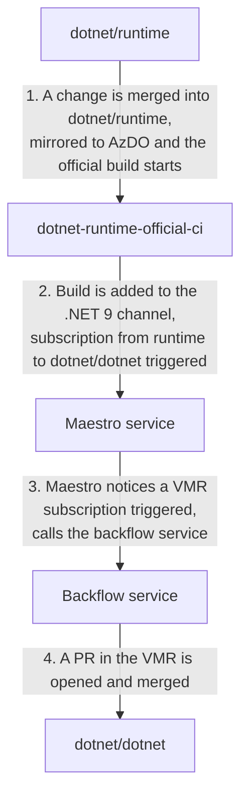
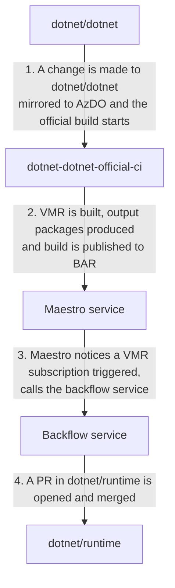
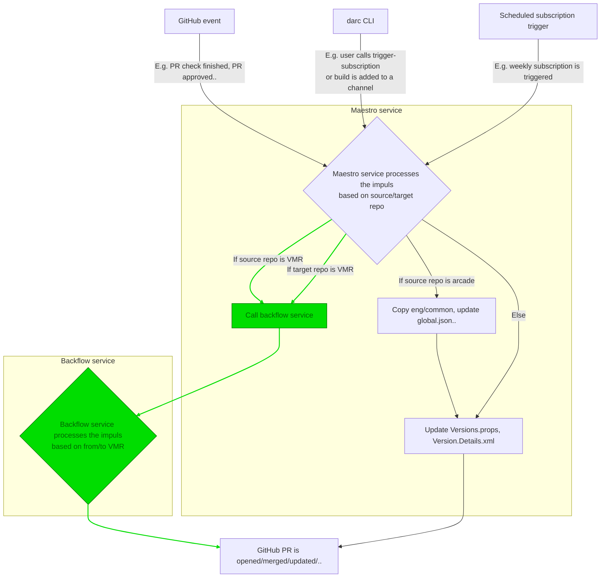
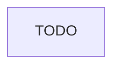

# Full VMR code flow

## Purpose

This document describes the architecture of the full code flow between product repositories and the VMR.

## Terminology

This section presents more precise definitions of common terms used in this document that may be prone to confusion. Also see the [Unified Build terminology](./Terminology.md) for more.

- **Individual/Source/Product repository** – One of the current development repositories, e.g., `dotnet/runtime`. An "individual product repository" is then one that contains code for part of the product (but no individual repository contains code to build the whole .NET Core product).
- **VMR (Virtual Monolithic Repository)** – A repository containing code layout that produces the official build product of .NET Core. The repository contains individual product repositories plus tooling to enable a full build of the product.
- **Source-Build** – A set of sources and a process which allows to build the entire product end to end including all its dependencies in offline mode, excluding native dependencies from the source.
- **Microsoft build** – The current build methodology used to assemble the final product that Microsoft ships binaries from.
- **Build output packages** – Packaged build products of each of the individual repositories either built in their individual repo source-build or during the build of each individual repository component within the full VMR build. These are used during package flow between the VMR and the individual repositories, and in the VMR build itself.
- **BAR / Build Asset Registry** - A database of build assets (e.g. packages) and their associated metadata (e.g. commit, build number, etc.). For more information about BAR, see the [BAR documentation](https://github.com/dotnet/arcade/blob/main/Documentation/Maestro/BuildAssetRegistry.md).
- **Maestro** - A service used by the .NET team to manage dependency flow between repositories. For more information about channels, subscriptions and other Maestro concepts, see the [Maestro documentation](https://github.com/dotnet/arcade/blob/main/Documentation/BranchesChannelsAndSubscriptions.md). 
- **Forward flow** – The process of moving changes from an individual repository to the VMR.
- **Backflow** - The process of moving changes from the VMR to an individual repository.

## High-level overview

### Forward flow

The high-level flow of changes from an individual repository (e.g. `dotnet/runtime`) to the VMR is as follows:

The numbered steps are described in more detail below:

1. This is the current normal process for making a change to an individual repository. Nothing changes.
2. Currently, each official build of each repo publishes itself via darc which registers the commit and the set of built packages into the BAR and is assigned to zero or more channels. There is a lot of configuration effort in which repositories publish from which branches to which channels. We intend to keep this existing setup in place and piggy back on this. The only change to the current state is that we will subscribe to channels from the VMR. Possibly, these subscription will get a special flag to indicate that they are VMR subscriptions, e.g. `CodeFlow=true`.
3. Maestro already listens to BAR events (to builds being added to channels) and triggers the appropriate subscriptions. For VMR subscriptions, it will call the backflow service which will process the request on its own time (e.g. stores requests in a queue and works through them). The initial call from Maestro should be just a quick ping that will enqueue the request.
4. The backflow service will process the request by looking at the commit of the source repo that was synchronized to the VMR last by looking at the (`source-manifest.json` file)[https://github.com/dotnet/dotnet/blob/main/src/source-manifest.json]. It will then apply the diff between that commit and the one that is associated with the build information in BAR. The details of this step are described below in (#TODO)[#TODO].

From this, it is obvious that the changes needed in the Maestro changes and the BAR database are minimal. The new backflow service will be the main new component. It will, however, re-use a lot of already existing code from Maestro (namely (`DarcLib`)[https://github.com/dotnet/arcade-services/tree/main/src/Microsoft.DotNet.Darc/DarcLib]).

> TODO: Consider baking the new functionality directly into Maestro. Pros: Less new infrastructure. Cons: Not sure Service Fabric can handle the disk space requirements of the VMR and that the computation model is a good fit for a long living service that needs to hold onto the already cloned repositories.

### Backflow

For backflow, the situation is quite similar:

The only difference from the forward flow is that the VMR creates and publishes build output packages which **TODO**. These packages are then used by the individual repositories during their partial source-building and their versions must be updated in the individual repositories.  
The last step is again described below ((#TODO))[#TODO].

## Implementation plan

### Backflow service

For the purpose of flowing the code from/to the VMR, we will create a new service. This service will be called by Maestro when a VMR subscription is triggered. It will then perform the actual work of creating the PRs in the individual repositories or in the VMR.

The following diagram roughly shows how these services will be composed (new components are in green):

### Why new service?

We have decided to not put the backflow functionality directly into Maestro for the following reasons:
- The backflow service will need to clone the VMR and individual repositories. This will require a lot of disk space and we are not sure if Service Fabric can handle this.
- The backflow service will be long living and persisting the cloned repositories to speed up the synchronization process. This is again something that might be difficult to achieve using Service Fabric actors.
- The Maestro service is very stable and not receiving many changes so we will implement this new functionality in a separate service to avoid introducing new bugs into Maestro.
- The local development workflow will be much easier if we can run the backflow service locally without having to run the whole Maestro service fabric cluster.
- We plan to use a more modern technology such as Azure Container Apps. Once we have stabilized the Backflow service, whichever of these two technologies proves to be better, we will merge those. This should be fairly simple as both will use `DarcLib` to perform the actual work.
- We expect that moving to ACA will be easier as Maestro itself doesn't have many complex requirements and once we have both, moving existing Maestro controllers and background services to ACA should be fairly simple. The other way might be harder because of the disk space limitations.

### Composition of DarcLib commands

Presently, the `DarcLib` library contains a set of simple commands which are used by the Maestro service to perform its tasks. Number of them can also be executed locally via the Darc CLI.  
As an example, there is the `update-dependencies` command which locally updates the versions of dependencies of a repository. The same command is run within Maestro to create the dependency flow PR.

The Darc CLI currently contains a subset of VMR commands and is used to synchronize the present VMR-lite. The new backflow service should use a similar pattern and follow the existing non-VMR counterparts. For instance, a `darc vmr update-dependencies` command will be added.

Once we have the set of commands that can forward/backflow the code locally, we can compose the service out of these.

## Handling concurrent changes

Once we start accepting changes in the VMR, the process of figuring out the diff between the last synchronized commit and the current commit in the VMR will become more complicated. We need to understand which changes come from being behind and which are new ones. This is especially important for the backflow case where we need to make sure that we don't overwrite changes that were made in the individual repository after the last synchronization.

