# Full VMR code flow

## Purpose

This document describes the architecture of the full code flow between product repositories and the VMR.

## Terminology

This section presents more precise definitions of common terms used in this document that may be prone to confusion. Also see the [Unified Build terminology](./Terminology.md) for more.

- **Individual/Source/Product repository** – One of the current development repositories, e.g., `dotnet/runtime`. An "individual product repository" is then one that contains code for part of the product (but no individual repository contains code to build the whole .NET Core product).
- **VMR (Virtual Monolithic Repository)** – A repository containing code layout that produces the official build product of .NET Core. The repository contains individual product repositories plus tooling to enable a full build of the product.
- **Source-Build** – A set of sources and a process which allows to build the entire product end to end including all its dependencies in offline mode, excluding native dependencies from the source.
- **Microsoft build** – The current build methodology used to assemble the final product that Microsoft ships binaries from.
- **Build output packages** – Packaged build products of each of the individual repositories either built in their individual repo source-build or during the build of each individual repository component within the full VMR build. These are used during package flow between the VMR and the individual repositories, and in the VMR build itself.
- **BAR / Build Asset Registry** - A database of build assets (e.g. packages) and their associated metadata (e.g. commit, build number, etc.). For more information about BAR, see the [BAR documentation](https://github.com/dotnet/arcade/blob/main/Documentation/Maestro/BuildAssetRegistry.md).
- **Maestro** - A service used by the .NET team to manage dependency flow between repositories. For more information about channels, subscriptions and other Maestro concepts, see the [Maestro documentation](https://github.com/dotnet/arcade/blob/main/Documentation/BranchesChannelsAndSubscriptions.md). 
- **Forward flow** – The process of moving changes from an individual repository to the VMR.
- **Backflow** - The process of moving changes from the VMR to an individual repository.

## High-level overview

### Forward flow

The high-level flow of changes from an individual repository (e.g. `dotnet/runtime`) to the VMR is as follows:


The numbered steps are described in more detail below:

1. This is the current normal process for making a change to an individual repository. Nothing changes.
2. Currently, each official build of each repo publishes itself via darc which registers the commit and the set of built packages into the BAR and is assigned to zero or more channels. There is a lot of configuration effort in which repositories publish from which branches to which channels. We intend to keep this existing setup in place and piggy back on this. The only change to the current state is that we will subscribe to channels from the VMR. Possibly, these subscription will get a special flag to indicate that they are VMR subscriptions, e.g. `CodeFlow=true`.
3. Maestro already listens to BAR events (to builds being added to channels) and triggers the appropriate subscriptions. For VMR subscriptions, it will call the backflow service which will process the request on its own time (e.g. stores requests in a queue and works through them). The initial call from Maestro should be just a quick ping that will enqueue the request.
4. The backflow service will process the request by looking at the commit of the source repo that was synchronized to the VMR last by looking at the (`source-manifest.json` file)[https://github.com/dotnet/dotnet/blob/main/src/source-manifest.json]. It will then apply the diff between that commit and the one that is associated with the build information in BAR.

From this, it is obvious that the changes needed in the Maestro changes and the BAR database are minimal. The new backflow service will be the main new component. It will, however, re-use a lot of already existing code from Maestro (namely (`DarcLib`)[https://github.com/dotnet/arcade-services/tree/main/src/Microsoft.DotNet.Darc/DarcLib]).

### Backflow

For backflow, the situation is quite similar:


The only difference from the forward flow is that the VMR creates and publishes build output packages which are then flown back to the original repositories.

## Implementation plan

### Backflow service

For the purpose of flowing the code from/to the VMR, we will create a new service. This service will be called by Maestro when a VMR subscription is triggered. It will then perform the actual work of creating the PRs in the individual repositories or in the VMR.

The following diagram roughly shows how these services will be composed (new components are in green):


On the diagram we can see:
1. An external trigger starts a process in Maestro which means a subscription needs to be handled.
2. The logic for handling the trigger is mostly the same as today. Maestro checks the source and target repository and prepares the update:
   - For the VMR, it will newly call a new service.
   - Otherwise, it opens a regular dependency PR where for subscriptions originating in Arcade it also copies the `eng/common` folder and updates the `global.json` file.
3. The call to the backflow service only pings it to start processing the request. The backflow service will then process the request on its own time. Meanwhile, Maestro will note down that it's waiting for the backflow service to finish.
4. The backflow service will synchronize the new content and push it into a branch.
   - If this is a branch of an already existing PR, the PR will be updated.
   - If this is a branch for a new PR, the PR will be created by Maestro later.
5. Maestro will process the ping and check what stage the PR is in or create a new one.
   - The ping must also contain information about whether any new changes are even available.
   - It's possible the PR got already merged or closed so Maestro will need to work with these cases.

### Why new service?

We have decided to not put the backflow functionality directly into Maestro for the following reasons:
- The backflow service will need to clone the VMR and individual repositories. This will require a lot of disk space and we are not sure if Service Fabric can handle this.
- The backflow service will be long living and persisting the cloned repositories to speed up the synchronization process. This is again something that might be difficult to achieve using Service Fabric actors.
- The Maestro service is very stable and not receiving many changes so we will implement this new functionality in a separate service to avoid introducing new bugs into Maestro.
- The local development workflow will be much easier if we can run the backflow service locally without having to run the whole Maestro service fabric cluster.
- We plan to use a more modern technology such as Azure Container Apps. Once we have stabilized the Backflow service, whichever of these two technologies proves to be better, we will merge those. This should be fairly simple as both will use `DarcLib` to perform the actual work.
- We expect that moving to ACA will be easier as Maestro itself doesn't have many complex requirements and once we have both, moving existing Maestro controllers and background services to ACA should be fairly simple. The other way might be harder because of the disk space limitations.

### Composition of DarcLib commands

Presently, the `DarcLib` library contains a set of simple commands which are used by the Maestro service to perform its tasks. Number of them can also be executed locally via the Darc CLI.  
As an example, there is the `update-dependencies` command which locally updates the versions of dependencies of a repository. The same command is run within Maestro to create the dependency flow PR.

The Darc CLI currently contains a subset of VMR commands and is used to synchronize the present VMR-lite. The new backflow service should use a similar pattern and follow the existing non-VMR counterparts. For instance, a `darc vmr update-dependencies` command will be added.

Once we have the set of commands that can forward/backflow the code locally, we can compose the service out of these.

## Handling concurrent changes

Once we start accepting changes in the VMR, the process of figuring out the diff between the last synchronized commit and the current commit in the VMR will become more complicated. We need to understand which changes come from being behind and which are new ones. This is especially important for the backflow case where we need to make sure that we don't overwrite changes that were made in the individual repository after the last synchronization.

Conflicts seem to need double resolutions at times:

```mermaid
sequenceDiagram
    autonumber

    participant runtime as dotnet/runtime
    participant VMR as VMR<br>src/runtime

    Note over runtime, VMR: runtime and VMR are synchronized at 🔖001
    runtime->>runtime: 📄 A.txt is deleted<br>🔖002
    VMR->>VMR: 📄 A.txt is changed<br>🔖003

    VMR-->>runtime: Backflow PR with 🔖003 is opened<br>base commit is 🔖001
    activate runtime
    Note over runtime: ❌ Backflow PR has a conflict with 🔖002
    runtime->>runtime: ✔️ Conflict is manually resolved<br>A.txt is deleted
    runtime->>runtime: PR is merged<br>🔖004
    deactivate runtime

    runtime-->>VMR: VMR is synchronized from 🔖002 to 🔖004<br>base commit is 🔖001
    activate VMR
    Note over VMR: ❌ Backflow PR has a conflict with 🔖003
    VMR->>VMR: ✔️ Conflict is manually resolved<br>A.txt is deleted
    deactivate VMR
```

```mermaid
sequenceDiagram
    autonumber

    participant runtime as dotnet/runtime
    participant VMR as VMR<br>src/runtime

    Note over runtime, VMR: runtime and VMR are synchronized at 🔖001
    runtime->>runtime: 📄 A.txt is deleted<br>🔖002
    VMR->>VMR: 📄 A.txt is changed<br>🔖003

    runtime-->>VMR: Backflow PR with 🔖003 is opened<br>base commit is 🔖001

    activate VMR
    Note over VMR: ❌ Backflow PR has a conflict with 🔖003
    VMR->>VMR: ✔️ Conflict is manually resolved<br>A.txt is deleted
    VMR->>VMR: PR is merged<br>🔖004
    deactivate VMR

    VMR-->>runtime: 🔖003, 🔖004 are synchronized<br>base commit is 🔖001
    activate runtime
    Note over runtime: ❌ Backflow PR has a conflict with 🔖002
    runtime->>runtime: ✔️ Conflict is manually resolved<br>A.txt is deleted
    deactivate runtime

```





The problem is the conflict resolution, that was done in dotnet/runtime's PR, is lost after squashing of the PR.
When the same conflict happens again in the VMR, the resolution needs to be done again.
The question is, whether we shouldn't then first flow runtime to VMR before the backflow happens (step 3).

## Synchronization configuration

Presently, in the VMR-lite, the rules affecting the code synchronization live in the `source-mappings.json` file. This file is located in the `dotnet/installer` repository and mapped into the `src/` directory of the VMR. That `dotnet/installer` repository is the only point from which we synchronize the code into the VMR.  

### Configuration location

When changes are made to installer's `source-mappings.json`, the first next synchronization takes them into account already.
This is a very handy mechanism as we can react to incoming changes of every individual repository right away. For instance, if a new commit of a repository brings in binaries, we can add the cloaking rules in the very same commit and the binaries will never reach the VMR.

For the full codeflow, it's good to assume we'll want to take advantage of the same mechanism. This however means, that we either need to have a mapping file for each repository or we need to have a single mapping file that will be mapped to and shared with every repository. It's probably better to separate these and avoid unnecessary conflicts.  
Furthermore, we will want to map additional files or cloak a different set of files when flowing the code back from the VMR. This means, we will need to have two sets of rules for every repository.

Lastly, when performing the synchronization, we will always take the configuration file of the source so that we get flexibility when adding/changing the configuration. This proved beneficial in the VMR-lite as we could react to incoming changes right away.

#### Proposed configuration

- Each repository gets a new `eng/source-mapping.json` file.
- This file has two sections, for forward and backflow, with identical schema.
  - Each section defines cloaking rules and additional mappings.
- This file is an override for defaults defined in the `src/source-mappings.json` file of the VMR (common for all repositories).
  - Default cloakings are similar to what we have today (`*.dll`, ...).
  - The `src/source-mappings.json` file is not mirrored to any individual repository and lives in the VMR only.
- When synchronizing code, the current contents of the `eng/source-mappings.json` from the source repository (individual repository for forwards flow, VMR for backflow) is used to configure the synchronization.

Example of `nuget/NuGet.Client`'s `source-mapping.json` (this repo doesn't use Arcade):

```jsonc
{
  "name": "nuget-client", // name of VMR's src/ folder for this repository

  // ❓❓❓: repoToVmr name? Maybe egress/ingress? Would it be obvious which one applies?
  "repoToVmr": {
    "exclude": [
      "src/NuGet.Clients/NuGet.VisualStudio.Client"
    ]
  },

  "vmrToRepo": {
    "ignoredPackages": [
      // This opts out from getting Arcade and eng/common updates from the VMR
      "Microsoft.DotNet.Arcade.Sdk"
    ]
  }
}
```

### Arcade

#### Updating `eng/common`

The `eng/common` folder is currently hosted in the `dotnet/arcade` repository and copied to other repositories when they receive dependency updates from `dotnet/arcade`.
Since repositories will only accept dependency updates from the VMR, we will need to distribute this folder from there too.

The rules for managing `eng/common`:

- `dotnet/arcade` stays the home for this folder as the contents are tied to the Arcade version often.
- `eng/common` is mapped from Arcade into VMR's root (and also mirrored to `src/arcade/eng/common`).
- Changes of `eng/common` in the VMR are only allowed when also changing Arcade's ❓❓❓.
- Repositories can opt-out from getting Arcade updates from the VMR by ignoring the `Microsoft.DotNet.Arcade.Sdk` package in their `src/source-mapping.json` file.

A diagram of how the code flow including the `eng/common` folder looks like:


A diagram of a similar code flow but the `eng/common` change would happen in the VMR:


#### Updating `global.json`

Similar to `eng/common`, individual repos will follow the `global.json` settings from the VMR with the option to opt-out. This is mainly because bumping the .NET SDK in repositories can take time or is not desirable.

Repositories can opt-out from getting Arcade updates from the VMR by ignoring the `Microsoft.DotNet.Arcade.Sdk` package in their codeflow setting.
