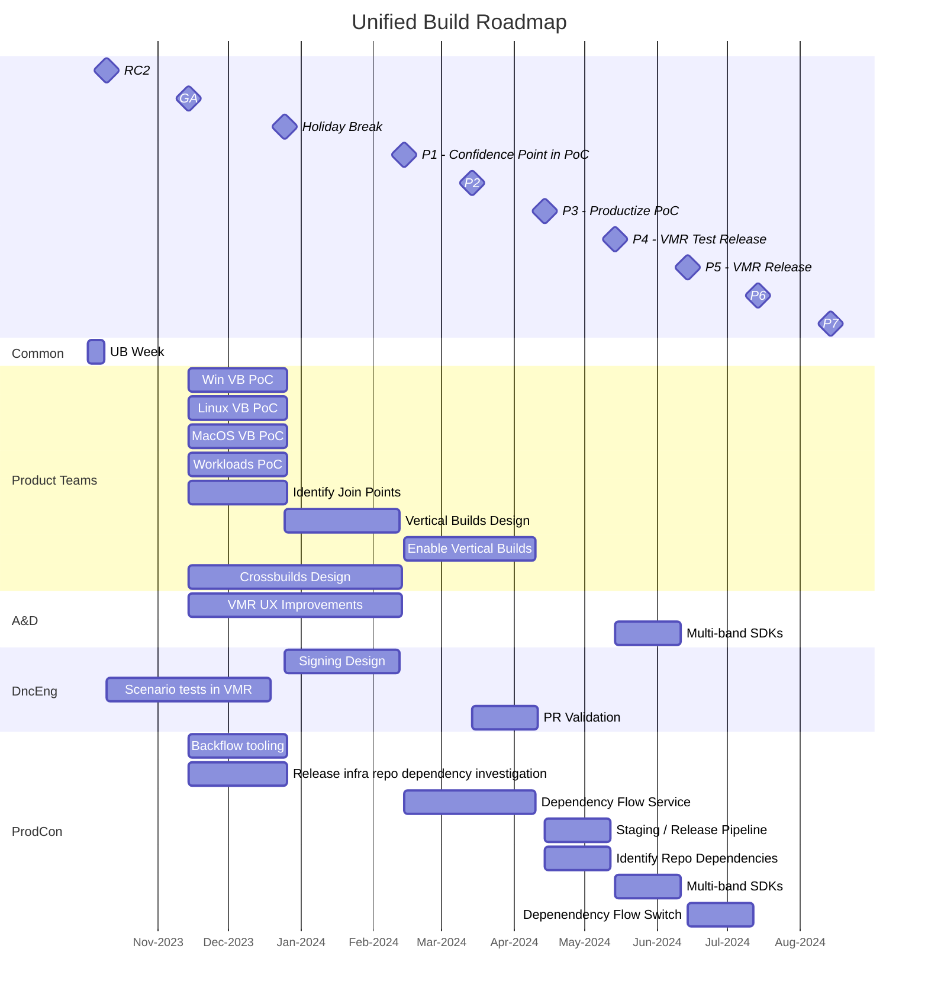

# Unified Build Roadmap

```mermaid
gantt
    title Unified Build Roadmap
    axisFormat %b-%Y
    RC2: milestone, net8-rc2, 2023-10-10, 0
    GA: milestone, net8-ga, 2023-11-14, 0
    Holiday Break: milestone, holiday, 2023-12-25, 0
    %% delta between Holiday and P1 is 7w
    P1 - Confidence Point in PoC: milestone, net9-p1, 2024-02-14, 0
    P2: milestone, net9-p2, 2024-03-14, 0
    P3 - Productize PoC: milestone, net9-p3, 2024-04-14, 0
    P4 - VMR Test Release: milestone, net9-p4, 2024-05-14, 0
    P5 - VMR Release: milestone, net9-p5, 2024-06-14, 0
    P6: milestone, net9-p6, 2024-07-14, 0
    P7: milestone, net9-p7, 2024-08-14, 0
 
    section Common
        UB Week: ub-week, 2023-10-02, 1w

    section Product Teams
        Win VB PoC: after net8-ga, 6w
        Linux VB PoC: after net8-ga, 6w
        MacOS VB PoC: after net8-ga, 6w
        Workloads PoC: after net8-ga, 6w
        Identify Join Points: after net8-ga, 6w
        Vertical Builds Design: after holiday, 7w
        Enable Vertical Builds: after net9-p1, 8w
        Crossbuilds Design: after net8-ga, 13w

    section A&D
        VMR UX Improvements: after net8-ga, 13w
        Multi-band SDKs: after net9-p4, 4w

    section DncEng
        Signing Design: after holiday, 7w
        Scenario tests in VMR: after net8-rc2, 10w
        PR Validation: after net9-p2, 4w

    section ProdCon
        Backflow tooling: after net8-ga, 6w
        Release infra repo dependency investigation: after net8-ga, 6w
        Dependency Flow Service: after net9-p1, 8w
        Staging / Release Pipeline: after net9-p3, 4w
        Identify Repo Dependencies: after net9-p3, 4w
        Multi-band SDKs: after net9-p4, 4w
        Depenendency Flow Switch: after net9-p5, 4w
```
