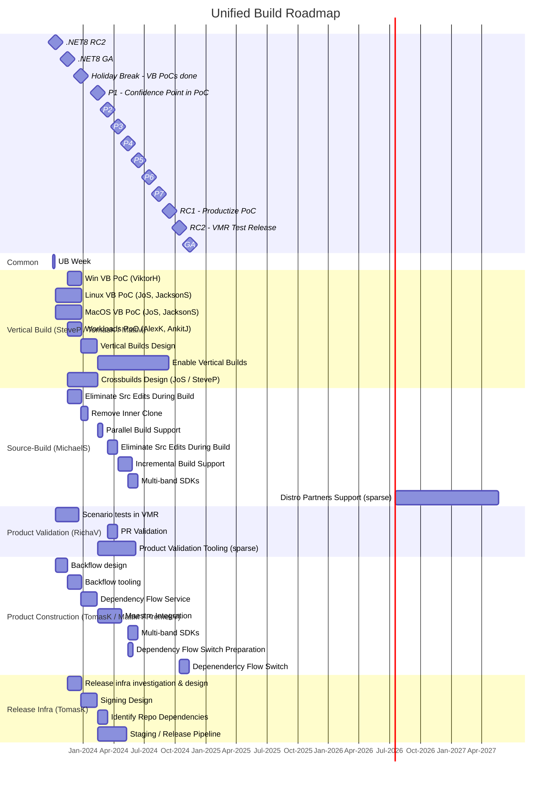

# Unified Build Roadmap

(not displayed on the roadmap) Switch .NET 9 to UB at 9.0.2 or 9.0.3, based on risk calculation and .NET 10 results.

# Milestones

The Unified Build milestones are aligned with the .NET9 lifecycle, specifically with the preview releases.

**Holiday Break (end of Dec)**

* Vertical Build (VB) Proof of Concepts (PoCs) for each of the major platforms completed.
* The main join points are identified and most of the unforseen problems have surfaced as result of the PoC work.
* The VMR scenario tests focused on the overall product functionality are running on the VMR for every PR.

**.NET9 Preview 1**

* High confidence in the PoCs. At this point, we expect to have uncovered and understood all problematic aspects of the Unified build designs, including the Vertical Buidls, their Join points, cross-compiled builds, and the full flow (forward flow + backflow) between the individual produt repos and the VMR. Differences between the current source-build and Linux vertical build are identified.

**.NET9 Preview 3**

* PoC Productization. At this point, we expect to have the Vertical Builds work completed, including setting up minimal set of join points.
* The VMR tooling will support automated backflow and be fully integrated with the current dependency flow tooling (Maestro++).

**.NET9 Preview 4**

* Test release of VMR in parallel with existing build methodology.

**.NET9 Preview 5**

* Switch to release from VMR.
* Start turning off the existing build methodology (for .NET9).

**.NET9 Preview 7**

* The latest possible time to move to the VMR based dependency flow with confidence to not introduce any risk for .NET9 release.

# Product Areas Owners

List of product area owners from the Vertical Builds perspective.

* Runtime - Jeff Schwartz
* Libraries - Art Leonard
* ASP.NET - Dan Moseley
* Mono - Marek Safar
* SDK, Winforms, MSBuild - Donald Drake
* Roslyn - Jared Parsons
* WPF - TBD

# Individual Tasks

## Vertical Build area

**Windows, Linux, MacOS Vertical Build (VB) PoC**

Initial vertical build efforts for each of the main platforms (Windows, Linux, MacOS). The goal of these efforts is to uncover hidden problems with building the product for each platform in a single build without requiring cross-platform build assets.
        
**Workloads PoC**

SDK Workloads vertical build Proof of Concept. Similar to the platform VB PoCs, this effort is focused to identify and uncover all issues related to building the SDK workloads.

**Identify Join Points**

Identification and mapping of the current cross-platform build orchestration.

**Vertical Builds Design**

Leverage the finding of the vertical build PoC works to design vertical builds for each platform properly, with the minimal set of join points.

**Enable Vertical Builds**

Implementation of the vertical builds design with the new se of join points.

**Crossbuilds Design**

Design for cross-arch or cross-platform builds and determine how to define cross-build behavior.

## Source-Build area

* [Eliminate Src Edits During Build](https://github.com/dotnet/source-build/issues/3664)
* [Parallel Build Support](https://github.com/dotnet/source-build/issues/3072)
* [Remove Inner Clone](https://github.com/dotnet/source-build/issues/3666)
* [Incremental Build Support](https://github.com/dotnet/source-build/issues/3608)
* [Multi-band SDKs](https://github.com/dotnet/source-build/issues/3667)

## Product Validation area

**Scenario tests in VMR**

End-to-end scenario tests (such as `dotnet new console` or a running a Stage 2 Linux source-build of the SDK) of the .NET product.

**PR Validation**

Definition and implementation of the set of tests that would be executed as part of the VMR PR validation.

## Product Construction area

**Backflow design**

Design for the backflow from the VMR to the individual product repositories.

**Backflow tooling**

Implementation of the core functionality and CLI tooling for the VMR backflow in to the product repos.

**Dependency Flow Service**

Implementation of the new dependency flow service, that will be extending the current BAR design.

**Maestro Integration**

Integration of the new dependency flow service with Maestro++.

**Dependency Flow Switch Preparation**

Preparation for switching from the existing multi-leayered product dependency flow to the new flat dependency flow between VMR and product repos.

**Depenendency Flow Switch**

Switch to the new flat dependency flow between VMR and product repos.

## Release Infra area

**Release infra investigation & design**

Design for changes necessary to enable releases off of the VMR.

**Signing Design**

Design for signing releases based off of the VMR.

**Identify Repo Dependencies**

Identification of the dependencies between product repos and the layout used to stage the product assets for release.

**Staging / Release Pipeline**

Updates to the current release infrastructure, namely the staging and release pipelines to be able to base releases both off the current dependency flow for .NET8 and the VMR for .NET9.

