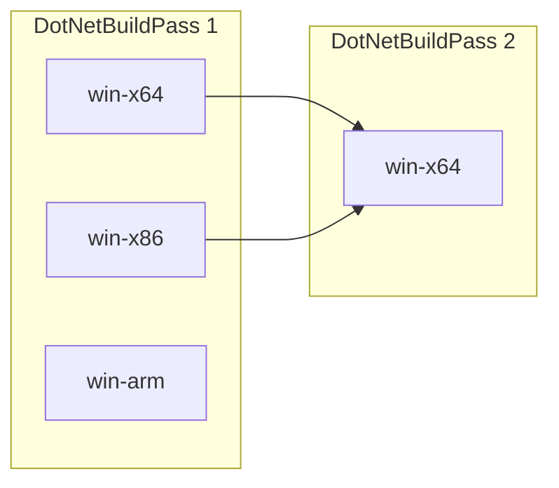
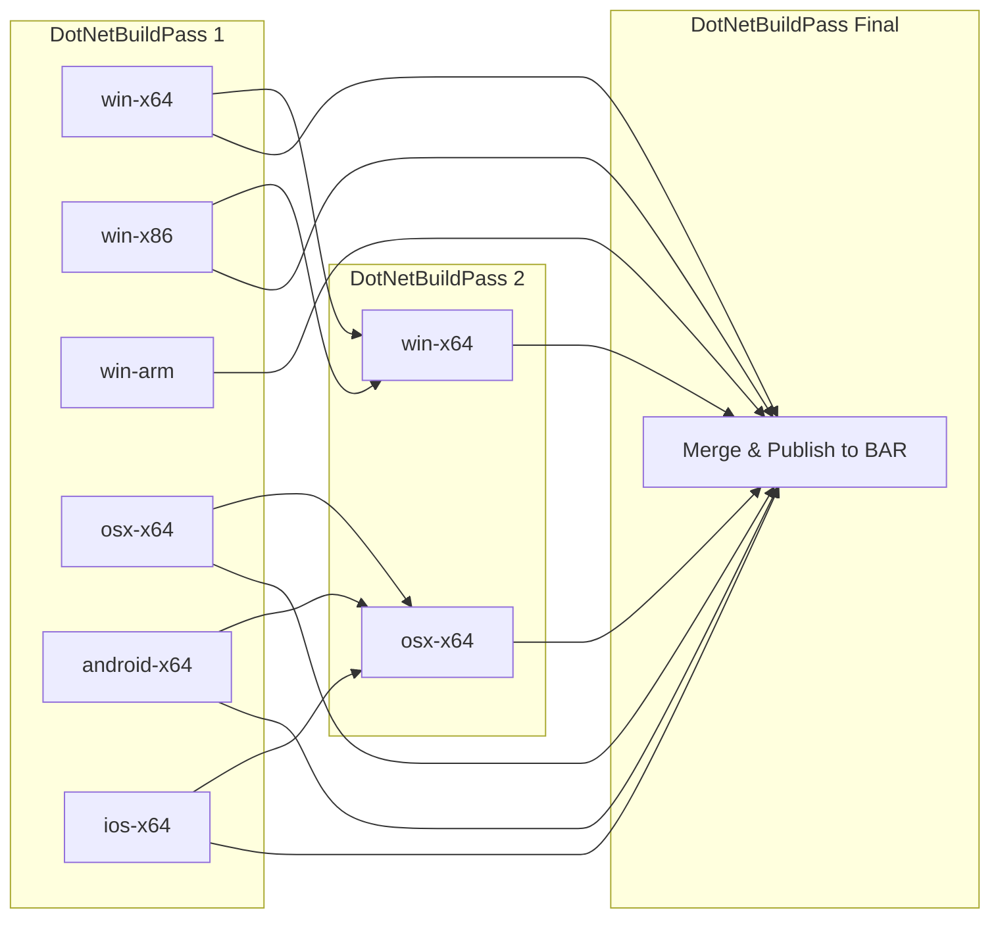

# The Unified Build Join Point Design

This document serves as a design for implementing join points to support Unified Build.

Let's start with describing nomenclatures used throughout this document:
- Vertical: A VMR build that targets a specific build configuration (`TargetOS`, `TargetArchitecture` and other potential inputs, i.e. `PGO` for instrumentation). Example: `win-x64` (Inputs: `TargetOS=windows`, `TargetArchitecture=x64`).
- Join point: Describes a specific component in the build that depends on live outputs from another build. As an example, a native component targeting `win-x64` can only be built on that corresponding vertical (meaning no cross-build support) and is then redistributed by another vertical. A concrete example is the Windows x86 apphost that exists in an Windows x64 .NET SDK for x86 support.

For the VMR effort, the goal is to identify and act on the current join points in the .NET SDK product. To support join-points, builds that depend on each other need to run sequentially. This requires declaring the dependent verticals and passing information into the build so that it builds the components that depend on outputs from the other verticals.

Such join verticals should only build the components that depend on other verticals to avoid overbuilding and with that producing identical assets that can't be resolved when publishing the VMR artifacts. 

While the following design supports multiple join point passes, minimizing the number of join points and sequential builds should be preferred.

## DotNetBuildPass

The `DotNetBuildPass` parameter identifies the build pass number in the sequential build order.



In the above example, the `win-x64` build in the `DotNetBuildPass=2` group builds after `win-x64` and `win-x86` in the `DotNetBuildPass 1` group:
- A: Inputs=`TargetOS=windows, TargetArchitecture=x64`, Dependencies=`none`.
- B: Inputs=`TargetOS=windows, TargetArchitecture=x86`, Dependencies=`none`.
- D: Inputs=`TargetOS=windows, TargetArchitecture=x64, DotNetBuildPass=2`, Dependencies=`A,B`.

> [!NOTE]
> The default value (`DotNetBuildPass=1`) doesn't get passed into the build to avoid additional state.

### Final pass

By setting `DotNetBuildPass=final`, the VMR vertical build skips building repositories and performs the final pass which selects artifacts, merges build manifests and publishes the result to the Build Asset Registry.

Below is a more complex example:
- Builds six verticals in the first build pass
- Builds two join verticals in the second build pass. The join vertical starts as soon as the dependent verticals finished.
- Builds the final vertical that merges artifacts and publishes to the Build Asset Registry when all other verticals finished.



## Declare projects to build in a join vertical

The `eng/Build.props` file is an Arcade msbuild extension point to specify the projects to build. To facilitate VMR join verticals, repositories need to specify the components to build when the `DotNetBuildPass` property is passed in.

If a repository doesn't use the `eng/Build.props` extension point, [Arcade's Build.proj wrapper project searches for and builds solution files in the repository root](https://github.com/dotnet/arcade/blob/777bc46bd883555cf89b8a68e3e2023fd4f1ee50/src/Microsoft.DotNet.Arcade.Sdk/tools/Build.proj#L75-L78). This needs to change in Arcade so that the default is ignored when `DotNetBuildPass>1` is passed in. This guarantees that nothing gets built in the individual repository if it doesn't explicitly opt into building components in a join vertical. 

> [!NOTE]
> If a repository already uses another mechanism to traverse the repository graph based on inputs, i.e. the `Microsoft.Build.Traversal` msbuild sdk, then that can be used instead. The below examples works in all Arcade-ified repositories.

**Example: Declare a join component**

This example demonstrates how to only build a component in a join vertical that depends on live outputs from other verticals.

_eng/Build.props_
```xml
<Project>

  <!-- Build ComponentA in the join vertical when DotNetBuildPass=2 is passed in. -->
  <ItemGroup>
    <ProjectToBuild Include="src\ComponentA\ComponentA.csproj" DotNetBuildPass="2" />
  </ItemGroup>

</Project>
```

_src\ComponentA\ComponentA.csproj_
```xml
<Project Sdk="Microsoft.NET.Sdk">

  <PropertyGroup>
    <!-- ComponentA doesn't get built unless in the DotNetBuildPass=2 join vertical.
         This uses Arcade's exclude infrastructure but can be replaced with any condition that feels
         right in the individual repository. Ideally, this condition would be applied at the traversal
         point but which isn't possible with static sln/slnf files. -->
    <ExcludeFromDotNetBuild Condition="'$(DotNetBuildPass)' != '2'">true</ExcludeFromDotNetBuild>
    ...
  </PropertyGroup>

  <!-- This project redistributes artifacts from the rid specific ComponentB packages. -->
  <ItemGroup>
    <PackageReference Include="ComponentB.Runtime.win-x64" Version="..." PrivateAssets="all" GeneratePathProperty="true" />
    <PackageReference Include="ComponentB.Runtime.win-x86" Version="..." PrivateAssets="all" GeneratePathProperty="true" />
  </ItemGroup>

  <Target Name="..." BeforeTargets="Pack">
    <None Include="$(PkgComponentB_Runtime_win_x64)\content\win-x64\ComponentB.x64.dll" Pack="true" PackagePath="lib/$(TargetFramework)" />
    <None Include="$(PkgComponentB_Runtime_win_x86)\content\win-x86\ComponentB.x86.dll" Pack="true" PackagePath="lib/$(TargetFramework)" />
  </Target>

</Project>
```

## Declare join verticals (YML)

The join verticals will declare their dependent verticals and pass the `DotNetBuildPass` property in. Example:

```YML
# Join vertical with
#  - `Windows_x64_BuildPass2` job name
#  - `win-x64 BuildPass 2` display name
#  - `Windows_x64` and `Windows_x86` job dependencies
#  - `Windows_x64` as the primary job dependency (important for asset selection)

- template: ../jobs/vmr-build.yml
  parameters:
    buildName: Windows
    displayName: win-x64
    targetOS: windows
    targetArchitecture: x64
    buildPass: 2
    primaryDependentJob: Windows_x64
    dependsOn:
     - Windows_x64
     - Windows_x86
```

The above YML does the following:
1. Downloads the job artifacts from the two dependent jobs. The job artifact payload contains the artifacts/packages and artifacts/assets folders.
2. Places the downloaded folders into the VMR's artifacts folder, i.e. `Windows_x64_Artifacts/packages` -> `/artifacts/packages` and `Windows_X64_Artifacts/assets` -> `/artifacts/assets`.
   Asset selection: In case of duplicates (i.e. rid agnostic `System.CommandLine.nupkg` package that gets produced in all verticals), the artifact from the primary dependent job wins.
3. Invokes the VMR's build script and passes the `DotNetBuildPass=2` msbuild property in addition to the other parameters in.
4. The VMR build then traverses all repositories and only builds the join components that are declared to be built in `DotNetBuildPass=2`.
5. The VMR publish then only publishes the new components that got produced in that vertical and the new build manifest.

While join verticals could be grouped into stages per build pass for a better UX in the AzDO pipeline view, that would significantly impact build performance as join verticals would need to wait for all jobs in the previous stage to complete. Therefore, stages won't be utilized.

Step one above downloads the job artifacts payload from each dependent job which contains the packages and assets folders. While not all artifacts might be needed by the join vertical, it's easier to just download the entire archive than hardcoding the assets to use in YML. This strategy could be revisited in the future if it significantly impacts the overall build times.
