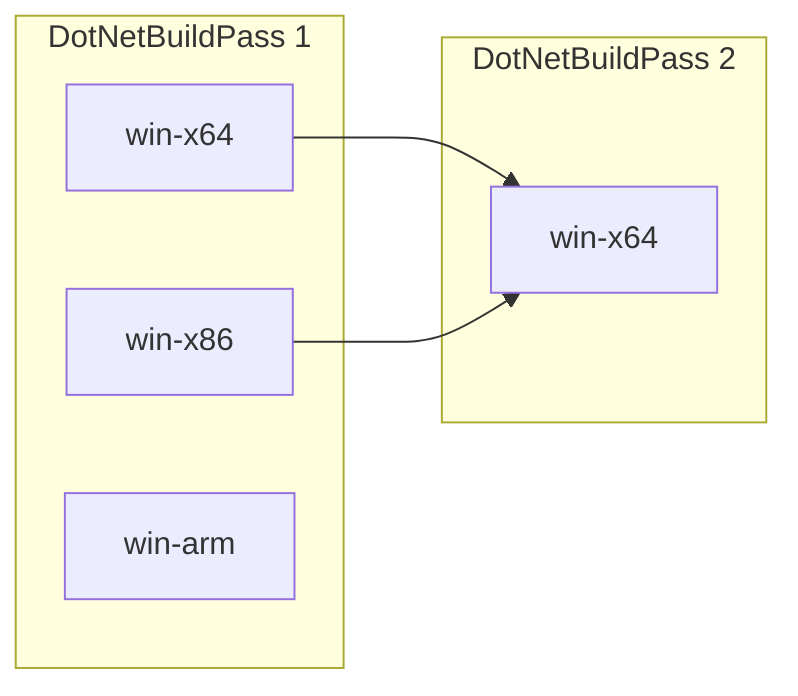

# The Unified Build Join Point Design

This document serves as a design for implementing join points to support Unified Build.

Let's start with describing nomenclatures used throughout this document:
- Vertical: A VMR build that targets a specific build configuration (`TargetOS`, `TargetArchitecture` and other potential inputs, i.e. `PGO` for instrumentation). Example: `win-x64` (Inputs: `TargetOS=windows`, `TargetArchitecture=x64`).
- Join point: Describes a specific component in the build that depends on live outputs from another build. As an example, a native component targeting `win-x64` can only be built on that corresponding vertical (meaning no cross-build support) and is then redistributed by another vertical. A concrete example is the Windows x86 apphost that exists in an Windows x64 .NET SDK for x86 support.

For the VMR effort, the goal is to identify and act on the current join points in the .NET SDK product. To support join-points, builds that depend on each other need to run sequentially. This requires declaring the dependent verticals and passing information into the build so that it builds the components that depend on outputs from the other verticals. Such join verticals should only build the components that depend on other verticals to avoid overbuilding and with that producing identical assets that can't be resolved when publishing the VMR artifacts. 

While the following design supports multiple join point passes, minimizing the number of join points and sequential builds should be preferred.

### DotNetBuildPass

The `DotNetBuildPass` parameter identifies the build phase number in the sequential build order.



In the above example, the `win-x64` build in the `DotNetBuildPass=2` group builds after `win-x64` and `win-x86` in the `DotNetBuildPass 1` group:
- A: Inputs=`TargetOS=windows, TargetArchitecture=x64`, Dependencies=`none`.
- B: Inputs=`TargetOS=windows, TargetArchitecture=x86`, Dependencies=`none`.
- D: Inputs=`TargetOS=windows, TargetArchitecture=x64, DotNetBuildPass=2`, Dependencies=`A,B`.

> [!NOTE]
> The default value (`DotNetBuildPass=1`) doesn't get passed into the build to avoid additional state.

By setting `DotNetBuildPass=final`, the VMR vertical build skips building repositories and performs the final pass which selects artifacts, merges build manifests and publishes the result to the Build Asset Registry.

### eng/Build.props
The `eng/Build.props` is an Arcade msbuild extension point to specify the projects to build. To facilitate VMR join verticals, repositories need to specify the components to build when the `DotNetBuildPass` property is passed in.
If repositories already use an similar mechanism to traverse the repository graph based on inputs, i.e. the `Microsoft.Build.Traversal` msbuild sdk, then that can be used instead. The below example works in all Arcade-ified repositories. 

_eng/Build.props_
```xml
<Project>

  <!-- Build ComponentA in the join vertical, when DotNetBuildPass=2 is passed in. -->
  <ItemGroup>
    <ProjectToBuild Include="src\ComponentA\ComponentA.csproj" DotNetBuildPass="2" />
  </ItemGroup>

</Project>
```

_src\ComponentA\ComponentA.csproj_
```xml
<Project Sdk="Microsoft.NET.Sdk">

  <PropertyGroup>
    <!-- ComponentA doesn't get built unless in the DotNetBuildPass=2 join vertical.
         This uses Arcade's exclude infrastructure but can be replaced with any condition that feelds
         right in the individual repository. -->
    <ExcludeFromBuild Condition="'$(DotNetBuildPass)' != '2'">true</ExcludeFormBuild>
    ...
  </PropertyGroup>

  <!-- This project redistributes artifacts from the rid specific ComponentB packages. -->
  <ItemGroup>
    <PackageReference Include="ComponentB.Runtime.win-x64" Version="..." PrivateAssets="all" GeneratePathProperty="true" />
    <PackageReference Include="ComponentB.Runtime.win-x86" Version="..." PrivateAssets="all" GeneratePathProperty="true" />
  </ItemGroup>

  <Target Name="..." BeforeTargets="Pack">
    <None Include="$(PkgComponentB_Runtime_win_x64)\content\win-x64\ComponentB.x64.dll" Pack="true" PackagePath="lib/$(TargetFramework)" />
    <None Include="$(PkgComponentB_Runtime_win_x86)\content\win-x86\ComponentB.x86.dll" Pack="true" PackagePath="lib/$(TargetFramework)" />
  </Target>

</Project>
```

The above example demonstrates how to only build a component in a join vertical that depends on live outputs from other verticals.

> [!NOTE]
> This requires changing arcade's Build.proj to not look for a solution file or any other project to build when `DotNetBuildPass>=1` is passed in. This guarantees that nothing gets built by default in a join build.

### YML

The join verticals will declare their dependent verticals and pass the `DotNetBuildPass` property in. Example:

```YML
# Join vertical with
#  - `Windows_x64_BuildPass2` job name
#  - `win-x64 BuildPass 2` display name
#  - `Windows_x64` and `Windows_x86` job dependencies

- template: ../jobs/vmr-build.yml
  parameters:
    buildName: Windows
    displayName: win-x64
    buildPass: 2
    targetOS: windows
    targetArchitecture: x64
    # Order is important, declare by priority
    dependsOn:
     - Windows_x64
     - Windows_x86
```

The above YML does the following:
1. Downloads the job artifacts from the two dependent jobs. The job artifact payload contains the artifacts/packages and artifacts/assets folders.
2. Places the downloaded folders into the repo's artifacts folder in order of declaration.
   Asset selection: In case of duplicates (i.e. rid agnostic `System.CommandLine.nupkg` package that gets produced by all verticals), the artifact from the first payload wins.
3. Invokes the VMR's build script and passes the `DotNetBuildPass=2` msbuild property in addition to the other parameters in.
4. The VMR build then traverses all repositories and only builds the join components that are declared to be built in `DotNetBuildPass=2`.
5. The VMR publish then only publishes the new components that got produced in that vertical and the new build manifest.
