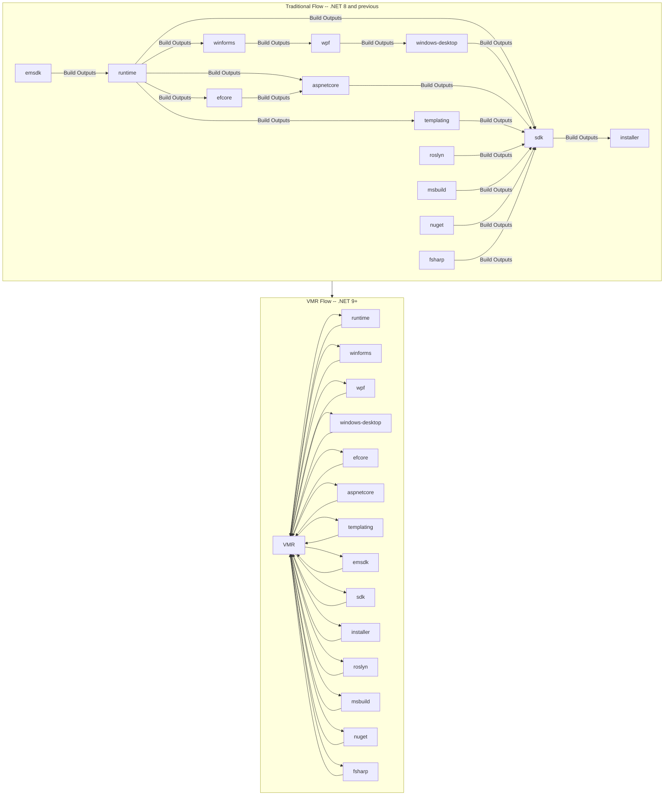
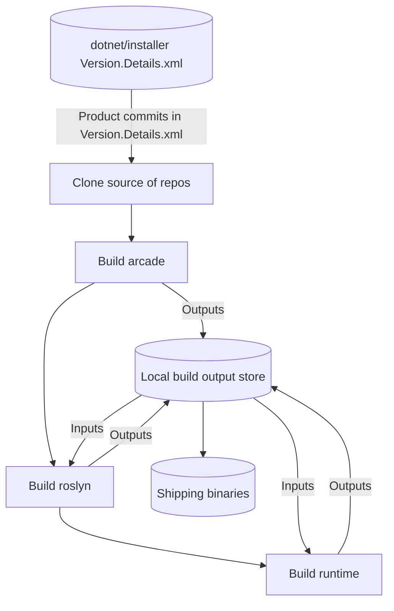
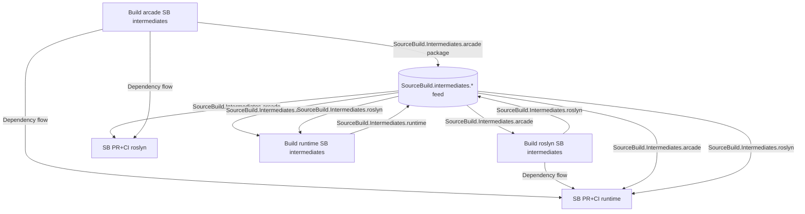
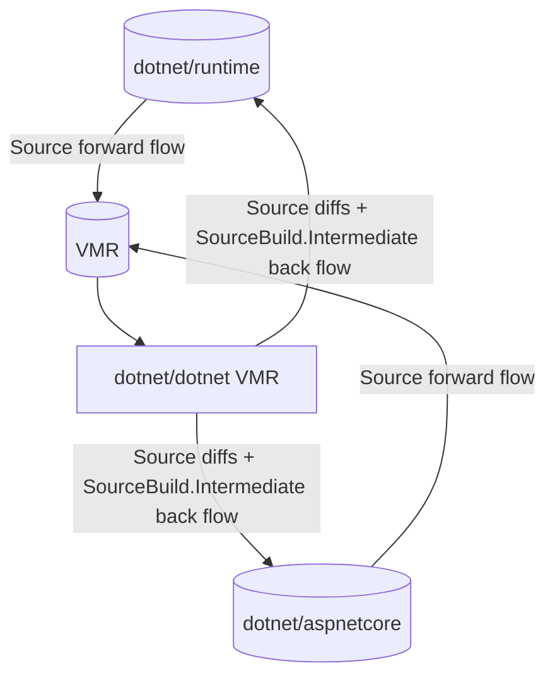
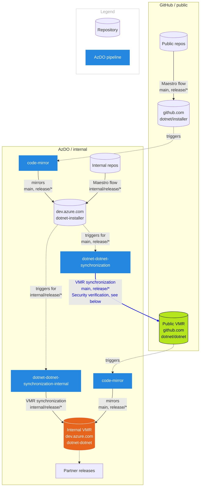

# The Unified Build Almanac (TUBA) - VMR Workflow Concepts

## Introduction

Unified build seeks not only to use the source-build methodology to build the .NET product across the board, but also to "flatten the graph" of the build. Rather than flow dependencies from repository to repository through a deep graph, then walking that graph to determine what commits contribute to the product build, source will flow directly from development repositories into the VMR itself, in parallel.

*Subset of the code flow graph for Traditional and VMR workflows*

While this may appear to be a signficant departure from the current build methodology, it is functionally not altogether that different. This document seeks to explain some of the basic concepts around the VMR development workflow: dealing with breaking changes, where development can happen, etc.

## Now vs. .NET 9 - How Code Flow Works

Today, a development repository such as `dotnet/runtime` serves as both a home for development of the .NET runtime as well as the home for its official build. However, the `dotnet/runtime` repository alone does not constitute the entire .NET product. Repositories like `dotnet/winforms`, `dotnet/wpf`, and `dotnet/sdk` also contribute, and they have strong dependencies on the `dotnet/runtime`, from its API surface area to, in some cases, specific version numbers. Developing and building the .NET product is an iterative process by which code changes are made in a repository, those changes are built officially, and then the outputs flow downstream via automation to repositories that depend on them. A build is 'done' when all 'real' code changes have been made, and the resultant official builds have flowed throughout the entire dependency graph. The key highlight is that *functionality in product code is flowed via the resultant outputs of building that code (binaries), and the product build is simply the closure of all shipping outputs from the input builds.*.

Unified Build tweaks this by splitting the build and development repository concepts. Rather than being home of the code for the .NET runtime *and* its official build, `dotnet/runtime` is instead home to just the code, and the VMR is home to the official build. Repositories flow source changes into the VMR and then the VMR builds the code all at once. The key highlight here is that *functionality in product code is flowed via the code itself; then source-build's methodology is used to build the product in the VMR.*

To understand how this works, let's take look at how source-build works today. Source-build uses a code layout which combines the source of a set of input components together in a build environment. The build then starts at the lowest layer of the dependency structure of the product (e.g. roslyn). The packages and other output binaries are then held locally on the machine, and those are fed into the next layer. For example, let's consider a few low-level repos:

The key difference between today and .NET 9 is how those source-build input commits are determined. Today, source-build piggy-backs on the traditional code-->dependency flow-->build model and uses the *same commits* that appear in the traditionally constructed product. .NET 9 flattens the graph, and the source is directly flowed, in parallel, into the VMR. Each time (or on a definable schedule) a commit is made to a development repo, the tooling obtains the *source diffs* from the set of commits that have occurred between the last time the repo was synced to the VMR, and the current commit. It then commit a patch or set of commits, mapping the development repo files onto the directory structure of the VMR. The VMR now has the updated sources and can build. While this is vastly more efficient for most code changes, it does present an obvious problem. What happens if there are breaking changes?

### Dealing with breaking changes

The traditional graph-based build methodology deals with breaking changes by flowing new functionality into downstream repositories via pull requests. The pull request contains the versions of the new binaries that have been produced, and validation (build and test) takes place in the downstream repository. Reactions to breaking changes generally occur within those PRs. Thus, changes in components that are required because of changes in their dependencies "roll" through the product build graph over time. While this works, it's generally slow. It does allow teams to react over time to new functionality, but this hinders fast iteration on the product. It also introduces the possibility of incoherency. Incoherency is:

*A state of the traditional product build graph in which multiple versions of the same component are transitively referenced, and where the difference in those versions does or could have meaningful impact on product functionality. For instance, if two dotnet/runtimes are referenced within the same SDK, one may be packaged with the SDK, but the other may have been what `dotnet/aspnetcore` was built against. If there are meaningful differences between those two runtimes, `dotnet/aspnetcore` may not operate as expected.*

So, because the build graph has multiple paths for various components to flow new functionality to the eventual end-point in `dotnet/installer`, and because that functionality will flow at different rates, there is a possibility that some or part of the product may simply be broken at some point. Unified Build gets rid of this possibility, but adds that wrinkle that *all repositories built together in the VMR simultaneously observe changes in the functionality of shared dependencies*. For example, when `dotnet/runtime` flows new code that removes an API, the `dotnet/sdk`, `dotnet/installer`, `dotnet/winforms`, `dotnet/aspnetcore` will see that change immediately.

To deal with this, the Unified Build uses the same concept as the traditional build. Sets of source changes for a development repo are packaged into a pull request against the VMR. Any required reaction to functionality changes in other components (or, the source component itself) also occurs *in that PR*. The primary difference between the traditional and VMR-style workflow is simply *when* the reaction happens. In the traditional model, it "rolls" through over time (and in fact, in some cases it is impossible to react immediately), and in the VMR model, the reaction happens immediately. Functionally, the same source changes are necessary.

But of course, this brings up another question: How does development manage to continue effectively in the development repos?

### Closing the loop - Keeping developement repos up to date

To understand how development repositories are kept up to date, it's again helpful to look at how source-build works in .NET 8 and prior releases. Even though the full "source-build" happens against the full set of product commits, for practical purposes there needs to be validation at individual repo PR/CI time to ensure that no regressions occur. To do this, source-build again piggy-backs off of the traditional model. Each repo runs in its official build pipeline an additional leg which runs the individual repo in source-build mode, as if the required inputs were already available. It then produces a set of intermediate outputs, which are flowed along the 'normal' product assets to dependent repos. Those inputs can then be used to run that source-build leg in CI/PR validation. Essentially, the source-build leg for a repo is a pinhole view of source-build, mimicking how that component would build were it in the "full" source-build infrastructure.

*Source build legs are kept up to date using traditional dependency flow*

In Unified Build, development repositories use the same source-build intermediates to enable isolated workflows. Most 'normal' dependency flow (e.g. `Microsoft.NETCore.App.Ref`) ceases. To keep the `SourceBuild.Intermediate` packages up to date, the VMR build saves off the outputs of each individual component as the build progresses. Those are then flowed *back* into the development repos on a definable cadence. Essentially, the workflow is identical to traditional builds, with one signficant tweak: any source changes made only in the VMR are flowed too.

Consider the following example: `dotnet/runtime` fixes a typo in an API, renaming `WaitForConnectionsToDrainAsink` to a more appropriate `WaitForConnectionsToDrainAsync`. These source changes flow into the VMR after the runtime commit, in the form of a PR. It turns out, `dotnet/aspnetcore` had taken a dependency on this incorrect name and now needs a fix. The developer who made the runtime change updates the `src/aspnetcore` directory, replacing several incorrect usages with the correct name. The VMR builds, and the `SourceBuild.Intermediate` packages are saved off as the build progresses. These flow back into the `dotnet/aspnetcore` using traditional-style dependency flow (as binary package flow), and a PR is opened. To help the developer, *this PR also contains the source-diffs introduced in the VMR update*.

Essentially, the same mechanism for forward flow (create patches -> map onto target directories -> create commits) is used to gather up **any** changes in the `src/aspnetcore` directories made since the last time the VMR flowed to `dotnet/aspnetcore` and places them alongside binary updates in the same PR. This helps keep the development repo up to date with minimal user intervention. If by chance `dotnet/aspnetcore` had introduced *new* usages of `WaitForConnectionsToDrainAsink` that had not yet been dealt with, these reaction occur in the development repo update PR. That of course would trigger new forward flow to the VMR, and the cycle occurs over again until a stable state is reached.

This opens up a new possibility: If source and intermediates automatically flow backwards to development repos, does this mean that work can happen solely in the VMR?

## Where development happens

Backflow introduces the option of working in the full VMR *in addition* to working in the development repository. When a change is made solely in the VMR, it is *immediately* part of the product, and will be reflected in development repository workflows as backflow occurs. Therefore, it becomes possible to choose where to work based on the type of change.

Large, cross stack changes may be better suited to VMR work. Experiments where the developer wishes to immediately obtain an SDK become simpler. Simply clone the VMR, make appropriate changes, and build to get an SDK to test. Small changes that are unlikely to affect downstream components happen in development repos where inner-loop times are shorter. Working in the development repo also adds a bit of risk mitigation. When a bug is introduced in the VMR, it will immediate start propagating everywhere. Working in development repo adds additional bake time before the change starts propagating and reduces risk of large-scale breakages.

Ideally, the VMR PR/CI pipelines will provide a full swath of product coverage. It is not ideal to be dependent on backflow to validate product functionality. However, some specialized pipelines and testing may only be available against the development repositories. For certain changes that depend on this testing, working in the development repo may be more desirable.

## Internal code flow and releases

Following section describes how code flows into the (internal) release branches of the VMR.

On the diagram, you can see two main code flows. The first one for `main` and `release/*` branches (public flow):
1. Changes are made to product repos as usual (e.g. `dotnet/runtime`).
2. Runtime flows into `dotnet/installer` as part of the regular Maestro package flow.
3. `dotnet/installer` is mirrored internally.
4. The VMR synchronization build is triggered and newly ingested sources are pushed to the public VMR.
5. The public VMR is then mirrored internally.

The second flow is for internal changes:
1. Changes are made to an `internal/release/X` branch of an internal mirror of some product repo.
2. These changes are flown to an `internal/release/X` branch of the internal mirror of `dotnet/installer`.
3. The *internal* VMR synchronization build triggered and changes are pushed to the internal VMR.

### Security considerations

As you can see from the diagram above, there are some security risks connected to the VMR code flow. The problem arises from the fact that code is being pushed from the internal AzDO instance back to GitHub. This direction of code flow does not happen for the product repos where we always cross the boundary the other way only.  
Furthermore, the official build of the internal mirror of `dotnet/installer` is handling both internal and public synchronization of the VMR.

For this reason, we had to put some security mechanisms in place so that a commit from an internal release branch is not pushed in the public VMR:

1. When building an internal release branch of the internal mirror of `dotnet/installer`, the credentials used for pushing to the public VMR are not available.
2. Before pushing to the public VMR, we verify that each commit of each product repo, that is being synchronized into the VMR, is available in the respective public product repository as well.
3. We verify branch names of where the build is running from and where it wants to push.

## What happens when...?

In any dependency flow system, there are possible issues that may arise. Below are listed possible scenarios and how they are handled in the VMR:

### A repo falls behind on their backflow?

When a development repository falls behind on their backflow, they cannot make new changes that are also dependent on (or conflicting with) functionality coming in through the backflow, but they can make all other changes which will flow into the VMR. This is exactly the same as it has been in .NET 8 and prior releases:

Let's say `dotnet/runtime` removes an API `Foo.Bar`. If `dotnet/aspnetcore` has calls to `Foo.Bar`. In .NET 8 and prior releases the `dotnet/runtime` dependency flow PR into `dotnet/aspnetcore` fails. But there are plenty of other PRs in `dotnet/aspnetcore`'s repo which continue onward (e.g. fixing bugs, new features, etc.). Those can be checked in and flow onward. The same goes for Unified Build and the VMR code flow. If a bug is fixed that does not involve `Foo.Bar`, the change that flows into the VMR is only the *diff* of that change, not the current state of `dotnet/aspnetcore`'s sources, so it will flow just fine. It does, however, mean that aspnetcore cannot *new* flow changes that are dependent or incompatible with the `dotnet/runtime` in the VMR. That's a good thing though. In the old model, it could flow new changes into the product there are dependent on the `dotnet/runtime` version it last ingested. Those would likely not break in downstream dependency PRs (depending on testing) and simply cause product behavioral issues.

### A bug in the product/VMR breaks development repo workflow?

If a bug is introduced into the product (i.e. into the VMR sources), it could start to flow backwards into the development repositories and cause issues. In this case, the fix could be reverted or fixed in the VMR or even in the development repository that is the source of the bug. Like the traditional product build, what to do is mostly a policy and impact evaluation. Fixes/reverts in the VMR flow faster to development repositories, but low-priority issues can easily be handled in a development repo.
