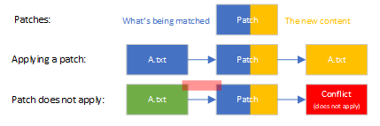
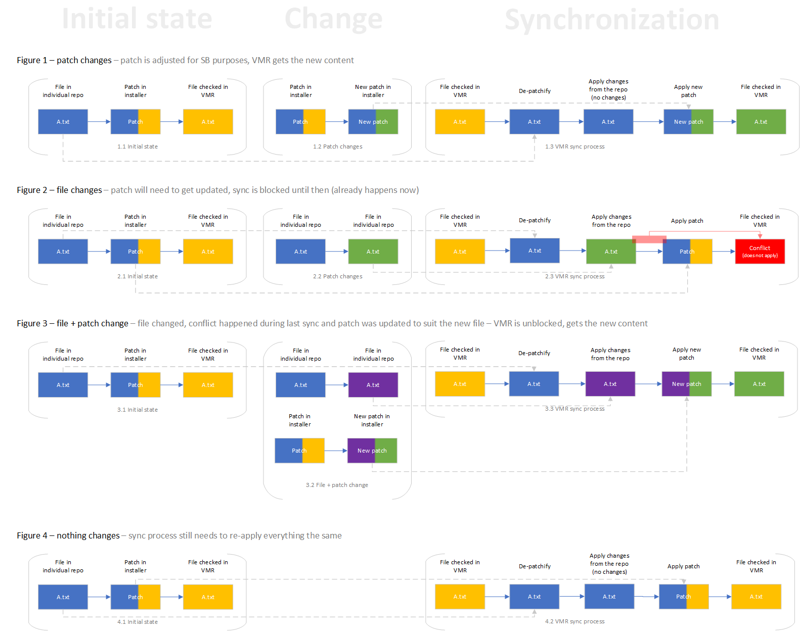

# The Unified Build Almanac (TUBA) - VMR Design and Operation

The VMR (**VMR** - **V**irtual **M**onolithic **R**epository) is a source layout projection of a set of separate input repositories into a single repository.
Unlike a repository with a set of submodules, this repository is a source copy of the input repositories.

The VMR aims to serve as the build repository for the .NET Unified Build product.
Rather than building as a set of independent repositories and flowing dependencies among them, the entire coherent source of the product is cloned at a single time and built using the [source-build methodology](https://github.com/dotnet/source-build).

## Contents

- [Contents](#contents)
- [Structure](#structure)
  - [Goals](#goals)
  - [General Components](#general-components)
    - [Component Source Types](#component-source-types)
    - [Special Note: SDK Band Layout](#special-note-sdk-band-layout)
  - [Examples](#examples)
  - [Layout](#layout)
  - [Repository Source Inclusion](#repository-source-inclusion)
  - [Repository Source Mappings](#repository-source-mappings)
    - [Mapping Defaults](#mapping-defaults)
    - [Repo-level Overrides for Ex/inclusions](#repo-level-overrides-for-exinclusions)
- [Moving Code and Dependencies between the VMR and Development Repos](#moving-code-and-dependencies-between-the-vmr-and-development-repos)
  - [Forward Flow](#forward-flow)
    - [Dealing with Conflicts](#dealing-with-conflicts)
  - [Back Flow](#back-flow)
  - [Automation](#automation)
- [Source Synchronization Process](#source-synchronization-process)
  - [Synchronizing Submodules](#synchronizing-submodules)
  - [Tracking Sources](#tracking-sources)
    - [Source Manifest](#source-manifest)
    - [Commit Messages](#commit-messages)
    - [Component List in VMR's README](#component-list-in-vmrs-readme)
- [Temporary Mechanics](#temporary-mechanics)
  - [VMR-lite](#vmr-lite)
  - [Source-Build Patches](#source-build-patches)
  - [Synchronization Based on Declared Dependencies](#synchronization-based-on-declared-dependencies)
    - [Example](#example)
  - [Synchronizing Patched Files](#synchronizing-patched-files)
  - [*"git-info"* XMLs to support source-link](#git-info-xmls-to-support-source-link)
  - [Storing original package version of dependencies](#storing-original-package-version-of-dependencies)

## Structure

This section describes how we structure the monolithic repository, how we track what sources and components are synchronized inside and other pieces of the infrastructure needed for the build.

### Goals

- Simple, easy to understand layout.
- The repository contains all source code necessary to build the whole .NET product from source contained in any given commit.
- Other organizations and contributors can use their own *Continuous Integration* systems (e.g. Microsoft uses AzDO, while the Contoso Company might use GitHub Actions).
- Allow for multiple versions of the same code to be used (e.g. multiple SDKs or multiple Newtonsoft.Json versions).

### General Components

The VMR contains 5 primary components:
- **Engineering and infrastructure sources** - These sources cover the infrastructure tooling for the VMR, both in general, org-agnostic cases as well as org-specific functionality. Examples:
    - **Organization agnostic** - General build scripting and root projects (`Build.cmd`, `build.sh`, ..).
    - **Organization specific** - YAML for building the VMR with signing in Microsoft’s AzDO orchestration systems. YAML for building using CircleCI.
- **Documentation** - Documentation covering the VMR repository. Developer guides, etc.
- **Component sources** - Sources for individual component (development) repositories. `aspnetcore`, `NuGet.Client`, `msbuild`.
- **End-to-end tests** - Product scope tests that validate end-to-end scenarios.
- **Reference package sources** - Text-only sources that are required to build the product. For instance, the product requires the netstandard reference libraries. Some .NET distro maintainers cannot obtain these using a pre-built binary package. Instead, they are checked in as IL (viewed as hand-editable), then assembled for use as input to component builds.

#### Component Source Types

There are two types of component sources:
- **.NET** - These are components that are inherently part of the .NET project. Examples include: `dotnet/wpf`, `dotnet/installer`, `dotnet/aspnetcore`, `dotnet/msbuild`.
- **External** - These components are redistributed or referenced by the .NET product but are not developed as part of the .NET project. In a ‘traditional’ non-source build methodology, they would be brought in via binary dependency flow. Build requirements from partners prohibit pre-build binaries, so they are included in the VMR sources instead. Examples include: `Newtonsoft.Json`.

#### Special Note: SDK Band Layout

SDK bands, e.g. 8.0.1xx and 8.0.2xx are laid out under the `src/sdk` directory, with a directory for each specific band that is active for the given branch. In all cases except post-RTM-Band preview SDKs, all active SDKs are laid out in parallel in the VMR. They are not kept in other branches in the VMR, or in a separate VMR. This is for the following reasons:
- **Runtime:SDK is a one:many relationship** - For each .NET distro maintainer, a single runtime is shipped in at least one SDK. Ensuring that the identity of those runtime files is identical between the SDKs is less confusing for SDK consumers.
- **Separate VMRs would require stable binary flow** -  Stable binary flow violates the Unified Build Rule "There may be no pre-release, non-final stable binary flow". This avoids complexity and ensures that our partners do not have to violate their build requirements.
- **We already have multiple versions of the same source in the VMR** - There is precedent for this situation already, as there are occasionally multiple versions of the same repository (e.g. `Newtonsoft.Json`) shipped within the product.
For post-RTM preview SDKs, they shall exist in their expected location in the VMR (e.g. `src/sdk/8.0.2xx`) in a separate branch of the VMR, with the non-SDK elements of the VMR removed. This VMR may only depend on released .NET runtimes. When this SDK goes to RTM, it shall be merged into the parent `MAJOR.MINOR` servicing branch.

### Examples

|  Scenario                                       |  VMR branch            |  SDK directories                      |  Notes                                              |
|-------------------------------------------------|------------------------|---------------------------------------|-----------------------------------------------------|
|  8.0   pre-RTM (development)                    |  main                  |  src/sdk/8.0.1xx                      |                                                     |
|  8.0 Preview 2                                  |  release/8.0-preview2  |  src/sdk/8.0.1xx                      |                                                     |
|  8.0 RTM                                        |  release/8.0           |  src/sdk/8.0.1xx                      |                                                     |
|  8.0.2xx Preview SDK                            |  release/8.0.2xx       |  src/sdk/8.0.2xx                      |  VMR contains SDK-relevant directories only (e.g. runtime directories are removed as the preview SDK typically builds against shipped runtimes |
|  8.0 at   8.0.2xx RTM                           |  release/8.0           |  src/sdk/8.0.1xx<br />src/sdk/8.0.2xx |  release/8.0.2xx VMR integrated into release/8.0    |
|  8.0 at 8.0.3xx RTM (8.0.2xx out of servicing)  |  release/8.0           |  src/sdk/8.0.1xx<br />src/sdk/8.0.3xx |  release/sdk/8.0.2xx deleted                        |

### Layout

| Directory                              | Purpose                                                                                          |
|----------------------------------------|--------------------------------------------------------------------------------------------------|
| `src/source-mappings.json`              | Source subset mappings definition. See [Repository source mappings](#repository-source-mappings) |
| `src/source-manifest.json`              | An always up-to-date list of all original sources, paths where and versions which are synchronized into the VMR (in that given commit). See [Source Manifest](#source-manifest) |
| `src/<repo>/`                           | Product source for `<repo>` (e.g. `src/runtime`). See [Repository source inclusion](#repository-source-inclusion) for what does and does not get included |
| `src/<repo>/<version>`                  | If multiple versions of a repository must be built in the VMR, then subdirectories for each required version are placed under `<repo>`.<br />- `src/Newtonsoft.Json/13.0/`<br />- `src/Newtonsoft.Json/12.0/` |
| `src/sdk/<sdk band>/`                   | Active SDK bands that are not in preview are laid out in parallel, like the layout of development repo versions above. When a band goes out of active servicing, it is removed from the VMR. See SDK Band Layout for more details. |
| <nobr>`src/source-build-reference-packages/`</nobr> | Reference packages required to bootstrap the product build. |
| `eng/`                                  | Top level directory for engineering functionality:<br />- Build scripting (e.g. `Versions.props`) |
| `eng/keys/`                             | Strong name keys |
| `eng/tools`                             | Organization agnostic tooling. E.g.<br />- Tooling for VMR management<br />- Tooling for change tracing |
| `eng/org/<org or orchestration system>` | Organization or orchestration system specific infrastructure for <org>. E.g.<br />- `eng/msft`<br />- `eng/travisci`<br />- `eng/github` |
| `eng/msft/`                             | Microsoft-specific infra<br />- `eng/msft/pipelines` – AzDO Pipelines<br />- `eng/msft/scripts` – Microsoft specific scripts |
| `documentation/`                        | Documentation<br />- Engineering system documentation<br />- Build environment requirements.<br />- VMR architecture info<br />- ... |

Additional rules:
- Repositories shall maintain the original casing of their development repository name.
- Organization specific engineering shall be placed in an organization (or directory indicative of the type of engineering) directory.

### Repository Source Inclusion

A development repository does not need to contribute all its sources to the VMR.
The sources it contributes are defined by the following rules:
- **The repository shall not contribute any sources that would cause VMR input/output flow to continue forever** – The VMR has two-way flow during mainline development.
    - Sources flow into the VMR from development repositories
    - VMR outputs (source build intermediate packages) and any additional source changes flow back out of the VMR and into the development repositories.
      Maestro is used for backflow.
      This means that each time the VMR back flows into the development repositories, the Version.Details.xml file will be updated in the development repository.
      If files that are always changed with VMR backflow also generate forward flow, the VMR flow will cycle forever.
      We wish to avoid this.

        ```mermaid
        flowchart TD
            Step1[VMR Forward Flow]
            Step2[VMR Build]
            Step3[VMR Back Flow]
            Step4[Development Repo Change]

            Step1-->Step2
            Step2-->Step3
            Step3-->Step4
            Step4-. avoid this .->Step1

            linkStyle default fill:none,stroke-width:3px
            linkStyle 3 stroke:red,color:red
        ```
    *<p align="center">Avoiding cyclical flow</p>*

- **The repository only need contribute sources required to build and test the desired VMR outputs**
    A repository doesn’t need to contribute all of its sources (e.g. roslyn might cloak VS IDE sources), but it does need to contribute enough to build the desired outputs of the VMR.
    Tests may also be included in these sources.

### Repository Source Mappings

Because each repository usually only contributes a subset of its sources, we need a way of specifying this specification for user and tooling purposes.
This is accomplished by a file called `source-mappings.json` file under `src/` in the VMR.

For each repository in the `src/` directory that maps onto a development repository, the source mapping file shall contain an entry that specifies:

| Element         | Description                                                                                                                              | Examples                                           |
|-----------------|------------------------------------------------------------------------------------------------------------------------------------------|----------------------------------------------------|
| `name`          | Name of component. This is the directory that the source will map to.                                                                    | `name: sdk`                                        |
| `version`       | *Optional*. If specified, the sources map onto a subdirectory of the repository name                                                     | `name: sdk`,<br />`version: 8.0.1xx`               |
| `defaultRef`    | *Optional*. If specified, this is the source branch, tag, or commit of the repository that maps onto this directory. Defaults to `main`. | `defaultRef: mytestBranch`<br />`defaultRef: v1.0` |
| `defaultRemote` | Default git remote for the source                                                                                                        | `defaultRemote: https://github.com/dotnet/sdk`     |
| `include`       | *Optional*. Inclusion globs. If omitted, everything is included (`**/*`).                                                                | `include: [ src/**/* ]`                            |
| `exclude`       | *Optional*. Exclusion globs. If omitted, nothing is excluded.                                                                            | `exclude: [ eng/Version.Details, global.json ]`    |

We expect the VMR to be the backbone of future .NET releases and to use the VMR strategy for servicing as well.
This means that the automation will be flowing code to different VMRs of varying .NET versions.
To enable that, we need to define this interface between the automation and the VMR, so that the automation can flow the changes appropriately.
This interface then needs to be shared between and stay backwards compatible.
The `source-mappings.json` file is expected to be one part of such interface.

#### Mapping Defaults

Furthermore, the `source-mappings.json` file will contain "useful defaults" (a default mapping) as we expect most of the repositories will share some common exclusions or a common `defaultRef`.
The mappings will have a chance to discard the defaults by specifying a flag `overrideDefaults: true`.

In practice, in/exclusion filters of the mappings would be merged with the defaults, so a following setup:
```json
{
    "defaults": {
        "defaultRef": "main",
        "exclude": [
            "**/*.dll",
            "**/*.exe",
        ]
    },
    "mappings": [
        {
            "name": "arcade",
            "defaultRemote": "https://github.com/dotnet/arcade",
            "include": [
                "*.*",
                ".*",
                "eng/**/*",
                "scripts/**/*"
            ],
            "exclude": [
                "**/tests/**/*"
            ]
        },
        {
            "name": "fsharp",
            "defaultRef": "develop",
            "defaultRemote": "https://github.com/dotnet/fsharp"
        },
        {
            "name": "aspnetcore",
            "defaultRemote": "https://github.com/dotnet/aspnetcore",
            "overrideDefaults": true,
            "defaultRef": "dev",
            "exclude": [
                "**/samples/**/*.js"
            ]
        },
    ]
}
```

would yield the following subset of sources to be synchronized:

```bash
https://github.com/dotnet/arcade@main → src/arcade
    included: 'eng/**/*', 'scripts/**/*',
    excluded: '**/*.dll', '**/*.exe', '**/tests/**/*'

https://github.com/dotnet/fsharp@master → src/fsharp
    included: '**/*'
    excluded: '**/*.dll', '**/*.exe'

https://github.com/dotnet/aspnetcore@dev → src/aspnetcore
    included: '**/*'
    excluded: '**/samples/**/*.js'
```

#### Repo-level Overrides for Ex/inclusions

Some exclusion patterns get complicated and would be hard to enforce using the include/exclude filters described above.
For instance, it might be desirable for repositories to exclude all binaries (e.g., `**/*.pdb`).
However, there might be exceptions to these rules where it might be needed to include specific PDB files. Actually, these already apply in today’s setting.

For cases like these, it should be possible for the development repos to have a final say in which files are required or, in contrary, ignored.
The repos should ultimately be able to override this as in the end they have the best knowledge about the concrete files.
To deal with this requirement and to plug this together well with the process that we have for repo synchronization, the tooling will take into account git attributes that the repositories can set via the `.gitattributes` files.
The repository will utilize two attributes named vmr-preserve and vmr-ignore and files tagged with these will override the filters from the mapping.

Example `.gitattributes` record:
```bash
src/.nuget/**/*.pdb     vmr-preserve
src/SomeNonDesiredFile.cs    vmr-ignore
```

## Moving Code and Dependencies between the VMR and Development Repos

Information may move in two directions for a VMR that is still connected to its development repositories:
- **Forward Flow** - Source from mapped files in a development repository to a VMR.
- **Back Flow** - Source, intermediate packages, and product binaries from a component of a VMR to a development repository.

When moving code in either direction, the VMR tooling must take care to:
- Indicate the VMR/development repository commit that represents the latest sync.
- Preserve the desired granularity of commits.
- For each commit moved, preserve the source commit information.
- Add extra information into each commit message in the VMR to indicate its corresponding commit(s) in a development repository, and vice versa
    > Note: Tooling should use such information for information purposes only, since it could be incorrectly populated, formatted, or simply lost by squashes, rewriting of commit metadata, etc.
- Allow for merge conflict resolution.

> Note: .NET 8 version of the VMR will only support automated forward flow. The [back flow process will be manual](#manual-back-flow).

### Forward Flow

During mainline development, most changes occur in development repositories.

> Note: It will be possible to work solely in the VMR and may even be desirable for some changes.

When source code changes in a repository branch that maps onto a VMR, this source needs to flow into the VMR.
This is completed using the following steps:

1. Trigger Update
    - Manual trigger/local update
    - On commit to tracked development repo branch
2. Create patch(es)
    - Create diff(s) from set of target commits to be moved.
    - Modify patch to exclude unmapped sources, deal with renames, etc.
    - Format commit message(s)
3. Apply patch
    - Apply patch to target VMR
4. Open PR
    - N/A for local-only updates
5. Verify, Modify and Approve PR
    - N/A for local-only updates
    - PR validation
    - Resolve conflicts
    - Modify as necessary for breaking changes
6. Merge PR
    - N/A for local-only updates
    - Typically merge commit, not a squash

#### Dealing with Conflicts

In case a file in the VMR changes outside of the *Forward Flow* (e.g., directly in the VMR), it may happen that the synchronization process will fail due to conflicts with changes in the development repository.

In this case, the development repository will cease to synchronize into the VMR without human intervention.
The other repositories will keep synchronizing as they are dealt with separately.
A conflict needs to be dealt with as soon as possible not to fall behind and this should be the main driving metric of the conflict resolution process.

In case of a conflict the tooling should:
- Create a branch off the top of the VMR, synchronize the problematic commit and open a PR using this branch.
- Assign reviewers to the PR – ideally author(s) of the original commit and additionally some group such as QB who will be responsible for driving the resolution.

### Back Flow

Back flow is used to keep development repositories up to date with respect to their dependencies.
This is the replacement for classic dependency flow in .NET 6 and prior releases.

To explain, let’s look at `dotnet/aspnetcore`.
`dotnet/aspnetcore` has dependencies on artifacts that are developed in the `dotnet/runtime` source code.
In .NET 6 and prior, `dotnet/runtime` would produce an official build, and those artifacts would flow from `dotnet/runtime` build to `dotnet/aspnetcore`'s development branch, allowing it to react to breaking changes and take advantage of new APIs.
In Unified Build, the `dotnet/runtime` development repository does not produce any official artifacts.
Instead, its source flows into the VMR via *Forward Flow*, which then produces official artifacts and intermediate packages representing the build outputs of each component.
To code against a newly available feature in the product repository, a development repository must build against intermediate packages that support that feature.
Similarly, if a `dotnet/runtime` breaking change flows into the VMR, reaction in the aspnetcore component must occur in that flow PR.
Then, when those intermediate outputs of `dotnet/runtime` back flow into `dotnet/aspnetcore`, the modified VMR source for the aspnetcore component must be patched onto the development repository.

Back flow is completed using the following steps:

1. Trigger Update
    - Manual trigger/local update
    - On new build of VMR
2. Prepare a diff between the VMR and each development repo
    - Checkout the development repo at revision that matches last forward flow into the VMR
    - Copy the development repo onto VMR (adhere to cloaking rules, resolve source-build patches, ...)
    - If there are any diffs, submit PR to development repo with inverse diff
4. Open PR or update an existing one
    - N/A for local-only updates
5. Verify, Modify and Approve PR
    - N/A for local-only updates
    - PR validation
    - Resolve conflicts
6. Merge PR
    - N/A for local-only updates
    - Typically a squash commit, not a merge

### Automation

The automation of the code flow will largely be active only for mainline development where development repositories are in use.
When the product switches to public servicing, when a VMR is being used for a private full-stack development, or being used for closed-source development, automation will not be used except in cases of repositories that dual insert into Visual Studio. In those cases, repos must maintain an official build for VS insertion, but will insert source into the VMR. They can **choose** to maintain a development repo for servicing workflows, though this is not required.

The automation shall provide the following functionality:
- Automated forward flow from development repositories to the VMR, by opening PRs in the VMR repository with updated sources for review, testing, and merge.
- Automated back flow between a VMR and development repositories, opening PRs in the development repositories with updated sources  and input binaries (intermediates and updated SDKs).
- Ability to configure the frequency of updates.
- Ability to trigger updates to/from the VMR (via command line tooling).
- Provide functionality to pause updates.

In addition to VMR code-flow, we will preserve the already present binary flow to the VMR and to development repositories as necessary.
However, due to rules regarding what is and is not required to be part of the VMR (see [Scope - "Who Participates?"](./Foundational-Concepts.md#scope---who-participates)), it is expected that the number of cases shall be small and focused on constrained leaf scenarios (e.g. `wpf-int`, IBC/PGO data).

> Note: It is important to remember that the product shall not be dependent on orchestration systems like Maestro or Dependabot to be reliably constructable.
> Dependencies should be self-evident and hand-editable. See the following Rules of Unified Build for more information:
> - There may be no pre-release, non-final stable binary flow.
> - The build shall not require any orchestration to build artifacts for a specific platform distribution.
> - Public open-source .NET releases must be buildable by .NET distro maintainers from a single commit in the upstream repository.

## Source Synchronization Process

This section describes the process of how we synchronize the sources of the development repositories into the VMR.

### Synchronizing Submodules

Some development repositories contain [git submodules](https://www.git-scm.com/book/en/v2/Git-Tools-Submodules) and need them to successfully build.
Some of these are also external to the .NET Foundation.
These could be kept as submodules in the VMR too, however, this conflicts with some of the requirements and goals for the VMR:

- One of the main goals of the VMR is to be able to build the whole .NET product from any given commit always.
- Some .NET distro maintainers require that the build needs to happen without internet connectivity to ensure no further artifacts are downloaded in the process.
- Some .NET distro maintainers require that there are no non-text-based files in the VMR (e.g. binaries).
- We would like to upstream as many changes back into the submodules as possible.
- We would like to not be dependent on the external submodule remote to exist long-term (to be able to service .NET releases).

The above gives us two options:
- We would either must fork all submodules, strip all non-text-based files and reference these forks from the VMR.
- Synchronize submodules into the VMR as hard copies of the sources instead of preserving them as a submodule (stripping the binaries during this process).

We have considered both options and decided to go with the latter as it will mean less friction when working with these upstreams.
Without the man-in-the-middle forks, we can consume new versions faster and contribute back to the upstream easier.

Effectivelly, this means the tooling will be synchronizing the sources using patches and diffing the submodules the same way as when synchronizing non-submodule code.
We call this process *submodule inlining*.

### Tracking Sources

When we synchronize sources from the development repositories into the VMR, we create a patch file for the diff of where we synchronized from, then transfer that onto the VMR sources.
To be able to do this, we need to store the information about the currently synchronized sources.

For every development repo synchronized into the VMR, the VMR tracks the remote URI and the last SHA it has pulled the last time when synchronizing.
Whenever we synchronize the VMR and pull new changes from the development repo, we make a diff of the changes in the development repo between this last SHA and wherever we want to synchronize to (e.g., HEAD).
We then apply this change set onto the VMR by creating a commit for the diff.

Similarly to this, we need to be able to track the inlined submodules.

#### Source Manifest

The information about the SHA synchronized in the VMR is stored in a JSON manifest file.
An example entry in the manifest file can look like this:
```json
{
    "path": "aspnetcore",
    "remoteUri": "https://github.com/dotnet/aspnetcore",
    "commitSha": "1e859f1c9e7e4a8aa823f7e95d820e7049892ee6"
}
```

The fields represent following pieces of information:
- `path` - Path where sources are synchronized into.
- `remoteUri` - Remote URI from which the last synchronization happened.
- `commitSha` - SHA of the commit that was synchronized.

Similarly to this, we will also track the [inlined submodules](#synchronizing-submodules).

#### Commit Messages

Furthermore, when pulling new changes, we will also include tracking information in the commit messages.
This information is meant to be human readable and serve as a quick way to navigate to original source if need be.
The tooling that synchronizes the sources will utilize the [source manifest](#source-manifest) and not these.

Example of a commit message when synchronizing the `dotnet/installer` repository:
```
[installer] Sync 4545c34 → 46786fe

Diff: https://github.com/dotnet/installer/compare/4545c34392c668fe84b93dae0ff613c9b5c3cad6..46786fe77759d7f58cffef1ec2f71d5be5e11f31

Commits:
- Remove unused xliff-task patch (#14201)
   https://github.com/dotnet/installer/commit/4545c34392c668fe84b93dae0ff613c9b5c3cad6
- Update dependencies from dotnet/arcade (#14202)
   https://github.com/dotnet/installer/commit/46786fe392c668fe88b911ae0ff613c9b5c3cb38

From: https://github.com/dotnet/installer/commit/4545c34392c668fe84b93dae0ff613c9b5c3cad6
To: https://github.com/dotnet/installer/commit/46786fe77759d7f58cffef1ec2f71d5be5e11f31

[[ commit created by automation ]]
```

We should consider a special case when we only synchronize a single commit and possibly preserve full original message.

#### Component List in VMR's README

Additionally, for full transparency of all components (development repositories, submodules) synchronized in the VMR, we will also dynamically generate a markdown list of components
and place it in the main README of the VMR.

Example:
- `src/arcade`  
*[dotnet/arcade@d149051](https://github.com/dotnet/arcade/commit/d149051ba716ea81b818d69d3d6a944576ad275b)*
- `src/aspnetcore`  
*[dotnet/aspnetcore@ce60f0d](https://github.com/dotnet/aspnetcore/commit/ce60f0d10c0adb79b2b824f5da05e41e1199f6cf)*
    - `src/aspnetcore/src/submodules/MessagePack-CSharp`  
    *[aspnet/MessagePack-CSharp@fe9fa08](https://github.com/aspnet/MessagePack-CSharp/tree/fe9fa0834d18492eb229ff2923024af2c87553f8)*
    - `src/aspnetcore/src/submodules/googletest`  
    *[google/googletest@93f08be](https://github.com/google/googletest/tree/93f08be653c36ddc6943e9513fc14c7292b4d007)*

## Temporary Mechanics

This section is dedicated to temporary measures we had to take in order to transition the infrastructure towards the end goals of Unified Build effort.
It is expected that these processes and behaviours will go away once we finish other pieces of the big picture.

### VMR-lite

Currently, not all of the capabilities described above are in place. While we work on getting there, we have coined a term *VMR-lite* which describes an intermediate goal which would meet a relaxed set of requirements:

- It is _read-only_ meaning no changes done to the VMR will flow back to the development repos automatically yet.
- It can be initialized from ground up using any `dotnet/installer` commit by using the SHAs from its `Version.Details.xml`.
- It can update its contents (mirrored development repos) from one SHA to another by diffing the development repos and applying this change.
- We are able to validate its readiness as part of the `dotnet/installer` PR build.
- We can build the RedHat/Canonical product from it (i.e. it is interchangeable with the tarball) and it does not contain binaries / files with invalid licenses (i.e. ready for a handover to Canonical).

### Source-Build Patches

Making the VMR build from source is no easy task and development and maintenance often requires quick fixes that bend the original source code to make it build.
For this reason, the VMR contains so-called *"Source-Build patches"* which are applied on top of the synchronized sources.
The required changes could technically be applied with a commit in the VMR directly but that would possibly cause conflicts on future synchronization.

The idea is that if we keep these changes in the form of patches, cataloguing them will be more explicit and transparent in what we're changing for the VMR only.
The expected workflow is to use these patches to quickly react to breaks in the Source-Build but upstream them as soon as possible since they only bring complexity into the process.

Presently, these patches are located in the `dotnet/installer` repository but might be moved into the VMR later.

### Synchronization Based on Declared Dependencies

The VMR-lite should match exactly what is in the Microsoft built product, so that validation from the Microsoft built product is as applicable as possible. The exact match is only possible for coherent build. During development time (pre-coherency), VMR-lite should be as close as possible to what's in the Microsoft built product, 

We take a look at the dependency tree of the whole product based on information stored in the `Version.Details.xml` files that each repo has and which is a well-defined way of how we currently deal with dependency declaration in .NET.
For more information, see [Dependency Description Format](https://github.com/dotnet/arcade/blob/e7ede87875f41a9b3df898ae08da5ebc96e24f56/Documentation/DependencyDescriptionFormat.md).
The root of the dependency tree, that we consider during the process, is the `dotnet/installer` repository where all product repositories eventually flow their packages into.

We start by pulling the new version of this repository into the VMR, parse its `Version.Details.xml` file and recursively repeat this process down the dependency tree.
We only consider dependencies containing the special `<SourceBuild>` tag that marks repositories required for Source-Build.
The graph tree that these tags form is the same as the already existing binary flow between the repositories that we have today.
We always synchronize to the first version (in the sense of a top layer) of a particular development repository we encounter during this process, making this deterministic but also dependent on the declarations.

#### Example

The algorithm can be explained using a following dependency tree:
```
└── installer       1.0.0
    ├── aspnetcore  3.0.0
    │   └── runtime 2.1.1
    ├── runtime     2.0.0
    └── sdk         3.0.0
    ...
```

When start recursively synchronizing `v1.0.0` of `installer`.
After pulling in its sources, we'd continue down its dependencies:
- `aspnetcore v3.0.0`
- `runtime v2.0.0`
- `sdk v3.0.0`

We move onto `aspnetcore` which has a dependency on `runtime` as well.
This time, we ignore `runtime 2.1.1` as we've already seen `runtime v2.0.0` on the previous layer.
After we're done with `aspnetcore`, we move onto `runtime v2.0.0` and further.

Please consider one more situation. Let's say dependencies update on a follow-up sync the following way:
```
└── installer       1.0.1*
    ├── aspnetcore  3.0.1*
    │   └── runtime 2.2.2*
    ├── runtime     2.0.0
    └── sdk         3.0.0
    ...
```
*\* marks an update from the previous state*

In this case, we would only update `installer` and `aspnetcore`, as, again, `runtime`'s version would come from `installer`'s list of dependencies.

### Synchronizing Patched Files

As described above (see [Source-Build patches](#source-build-patches)), we will have patches in the VMR that we will apply on top of the synchronized sources.
This presents an interesting challenge as when we are creating patch files for diffs of the incoming changes, those will not be applicable anymore as the version of the file in VMR will differ.

For this reason, we will need to handle the patches differently. The synchronization process will:
1. Revert all patched files onto their old versions from the development repository
2. Apply new changes from the development repository
3. Apply the Source-Build patch again

Now, depending on what changes and how, this process can break.
For instance, the changes coming from the development repository might change the file enough so that the Source-Build patch won't be applicable anymore.
For cases like these, the patches will have to be fixed so that the synchronization process can continue.

To better illustrate this process, consider the following notation:



1. Imagine we denote file's content with a colour. When the content changes, a new colour is used.
2. A patch then has two sides - the kind of content it expects and is applicable onto and the resulting patched file which has a new content.
3. When a file changes so that patch does not apply, we can clearly see that whenever colours don't match.

The diagram below shows various situations that can occur within the VMR when new changes from the development repo are synchronized and how they interact with patches.

> Note: the patches are originally stored in the `installer` repo at the moment and are synchronized together with this repository. Changes to patches then happen in that repository and are brought in with the sources.


*<p align="center">Synchronization process & patches</p>*

### *"git-info"* XMLs to support source-link

Following what the present Source-Build does, we need to preserve the origin of the sources in the VMR in automatically generated XML files in the `git-info/` folder which serve as metadata for [source-link](https://learn.microsoft.com/en-us/dotnet/standard/library-guidance/sourcelink).

Example file (`git-info/fsharp.props`):
```xml
<Project>
  <PropertyGroup>
    <GitCommitHash>6d626ff0752a77d339f609b4d361787dc9ca93a5</GitCommitHash>
    <IsStable>false</IsStable>
    <OfficialBuildId>20211022.2</OfficialBuildId>
    <OutputPackageVersion>6.0.1-beta.21522.2</OutputPackageVersion>
    <PreReleaseVersionLabel>beta</PreReleaseVersionLabel>
  </PropertyGroup>
</Project>
```

It is expected that these files will go away as there will be no need to preserve the reference to the original source.
The VMR will become the source and `source-link` information will point to the VMR directly.

### Storing original package version of dependencies

As part of the *"git-info"* files mentioned above and also inside of the [source manifest](#source-manifest) file, we store a "package version" attribute (also called `OfficialBuildId`).
This attribute holds the version of a package produced from that given SHA of that particular development repository.
It is used to reproduce the exact build versions over again when building the VMR.

There will be no need to preserve the package version of sources as we will always pin and flow one common version for the whole source-build and set that as the version of the packages produced.
