# Full VMR code flow

- [Full VMR code flow](#full-vmr-code-flow)
  - [Purpose](#purpose)
  - [Terminology](#terminology)
  - [High-level code flow](#high-level-code-flow)
    - [Forward flow](#forward-flow)
    - [Backflow](#backflow)
  - [Implementation plan](#implementation-plan)
    - [Backflow service](#backflow-service)
    - [Why new service?](#why-new-service)
    - [Composition of DarcLib commands](#composition-of-darclib-commands)
  - [The code flow algorithm](#the-code-flow-algorithm)
    - [Algorithm visualization](#algorithm-visualization)
    - [Pseudo-code](#pseudo-code)
    - [Previous flow direction detection](#previous-flow-direction-detection)
      - [Detecting incoming flow](#detecting-incoming-flow)
      - [Detecting outgoing flow](#detecting-outgoing-flow)
      - [Cases when SHA is not in the graph](#cases-when-sha-is-not-in-the-graph)
    - [Conflicts](#conflicts)
    - [Parallel flows](#parallel-flows)
    - [Updating PRs](#updating-prs)
  - [Synchronization configuration](#synchronization-configuration)
    - [Arcade](#arcade)
      - [Updating `eng/common`](#updating-engcommon)
      - [Updating `global.json`](#updating-globaljson)

## Purpose

This document describes the architecture of the full code flow between product repositories and the VMR.

## Terminology

This section presents more precise definitions of common terms used in this document that may be prone to confusion. Also see the [Unified Build terminology](./Terminology.md) for more.

- **Individual/Source/Product repository** – One of the current development repositories, e.g., `dotnet/runtime`. An "individual product repository" is then one that contains code for part of the product (but no individual repository contains code to build the whole .NET Core product).
- **VMR (Virtual Monolithic Repository)** – A repository containing code layout that produces the official build product of .NET Core. The repository contains individual product repositories plus tooling to enable a full build of the product.
- **Source-Build** – A set of sources and a process which allows to build the entire product end to end including all its dependencies in offline mode, excluding native dependencies from the source.
- **Microsoft build** – The current build methodology used to assemble the final product that Microsoft ships binaries from.
- **Build output packages** – Packaged build products of each of the individual repositories either built in their individual repo source-build or during the build of each individual repository component within the full VMR build. These are used during package flow between the VMR and the individual repositories, and in the VMR build itself.
- **BAR / Build Asset Registry** - A database of build assets (e.g. packages) and their associated metadata (e.g. commit, build number, etc.). For more information about BAR, see the [BAR documentation](https://github.com/dotnet/arcade/blob/main/Documentation/Maestro/BuildAssetRegistry.md).
- **Maestro** - A service used by the .NET team to manage dependency flow between repositories. For more information about channels, subscriptions and other Maestro concepts, see the [Maestro documentation](https://github.com/dotnet/arcade/blob/main/Documentation/BranchesChannelsAndSubscriptions.md). 
- **Forward flow** – The process of moving changes from an individual repository to the VMR.
- **Backflow** - The process of moving changes from the VMR to an individual repository.

## High-level code flow

### Forward flow

The high-level flow of changes from an individual repository (e.g. `dotnet/runtime`) to the VMR is as follows:

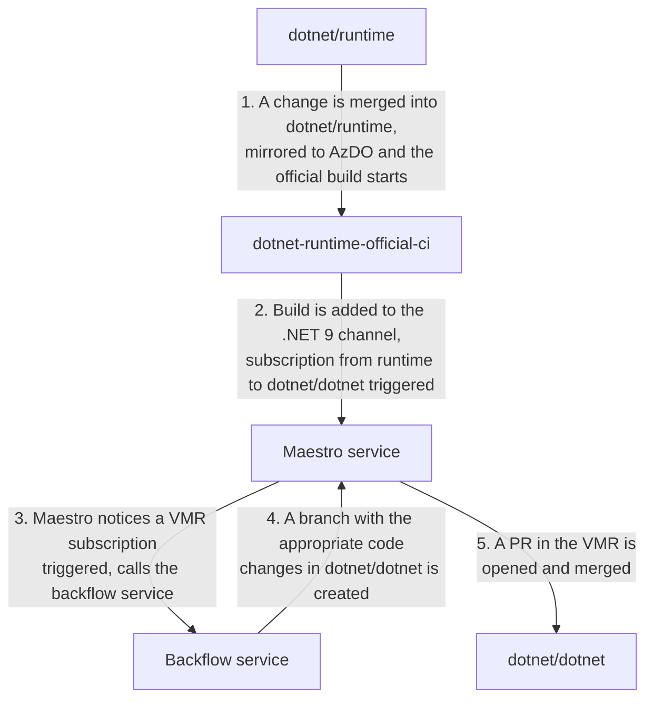

The numbered steps are described in more detail below:

1. This is the current normal process for making a change to an individual repository. Nothing changes.
2. Currently, each official build of each repo publishes itself via darc which registers the commit and the set of built packages into the BAR and is assigned to zero or more channels. There is a lot of configuration effort in which repositories publish from which branches to which channels. We intend to keep this existing setup in place and piggy back on this. The only change to the current state is that we will subscribe to channels from the VMR. Possibly, these subscription will get a special flag to indicate that they are VMR subscriptions, e.g. `CodeFlow=true`.
3. Maestro already listens to BAR events (to builds being added to channels) and triggers the appropriate subscriptions. For VMR subscriptions, it will call the backflow service which will process the request on its own time (e.g. stores requests in a queue and works through them). The initial call from Maestro should be just a quick ping that will enqueue the request.
4. The backflow service will process the request by looking at the commit of the source repo that was synchronized to the VMR last by looking at the [`source-manifest.json` file](https://github.com/dotnet/dotnet/blob/main/src/source-manifest.json). It will then apply the diff between that commit and the one that is associated with the build information in BAR.

From this, it is obvious that the changes needed in the Maestro changes and the BAR database are minimal. The new backflow service will be the main new component. It will, however, re-use a lot of already existing code from Maestro (namely [`DarcLib`](https://github.com/dotnet/arcade-services/tree/main/src/Microsoft.DotNet.Darc/DarcLib)).

### Backflow

For backflow, the situation is quite similar:

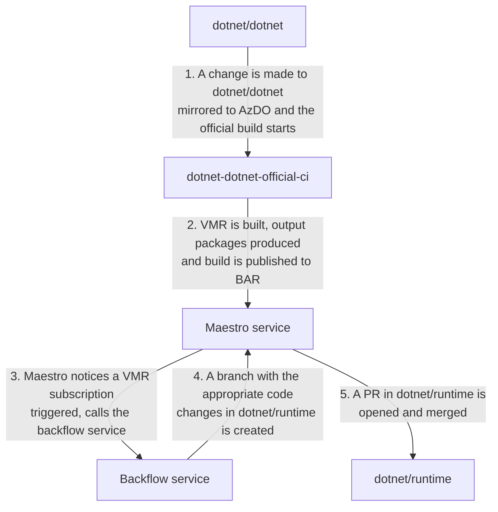

The only difference from the forward flow is that the VMR creates and publishes build output packages which are then flown back to the original repositories.

## Implementation plan

### Backflow service

For the purpose of flowing the code from/to the VMR, we will create a new service. This service will be called by Maestro when a VMR subscription is triggered. It will then perform the actual work of creating the PRs in the individual repositories or in the VMR.

The following diagram roughly shows how these services will be composed (new components are in green):

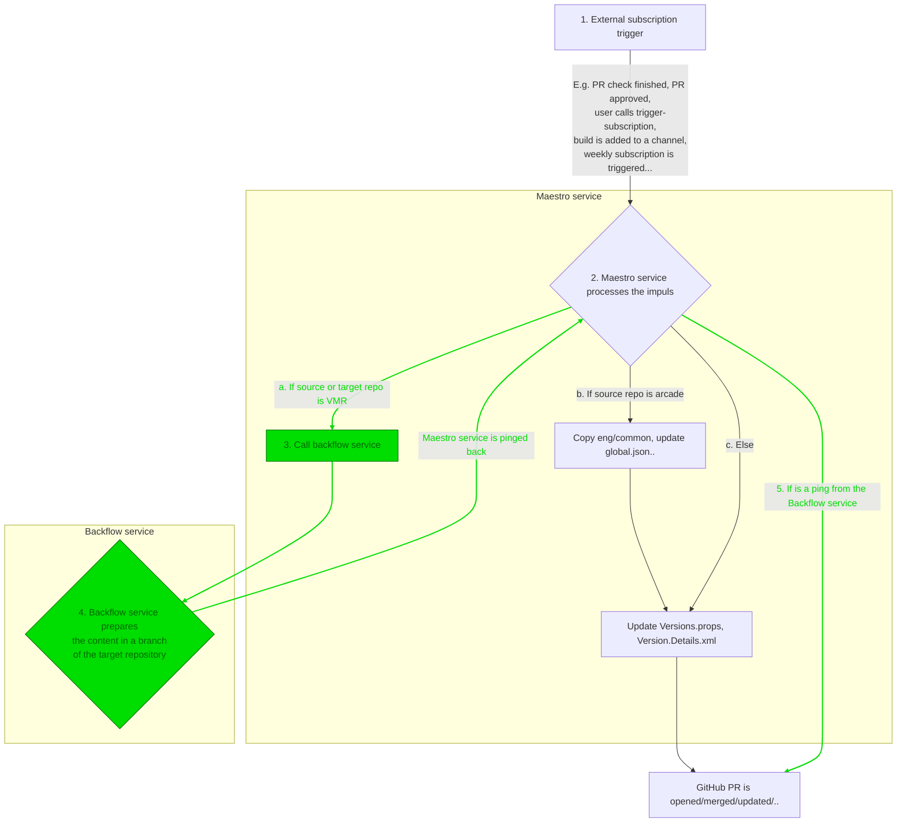

On the diagram we can see:
1. An external trigger starts a process in Maestro which means a subscription needs to be handled.
2. The logic for handling the trigger is mostly the same as today. Maestro checks the source and target repository and prepares the update:
   - For the VMR, it will newly call a new service.
   - Otherwise, it opens a regular dependency PR where for subscriptions originating in Arcade it also copies the `eng/common` folder and updates the `global.json` file.
3. The call to the backflow service only pings it to start processing the request. The backflow service will then process the request on its own time. Meanwhile, Maestro will note down that it's waiting for the backflow service to finish.
4. The backflow service will synchronize the new content and push it into a branch.
   - If this is a branch of an already existing PR, the PR will be updated.
   - If this is a branch for a new PR, the PR will be created by Maestro later.
5. Maestro will process the ping and check what stage the PR is in or create a new one.
   - The ping must also contain information about whether any new changes are even available.
   - It's possible the PR got already merged or closed so Maestro will need to work with these cases.

### Why new service?

We have decided to not put the backflow functionality directly into Maestro for the following reasons:
- The backflow service will need to clone the VMR and individual repositories. This will require a lot of disk space and we are not sure if Service Fabric can handle this.
- The backflow service will be long living and persisting the cloned repositories to speed up the synchronization process. This is again something that might be difficult to achieve using Service Fabric actors.
- The Maestro service is very stable and not receiving many changes so we will implement this new functionality in a separate service to avoid introducing new bugs into Maestro.
- The local development workflow will be much easier if we can run the backflow service locally without having to run the whole Maestro service fabric cluster.
- We plan to use a more modern technology such as Azure Container Apps. Once we have stabilized the Backflow service, whichever of these two technologies proves to be better, we will merge those. This should be fairly simple as both will use `DarcLib` to perform the actual work.
- We expect that moving to ACA will be easier as Maestro itself doesn't have many complex requirements and once we have both, moving existing Maestro controllers and background services to ACA should be fairly simple. The other way might be harder because of the disk space limitations.

### Composition of DarcLib commands

Presently, the `DarcLib` library contains a set of simple commands which are used by the Maestro service to perform its tasks. Number of them can also be executed locally via the Darc CLI.  
As an example, there is the `update-dependencies` command which locally updates the versions of dependencies of a repository. The same command is run within Maestro to create the dependency flow PR.

The Darc CLI currently contains a subset of VMR commands and is used to synchronize the present VMR-lite. The new backflow service should use a similar pattern and follow the existing non-VMR counterparts. For instance, a `darc vmr update-dependencies` command will be added.

Once we have the set of commands that can forward/backflow the code locally, we can compose the service out of these.

## The code flow algorithm

This section describes the details of moving the code between product repositories and the VMR. The algorithm will work differently in each direction to achieve maximum fluency and minimize the amount of conflicts developers need to tend to but also ensure that conflicting changes manifest as conflicts and changes are not overridden without a trace.

The algorithm will always consider the delta between the VMR and the repository and we will flow this delta via a pull request that will open in the counterpart repository. It is expected that there will be a forward flow and a backflow PR open at most times and the order in which the repositories will synchronize in can be random. As an example, a backflow might be blocked for an extended period of time because repo's validation, which will be more extensive than VMR's, might uncover some problematic changes done in the VMR that need fixing. While this is going, the forward flow can continue and the VMR can be updated with the latest changes from the repository. For this reason, we need to have a look at the algorithm with respect to its context - e.g. the direction of the last synchronization.

This means that we need to look at the following flow combinations:
- Forward flow after backflow
- Backflow after forward flow
- Two flows in the same direction

The diagrams for these four situations can be seen here:

| Previous flow / Current flow | Then backward | Then forward |
|------------------------------|:-------------:|:------------:|
| Backward first               | 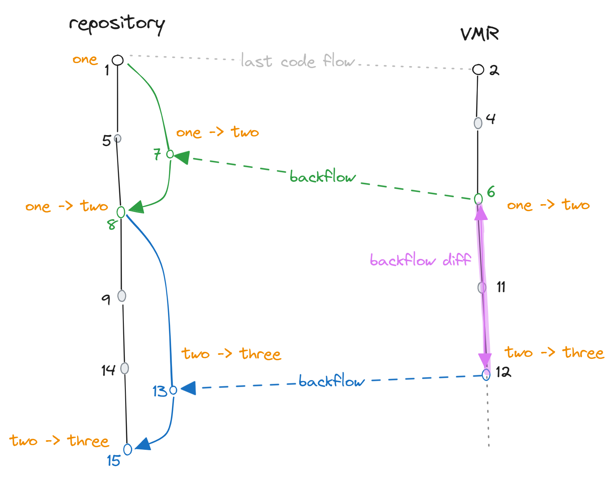 | 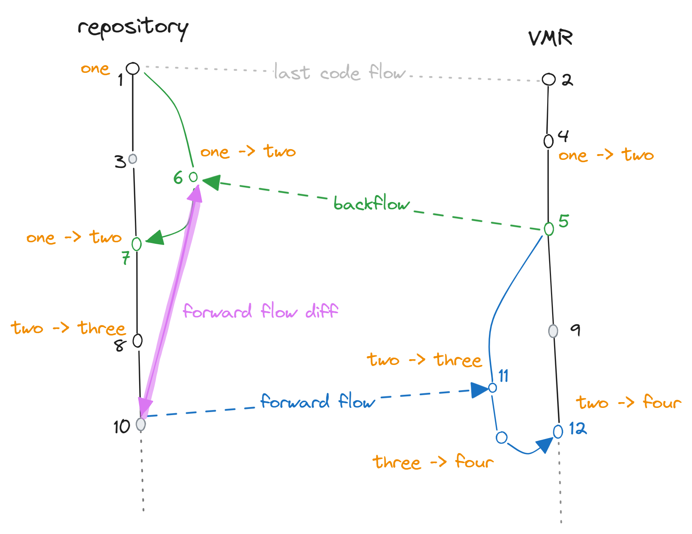 |
| Forward first                | 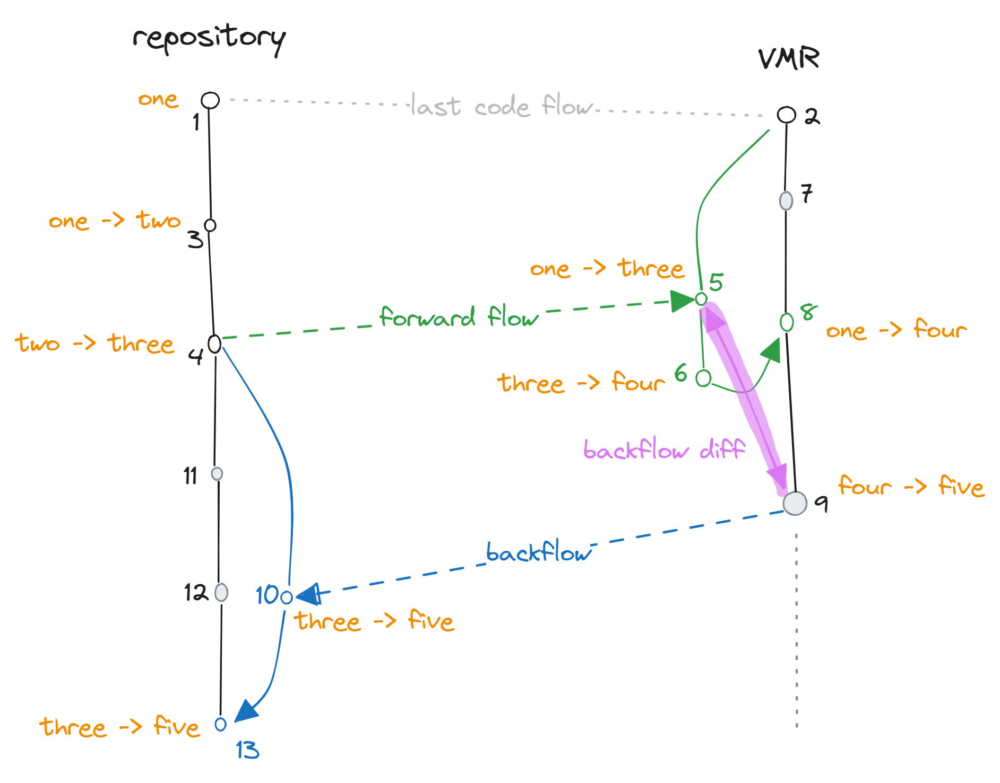 | 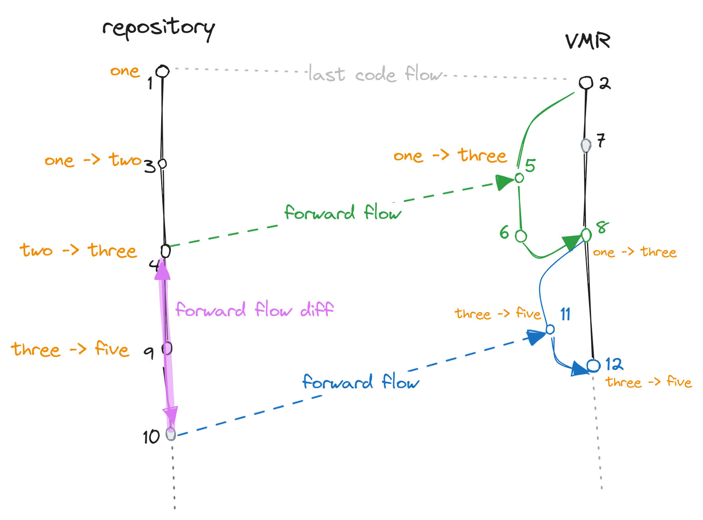 |

### Algorithm visualization

The diagrams below visualize the algorithm and show which diffs are used to create the PRs. The diagrams use the following common notation:
- 🟠 The repository contains an example file (say `A.txt`). This file contains a single line of text. The content of the file transformations are denoted in orange. The file starts with the text `one` and ends with the text `five`.
- 🟢 Green arrows denote the previous successful flow.
- 🔵 Blue arrows denote the flow we're interested in in the current diagram.
- 🟣 In purple, we visualize the actual diff that we need to carry over to the counterpart repository.
- ⚫ Greyed out commits denote commits that do not affect the `A.txt` file but contain an unrelated change done in the given repository.
- We usually assume that some previous synchronization happened (points `1` <-> `2`) and the 🟢 green previous synchronization was done based on its previous synchronization.
- The commits are numbered and happen in the order of the numbers. The numbers are used to refer to the commits in the text.
- Editable source version of diagrams is [here](https://excalidraw.com/#json=2QlCyifI87WwEdysg_Ybg,ZPCAufuEmT1SybVB1ooSWA).


<p align="center">
  🖼️ Image #1 - Backflow after forward flow
</p>

On this diagram we see:

The flow of changes in the diagram is as follows:  
`1` and `2` denote some previous synchronization point.
`3` Commit in the repository changes the contents of `A.txt` to `two`.  
`4` Commit in the repository changes the contents of `A.txt` to `three`. Forward flow also starts at that point (this is arbitrary).  
`5` A forward-flow branch (green) is created in the VMR. The branch is based on the commit of last synchronization (`2`). How this forward flow is created is not the subject of this diagram. Here, we are interested in the following flow.  
`6` An additional arbitrary commit is made in the forward flow PR which changes the contents of `A.txt` to `four` (i.e. fixing the build).  
`7` A commit is made to the main branch of the VMR, content is unrelated.  
`8` Forward flow PR is merged, effectively updating `A.txt` from `one` to `four`.  
`9` A commit is made to the main branch of the VMR, changing content from `four` to `five`. Backflow starts at that point (this is arbitrary).  
`10` A backflow branch (blue) is created in the repository. The branch is based on the commit of last synchronization's (`2`) base commit. The content on the commit is [described below](#backflow-commit). A PR from this branch is opened.  
`11` A commit is made to the main branch of the repository, content is unrelated.  
`12` A commit is made to the main branch of the repository, content is unrelated.  
`13` The PR is merged, effectively updating `A.txt` from `three` to `five`.

You can notice several features:
- No (git) conflicts appear. This is because this concrete example considers a single file that is chronologically changed from `one` to `five` in gradual steps. In such case, we should not expect any conflicts and this is by design. In cases where most of the changes happen in the individual repository, we expect the code to flow fluently.
- The whole flow is comparable to a dev working in a dev branch within a single repository - the dev branch being the VMR where the dev merges the main branch in between the work (this is the forward flow). The dev then opens a PR against the main branch (the repository in this case). Wherever there would be conflicts in a single repository case, we would get conflicts here too and this is by design.

What is left to discuss is how we create the commit (`10`) of the backflow branch. We know that we received the delta from the repository as part of the commit `8` after the last forward flow PR was merged. We assume that a squash merge was used and commits `5` and `6` are no longer available.  
The delta between the repositories when commit `9` (which we will backflow) happens is technically commits `6`, `7` and `9` is visualized as the purple diff between `9` and `5`. This diff correctly represents the delta because:
- It contains the last known snapshot of the repository (`5`)
- All commits that happened in the VMR in the meantime (since the last commit) - the commit `7`.
- The other commits that happened in the VMR since the sync `9`.

The base commit of the backflow branch is then the base commit of the last forward flow as that's what we're applying the delta to. If commit `11` or `12` would change the contents of `A.txt`, we would get a conflict in the backflow PR which is desired.

Similarly, we can look at the opposite direction which is symmetrical.


<p align="center">
  🖼️ Image #2 - Forward flow after a backflow
</p>

The situation changes when we have two flows in the same direction and things are a bit easier than:


<p align="center">
  🖼️ Image #3 - Two backwflows in a row
</p>

or the opposite direction:


<p align="center">
  🖼️ Image #4 - Two forward flows in a row
</p>

When we are forming the backflow commit (`13`), we know that the only things that happened since we last sent all our updates to the repository are the commits `11` and `12` which are equal to a simple diff of the branch we're flowing.

### Pseudo-code

For simplicity, let's consider the following:
- There is only one target individual repository and it is known in advance. In reality, we would need to figure out all target repositories for which the files in the VMR changed but this is trivial and unimportant for what we want to show - the way we will create the diffs and patches for the changes within a single repository.
- There was a previous successful code flow in the past. The repositories will be synchronized in the already existing VMR-lite and the first code flow will be manually triggered. The algorithm describes how the code will flow after that.
- The last SHA of the counterpart repository that we have synchronized from is stored in the VMR/individual repository. In the present VMR, this information is already in the `source-manifest.json` file. For backflow, we will store the source VMR SHA in the `Version.Details.xml` file.
- The algorithm works symmetrically in both directions with the exception of some of the files being cloaked on the way to the VMR. The cloaking mechanism is described [here](./VMR-Design-And-Operation.md#repository-source-mappings).
- The algorithm won't contain steps for opening a pull request but rather focuses on preparing the commits/PR branches locally.
- The code doesn't take into account the case that a PR might already exists and we are updating it. This situation is described in the [Updating PRs](#updating-prs) section.

A high-level pseudo-code of the algorithm would go as follows:

1. Detect the direction of the last flow.
2. If last flow was in the in-flow direction:
    1. Diff the state flown from the target repo on the last sync and the current head.
    2. Apply the diff on top of the last flown commit of the target repo.
3. If last flow was in the out-flow direction, flow the new changes in the source repo:
    1. Create a diff of the current HEAD commit and the last flown commit of the source repo.
    2. Try to apply the diff on top of the last flown commit in the target repo.
    3. If the diff does not apply cleanly, recreate the last flown state before merging and apply the diff on top.
4. If we are flowing to an individual repo, flow intermediate package versions.

More detailed low-level pseudo-code of the algorithm is as follows:

```bash
# Main entrypoint of the algorithm - input comes from Maestro subscription trigger
# $source_repo is where the build comes from (repository or VMR)
# $target_repo is the subscribed one (repository or VMR)
# The final effect is that there will be a branch in the target repo with the changes
function flow($sha, $source_repo, $target_repo):
  if $source_repo is VMR:
    backflow($sha, $source_repo, $target_repo)
  else
    forwardflow($sha, $source_repo, $target_repo)


# Direction repo -> VMR
function forwardflow($sha, $vmr_path, $repo_path):
  # The implementation of get_previous_flow is described "Previous flow direction detection"
  # It contains source/target SHAs
  let last_flow = get_previous_flow()

  if $last_flow is forward:
    same_direction_flow($sha, $last_flow, $target_repo, $vmr_path)
  else:
    opposite_flow($sha, $last_flow, $target_repo, $vmr_path)


# Direction VMR -> repo
function backflow($sha, $vmr_path, $repo_path):
  let last_flow = get_previous_flow()

  if $last_flow is backward:
    same_direction_flow($sha, $last_flow, $vmr_path, $repo_path)
  else:
    opposite_flow($sha, $last_flow, $vmr_path, $repo_path)

  # Bumps intermediate package versions in the individual repo
  # These are packages built in the VMR build that we are flowing
  update_dependencies($sha, $target_repo)
  commit($target_repo)


# Activated in a case when there was no in-flow since the last out-flow
# In this case, we only flow the new delta that happened in the source repo
# This can be seen lower in 🖼️ Images 3, 4 and 5
function same_direction_flow($sha, $last_flow, $source_repo, $target_repo):
  create_branch($target_repo, $last_flow.target_sha, 'pr-branch')

  if $source_repo is VMR:
    diff = diff($source_repo, $last_flow.source_sha, $sha, path: src/$repo_name, cloaking: [submodules])
    target_path = $target_repo
  else
    diff = diff($source_repo, $last_flow.source_sha, $sha, path: /, cloaking: [submodules + cloaking rules])
    target_path = $target_repo/src/$repo_name

  try:
    apply_diff($target_path, $diff)
  catch PatchDoesNotApply:
    # Changes in the target repo conflict, we have to create the branch from the previous point
    # This is shown in the "Conflicts" section below (🖼️ Image 6)
    # We recreate the last flown state, apply new diff on top and create a PR
    # The changes that were already merged before (the previously flown state)
    # will be transparently hidden when resolving the conflict in the new PR
    flow($last_flow.source_sha, $source_repo, $target_repo)
    # Diff should now apply as it follows the history of the source repo
    apply_diff($target_path, $diff)

  commit($target_repo)


# Activated in a case when the last flow was an in-flow
# It reconstructs the delta between what was in-flown the last and what is in the source repo now
# This can be seen lower in 🖼️ Images 1 and 2
function opposite_flow($sha, $last_flow, $source_repo, $target_repo):
  create_branch($target_repo, $last_flow.source_sha, 'pr-branch')

  # Now we diff the current state of the source repo and the last flown state of the counterpart repo
  # Please note that an inter-repo diff can't be used as cloaking rules might need to apply
  # Instead, we remove repo contents and copy the counterpart repo contents into it
  if $source_repo is VMR:
    delete_working_tree($target_repo, exclude: [submodules + cloaking rules])
    diff = diff($source_repo, EMPTY_COMMIT, $sha, src/$repo_name, cloaking: [submodules])
    target_path = $target_repo
  else
    delete_working_tree($target_repo, exclude: [submodules])
    diff = diff($source_repo, EMPTY_COMMIT, $sha, /, cloaking: [submodules + cloaking rules])
    target_path = $target_repo/src/$repo_name

  # Effectively copies the contents of the counterpart repo into the target repo (with cloaking rules applied)
  apply_diff($target_path, $diff)
  commit($target_repo)
```

As you can see, the algorithm chooses between two strategies - `same_direction_flow` and `opposite_flow`. These match the two different situations we've seen in the diagrams above.
You can also notice that the algorithm is recursive in an edge case when it cannot construct the PR branch in the first place. This situation is explained the [Conflicts section](#conflicts).
Theoretically, it could happen, that each of the previous flows had a conflicting change made in the flow PR. In such case, the algorithm would recurse all the way to the first flow and technically
recreate the whole source branch in the target repository. However, this would also mean there was no flow in the ingoing direction so this situation is not expected to happen.

### Previous flow direction detection

For the above to work correctly, we need to be able to tell which situation we're in and which direction the last flow happened. For this to work, we need to store the last SHA of the counterpart repository that we have synchronized from the last. In the present VMR, this information is already present in the `source-manifest.json` file. For flowing from the VMR into an individual repository, we will store this in the `Version.Details.xml` file.

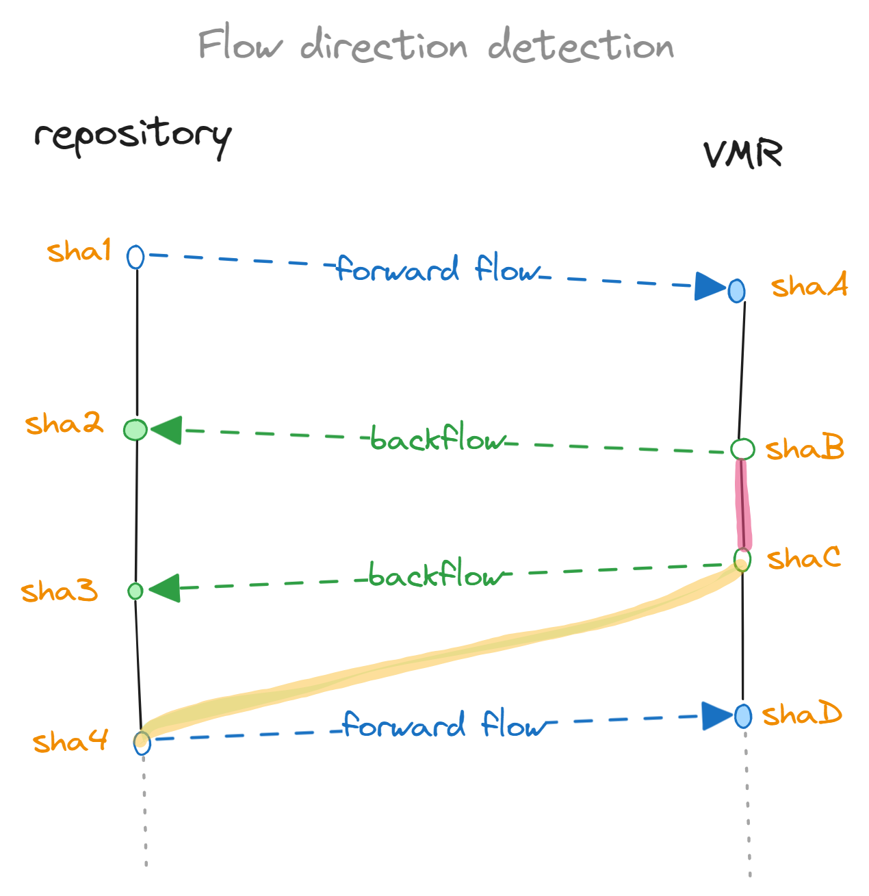
<p align="center">
  🖼️ Image #5 - Detecting flow direction
</p>

Let's assume we're at the point of wanting to open a flow PR from a given commit. To do that, we need to find out:
- Last points of synchronization in source and target repositories
- Base commit in the target repository

#### Detecting incoming flow

Let's assume we want to open a forward flow PR from commit `sha4`. To create the PR, we need the find out that:
1. `shaC` backflowed to `sha3`.
2. No other flow happened after that.

We can deduce this information easily from:
1. `Version.Details.xml` in `sha4` (our starting point) contains `shaC` as the last synchronized commit from the VMR.
2. `source-manifest.json` in the destination VMR commit contains a commit older than `sha3`.

`shaC` will then be both the base commit of the PR branch and also the commit we will be creating the diff (shown in yellow) against as you can see if you compare this simplified diagram to the "Forward flow after backflow" one above.

#### Detecting outgoing flow

Now let's assume we're trying to backflow from `shaC`, creating `sha3`. This time, we need to find out that:
1. `shaB` backflowed to `sha2`.
2. No other flow happened after that.

We can deduce this information easily from:
1. `Version.Details.xml` in `sha2` (our destination point) has `shaB` as the last synchronized commit from the VMR.
2. `source-manifest.json` in `shaC` (our starting point) VMR commit contains `sha2`.

We will then use the `shaB`-`shaC` diff (in pink) as the diff for the PR while basing the PR branch off of `sha2` (last known place we backflowed into).

#### Cases when SHA is not in the graph

It can happen that the SHA we find in the `Version.Details.xml` or `source-manifest.json` is not in the history of the current repository's branch tip. This can happen when we synchronize an off-branch commit or when the commit comes from a different repository entirely (e.g. internal fork).

> ⚠️⚠️⚠️ TODO - document how it can happen and what to do about it? E.g. force overwriting or finding last common ancestor etc.

### Conflicts

Conflicts will happen and the goal of the process is to:
1. Make the conflicts visible in the flow PR so that developers need to resolve them.
2. If a conflict occurs and gets resolved in one side, the next flow from that side should bring the resolution to the other side.
3. The PR description / comments made by the system should point to the points of friction (e.g. conflicting commits) so that developers have an easier time resolving them.

An example of a conflict that is quite problematic is shown here:

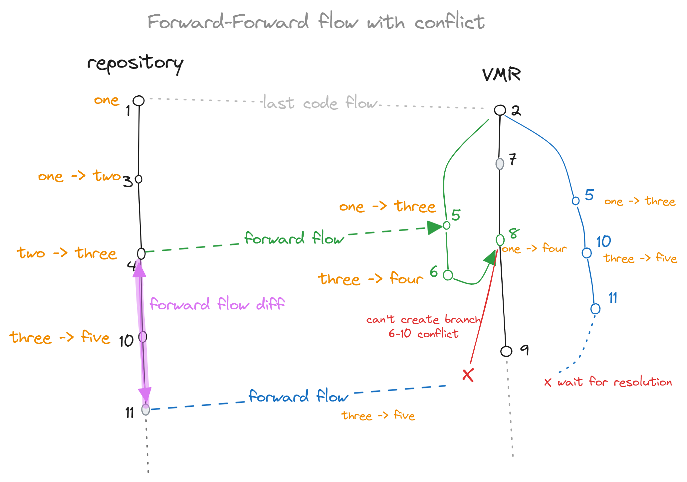
<p align="center">
  🖼️ Image #6 - Two flow in a row with a conflict
</p>

In this diagram, the additional commit that was made in the first forward flow PR (`6`) conflicts with a commit made in the repository (`10`). Since there was no backflow, this information is inaccessible by the repository.  
The follow-up forward flow is problematic because `10` and `11` cannot be applied on top of `8` so we are not able to even create the PR branch.  
In such a case the only thing left to do is to base the PR branch on the last known good commit (`2`), re-apply `5` (which is technically `1`, `3` and `4`), apply `10` and `11` on top and create a PR branch that will be conflicting with the target branch because of the `6`/`10` conflict.  
The user would then be instructed to merge the target branch (`9`) into the PR branch and resolve the conflict. The behaviour of git in this case is that the changes contained in `5` that are the same as the ones in `8`, will transparently match up and only the actual conflicting files will be left for resolution.  
The next backflow will then bring this resolution over to the repository.  
The downside is that before the target branch is merged into the PR branch, users will see changes in the PR that were previously only merged into the VMR as part of `8`. Those changes will disappear from the PR once the branch is merged.

There are countless other examples of conflicts that can occur but these will usually manifest as conflicts in the PR. The example above is more interesting because the forward flow is unable to even create the PR branch. This is due to the fact that `8` (the previous forward flow commit) contains `6` which is something extra.

### Parallel flows

Another usual situation is when we have PRs open for both flows at the same time and one of them merging while the other is still opened. We need to then make sure that the other flows is properly updated.

A sample situation can be seen here (again events happening in the order of the numbers):

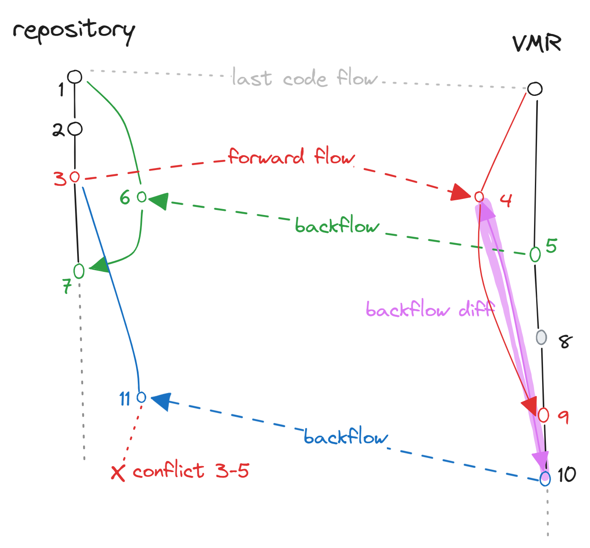

What we can see is that while the red forward flow PR was still open, the green backflow merged. The next backflow (blue) will then apply the same algorithm as before (shown in purple).  
The resulting PR branch will be in conflict with repository's target branch because `5` will clash with `7` but a simple merge would resolve this transparently just as we've seen with the conflict scenario mentioned above.
Outside of this, the purple diff contains all it needs (`8` and `10`) to bring the repository up to date. If additional changes were made in the forward flow PR (between `4` and `9`), those would be accounted for too - same as in the previous scenarios.

### Updating PRs

Once a code flow PR is opened, if a new build from the source repository is produced, we need to update the PR with the new changes.
The code flow algorithm should handle this situation seamlessly as it will detect the previous flow, which it made to create the PR, and apply the new changes on top of it.

It could happen that developers pushed additional commits into the PR branch to fix some issues. These can get in conflict with the new updates. In such a case, the algorithm should not invoke the recursive flow like discussed in the [Conflicts section](#conflicts) but rather just post a comment on the PR that the flow in this direction is paused until the PR is merged.

## Synchronization configuration

Presently, in the VMR-lite, the rules affecting the code synchronization live in the `source-mappings.json` file. This file is located in the `dotnet/installer` repository and mapped into the `src/` directory of the VMR. That `dotnet/installer` repository is the only point from which we synchronize the code into the VMR.

Since we will now also have to store information in the repo about the last time the code has flown there from the VMR, we will utilize the `Version.Details.xml` file and support a new tag:

```xml
<Source Uri="https://github.com/dotnet/dotnet" Sha="86ba5fba7c39323011c2bfc6b713142affc76171" />
```

The tag will store the last SHA that was flown from the VMR into the repository. This information will be used to detect the direction of the last flow.

### Arcade

#### Updating `eng/common`

The `eng/common` folder is currently hosted in the `dotnet/arcade` repository and copied to other repositories when they receive dependency updates from `dotnet/arcade`.
Since repositories will only accept dependency updates from the VMR, we will need to distribute this folder from there too.

The rules for managing `eng/common`:

- `dotnet/arcade` stays the home for this folder as the contents are tied to the Arcade version often.
- When code is flowing from arcade to the VMR, we treat it as any other code flow subscription, and just update `src/arcade`.
- Changes of `eng/common` in the VMR`s root will be overwritten like in any other repo.
- Any subscription from the VMR (code-enabled or normal) will contain `Microsoft.DotNet.Arcade.Sdk`. So any arcadified repo will receive the Arcade update from there. The `src/arcade` folder will be used as the source of truth for version file updates (`eng/common`, `global.json`, ...).
- Repositories can opt-out from getting Arcade updates from the VMR by ignoring the `Microsoft.DotNet.Arcade.Sdk` package in their code flow subscription.
- Like in any other repo, VMR's root `eng/common` will only get updated during regular (non-source-enabled) VMR -> VMR subscriptions.

A diagram of how the code flow including the `eng/common` folder looks like:

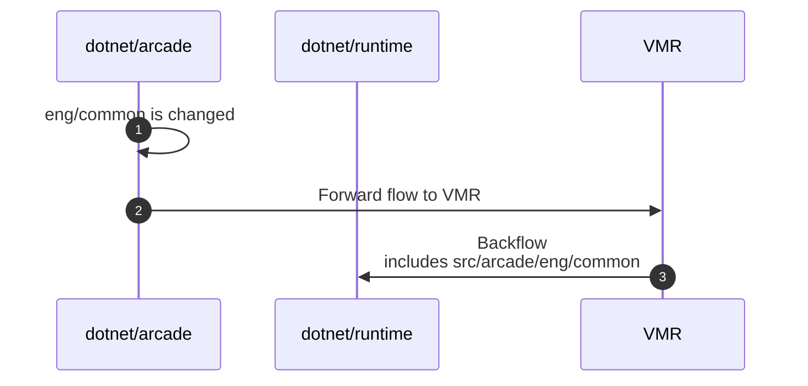

A diagram of a similar code flow but the `eng/common` change would happen in the VMR:

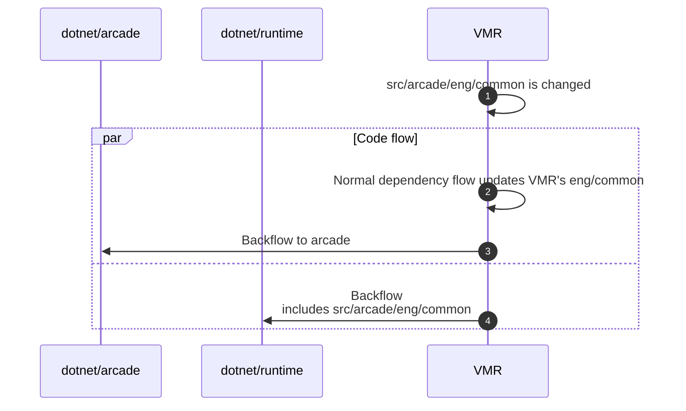

#### Updating `global.json`

Similar to `eng/common`, individual repos will follow the `global.json` settings from the VMR with the option to opt-out. This is mainly because bumping the .NET SDK in repositories can take time or is not desirable.

Repositories can opt-out from getting Arcade updates from the VMR by ignoring the `Microsoft.DotNet.Arcade.Sdk` package in their codeflow setting.
