> Note: This is a proposal for a strategy to build, manage and release multiple SDK bands of .NET. The proposal is part of the [Unified Build](./README.md) effort. For more context about the problem this design is trying to solve see the [Managing SDK Bands](./VMR-Managing-SDK-Bands.md) document.

# Managing SDK Bands - "SDK branches" proposal

This proposal follows closely how we organize SDK band branches today. The bottom line is that we'd just keep using SDK branches in the VMR the same way we have them in other repositories. This is, in fact, what we’re currently already doing with today’s read-only VMR-lite where we synchronize the SDK branches of `dotnet/installer`.

This document describes the end-to-end process from developing to shipping multiple SDK bands using this model.

## Layout

For simplicity, let's consider we are synchronizing the repositories `dotnet/arcade`, `dotnet/runtime`, `dotnet/roslyn` and `dotnet/sdk` where `dotnet/runtime` and `dotnet/arcade` are the shared components.

The layout of files stays the same as today's VMR-lite. There is one caveat though. The SDK branches for other bands than the first one (`1xx`) would not contain the sources of the shared components.
Instead, they would flow in the branches via a package flow where the branches would reference the intermediate packages that would be built in the from the `1xx` branch.

So the layout would look like this:

```sh
# release/9.0.1xx branch
└── src
    ├── arcade
    ├── roslyn
    ├── runtime
    └── sdk

# release/9.0.2xx branch
└── src
    ├── roslyn
    └── sdk
```

The layout has the following characteristics:
- VMR has SDK branches, e.g. `release/9.0.1xx` and `release/9.0.2xx`.
- Each repository is a folder under `src/` in the `1xx` branch of the VMR.
- Each non-1xx branch of each SDK-specific repository maps to a folder under `src/` in a matching branch in the VMR.
- Each commit of the `1xx` branch produces a single runtime and single SDK.
- Commits of the `non-1xx` branches produce SDKs only and their shared components are referenced as packages built from the `1xx` branch.

## Code flow

To re-iterate what the planned code flow looks like for .NET 9 (with full VMR back flow) – the individual repositories only receive and send updates from/to the VMR and not between each other. A regular forward flow with changes going to the VMR only would look like this:


The situation gets more interesting for breaking changes. Let’s imagine a situation where a change is needed in one of the bands that requires a breaking change in a shared component:

```mermaid
sequenceDiagram
    autonumber

    participant runtime as dotnet/runtime<br />release/9.0
    participant SDK_1xx as dotnet/sdk<br />release/9.0.1xx
    participant SDK_2xx as dotnet/sdk<br />release/9.0.2xx
    participant VMR_1xx as VMR<br />release/9.0.1xx
    participant VMR_2xx as VMR<br />release/9.0.2xx

    runtime->>runtime: Change in runtime ➡️ RUN_2

    runtime->>VMR_1xx: PR with source change to 📄 RUN_2 is opened
    activate VMR_1xx
    Note over VMR_1xx: ❌ Requires a change in SDK
    VMR_1xx->>VMR_1xx: Change is made to sdk, creating 📄 SDK_1.2
    deactivate VMR_1xx
    Note over VMR_1xx: 📦 VMR_2 intermediates are built

    VMR_1xx->>SDK_1xx: Flow of 📄 SDK_1.2, 📦 VMR_2

    VMR_1xx->>VMR_2xx: Flow of 📦 VMR_2
    activate VMR_2xx
    Note over VMR_2xx: ❌ Requires a change in SDK
    VMR_2xx->>VMR_2xx: Change is made to sdk, creating 📄 SDK_2.2
    deactivate VMR_2xx
    Note over VMR_2xx: 📦 VMR_3 intermediates are built
    VMR_2xx->>SDK_2xx: Flow of 📄 SDK_2.2, 📦 VMR_3

    Note over VMR_2xx: ✅ Coherent state<br />VMR 1xx and 2xx have both 📦 VMR_2
```



The diagram shows:

1. A change was made in `dotnet/runtime`. This starts steps `2.` and `5.` in parallel.
2. The change is flown to VMR's 1xx branch where a PR with the source change is opened.  
3. The PR build fails and more changes are needed under the `src/sdk` folder. PR is merged.  
   Official VMR build publishes intermediate packages for each repository.
4. New sources of the `1xx` band, together with the we new runtime intermediate package are flown back to `dotnet/sdk`.
5. Intermediate packages of shared components are flown to VMR's 2xx branch.
6. The PR build fails and more changes are needed under the `src/sdk` folder. PR is merged.  
   Official VMR build publishes intermediate packages for each repository.
7. New sources of the `2xx` band, together with the we new runtime intermediate package are flown back to `dotnet/sdk`.

After the last step, the `1xx` VMR branch has the sources of `dotnet/runtime` that are packaged and used by the `2xx` branch which means they're coherent.

## Band snap

To create a new band, and for the ease, it would be the best to do the snap in the VMR from where it would be flown to the appropriate branches in the individual repositories:

1. Create the new branch based off of the current one.  
   E.g. `src/sdk/9.0.1xx` to `src/sdk/9.0.2xx`
2. Remove sources of shared components, adjust versions and point the new band to the intermediate packages of shared components from the last release.
3. Configure Maestro subscriptions between new VMR bands and their individual repository counterparts.
4. If there are at least 3 bands, configure subscriptions of the currently released band to consume the intermediates of the `1xx` band.
5. Maestro flows the changes from the VMR and creates the appropriate branches in the individual repositories.

This makes sure that the new (preview) band is locked down to use the latest released shared components and that the a newly released bands will start getting the newest shared components built in the `1xx` branch.

## Release

On a release day, we need to make sure the SDK branches are coherent. This means that the lastly published intermediates from the `1xx` branch have flown to all of the other SDK band branches. For that to happen, we need to enable the package flow for the preview band and consume the newest bits to validate everything.

Since the shared components were built only once and stored inside of the intermediates, we can assemble the packages from all band branches and release them together.
