> Note: This is a proposal for a strategy to build, manage and release multiple SDK bands of .NET. The proposal is part of the [Unified Build](./README.md) effort. For more context about the problem this design is trying to solve see the [Managing SDK Bands](./VMR-Managing-SDK-Bands.md) document.

# Managing SDK Bands - "SDK branches" proposal

This proposal is probably the most obvious solution that comes to mind considering where we are today. The bottom line is that we'd just keep using SDK branches in the VMR the same way we have them today. This is, in fact, what we’re currently already doing with today’s read-only VMR-lite where we synchronize the SDK branches of `dotnet/installer`.

This document describes the end-to-end process from developing to shipping multiple SDK bands using this model.

## Layout

For simplicity, let's consider we are synchronizing the repositories `dotnet/arcade`, `dotnet/runtime`, `dotnet/roslyn` and `dotnet/sdk` where `dotnet/runtime` and `dotnet/arcade` are the shared components.

The layout of files stays the same as today's VMR-lite:

```
/
└── src
    ├── arcade
    ├── roslyn
    ├── runtime
    └── sdk
```

The layout has the following characteristics:
- Each repository is a folder under `src/` in the VMR.
- VMR has SDK branches, e.g. `release/9.0.1xx` and `release/9.0.2xx`.
- Each branch has a full copy of all repositories, even shared ones.
- Each commit of the VMR produces a single runtime and single SDK.

## Code flow

To re-iterate what the planned code flow looks like for .NET 9 (with full VMR back flow) – the individual repositories only receive and send updates from/to the VMR and not between each other. A regular forward flow with changes going to the VMR only would look like this:


The situation gets more interesting for breaking changes. Let’s imagine a situation where a change is needed in one of the bands that requires a breaking change in a shared component. For this, we assume that a change like this would be always made in the VMR where we can change both components at the same time:

```mermaid
sequenceDiagram
    autonumber

    participant runtime as dotnet/runtime<br />release/9.0
    participant SDK_1xx as dotnet/sdk<br />release/9.0.1xx
    participant SDK_2xx as dotnet/sdk<br />release/9.0.2xx
    participant VMR_1xx as VMR<br />release/9.0.1xx
    participant VMR_2xx as VMR<br />release/9.0.2xx

    runtime->>runtime: Change in runtime ➡️ RUN_2

    par
        runtime->>VMR_1xx: 📄 PR with source change to RUN_2 is opened
        activate VMR_1xx
        Note over VMR_1xx: ❌ Requires a change in SDK
        Note over VMR_1xx: 📦 VMR_2 intermediates are built
        VMR_1xx->>SDK_1xx: Flow of 📄 SDK_2.2, 📦 VMR_2
        deactivate VMR_1xx
    and
        runtime->>VMR_2xx: 📄 PR with source change to RUN_2 is opened
        activate VMR_2xx
        Note over VMR_2xx: ❌ Requires a change in SDK
        Note over VMR_2xx: 📦 VMR_3 intermediates are built
        deactivate VMR_2xx
        VMR_2xx->>SDK_2xx: Flow of 📄 SDK_2.2, 📦 VMR_3
    end

    Note over VMR_2xx: ✅ Coherent state<br />VMR 1xx and 2xx have RUN_2
```



## Build

## Band snap

## Release

> TODO - note: However, we need to make sure the shared bits are the same in each released SDK branch – we’d say the SDK branches would be coherent then. We also need to make sure that changes made to the shared components in VMR’s SDK branches are flown everywhere appropriately.
