> Note: This is a proposal for a strategy to build, manage and release multiple SDK bands of .NET. The proposal is part of the [Unified Build](./README.md) effort. For more context about the problem this design is trying to solve see the [Managing SDK Bands](./VMR-Managing-SDK-Bands.md) document.

# Managing SDK Bands - "SDK branches" proposal

This proposal follows closely how we organize SDK band branches today. The bottom line is that we'd just keep using SDK branches in the VMR the same way we have them in other repositories. This is, in fact, what we’re currently already doing with today’s read-only VMR-lite where we synchronize the SDK branches of `dotnet/installer`.

This document describes the end-to-end process from developing to shipping multiple SDK bands using this model.

## Layout

For simplicity, let's consider we are synchronizing the repositories `dotnet/arcade`, `dotnet/runtime`, `dotnet/roslyn` and `dotnet/sdk` where `dotnet/runtime` and `dotnet/arcade` are the shared components.

The layout of files will stay almost the same as today's VMR-lite:

```sh
└── src
    ├── arcade
    ├── roslyn
    ├── runtime
    └── sdk
```

The problem with this is that each SDK branch would contain source code for all shared components. This would cause problems with keeping the sources of these synchronized.
Furthermore, we don't really even want this behavior as for instance, the preview band always stays locked to the last released version of the shared components until right before the release happens.

To work around that, we'd have to make an adjustment. This adjustment would require a feature in Source Build where we could specify whether a components is built form source or restored from its build output package.
This functionality actually already exists and each repository already references its dependencies via `eng/Version.Details.xml` so that it can build inside of its individual repository.
Considering we have this capability, we'd then change the VMR contents so that the SDK branches of other bands than the first one (`1xx`) would not contain the sources of the shared components.
Instead, they would flow in the branches via a package dependency flow where the branches would reference the build output packages that would be built from the `1xx` branch. This will give us more flexibility such as locking down the version of the shared components in the preview band to the last released version.

The complete layout would then look like this:

```sh
# release/9.0.1xx branch
└── src
    ├── arcade
    ├── roslyn
    ├── runtime
    └── sdk

# release/9.0.2xx and other branch
└── src
    ├── roslyn # references the runtime and arcade build output packages instead of sources
    └── sdk # references the runtime and arcade build output packages instead of sources
```

To summarize the characteristics:

- VMR has SDK branches, e.g. `release/9.0.1xx` and `release/9.0.2xx`.
- Each repository is a folder under `src/` in the `1xx` branch of the VMR.
- Each non-1xx branch of each SDK-specific repository maps to a folder under `src/` in a matching branch of the VMR.
- Each commit of the `1xx` branch produces a single runtime and single SDK. The non-1xx branches do not contain all the code however.
- Commits of the `non-1xx` branches produce SDKs only and their shared components are referenced as packages built from the `1xx` branch.

## Band life cycle

- **Product preview time**  
    The preview time is when most of the development happens and the VMR would contain a single band only. For this time, we only have the 1xx branch in the VMR and everything works the same way as now.

- **Band preview time**  
    The band that is created the latest and is to be released next is called the preview band. Except of the 1xx, each preview band is locked down to use the latest released version of the shared components for the time of development. Since this proposal won't put the sources of the shared components in the non-1xx branches, it will be quite obvious that the dependencies come from packages.

- **Band snap**  
    To create a new band, and for the ease, it would be the best to do the snap in the VMR from where it would be flown to the appropriate branches in the individual repositories:

    1. Create the new branch based off of the current one.  
    E.g. `src/sdk/9.0.1xx` to `src/sdk/9.0.2xx`
    2. Remove sources of shared components in the `2xx` branch. Adjust package versions and point the new band to the build output packages of shared components from the last release.
    3. Configure Maestro subscriptions between new VMR bands and their individual repository counterparts.
    4. If there are at least 3 bands, configure subscriptions of the currently released band to consume the build output packages of the `1xx` band.  
    > Note: We need 3 bands at minimum because The first one is there from the beginning so we need to wait until a second one only gets out of preview which happens when we snap the third one.
    5. Maestro flows the changes from the VMR and creates the appropriate branches in the individual repositories.

    This makes sure that the new (preview) band is locked down to use the latest released shared components and that the a newly released bands will start getting the newest shared components built in the `1xx` branch.

## Working with the code

The proposed layout has some problematic implications. Let's consider the following scenarios:

1. A developer needs to make sure a cross-repo change to `src/runtime` and `src/sdk` in the `3xx` band.
2. A distro maintainer needs to build the `3xx` band from source.

We need to make sure both of these scenarios are easy to do but the layout of the sources doesn't allow that out of the box.

It seems that to make this work, we'd need to be able to tell Source Build to easily swap between using the sources and the build output packages of the shared components.
When someone would be interested in these flows, we should have a mechanism to also checkout the sources and reference them during the build. There are couple of possibilities:

1. The `src/` folder of non-1xx branches would contain submodules pointing to the original individual repositories. These would not be used in most flows but could be activated. When we'd be flowing changes from the 1xx branch, we could also change where the submodule points.
2. Have a script that would check the components out into `src/` onto the same location where they are placed in the 1xx branch. It would also create some dummy file to signal that Source Build should ignore `Version.Details.xml` when restoring the build output packages but rather build the sources. The `src/` locations and the signal file would be ".gitignored". The dev would then have to backport their changes from withing the folders to either the 1xx branch or the individual repositories.
3. We could just expect the individual repositories to be checked out somewhere else on developer's disk (e.g. next to the VMR itself) and Source Build would know to find and build those instead (again through an invisible signal file for instance).

The first option seems quite straightforward but the individual repository doesn't necessarily have to have the same contents as its counterpart in the VMR which might be problematic.  
The second flow solves the scenario of .NET distro maintainers fully as we'd easily create a source tarball that would match the layout of the 1xx branch. It doesn't work well for the developer scenario though.  
The third option seems to be the best for the developer but doesn't solve the distro maintainer scenario fully.

It seems that we could have a mixture of `2.` and `3.` where Source Build would have a feature of "know to look elsewhere" and distro maintainers would build from a tarball assembled as described in `2.` and developers would have the option to use the sources from their local individual repositories as shown in `3.`.

## Code flow

To re-iterate what the planned code flow looks like for .NET 9 (with full VMR back flow) – the individual repositories only receive and send updates from/to the VMR and not between each other. A regular forward flow with changes going to the VMR only would look like this:

```mermaid
sequenceDiagram
    autonumber

    participant runtime as dotnet/runtime<br />release/9.0
    participant SDK_1xx as dotnet/sdk<br />release/9.0.1xx
    participant SDK_2xx as dotnet/sdk<br />release/9.0.2xx
    participant VMR_1xx as VMR<br />release/9.0.1xx
    participant VMR_2xx as VMR<br />release/9.0.2xx

    runtime->>runtime: New change ➡️ RUN_2

    runtime->>VMR_1xx: Flow of 📄 RUN_2
    Note over VMR_1xx: 📦 VMR_2 build output packages are built
    VMR_1xx->>VMR_2xx: Flow of 📦 VMR_2<br />(runtime build output packages)
    Note over VMR_2xx: 📦 VMR_3 build output packages are built

    Note over VMR_2xx: ✅ Coherent state<br />VMR 1xx and 2xx have 📄 RUN_2

    par Parallel backflow of build output packages
        VMR_1xx->>SDK_1xx: Backflow of 📦 VMR_2
    and
        VMR_2xx->>SDK_2xx: Backflow of 📦 VMR_3
    end
```



The situation gets more interesting for breaking changes. Let’s imagine a situation where a change is needed in one of the bands that requires a breaking change in a shared component:

```mermaid
sequenceDiagram
    autonumber

    participant runtime as dotnet/runtime<br />release/9.0
    participant SDK_1xx as dotnet/sdk<br />release/9.0.1xx
    participant SDK_2xx as dotnet/sdk<br />release/9.0.2xx
    participant VMR_1xx as VMR<br />release/9.0.1xx
    participant VMR_2xx as VMR<br />release/9.0.2xx

    runtime->>runtime: Change in runtime ➡️ RUN_2

    runtime->>VMR_1xx: PR with source change to 📄 RUN_2 is opened
    activate VMR_1xx
    Note over VMR_1xx: ❌ Requires a change in SDK
    VMR_1xx->>VMR_1xx: Change needed in src/sdk<br />Creating 📄 SDK_1.2
    deactivate VMR_1xx
    Note over VMR_1xx: 📦 VMR_2 build output packages are built

    VMR_1xx->>SDK_1xx: Flow of 📄 SDK_1.2, 📦 VMR_2

    VMR_1xx->>VMR_2xx: Flow of 📦 VMR_2
    activate VMR_2xx
    Note over VMR_2xx: ❌ Requires a change in SDK
    VMR_2xx->>VMR_2xx: Change needed in src/sdk<br />Creating 📄 SDK_2.2
    deactivate VMR_2xx
    Note over VMR_2xx: 📦 VMR_3 build output packages are built
    VMR_2xx->>SDK_2xx: Flow of 📄 SDK_2.2, 📦 VMR_3

    Note over VMR_2xx: ✅ Coherent state<br />VMR 1xx and 2xx both use 📄 RUN_2
```



The diagram shows:

1. A change was made in `dotnet/runtime`.
2. The change is flown to VMR's `1xx` branch where a PR with the source change is opened.  
3. The PR build fails and more changes are needed under the `src/sdk` folder. PR is merged.  
   Official VMR build publishes build output packages for each repository.
4. New sources of the `1xx` band, together with the we new runtime build output package are flown back to `dotnet/sdk`.
5. Build output packages of shared components are flown to VMR's 2xx branch.
6. The PR build fails and, similarly to the `1xx` branch PR, more changes are needed under the `src/sdk` folder. PR is merged.  
   Official VMR build publishes build output packages for each repository.
7. New sources of the `2xx` band, together with the we new runtime build output package are flown back to `dotnet/sdk`.

After the last step, the `1xx` VMR branch has the sources of `dotnet/runtime` that are packaged and used by the `2xx` branch which means they're coherent.

## Release

The release has three main phases:

1. **Figuring out what to release** - We need to make sure the SDK branches are coherent. This means that the lastly published build output packages from the `1xx` branch have flown to all of the other SDK band branches. For that to happen, we need to enable the package flow for the preview band and consume the newest bits to validate everything.

2. **Compiling the binary release** - Since the shared components were built only once and stored inside of the build output packages, we can assemble the packages from all band branches and release them together, similarly to how we do it today. The staging pipeline could assemble the build products from the official builds similarly to how we do it today.

3. **Publishing and communicating the release of the sources** - Publishing of sources so they are easily consumed by 3rd party partners would differ based on whether the consumer cares about one or all bands. or a single SDK band release, only the 1xx band branch would contain the sources in such a way that you could build directly. The non-1xx band branches do not contain the source code of the shared components and only reference them as build output packages. This means that we'd need to compile the sources by restoring them from the 1xx band branch. For releases of multiple SDKs together, we'd also need to compile the full set of sources by bringing the branches together.
