> Note: This is a proposal for a strategy to build, manage and release multiple SDK bands of .NET. The proposal is part of the [Unified Build](./README.md) effort. For more context about the problem this design is trying to solve see the [Managing SDK Bands](./VMR-Managing-SDK-Bands.md) document.

# Managing SDK Bands - "Side by Side folders" proposal

This proposed solution would be to take the inverse approach and, instead of having SDK branches in the VMR, we’d organize the branches based on the shared bits (e.g. `release/9.0`). We would then place the band specific components side-by-side in folders.

This document describes the end-to-end process from developing to shipping multiple SDK bands using this model.

## Layout

For simplicity, let's consider we are synchronizing the repositories `dotnet/arcade`, `dotnet/runtime`, `dotnet/roslyn` and `dotnet/sdk` where `dotnet/runtime` and `dotnet/arcade` are the shared components.

Layout of files in the VMR would be as follows:

```sh
└── src
    ├── roslyn
    │   ├── 9.0.1xx # Note: These could also be named just 2xx
    │   └── 9.0.2xx
    ├── sdk
    │   ├── 9.0.1xx
    │   └── 9.0.2xx
    └── shared
        ├── arcade
        └── runtime
```

There could be also variations of this such as this:

```sh
└── src
    ├── sdk
    │   ├── roslyn
    │   │   ├── 9.0.1xx
    │   │   └── 9.0.2xx
    │   └── sdk
    │       ├── 9.0.1xx
    │       └── 9.0.2xx
    └── shared
        ├── arcade
        └── runtime
```

The impact of the actual structure is not so important in the context of this design but it's an important detail to consider that will influence the usability of the VMR.

This layout however doesn't comply with the requirement where the preview band is locked down to use the latest released runtime. To work around that, we'd have to make an adjustment. This adjustment would require a feature in Source Build where we could specify whether a components is built form source or restored from its intermediate package.
This functionality actually already exists and each repository already references its dependencies via `eng/Version.Details.xml` so that it can build inside of its individual repository.

Considering we have this capability, we'd then change the VMR contents so that the SDK-specific components of other bands than the first one (`1xx`) would not contain the sources of the shared components.
Instead, they would reference intermediate packages that would be built from the `1xx` branch. This will give us more flexibility such as locking down the version of the shared components in the preview band to the last released version.

The complete layout would then look like this:

```sh
└── src
    ├── roslyn
    │   ├── 9.0.1xx
    │   └── 9.0.2xx # references the runtime and arcade intermediates instead of sources
    ├── sdk
    │   ├── 9.0.1xx
    │   └── 9.0.2xx # references the runtime and arcade intermediates instead of sources
    └── shared
        ├── arcade
        └── runtime
```

To summarize the characteristics:

- Each repository is a folder either under `src/` or `src/shared/` in the VMR.
- Each band-specific component would have its full copy in the respective band folder. When creating a new band, the contents of `src/sdk/9.0.2xx` would be copied from `src/sdk/9.0.1xx` (with some changes described below).
  - E.g. The `dev/17.7` branch of `dotnet/roslyn` would map to `src/roslyn/9.0.1xx`
- VMR has branches for each major .NET version, e.g. `release/9.0`.
- Each commit of the VMR contains code for all SDK bands with shared components having a single copy.

> TODO: ❓❓❓ What does a single band preview-time VMR look like? Single band VMR is in the `main` where we develop preview version of .NET. Would we have this layout from the start?

## Working with the code

The proposed layout has some problematic implications. Let's consider the following scenarios:

1. A developer wants to make a cross-repo change in a preview band and a shared component.
2. Distro maintainer wants to build the latest band only.

It might be counter-intuitive to build a commit only to find out that the non-1xx bands do not contain the runtime from that commit. For instance, when you change a sources of a shared component to rebuild a non-1xx band only for the change to not manifest. This is due to the fact that the band would restore the dependencies from the intermediate package instead. This is not ideal as it will be quite hard to test the branch against arbitrary code.

It seems that to make this work, we'd need to be able to tell Source Build to easily swap between using the sources and the intermediate packages of the shared components.
When someone would be interested in these flows, they would point Source Build to sources somewhere on their disk - either directly in the VMR (e.g. `src/runtime`) or in a full clone of the individual repository checked out outside of the VMR folder.

## Code flow

To re-iterate what the planned code flow looks like for .NET 9 (with full VMR back flow) – the individual repositories only receive and send updates from/to the VMR and not between each other. A regular forward flow with changes going to the VMR only would look like this:


The situation gets more interesting for breaking changes. Let’s imagine a situation where a change is needed in one of the bands that requires a breaking change in a shared component. For this, we assume that a change like this would be always made in the VMR where we can change both components at the same time:

```mermaid
sequenceDiagram
    autonumber

    participant runtime as dotnet/runtime<br />release/9.0
    participant SDK_1xx as dotnet/sdk<br />release/9.0.1xx
    participant SDK_2xx as dotnet/sdk<br />release/9.0.2xx
    participant VMR as VMR<br />release/9.0

    runtime->>runtime: Change in runtime ➡️ RUN_2


    activate SDK_2xx
    runtime->>VMR: Flow of runtime
    activate VMR
    Note over VMR: ❌ Requires change<br />(in sdk/1xx and sdk/2xx)<br />Fix is made immediately
    VMR->>VMR: Change is made to sdk, creating 📄 SDK_1.2, SDK_2.2
    deactivate VMR

    Note over VMR: 📦 VMR_2 intermediates are built

    par Parallel backflow
        VMR->>SDK_1xx: Backflow of 📄 SDK_1.2, 📦 VMR_2
    and
        VMR->>SDK_2xx: Backflow of 📄 SDK_2.2, 📦 VMR_2
    end
```



The diagram shows:

1. A change was made in `dotnet/runtime`.
2. The change is flown to the VMR SDK branch where a PR with the source change is opened.
3. Sources of both SDK bands are changed, PR is merged.  
   Official VMR build publishes intermediate packages for each repository.  
   This triggers the next steps in parallel.
4. New sources of both bands, together with the we new runtime intermediate package are flown back to `dotnet/sdk`.
5. Same as step `4.` but for the other SDK band.

After the last step, both SDK branches have the same sources of `dotnet/runtime` which means they're coherent.

## Release

Release would mean we'd have to make all released SDK band components use sources to build and use their dependencies from. After that, it should be quite simple to build everything together as all the sources would happen to be within one commit.

## Band snap

To create a new band, and for the ease, it would be the best to do the snap in the VMR from where it would be flown to the appropriate branches in the individual repositories:

1. Create the new band folders by copying the sources of the latest band.  
   E.g. `src/sdk/9.0.1xx` to `src/sdk/9.0.2xx`
2. Adjust versions, point the new band to the new runtime intermediate package.
3. Configure Maestro subscriptions between new VMR bands and their individual repository counterparts.
4. Maestro flows the changes from the VMR and creates the appropriate branches in the individual repositories.
