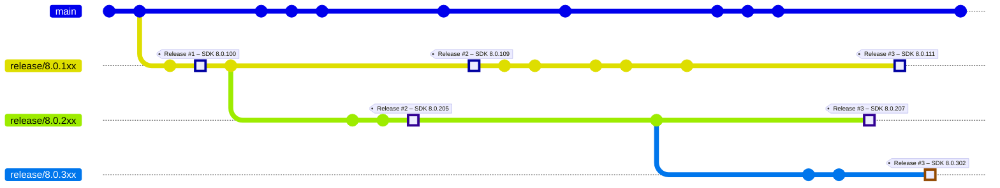
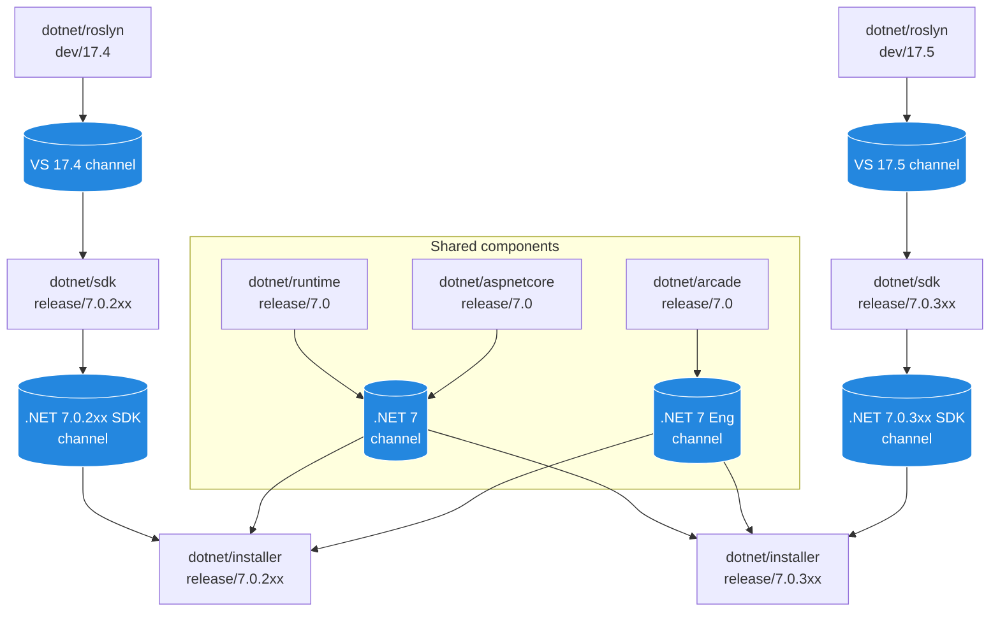
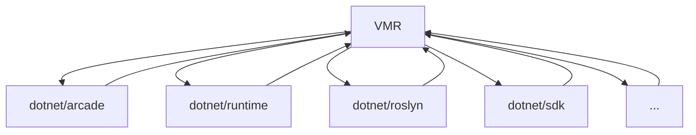

# The Unified Build Almanac (TUBA) - Managing SDK Bands

## Purpose

This document describes the problematics of managing multiple .NET SDK bands and discusses how we propose to solve this in the Unified Build world during the .NET 9 timeframe using the new build methodology and the full VMR.

## Terminology

This section presents more precise definitions of common terms used in this document that may be prone to confusion. Also see the [Unified Build terminology](./Terminology.md) for more.

- **Individual/Source repository** – One of the current development repositories, e.g., `dotnet/runtime`. An "individual product repository" is then one that contains code for part of the product (but no individual repository contains code to build the whole .NET Core product).
- **VMR (Virtual Monolithic Repository)** – A repository containing code layout that produces the official build product of .NET Core. The repository contains individual product repositories plus tooling to enable a full build of the product.
- **VMR-lite** – present state where changes only flow one way into the VMR which is read-only.
- **Full VMR (Backflow)** – future final state where changes can be made in the VMR too and flow both ways. Dependency flow at that time will be only between VMR and individual repos, not between individual repos themselves.
- **Source-Build** – A set of sources and a process which allows to build the entire product end to end including all its dependencies in offline mode, excluding native dependencies from the source.
- **Microsoft build** – The current build methodology used to assemble the final product.
- **SDK branch** – A git branch related to a specific SDK band, e.g. `release/8.0.1xx`.
- **Non-SDK branch** – A git branch common for all associated SDK bands, e.g. `release/8.0`.
- **Intermediate packages** – Packaged build produces of each of the individual repositories either built in their source repos or during the subsequent build of each individual repository component within the VMR. These are used during package flow between the VMR and the individual repositories.
- **Maestro** - a service used by the .NET team to manage dependency flow between repositories.

## SDK bands

To align with new Visual Studio releases, .NET SDK updates sometimes include new features or new versions of components such as Roslyn or MSBuild. These new features or components may be incompatible with the versions that shipped in previous SDK updates for the same major or minor version. To differentiate such updates, the .NET SDK uses the concept of feature bands. While these bands differ in their feature set they share some common parts such as the .NET runtime.

To best illustrate how this works in practice, let’s imagine the following timeline for repositories with SDK branches (e.g., `dotnet/sdk`):

In parallel, this would represent the state of a shared repository (e.g., `dotnet/runtime`) that is not specific to any particular SDK band:

On the image you can see timelines of branches of two different repositories – `dotnet/sdk` and `dotnet/runtime`. As noted previously, each (servicing) release of .NET contains multiple SDK bands but only one runtime. Each individual repository of each component that needs to differ per band would then have these so-called “SDK branches” named `release/Z.0.Yxx` while repositories that are shared per release have the non-SDK `release/Z.0` branches. As shown in the example, the development of the single runtime would happen in the `release/8.0` branch while the various SDK bands are stored in the following SDK branches (e.g., `release/8.0.1xx` represents the “100th band”).

Once we hit each release day (denoted with red vertical lines), we take the latest commit of each of those branches (that already exist) and release those together. For the releases in the example diagram, this might be:

- Release day #1 – `8.0.0` runtime + one SDK (`8.0.100`)
- Release day #2 – `8.0.6` runtime + two SDKs (`8.0.109`, `8.0.205`)
- Release day #3 – `8.0.12` runtime + three SDKs (`8.0.111`, `8.0.207`, `8.0.302`)

### Current code flow

To organize what ends up in each band and to drive the code flow between the repositories, we utilize the Maestro dependency flow, namely the Maestro channels (see [Channels, Branches and Subscriptions](../BranchesChannelsAndSubscriptions.md for details):

- **VS-centric channels** – To better match how teams opererate, some repositories align their build outputs with the Visual Studio versions, e.g. `dotnet/roslyn`. Outputs of repositories like that would end up in a channel named based on the version of VS, e.g. `17.5`.
- **SDK band channels** – The repositories that are closer to how we organize the final release are then targeting channels named based on the band version, e.g. `.NET 7.0.3xx SDK`.
- **Shared component channels** – Lastly, repositories with shared components and tooling repositories target channels named based on the major .NET version, e.g. `.NET 7` or `.NET 7 Eng`.

The following diagram shows a simplified example (some relationships are left out for brevity such as tooling leading to all repositories):

This setup makes sure that the latest version of each shared component (e.g., runtime) eventually flows to all SDK branches which then become coherent between each other. **We call the SDK bands coherent when the versions of all shared components of each band are the same**.

### Band lifecycle

As described above, the band lifecycle is tightly coupled with the releases of Visual Studio. For repositories that target the VS-centric bands, the `main` branch usually targets the next VS version which is in preview. Once a version of VS is released (is GA-ed), we create a new branch named `dev/XX.Y` where `XX.Y` is the version of the released VS. The `main` branch then targets the next VS version in preview

As an example, let's say we have the following setup:
- VS `17.1` is the latest stable version of VS and is associated with the `7.0.1xx` band.
- VS `17.2` is in preview and is associated with the `7.0.2xx` band.
- VS-centric repositories would have a `dev/17.1` branch targeting the `17.1` channel and a `main` branch targeting `17.2`.
- The `17.1` channel would then flow into the `7.0.1xx` branches and the `17.2` channel would flow into the `7.0.2xx`.
- The `7.0.1xx` branches would then flow into the `7.0.1xx` SDK channel and the `7.0.2xx` branches would flow into the `7.0.2xx` SDK channel.
- The `7.0` and `7.0 Eng` channels would collect builds of shared repositories and flow into their respective `7.0.Yxx` branches.

For this setup, we'd say the 100th band is in **servicing** and the 200th band is in **preview**. It is important to also note that **while a band is in preview, it uses the lastly released .NET runtime** while **the servicing band revs with the `7.0` channel**.

When we would be ready to release VS `17.2`, we'd flow the latest shared components into the 200th band branches so that it becomes coherent with the 100th band. Then we'd release the coherent bands and after we would do the following:

- We'd create the `dev/17.2` branch in VS-centric repositories, point it to the `17.2` channel and retarget `main` to `dev/17.3`.
- We'd snap branches of SDK repositories by branching `7.0.3xx` from `7.0.4xx`. While doing that, we'd update the runtime version of `7.0.3xx` to the just released version.
- We would set up the `7.0` shared channels to start flowing into the `7.0.3xx` branches as the runtime there would start reving.

### Full code backflow and Maestro

Currently, the [VMR is synchronized](./VMR-Design-And-Operation.md#source-synchronization-process) based on the `dotnet/installer` repository mapping its commits 1:1 with `dotnet/installer`. This will have to change once we switch over to the full code backflow model.

To re-iterate what the planned code flow looks like for .NET 9 (with full VMR back flow) – the individual repositories only receive and send updates from/to the VMR and not between each other, so the situation looks like this (see [VMR Code and Build Workflow](./VMR-Code-And-Build-Workflow.md) for details):

The updates of the VMR will no longer happen when `dotnet/installer` is updated but rather whenever a new build appears in one of the channels. The information making the builds of the `dev/17.4` branch of `dotnet/roslyn` end up in the `7.0.3xx` SDK band is stored in the configuration of Maestro subscriptions between those branches. The Maestro service will have to follow this configuration and update the corresponding sources (the right folder of the right branch) of the VMR accordingly. It will also have to flow changes the other way too when a change is made in the VMR or when VMR produces a new intermediate package. **This is all new functionality that Maestro will have to implement.** That being said, both proposed solutions seem orthogonal to this and the impact on the Maestro changes needed should be minimal.

### Release process

The dependency flow eventually flows all the bits into the `dotnet/installer` repository which also uses the SDK branching. Each of those branches then produces an official build – so one build per band – and we release those. The exact process is that a dedicated person selects all the right official builds which are coherent on the shared bits (so each has the same of the runtime for instance) and inputs the IDs of these builds into the staging pipeline called `Stage-DotNet`. **During this process, it is important for the MSFT build that the shared bits are only built once officially and then re-used in the respective band builds.**

The long-term plan is to transition to building and releasing using the Virtual Monolithic Repository which is a repository where each commit denotes a full set of sources needed for building .NET. The sources of this repository are synchronized from the individual repositories based on the contents of the `dotnet/installer` repository. The goal of this document is to discuss how this will be done with regards to both the different bands as well as the shared components.
