```mermaid
sequenceDiagram
    autonumber

    participant runtime as dotnet/runtime<br />release/9.0
    participant SDK_1xx as dotnet/sdk<br />release/9.0.1xx
    participant SDK_2xx as dotnet/sdk<br />release/9.0.2xx
    participant VMR_1xx as VMR<br />release/9.0.1xx
    participant VMR_2xx as VMR<br />release/9.0.2xx

    runtime->>runtime: New change ➡️ RUN_2

    runtime->>VMR_1xx: Flow of 📄 RUN_2
    Note over VMR_1xx: 📦 VMR_2 intermediates are built
    runtime->>VMR_2xx: Flow of 📄 RUN_2
    Note over VMR_2xx: 📦 VMR_3 intermediates are built

    Note over VMR_2xx: ✅ Coherent state<br />VMR 1xx and 2xx have 📄 RUN_2

    par Backflow of intermediates
        VMR_1xx->>SDK_1xx: Backflow of 📦 VMR_2 ➡️ SDK_1.2
        SDK_1xx-->>VMR_1xx: No-op
    and
        VMR_2xx->>SDK_2xx: Backflow of 📦 VMR_3 ➡️ SDK_2.2
        SDK_2xx-->>VMR_2xx: No-op
    end
```

```mermaid
sequenceDiagram
    autonumber

    participant runtime as dotnet/runtime<br />release/9.0
    participant SDK_1xx as dotnet/sdk<br />release/9.0.1xx
    participant SDK_2xx as dotnet/sdk<br />release/9.0.2xx
    participant VMR_1xx as VMR<br />release/9.0.1xx
    participant VMR_2xx as VMR<br />release/9.0.2xx

    # Change in SDK+runtime
    runtime->>runtime: Change in runtime ➡️ RUN_2

    par
        runtime->>VMR_1xx: 📄 PR with source change to RUN_2 is opened
        activate VMR_1xx
        Note over VMR_1xx: ❌ Requires a change in SDK
        Note over VMR_1xx: 📦 VMR_2 intermediates are built
        VMR_1xx->>SDK_1xx: Flow of 📄 SDK_2.2, 📦 VMR_2
        deactivate VMR_1xx
    and
        runtime->>VMR_2xx: 📄 PR with source change to RUN_2 is opened
        activate VMR_2xx
        Note over VMR_2xx: ❌ Requires a change in SDK
        Note over VMR_2xx: 📦 VMR_3 intermediates are built
        deactivate VMR_2xx
        VMR_2xx->>SDK_2xx: Flow of 📄 SDK_2.2, 📦 VMR_3
    end

    Note over VMR_2xx: ✅ Coherent state<br />VMR 1xx and 2xx have RUN_2
```

# Managing SDK Bands

## Purpose

This document describes the problematics of managing multiple .NET SDK bands and discusses how we propose to solve this in the Unified Build world during the .NET 9 timeframe using the new build methodology and the full VMR.

## Terminology

This section presents more precise definitions of common terms used in this document that may be prone to confusion.

- **Individual/Source repository** – One of the current development repositories, e.g., `dotnet/runtime`. An "individual product repository" is then one that contains code for part of the product (but no individual repository contains code to build the whole .NET Core product).
- **VMR (Virtual Monolithic Repository)** – A repository containing code layout that produces the official build product of .NET Core. The repository contains individual product repositories plus tooling to enable a full build of the product.
- **VMR-lite** – present state where changes only flow one way into the VMR which is read-only.
- **Full VMR (Backflow)** – future final state where changes can be made in the VMR too and flow both ways. Dependency flow at that time will be only between VMR and individual repos, not between individual repos themselves.
- **Source-Build** – A set of sources and a process which allows to build the entire product end to end including all its dependencies in offline mode, excluding native dependencies from the source.
- **Microsoft build** – The current build methodology used to assemble the final product.
- **SDK branch** – A git branch related to a specific SDK band, e.g. `release/8.0.1xx`.
- **Non-SDK branch** – A git branch common for all associated SDK bands, e.g. `release/8.0`.
- **Intermediate packages** – Packaged build produces of each of the individual repositories either built in their source repos or during the subsequent build of each individual repository component within the VMR. These are used during package flow between the VMR and the individual repositories.
- **Maestro** - a service used by the .NET team to manage dependency flow between repositories.

## SDK bands

To align with new Visual Studio releases, .NET SDK updates sometimes include new features or new versions of components such as Roslyn or MSBuild. These new features or components may be incompatible with the versions that shipped in previous SDK updates for the same major or minor version. To differentiate such updates, the .NET SDK uses the concept of feature bands. While these bands differ in their feature set they share some common parts such as the .NET runtime.

To best illustrate how this works in practice, let’s imagine the following timeline for repositories with SDK branches (e.g., `dotnet/sdk`):

In parallel, this would represent the state of a shared repository (e.g., `dotnet/runtime`) that is not specific to any particular SDK band:

On the image you can see timelines of branches of two different repositories – `dotnet/sdk` and `dotnet/runtime`. As noted previously, each (servicing) release of .NET contains multiple SDK bands but only one runtime. Each individual repository of each component that needs to differ per band would then have these so-called “SDK branches” named `release/Z.0.Yxx` while repositories that are shared per release have the non-SDK `release/Z.0` branches. As shown in the example, the development of the single runtime would happen in the `release/8.0` branch while the various SDK bands are stored in the following SDK branches (e.g., `release/8.0.1xx` represents the “100th band”).

Once we hit each release day (denoted with red vertical lines), we take the latest commit of each of those branches (that already exist) and release those together. For the releases in the example diagram, this might be:

- Release day #1 – `8.0.0` runtime + one SDK (`8.0.100`)
- Release day #2 – `8.0.6` runtime + two SDKs (`8.0.109`, `8.0.205`)
- Release day #3 – `8.0.12` runtime + three SDKs (`8.0.111`, `8.0.207`, `8.0.302`)

### Current code flow

To organize what ends up in each band and to drive the code flow between the repositories, we utilize the Maestro dependency flow, namely the Maestro channels (see [Channels, Branches and Subscriptions](../BranchesChannelsAndSubscriptions.md for details):

- **VS-centric channels** – To better match how teams opererate, some repositories align their build outputs with the Visual Studio versions, e.g. `dotnet/roslyn`. Outputs of repositories like that would end up in a channel named based on the version of VS, e.g. `17.5`.
- **SDK band channels** – The repositories that are closer to how we organize the final release are then targeting channels named based on the band version, e.g. `.NET 7.0.3xx SDK`.
- **Shared component channels** – Lastly, repositories with shared components and tooling repositories target channels named based on the major .NET version, e.g. `.NET 7` or `.NET 7 Eng`.

The following diagram shows a simplified example:

<i>*Note: Dependencies of roslyn and sdk on tooling repositories were left out for simplicity</i>

This setup makes sure that the latest version of each shared component (e.g., runtime) eventually flows to all SDK branches which then become coherent between each other. **We call the SDK bands coherent when the versions of all shared components of each band are the same**.

### Band lifecycle

As described above, the band lifecycle is tightly coupled with the releases of Visual Studio. For repositories that target the VS-centric bands, the `main` branch usually targets the next VS version which is in preview. Once a version of VS is released (is GA-ed), we create a new branch named `dev/XX.Y` where `XX.Y` is the version of the released VS. The `main` branch then targets the next VS version in preview

As an example, let's say we have the following setup:
- VS `17.1` is the latest stable version of VS and is associated with the `7.0.1xx` band.
- VS `17.2` is in preview and is associated with the `7.0.2xx` band.
- VS-centric repositories would have a `dev/17.1` branch targeting the `17.1` channel and a `main` branch targeting `17.2`.
- The `17.1` channel would then flow into the `7.0.1xx` branches and the `17.2` channel would flow into the `7.0.2xx`.
- The `7.0.1xx` branches would then flow into the `7.0.1xx` SDK channel and the `7.0.2xx` branches would flow into the `7.0.2xx` SDK channel.
- The `7.0` and `7.0 Eng` channels would collect builds of shared repositories and flow into their respective `7.0.Yxx` branches.

For this setup, we'd say the 100th band is in **servicing** and the 200th band is in **preview**. It is important to also note that **while a band is in preview, it uses the lastly released .NET runtime** while **the servicing band revs with the `7.0` channel**.

When we would be ready to release VS `17.2`, we'd flow the latest shared components into the 200th band branches so that it becomes coherent with the 100th band. Then we'd release the coherent bands and after we would do the following:

- We'd create the `dev/17.2` branch in VS-centric repositories, point it to the `17.2` channel and retarget `main` to `dev/17.3`.
- We'd snap branches of SDK repositories by branching `7.0.3xx` from `7.0.4xx`. While doing that, we'd update the runtime version of `7.0.3xx` to the just released version.
- We would set up the `7.0` shared channels to start flowing into the `7.0.3xx` branches as the runtime there would start reving.

### Full code backflow and Maestro

Currently, the [VMR is synchronized](./VMR-Design-And-Operation.md#source-synchronization-process) based on the `dotnet/installer` repository mapping its commits 1:1 with `dotnet/installer`. This will have to change once we switch over to the full code backflow model.

To re-iterate what the planned code flow looks like for .NET 9 (with full VMR back flow) – the individual repositories only receive and send updates from/to the VMR and not between each other, so the situation looks like this (see [VMR Code and Build Workflow](./VMR-Code-And-Build-Workflow.md) for details):

The updates of the VMR will no longer happen when `dotnet/installer` is updated but rather whenever a new build appears in one of the channels. The information making the builds of the `dev/17.4` branch of `dotnet/roslyn` end up in the `7.0.3xx` SDK band is stored in the configuration of Maestro subscriptions between those branches. The Maestro service will have to follow this configuration and update the corresponding sources (the right folder of the right branch) of the VMR accordingly. It will also have to flow changes the other way too when a change is made in the VMR or when VMR produces a new intermediate package. **This is all new functionality that Maestro will have to implement.** That being said, both proposed solutions seem orthogonal to this and the impact on the Maestro changes needed should be minimal.

### Release process

The dependency flow eventually flows all the bits into the `dotnet/installer` repository which also uses the SDK branching. Each of those branches then produces an official build – so one build per band – and we release those. The exact process is that a dedicated person selects all the right official builds which are coherent on the shared bits (so each has the same of the runtime for instance) and inputs the IDs of these builds into the staging pipeline called `Stage-DotNet`. **During this process, it is important for the MSFT build that the shared bits are only built once officially and then re-used in the respective band builds.**

The long-term plan is to transition to building and releasing using the Virtual Monolithic Repository which is a repository where each commit denotes a full set of sources needed for building .NET. The sources of this repository are synchronized from the individual repositories based on the contents of the `dotnet/installer` repository. The goal of this document is to discuss how this will be done with regards to both the different bands as well as the shared components.

## Proposed solutions

Currently, we end up with SDK branches in the `dotnet/installer` repository and the release process makes sure to package those into the final product. With releasing from the VMR, we have two ways we can approach this:

- **SDK branches** - [📄 Detailed description of the proposal](./VMR-Managing-SDK-Bands-SDK-branches.md)  
    The first obvious solution that comes to mind considering where we are today. The bottom line is that we'd just keep using SDK branches in the VMR the same way we have them today. This is, in fact, what we’re currently already doing with today’s read-only VMR-lite where we synchronize the SDK branches of `dotnet/installer`. Each branch/commit of the VMR would then keep producing a single SDK. Each branch/commit of the VMR would then keep producing a single SDK. However, we need to make sure the shared bits are the same in each released SDK branch – we’d say the SDK branches would be coherent then. We also need to make sure that changes made to the shared components in VMR’s SDK branches are flown everywhere appropriately.

- **Side-by-Side folders in the VMR** - [📄 Detailed description of the proposal](./VMR-Managing-SDK-Bands-Side-by-Side-folders.md)  
    The second proposed solution would be to take the inverse approach and, instead of having SDK branches, we’d organize VMR’s branches based on the shared bits (e.g. `release/9.0`) and place the different bands of the SDK components side by side in the VMR, e.g. `src/sdk/9.0.1xx`. This makes sure that the shared bits exist only once and each commit of the VMR contains all bands which are coherent.

## Proposal comparison

To compare the two proposals, we identified several areas which might be impacted by the selected architecture, and we’ll try to evaluate how each of the solutions affect them:

- **Build** – what would build of a single and of multiple bands look like with regards to Source Build
- **Code flow** – what does a breaking change mean; how do we (back-)flow the code between the VMR and the individual repositories
- **Developer experience** – impact on developer lives and how they work with the VMR; their options for making changes that span multiple repositories
- **Release** – how do we compile the final Microsoft release
- **Validation** – what do we validate (build/test) and when
- **VMR size & performance** – impact of selected architecture on the git repository
- **Community, 3rd parties & upstream/downstream story** – what does it mean for partners to build their own SDK(s)
- **Implementation and maintenance complexity** – risks and costs associated with the future

### Build

The current (Microsoft) way of building the SDKs is based on re-using previously built artifacts which come into the build as NuGet packages. The components are flown as already compiled packages. This means that when building each SDK band, we only restore the shared components which were built only once at some point in the past during the official build of their source repository.

In .NET 9.0, when the full VMR code flow is in place (see [VMR Code and Build Workflow](./VMR-Code-And-Build-Workflow.md) for details), we’ll be building the individual repositories on more occasions:

- During the official build of their source repository – this will use other repo’s intermediate packages whenever they depend on another repo as if they were just built from source.
- During the official build of the VMR – when we build the whole product from source. This will end up producing an intermediate package per each individual repository built as part of the whole build.

This means that at several places, we’ll be building both the shared components and the SDK band components from source where their dependencies will be either freshly built or restored in a local NuGet cache of the build machine.

Regardless of how this will happen, there’s no real difference whether we’d build the SDK bands from folders which are side by side in a folder of a checked-out branch or which are checkouts of different SDK branches. The build process would need to know about the existence of multiple SDK bands eventually placed in a folder “somewhere on the disk”. **This means that the selected architecture doesn’t really affect the build and we don’t need to consider it during evaluation.** There will, however, be a change to the build process needed to accommodate for the new locations of the bands.

The various situations can be summarized as follows:
- For individual repository builds, the build process will need to know about the location of the SDK bands. This is the same for both proposals.
- For the VMR build shared components are built with the first band and put in a local NuGet cache. Other bands restore shared components from the cache (or rebuild the components over of cache is not possible).

### Code flow

Code flow is where the two approaches differ dramatically. The biggest difference is during breaking changes in shared components and how/when these get resolved.

For a simple forward flow where a shared component is changed, the code flow needed to update all branches does not differ much.

SDK branches:

Side-by-side folders:

The situation gets more interesting for breaking changes. Let’s imagine a situation where a change is needed in one of the bands that requires a breaking change in a shared component. For this, we assume that a change like this would be always made in the VMR where we can change both components at the same time.

SDK branches:

Side-by-side folders:

```mermaid
sequenceDiagram
    autonumber

    participant runtime as dotnet/runtime<br />release/9.0
    participant SDK_1xx as dotnet/sdk<br />release/9.0.1xx
    participant SDK_2xx as dotnet/sdk<br />release/9.0.2xx
    participant VMR as VMR<br />release/9.0

    runtime->>runtime: Change in runtime ➡️ RUN_2


    activate SDK_2xx
    runtime->>VMR: Flow of runtime
    activate VMR
    Note over VMR: ❌ Requires change<br />(in sdk/1xx and sdk/2xx)<br />Fix is made immediately
    deactivate VMR
    Note over VMR: 📄 RUN1, SDK_1.2 and SDK_2.2<br />📦 VMR_2 intermediates are built

    par Backflow
        VMR->>SDK_1xx: Backflow of 📄 SDK_1.2, 📦 VMR_2
        SDK_1xx-->>VMR: No-op
    and
        VMR->>SDK_2xx: Backflow of 📄 SDK_2.2, 📦 VMR_2
        SDK_2xx-->>VMR: No-op
    end
```

From the above, the side-by-side solution is much more resilient to breaking changes as those need to be dealt with immediately. The VMR won’t ever get into an inconsistent state as the bands live within a single commit. Whereas in the SDK folder solution, the breaking change is created and is dealt with in a follow-up step once code flows to the branch of the other band.

Other difference is in the number of steps in the flow to reach a coherent state. This is lower for side-by-side as incoherency is impossible from the start and the system does not need to deal with it. The number of changes needed is not that much higher though as we still need to flow changes to the same number of branches of all individual repositories that are part of the change. This does not differ much whether we flow folders from one or more branches.

### Developer experience

Important area to consider is how the day-to-day interactions of .NET developers with the VMR would look like. We identified the following key actions the developers are interested in:

- **Working with sources** – working with the source files such as searching, usual investigations such as checking file history & looking for symbols, and finally code editing and building itself
- **Git operation complexity** – actions such as checking file history, diffing bands, backporting changes between bands..
- **Git operation performance** – duration of operations such as `git status`. This area is considered separately [later in the document](#vmr-size--performance).

That said, it’s important to realize that most of the work and the VMR is the most active in the preview time where we only have one SDK band.

It is obvious that the SDK branch proposal wins in most of these categories. It stays truer to git by using commits/branches for file versioning rather than folders with versions in their name as it is with the side-by-side layout. This works well with all kinds of tooling and workflows:

- File history breaks with side-by-side folders once we snap the bands.
- File and symbol search might be confusing when going through almost identical side-by-side folders.
- Backporting a change between bands sounds less error prone with SDK branches as it’s just porting commits. Making a change in several bands at once can lead to omitting a change in one of the bands, harder-to-review pull requests and overall it seems to be easier to transfer changes between bands using git-native approaches. Of course it’s possible to utilize patches but once a change is up for review, making sure all bands stay in sync might be problematic.
- Diffing bands sounds easier to do with SDK branches as well as you don’t need to worry which all components are shared and which are not – diffing side-by-side folders might become tedious once we need to compare several repositories at once.

Some points of interested are rather a matter of personal preference – is it better for a developer to make a change in one SDK branch, open a PR and then backport to other branches, or is it better to do everything at once and build/validate it together? But over all it seems that storing code based on how we work with it rather than how we release it sounds better and the SDK branches proposal seems as the superior approach in this area since it optimizes for development rather than bend the architecture/layout to how we release the product.

### Release

> TODO: Describe what putting a release together looks like - but we should describe that in each of the proposals

> Note : Separating development and release cycle – the fact that we release several SDKs is a Microsoft problem that 3rd parties may or may not care about. We shouldn’t enforce the problems of our custom release on others through the code layout – for instance, you shouldn’t be forced to check out multiple versions of the code if you don’t care about multiple bands. Further, we shouldn’t tax the .NET team itself and subordinate how we store code to how we release it later.

> –	Note: Resiliency to band explosion – keeping bands in branches seems more resilient to outer requirements such as a sudden increase in the number of bands due to Visual Studio speeding up its release cycle.

### Validation

By validation we mean the process of running some set of tests over a changed code. For individual repositories, there is no change compared to today. There is a difference though for changes made directly in the VMR as we need to specify what needs to be built and validated.

It is unclear what the validation story should be when we have all SDKs in folders side-by-side and how it would impact developers. On one hand, validating a shared component change in all SDK branches adds up to more compute time as the shared components will get re-built in each branch. On the other hand, building all non-shared components always impacts every build and that might have negative impact on developer productivity.

<table>

<tr>
<th> SDK branches </th>
<th> Side-by-Side folders </th>
</tr>

<tr>
<th colspan=2> SDK-band-specific component changed </th>
</tr>

<tr>
  <td>We only rebuild 1 band/branch where the change happens. Change is flown to source repo and re-validated there.</td>
  <td>We’d need to detect that we don’t need to build all bands. Change is flown to source repo and re-validated there.</td>
</tr>
<tr>
<th colspan=2> Shared component changed </th>
</tr>

<tr>
  <td>We only rebuild 1 band – the branch this happened. Possible breaking changes with other bands which are detected after we try to flow the change back.</td>
  <td>We’d need to detect that and build/test all bands, validating the change.</td>
</tr>
</table>

### VMR size & performance

By size and performance we mean the implications of each proposed repository layout onto these metrics onto few key metrics that affect common operations we do with the VMR.

#### Git repository size

The expectation is that the size of the overall repository won’t differ much between the two proposed layouts. This is due to the mechanism of how git stores data internally. For illustration of this expectation, imagine a situation where we have two SDK bands which differ in one file only – `src/sdk/foo/bar.txt`. Let’s look at what is inside of the git object database:

- For SDK branches, we have the two commits that describe the two branches. These are equal at first, when we freshly snap the band branches.
- For side-by-side folders, the situation isn’t much different with the two git trees for each of the band folders – `src/sdk/9.0.1xx` and `src/sdk/9.0.2xx`. These are also the same at first – only the parent tree representing the sdk folder is an object created after the snap.
- 
Once we change bar.txt, we’d get a new object for the file itself and then some other:

- For SDK branches, we have the new git trees that describe the parent folders of the changed file leading up to the root of the repository (`/` → `src` → `sdk` → `foo`).
- For side-by-side folders, the situation is again not much different – we get a new set of git trees describing the path from foo through the new `src/sdk/9.0.2xx`.

Looking at this simple example, it hints that whatever solution we pick, the number of git objects we’ll create to capture the changes are around the same.

#### Single SDK source tarball size

Another interesting metric is the archive of sources needed to build a single SDK. It seems that when 3rd parties that only care about one SDK band would be downloading sources of VMR commits, the side-by-side layout incurs quite a big toll on the overall size as we’d need to download the sources of all bands always. The release process might be customized, and we could omit other bands from the tarball.

#### Release source tarball size

By release source tarball we mean an archive of all sources needed to build a whole release containing several SDK bands.
For side-by-side folders, this would simply equal to a VMR commit. For SDK branches, we’d have to do something about compiling the release archive as the shared components need to appear in the tarball just once.

> TODO: It’s a question whether there would be a thing such as “tarball for the whole release with all bands” but it’s probably possible to exclude the shared components from all but one band and reach the same result with SDK folder as with SDK branches.

#### Git operation performance

We care about the duration of common git operation duration such as checkout or status. We also need to consider scenarios in which we use the VMR – do we care about more bands than one?

SDK branches seem to have the innate benefit of not having to check out all the bands always. This seems like a big win for scenarios where we for instance make changes to one band only. But it goes away quite quickly once we need to build all of them and suddenly the checkout takes much longer.

> TODO: We should figure out how often would we care about building all bands in various flows – from CI to inner dev loop.

#### Summary of git size/performance

From the analysis above, it seems that to declare a winner, we need to consider how often we deal with a single vs multiple bands. Both solutions are a good fit for one or the other, never both.

<table>

<tr>
<th> SDK branches </th>
<th> Side-by-Side folders </th>
</tr>

<tr>
<th colspan=2> Git repository size </th>
</tr>

<tr>
  <td colspan=2>Roughly the same overhead</td>
</tr>

<tr>
<th colspan=2> Single SDK source tarball size </th>
</tr>
<tr>
  <td>Each VMR commit gives us this.</td>
  <td>Release process would have to be customized and other bands omitted.</td>
</tr>

<tr>
<th colspan=2> Release source tarball size </th>
</tr>

<tr>
  <td>Release process would have to be customized and shared components included just once.</td>
  <td>Each VMR commit gives us this.</td>
</tr>

<tr>
<th colspan=2> Git operation performance </th>
</tr>

<tr>
  <td>Ideal for scenarios concerning 1 band. Worse off for multi-band scenarios.</td>
  <td>Ideal for scenarios concerning multiple bands. Worse off for single-band scenarios.</td>
</tr>

</table>

### Community, 3rd parties & upstream/downstream story

There are quite big implications of how we lay the bands out in the VMR on the outside world. 3rd parties consuming .NET might or might not care about building multiple bands. Overall, the fact that we even need to have different SDK bands is native to Microsoft’s rhythm and way of bundling releases.

For SDK branches, nothing really changes in this regard as you can keep building the branch as you were doing until now and get the SDK you care about.  
For side-by-side, the situation is quite different. We’re suddenly influencing everyone’s experience with the VMR by projecting how we bundle releases into the layout of the code. This has negative implications such as having to check out all the bands always which would for instance prolong all repo operations.

> TODO: Forks and upstreaming changes differences? Some things are common for both, such as confusion about where a change should go but that’s the same for folders/branches.

### Implementation and maintenance complexity

- TODO: Much more work to implement side-by-side
- TODO: Resiliency to band explosion – keeping bands in branches seems more resilient to outer requirements such as a sudden increase in the number of bands due to Visual Studio speeding up its release cycle.

### Comparison summary

|                       Comparison area                       |    What comes out on top    |
|-------------------------------------------------------------|:---------------------------:|
|     Build                                                   |        Does not matter      |
|     Code flow                                               |     Side-by-side folders    |
|     Developer experience                                    |         SDK branches        |
|     Release                                                 |               ?             |
|     Validation                                              |               ?             |
|     VMR size & performance                                  |         SDK branches        |
|     Community, 3rd parties & upstream/downstream story      |         SDK branches        |
|     Implementation and maintenance complexity               |         SDK branches        |

## Comparison evaluation

Both approaches seem to have pros and cons. To choose the best approach, we should assign importance to the evaluation areas on which we were comparing these and see which approach seems better.

When doing so, we should take into account the product lifecycle. At first, the most active busy development happens in the preview time (on main branches). Only after the release, we move into servicing and only after then we branch out and snap the bands. We expect the servicing period to last very long but with less activity. During active development, we should prioritize **developer experience** and **code flow** as that has impact on product construction.  
During servicing we need the system to be as frictionless as possible so that we’re able to react to external impulses fast and release fixes fast which hints at prioritizing **code flow**, **release**, and **maintenance complexity**. Some areas should be important in both periods such as **community impact**.

> TODO: Actually decide

